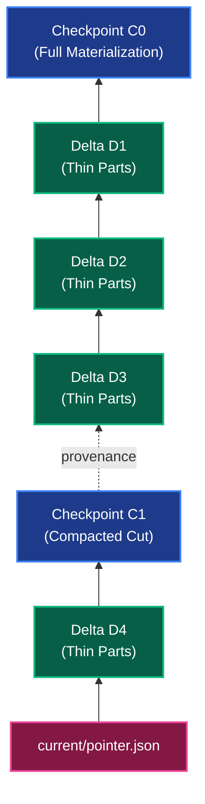

# Architecture Design: Append-Only Snapshot DAG Manager

## 1. Executive Summary & Core Motivations

The current document inventory snapshot system publishes **complete logical views** by rewriting affected annual partition files and all 48 lookup shards on every publication ([writer.py](../../edgar_sec/pipelines/document_inventory/snapshot/writer.py)). When the baseline dataset is "fat" (decades of filings) and candidate updates are "thin" (a handful of new accessions or refreshes), this Copy-on-Write (CoW) design induces severe write amplification, full-table scans, and glibc heap pressure.

This document defines an **Append-Only Directed Acyclic Graph (DAG) Snapshot Engine** with an operator-controlled DAG Manager. Thin plan deltas are resolved along the lineage selected by `current`; compaction, redirects, health checks, and pruning are separate graph operations.

Furthermore, this engine is designed to be **schema-agnostic** in `edgar_sec/infra/storage/dag/` so multiple pipelines (`document_inventory`, `metadata_sync`, and future `document_acquisition`) share unified graph mechanics without bespoke snapshot engines.

---

## 2. Graph Topology & Node Contracts

The snapshot storage layer forms a content-addressed DAG directed backwards from children to parents.



### 2.1. Node Types
1. **Checkpoint Node (`kind: "checkpoint"`):**
   * Self-contained, fully materialized state.
   * Contains consolidated Parquet partitions and seek index shards.
   * Serves as a **Lineage Cut Anchor**: Readers traversing backward terminate traversal upon reaching a checkpoint.
2. **Delta Node (`kind: "delta"`):**
   * Append-only change set containing only newly added or modified facts ($O(\Delta)$ size).
   * Contains delta Parquet parts for affected relations.
   * References a single direct parent (`parent_snapshot_id`) and records its distance from the nearest checkpoint anchor (`lineage_depth`).
3. **Bridge Record (sidecar):**
   * An integrity-pinned redirect for an exact missing node reference. It is external to snapshot manifests and cannot recreate data that has been deleted.

### 2.2. Manifest Invariants & Cycle Immunity
Every manifest is strictly content-addressed and pinned by cryptographic hashes:

```json
{
  "snapshot_id": "snap-9a7b1c4e2d",
  "kind": "delta",
  "parent_snapshot_id": "snap-8f2a1b9c3d",
  "parent_manifest_sha256": "4b6c8d...",
  "checkpoint_anchor_id": "snap-1a2b3c4d5e",
  "lineage_depth": 3,
  "created_at": "2026-10-06T23:00:00Z",
  "relations": {
    "accessions": [
      {
        "path": "deltas/accessions/part-00000.parquet",
        "sha256": "8a3f...",
        "row_count": 12,
        "byte_size": 1540,
        "key_min": "0000001000-24-000001",
        "key_max": "0000001000-24-000012"
      }
    ]
  },
  "logical_fingerprint": "e3b0c44298fc1c149afbf4c8996fb92427ae41e4649b934ca495991b7852b855"
}
```

> [!IMPORTANT]
> Parent digests help detect tampering but do not replace cycle checks. Current-lineage resolution checks repeated node IDs while walking the selected path. A DAG Manager health check can audit other branches and bridge redirects separately.

### 2.3 Current Path and Plan Commit Order

`current/pointer.json` selects one tip. Resolution follows only that tip's parent path to its checkpoint; sibling branches are not implicitly unioned. A branch is active only when `current` selects one of its tips.

Plans may be created independently from the same base. Plan creation does not reserve work or guarantee execution; overlapping plans may fetch the same accession more than once. At commit, the DAG Manager rechecks `current` and rebases the plan's immutable delta onto the then-current tip. It reuses the delta parts and writes a new node manifest with the actual parent digest and lineage depth. Plan creation time does not determine precedence; the resulting current-path order does. Identical facts deduplicate. If two successful revisions collide after rebase, the latest commit on the selected path wins; conflicting metadata is refused.

---

## 3. Declarative Relational Delta Algebra (`RelationSpec`)

To support differing schemas across pipelines (`document_inventory`, `metadata_sync`, `document_acquisition`) without bespoke engines, the DAG engine parameterizes tables via `RelationSpec`. All table mutations reduce to **three deterministic merge strategies**:

1. **`upsert` (Latest Key Replaces Previous):**
   * *Used in:* `metadata_sync` (submissions), `document_inventory` (`accessions`).
   * *Rule:* A row with the same primary key in a newer delta supersedes the older row along the lineage chain.
2. **`append` (Union & Accumulate):**
   * *Used in:* `document_inventory` (`accession_sources`), `document_acquisition` (`acquisitions` events).
   * *Rule:* Rows accumulate along the lineage. Duplicates on primary key resolve via an associative aggregator (`min`/`max` on tie-breaker column).
3. **`scoped_mask` (Parent-Revision Cascading Replacement):**
   * *Used in:* `document_inventory` (`entries` scoped to `accession`), `document_acquisition` (targets scoped to role/slot).
   * *Rule:* Child rows belong to a parent key revision. When the parent key gets a new revision in a delta, all child rows tied to older parent revisions are masked out.

### 3.1. Composite-Key Scope Masking (Multi-Plan Slot Isolation)

In `document_inventory`, a refresh replaces all entries of an accession because the directory index page is fetched as a unit. 

In `document_acquisition`, targets are **selective across separate plans**:
* **Plan A** targets **primary documents** (`request_id="primary"`).
* **Plan B** targets **exhibits** (`request_id="subsidiaries"` / EX-21).

If masking were naively scoped to `accession`, Plan B committing exhibits would mask out Plan A's primary document.

**The Contract:** The parent scope key must be composite:
$$\text{Scope Key} = (\text{accession}, \text{request\_id})$$
Refreshing a primary document only masks previous captures of that accession's primary slot, leaving all exhibit captures intact.

### 3.2. Preventing Artificial Snapshot Nodes (Pre-Publish Anti-Join)

When separate plans (or redundant runs) target overlapping accessions, they may acquire identical content (`source_sha256`). Publishing naively produces **artificial snapshot nodes** that inflate DAG depth with zero new facts.

**The Invariant:**
Before writing any delta Parquet parts or manifests, candidate rows are anti-joined against the resolved current DAG view:
1. **Pure No-Op:** If all candidate rows already exist in the current view with identical payload hashes and outcome statuses, publication returns `NoOp`. **Zero snapshot nodes are created.**
2. **Partial Overlap:** If candidate rows contain a mix of new and identical rows, identical duplicates are discarded. The delta Parquet file writes **only the genuinely new or modified rows**.

---

## 4. Proposed Implementation & Function Signatures

All generic graph and relational mechanics reside in `edgar_sec/infra/storage/dag/`:

```text
edgar_sec/infra/storage/dag/
├── spec.py          # Declarative RelationSpec and merge strategy types
├── manifest.py      # Universal DAG node manifest models and JSON IO
├── traversal.py     # Anchor-to-tip lineage walking and cycle verification
├── resolution.py    # Dynamic DuckDB virtual view compiler
├── anti_join.py     # Idempotence check and candidate delta filtering
├── publication.py   # Atomic pointer-last CAS publication and rebase validation
├── compaction.py    # Lineage cut and consolidated Checkpoint materialization
├── retention.py     # Root set reachability tracing and physical part reference counting
└── doctor.py        # Graph health audit, cycle detection, and dangling pointer repair
```

### 4.1. `spec.py` — Declarative Relational Contracts
```python
from dataclasses import dataclass
from typing import Literal
import pyarrow as pa

MergeStrategy = Literal["upsert", "append", "scoped_mask"]

@dataclass(frozen=True, slots=True)
class RelationSpec:
    name: str
    schema: pa.Schema
    primary_key: tuple[str, ...]
    merge_strategy: MergeStrategy
    sort_order: tuple[str, ...]
    parent_relation: str | None = None
    parent_join_key: tuple[str, ...] | None = None
    tie_breaker_column: str | None = None
    tie_breaker_op: Literal["min", "max"] = "min"
```

### 4.2. `traversal.py` — Graph Walking & Invariant Checks
```python
@dataclass(frozen=True, slots=True)
class LineageChain:
    tip_id: str
    checkpoint_anchor_id: str
    ordered_nodes: tuple[DAGNodeManifest, ...]  # checkpoint at index 0, tip at index -1

def walk_lineage(
    snapshots_root: Path,
    tip_id: str,
    *,
    bridge_registry: BridgeRegistry | None = None,
) -> LineageChain:
    """Traverse backward from tip_id to nearest checkpoint anchor.
    
    Raises:
        CycleDetectedError: If a snapshot ID repeats along the ancestor path.
        BrokenLineageError: If a parent manifest is missing or SHA-256 does not match.
    """
    ...
```

### 4.3. `resolution.py` — Dynamic DuckDB View Compiler
```python
def compile_virtual_views(
    con: duckdb.DuckDBPyConnection,
    specs: tuple[RelationSpec, ...],
    lineage: LineageChain,
) -> dict[str, str]:
    """Dynamically register active DuckDB views for each RelationSpec.
    
    Generates out-of-core SQL views ('active_{name}') using ROW_NUMBER windowing
    for upsert/scoped_mask and GROUP BY aggregation for append.
    """
    ...

def compute_logical_fingerprint(
    con: duckdb.DuckDBPyConnection,
    specs: tuple[RelationSpec, ...],
) -> str:
    """Streamed order-invariant SHA-256 digest over all active relations."""
    ...
```

### 4.4. `anti_join.py` — Delta Filtering & No-Op Detection
```python
@dataclass(frozen=True, slots=True)
class FilteredDelta:
    is_noop: bool
    filtered_parts: dict[str, Path]
    row_counts: dict[str, int]

def filter_candidate_delta(
    con: duckdb.DuckDBPyConnection,
    specs: tuple[RelationSpec, ...],
    candidate_tables: dict[str, str],
    active_views: dict[str, str],
    output_dir: Path,
) -> FilteredDelta:
    """Anti-join candidate rows against active views to strip redundant duplicates."""
    ...
```

### 4.5. `compaction.py` — Vacuum Compaction
```python
def compact_lineage(
    snapshots_root: Path,
    specs: tuple[RelationSpec, ...],
    tip_id: str,
    output_snapshot_id: str,
    profile: RuntimeResourceProfile,
) -> DAGNodeManifest:
    """Materialize resolved virtual view into consolidated Parquet parts.
    
    Enforces repository Parquet contracts (row_group_size=128_000, compression='zstd').
    Verifies Logical Parity Gate before returning the checkpoint manifest.
    """
    ...
```

### 4.6. `publication.py` — Atomic Publishing & CAS
```python
def publish_node(
    snapshots_root: Path,
    manifest: DAGNodeManifest,
    staged_dir: Path,
    expected_parent_id: str | None,
) -> None:
    """Install snapshot directory and atomically advance current/pointer.json.
    
    Raises:
        StaleParentError: If current pointer changed during staging.
    """
    ...
```

---

## 5. Multi-Identity Contract: Preserving Downstream Work

Three distinct identities decouple storage maintenance from downstream execution:

```text
┌────────────────────────────────────────────────────────┐
│ 1. Logical Inventory Identity                          │
│    canonical_hash(active relations)                    │
│    Invariant across S8 vacuum and physical repackaging.│
└────────────────────────────────────────────────────────┘
                           │
                           ▼
┌────────────────────────────────────────────────────────┐
│ 2. Physical Snapshot Identity                          │
│    snapshot_id + manifest_sha256                       │
│    Pinned for exact, reproducible filesystem reads.    │
└────────────────────────────────────────────────────────┘
                           │
                           ▼
┌────────────────────────────────────────────────────────┐
│ 3. Semantic Target / Plan Identity                     │
│    Derived strictly from domain facts consumed.        │
│    Target IDs remain unchanged after vacuum.           │
└────────────────────────────────────────────────────────┘
```

1. **Logical Fingerprint Invariant:** Compacting $C_0 + D_1 \dots D_k \to C_1$ produces a new `snapshot_id`, but `logical_fingerprint` remains byte-identical.
2. **S4 Resume Protection:** S4 work orders check `base_logical_fingerprint`. If vacuum compacts the base while S4 runs, S4 re-anchors to $C_1$ without re-fetching pages.
3. **Downstream Target Stability:** S6 plan digests and S9 target IDs hash the semantic facts consumed rather than transient snapshot IDs, preventing downstream cache invalidation.

---

## 6. Testing Strategy & Consolidation Plan

### 6.1. Mirrored Test Suite (`tests/infra/storage/dag/`)
The test tree strictly mirrors the source tree:
* `test_spec.py`: Verifies `RelationSpec` validation and edge configurations.
* `test_manifest.py`: Serializes/deserializes checkpoint and delta manifests with roundtrip equality.
* `test_traversal.py`: Validates anchor-to-tip traversal, cycle detection, and broken parent hash refusals.
* `test_resolution.py`: Tests DuckDB compilation across `upsert`, `append`, and `scoped_mask` with composite parent join keys.
* `test_anti_join.py`: Proves pure no-op returns `is_noop=True` and partial overlaps emit only distinct rows.
* `test_publication.py`: Tests publication locks, pointer atomicity, and stale parent CAS failures.
* `test_compaction.py`: Tests lineage cuts, Parquet encoding contracts, and logical parity verification.
* `test_retention.py`: Proves two-tier GC protects plan-pinned snapshots and active run directories.
* `test_doctor.py`: Tests detection of orphaned nodes, corrupted parts, and bridge redirects.

### 6.2. Reducing & Retiring Existing Pipeline Snapshot Tests
Currently, `tests/pipelines/document_inventory/snapshot/test_writer.py` and `tests/pipelines/metadata_sync/test_merger.py` spend substantial test code asserting storage mechanics:
* Partition inheritance and annual file copying.
* Stale parent CAS race conditions.
* Duplicate key checks.
* Pointer atomicity and publication locking.

**Consolidation Strategy:**
1. Once `infra.storage.dag` is verified, generic graph and storage tests in `test_writer.py` and `test_merger.py` are **retired**.
2. Pipeline-level tests become thin **contract adapter tests**:
   * Verify that pipeline domain inputs map correctly to `RelationSpec`.
   * Verify pipeline-specific anti-join filtering.
3. This eliminates redundant multi-second DuckDB write loops from the test gate.

---

## 7. Phased Implementation Milestones & Affected Files

```mermaid
gantt
    title Append-Only Snapshot DAG Implementation
    dateFormat  X
    axisFormat %s

    section Milestone 1: Kernel
    infra.storage.dag implementation        :active, m1, 0, 3
    tests/infra/storage/dag/ suite          :m1_test, 2, 4

    section Milestone 2: Inventory
    Adapter for document_inventory S5/S8    :m2, 4, 6
    Update S5/S8 roadmap & README contracts :m2_doc, 5, 7

    section Milestone 3: Metadata
    Adapter for metadata_sync               :m3, 7, 9
    Retire legacy merge rewriting           :m3_clean, 8, 10

    section Milestone 4: Acquisition
    Onboard document_acquisition (S9)       :m4, 10, 12

    section Milestone 5: Consolidation
    Prune redundant legacy snapshot tests   :m5, 12, 13
```



### Files Touched by Milestone

| Milestone | Layer | Files Touched / Added |
|---|---|---|
| **M1: Core DAG Kernel** | `infra/storage/dag` | • `edgar_sec/infra/storage/dag/` (`spec.py`, `manifest.py`, `traversal.py`, `resolution.py`, `anti_join.py`, `publication.py`, `compaction.py`, `retention.py`, `doctor.py`, `README.md`)<br>• `tests/infra/storage/dag/` (all mirrored unit test modules) |
| **M2: Document Inventory** | `pipelines/document_inventory` | • `edgar_sec/pipelines/document_inventory/snapshot/writer.py` (swapped to thin delta publish)<br>• `edgar_sec/pipelines/document_inventory/snapshot/validation.py` (tiered delta gate)<br>• `edgar_sec/pipelines/document_inventory/snapshot/vacuum.py` (new S8 DAG compaction module)<br>• `edgar_sec/pipelines/document_inventory/snapshot/README.md`<br>• `roadmap/accession_document_flow/subplans/S5_snapshot_publication.md`<br>• `roadmap/accession_document_flow/subplans/S8_vacuum.md` |
| **M3: Metadata Sync** | `pipelines/metadata_sync` | • `edgar_sec/pipelines/metadata_sync/merger.py` (delegates to DAG publisher)<br>• `edgar_sec/pipelines/metadata_sync/snapshot.py` (loads via DAG lineage resolution)<br>• `edgar_sec/pipelines/metadata_sync/README.md` |
| **M4: Document Acquisition** | `pipelines/document_acquisition` | • `edgar_sec/pipelines/document_acquisition/snapshot/` (new adapter using composite-key `scoped_mask`)<br>• `roadmap/accession_document_flow/subplans/S9_acquisition.md` |
| **M5: Test Consolidation** | `tests/` | • `tests/pipelines/document_inventory/snapshot/test_writer.py` (prune redundant CoW copy tests)<br>• `tests/pipelines/metadata_sync/test_merger.py` (prune redundant full chunk merge tests) |
