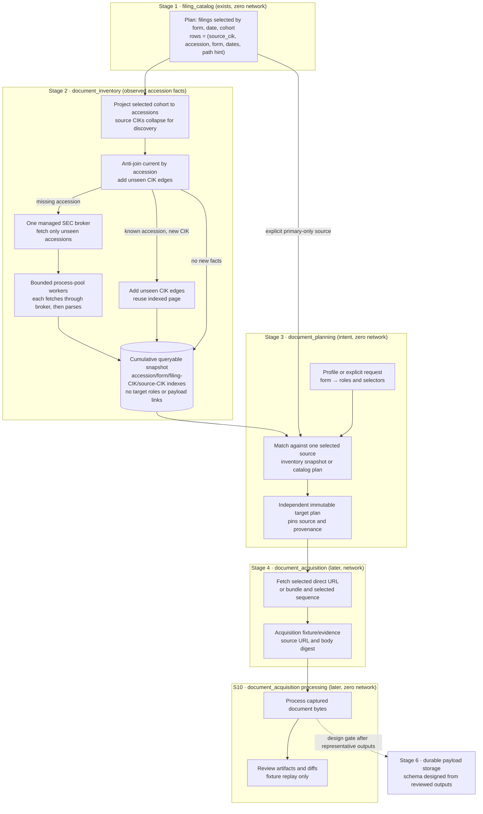

# Accession-Centric Document Flow

Status: **architecture direction.** This document replaces the single-document
acquisition model described in [design.md](../design.md) §5 with an
accession-centric flow. It leaves the durable fetched-payload storage schema
undecided; metadata inventory and target-plan schemas are specified in
[implementation.md](./implementation.md). [design.md](../design.md) remains the
reference for domain models, the layer graph, and downstream analytics.

---

## 1. Problem: one schema carries four concerns

Today a single document identity runs from planning to storage:

| Concern | Where it lives today | Coupling |
| :--- | :--- | :--- |
| Selection | `filing_catalog` plan rows keyed by `document_locator_key` = accession + `document_path` | The catalog chooses a filing *and* one document in it. With no `primary_document`, `document_path` falls back to `<accession>.txt` (`document_path_source = submission_bundle`). |
| Document choice | The same `document_path`, plus the pre-2005 candidate gate and bundle-first recovery in `document_storage` | Which document is wanted gets decided only *while* fetching. |
| Acquisition | `document_storage` fetchers (fixture / broker / live) | Raw bytes are fetched and processed in the same worker step. |
| Storage | `DOCUMENT_SNAPSHOT_SCHEMA` (`document_storage/checkpoint.py`) | `raw_payload`, `normalized_text`, and resolution `metadata` share one row. |

Result: a change to which documents are wanted, how they are fetched, or how
they are normalized changes the same artifact. A separate observed inventory
and target plan remove that coupling now; durable fetched-payload storage remains
a distinct, evidence-gated design.

## 2. EDGAR facts the model must respect

| Era | Packaging | What a primary link means | Discovery & Retrieval Truth |
| :--- | :--- | :--- | :--- |
| 1993–1999 | The inspected 1994 filing has a concatenated SGML `<accession>.txt` envelope; its children have `<SEQUENCE>` and `<TYPE>`. | Its `-index.html` lists types and sizes, but child links are blank. | The observed page exposes enough metadata to plan extraction from the advertised `.txt` bundle. Broader era coverage is gated by the source audit. |
| 2000–2004 | Historical filings may have both individual files and an envelope. | Sequence order alone is not a safe primary selector. | The source audit must establish which index fields identify the actual primary and when direct links are present. |
| 2005–present | Individual files, an envelope, and directory indexes may be present. | A source href identifies an individually linked candidate; it does not imply a body has been fetched or validated. | Inspected modern `-index.html` pages expose type and direct-link information. `index.json` lists some packages but lacks statutory type metadata. |
| XML forms (any era) | A primary link under `xsl*/…/<name>.xml` is an XSL rendering served as HTML. | The real XML is the archive-root basename. | The rendering is kept only as a fallback (`domain/document/route.py`, `archive_root_candidate`). |

The inspected 1994 and modern pages show that `<accession>-index.html` can expose
document type, sequence, descriptions, sizes, and direct-link presence across
different eras. A stratified 100–200-page audit in
[implementation.md](./implementation.md) gates broader coverage claims and
parser edge rules. Inventory preserves link presence as an observation; a later
target plan derives `direct_url` or `bundle_sequence` retrieval from it.

## 3. Stage flow: accession facts before target intent

The inventory unit is the accession, not a requested document. Inventory records
what the archive exposes; planning separately decides which rows to target. Each
stage consumes the prior artifact without rewriting it. The flow uses three
stage-owned pipeline packages — `document_inventory` (S0–S5),
`document_planning` (S6), and `document_acquisition` (S9–S10) — rather than a
monolithic replacement of `document_storage`. S6 publishes the target-plan artifact
consumed by acquisition.

Stage 2 interacts only with lightweight index metadata; fetching `.txt` bundles
and child documents belongs to the later acquisition stage. Index-page parsing is
separate from processing the HTML bodies of documents eventually selected.

The first published snapshot is cumulative and queryable, not a per-cohort staging
artifact. New filing plans anti-join by accession against `current`; later cohort
plans add only previously unseen source-CIK/accession relationships. An accession query
returns all observed document/data-file rows, while a form query reads selected
annual row groups. Both operate on saved metadata without SEC requests. The
seek-index, range-read, and vacuum contracts are in
[inventory_snapshot.md](./inventory_snapshot.md). This inventory index contains
no paths or offsets into fetched-document storage.

## 4. Deduplication grains

Redundant work is avoided by naming the grain at which two requests are the
same work:

| Grain | Key | Where it applies |
| :--- | :--- | :--- |
| Filing occurrence | `(source_cik, accession)` | Cohort/source relationship stored separately from the physical accession, so new source associations can grow without duplicating index rows. |
| Accession | `accession` | The targeting, indexing, and fetch unit. One page response and one observed-entry set per accession, regardless of how many CIK plans include it. |
| Inventory query | `(accession)` or `filing_form` | Snapshot seek indexes return one accession's child rows or the selected form's filings locally, without fetching pages. |
| Observed entry | `(accession, table_kind, row_ordinal)` | One source row from a document/data-file table; sequence and filename may be absent or duplicated. |
| Target plan row | `(plan_id, accession, request_id, source_origin, inventory_entry_id)` | Request-specific outcome and provenance stored separately from inventory. |
| Payload | To be decided | Whether identical bytes deduplicate is a future policy, not a committed storage contract. |

**Merger lineage is a selection concern, not a dedup key.** If B and C merge
and keep filing separately, their accessions are different filings. An accession
selected through multiple catalog CIK contexts shares discovery work. Each cohort contributes new
`(source_cik, accession)` edges to the current snapshot, but the accession
anti-join suppresses a repeat page fetch. Lineage affects *which filings get
selected*. `engine/company_family` groups registrants for selection, but it
models no succession or merger graph (see that package's deliberate gaps).

## 5. Decisions

1. **Freeze the `document_storage` implementation during replacement.** S0–S12
   do not change its code or import the old pipeline; its module-by-module
   dispositions are tracked in the
   [replacement map](document_storage_disposition.md) linked from implementation §9.
   The intended end state is removal after the full approved
   replacement (including S11 payload storage), consumer/artifact migration, and a
   separate decommission gate.
2. **No new layer.** Orchestration (reading a plan, chunking, publishing)
   belongs in `pipelines/`. Pure targeting rules (era windows, the statutory
   exhibit grammar, resolution-state decisions) belong in `engine/` or
   `domain/`. The six-layer graph is enforced by the `layer-boundary` scanner.
3. **Catalog hints do not become inventory facts.** The cohort adapter ignores
   `primary_document`, `document_path`, and `document_path_source`. An explicit S6
   catalog-direct source may use a validated primary path for a primary-only target
   plan, with `catalog_direct` provenance; it never synthesizes an observed entry,
   changes inventory, or covers exhibits. Narrowing `filing_catalog` is independent
   and waits for a separate compatibility plan.
4. **Only fetched-payload storage is designed last.** Inventory and target-plan
   schemas, index fixtures, and review artifacts can be planned before document
   processing. The durable payload schema waits for reviewed acquisition and
   processing outputs; see [implementation.md](./implementation.md).

## 6. Decisions delegated to implementation subplans

- The profile artifact, selector grammar, target-plan schema, and stage-specific
  contracts are laid out in [implementation.md](./implementation.md).
- The source audit determines whether runtime `index.json` is needed. HTML is
  the preferred metadata source; directory JSON is not a tier that runs by
  default.
- The cumulative snapshot schema, accession/form/filing-CIK/source-CIK queries, cross-plan
  anti-join, range-read contract, and vacuum plan are specified in
  [inventory_snapshot.md](./inventory_snapshot.md).
- The inventory cohort adapter projects accessions and filing metadata from the
  existing catalog plan but ignores document paths. The catalog-direct planner is a
  separate, explicit primary-only source with its own pinned provenance.
- Process-pool parsing uses a shared `SecBroker`; the implementation roadmap
  defines worker and persistence ownership.
