# Accession Document Flow — Implementation Roadmap

Status: **architecture and subplan sequence drafted; detailed subplans S0–S12 are authored in the subplans directory.** The metadata inventory and
target-plan schemas can be specified before processing document bodies. The
filing-index HTML parser's edge rules are gated by a representative SEC-page audit;
the persistent model for fetched document payloads remains deliberately deferred.

Each stage S0–S12 has a detailed subplan under
[./subplans/](./subplans/). Stage headers link to their subplan; further
refinement of any subplan is independent, and the summaries here will be
compressed to reference them once all subplans are stable. S9 is decomposed into
S9a–S9d contracts for target adaptation, streaming, extraction, and fixture replay.
Stages group into two independent pipelines: `document_inventory` (S0–S5) and
`document_acquisition` (S6–S10); S7, S8, and S12 are cross-cutting.

See [design.md](./design.md) for the stage boundaries and domain grain. The
queryable snapshot, source-CIK anti-join, seek-index, and vacuum contract is
detailed in [inventory_snapshot.md](./inventory_snapshot.md).

## 1. Decision and Scope

Build a new accession-centric flow alongside the frozen `document_storage`
pipeline. Do not port to, alter its implementation, or import that pipeline during
S0–S12. Reuse
independently owned lower-layer APIs where their contracts fit and take only
documented design inspiration from old pipeline modules. The intended end state is
to remove `document_storage` after the approved S11 payload store is implemented,
replacement parity and consumer/artifact migration are verified, and a separately
gated decommission milestone passes.

The replacement is not a single pipeline. It is two independent pipelines that
jointly replace `document_storage`:

- `edgar_sec.pipelines.document_inventory` (S0–S5): cohort selection, index-page
  fetching and parsing, and publication of the cumulative queryable snapshot.
- `edgar_sec.pipelines.document_acquisition` (S6–S10): target-plan publication,
  acquisition of selected payloads, and deterministic processing of them.

S7 review and S12 operator integration are cross-cutting to both pipelines; S8 is
inventory maintenance, and S11 is a payload-store design gate rather than a pipeline.
No stage in either pipeline imports the frozen legacy package.

The tradeoff is stronger than extending the current path. A factual index of an
accession's observed files can serve independent primary, exhibit, and XBRL
target plans. Target intent no longer changes the inventory artifact. The inventory
path requires one index-page request per previously unseen accession; an explicit
catalog-direct target plan can skip index discovery for primary-only work but does
not register an observed index page or make the inventory complete for those rows.
Later plans and source-CIK associations anti-join against the cumulative snapshot;
accession/form queries use its seek indexes and make no SEC request.

**Production HTML work is deliberately late, but there are two different HTML
tasks.** S0 must inspect captured `-index.html` evidence to inform S3; it can use
manual or disposable exploratory extraction, but does not implement the production
parser. S3 freezes the reusable index parser only after S0. Selected filing-body HTML
normalization is a separate S10 task and can be deferred until acquisition fixtures
exist. Before either production parser is implemented, S1/S2 contracts, raw-page
capture, target-plan schemas and catalog-direct planning, acquisition transport and
SGML extraction contracts, and review-artifact shapes can be specified and much of
their implementation can proceed against synthetic typed inputs. S5's schema/query
work can likewise proceed, but publication of real index-derived rows waits for S3/S4.
Only the durable payload-store schema is intentionally left open until reviewed S9/S10
outputs exist.

| Area | Can be fixed in the roadmap now | What must wait |
|---|---|---|
| Cohort, inventory, target-plan, fixture, and manifest schemas | Yes; exact row grains, fields, identity inputs, and refusal rules are specified below. | S0 validates observed index fields; it does not block S1/S2 contract implementation. |
| Index fetching and parallel execution | Yes; one brokered network stage, a bounded CPU process pool, and parent-owned writers. | Per-worker memory estimate is measured during the audit. |
| Index parser | Yes; pure input/output contract, error states, and fixture matrix. | Table-discovery and column-variant rules are finalized from the sampled pages. |
| Target planning | Yes; profile grammar, matching order, outcomes, and independent plan bundle. | XBRL package availability label depends on S0 evidence. |
| Document acquisition, processing, review | Yes; in-memory contracts, fixture evidence, fingerprints, and review outputs. | Exact processing behavior is exercised on captured document payloads in S9–S10. |
| Published fetched-payload storage | No, by design. | S11 follows representative acquisition/processing review and requires its own approval. |

## 2. Observed Evidence and the Required Source Audit

The following cases establish concrete examples, not universal format coverage.

### Legacy accession: `0000950123-94-000687`

The `Document Format Files` table has five child rows and no individual document
links:

| Seq | Description | Type | Size (bytes) | Individual link |
|---:|---|---|---:|---|
| 1 | FORM 10-K, JOHNSON & JOHNSON | `10-K` | 60,710 | No |
| 2 | CALCULATION OF EARNINGS PER SHARE | `EX-11` | 3,961 | No |
| 3 | COMPUTATION OF EARNINGS TO FIXED CHARGES | `EX-12` | 3,577 | No |
| 4 | ANNUAL REPORT TO STOCKHOLDERS FOR FISCAL YEAR 1993 | `EX-13` | 144,384 | No |
| 5 | SUBSIDIARIES | `EX-21` | 16,856 | No |

The complete submission text file is separately listed as
`0000950123-94-000687.txt` (231,224 bytes). It is accession-level bundle
metadata, not a sixth child entry. Child bytes are retrieved later from the
bundle and selected by sequence; inventory does not fetch the bundle.

### Modern accession: `0000200406-26-000016`

The `Document Format Files` table has direct links, including:

| Seq | Type | Filename | Size |
|---:|---|---|---:|
| 1 | `10-K` | `jnj-20251228.htm` | 3.7 MB |
| 2 | `EX-4.B` | `ex4b-descriptionofcapitals.htm` | 71 KB |
| 3 | `EX-21` | `ex21-subsidiariesxform10xk.htm` | 203 KB |

The complete submission text file is 24.8 MB. The directory `index.json`
contains concrete names and an `*-xbrl.zip`, but does not provide the statutory
types that the HTML page provides.

### Audit gate before parser rules are frozen

Survey **100–200 accession `-index.html` pages**, stratified across 1993–1999,
2000–2004, 2005–2010, and 2011–present. Cover multiple forms and pages with both
`Document Format Files` and `Data Files` tables. Capture the selected pages and
cohort metadata in the inventory fixture database described below. Record a
portable per-accession audit result with page digest, era/form, table presence,
row counts, missing/duplicate sequence, link and filename presence, reported
sizes, bundle listing, parser exceptions, and whether an XBRL ZIP URL constructed
from the accession is independently known to exist. Do not download XBRL ZIP
bodies for this study.

The audit must answer:

1. Can one HTML parser preserve the full document/data-file table across the
   sampled eras, including the legacy no-link case?
2. Which fields are actually absent or duplicated, and which rows cannot be
   identified by sequence or filename alone?
3. Does the page advertise enough information to distinguish direct-file
   retrieval from bundle-plus-sequence retrieval?
4. Can the XBRL ZIP URL pattern be constructed consistently, and is its
   per-accession existence known at planning time? A URL pattern alone is not
   proof that an archive contains the package. If presence cannot be established
   without fetching the package, the plan records a constructed candidate rather
   than an observed item. Use a rate-limited body-free probe only if SEC supports
   it; otherwise a sampled `index.json` may confirm a listing, but not package
   availability for unsampled accessions.

Use `index.json` at runtime only if the audit identifies a concrete required
metadata gap that the HTML page and deterministic URL construction cannot cover.
The preferred first implementation is HTML-only. Do not claim universal HTML
coverage from the two examples above. Live-network surveying is an explicit,
rate-limited research step; normal tests remain offline and deterministic.

## 3. Stage Boundaries and Ownership

```mermaid
    flowchart LR
    CAT["Filing cohort plan<br/>filing_catalog or inventory fixture"]
    ANTI["Anti-join current by accession<br/>add CIK edges separately"]
    FETCH["One shared SecBroker<br/>fetch only unseen accessions"]
    PARSE["Bounded process-pool workers<br/>fetch through broker, then parse"]
    EDGE["Add unseen CIK edges<br/>reuse indexed page"]
    INV[("Cumulative queryable snapshot<br/>accession/form/filing-CIK/source-CIK indexes")]
    PLAN["Inventory target planning<br/>profile + inventory snapshot"]
    DIRECT["Catalog-direct planning<br/>primary-only, no inventory rows"]
    TARGET[("Independent target-plan artifact")]
    ACQ["Later: acquire selected payloads<br/>direct URL or bundle sequence"]
    PROC["Later: transform/process<br/>deterministic processor"]
    REVIEW["Fixture-backed review<br/>source, result, comparison"]
    STORE["Future gate: durable payload store<br/>schema designed from observed outputs"]

    CAT --> ANTI
    ANTI -->|missing accession| FETCH --> PARSE --> INV
    ANTI -->|known accession, new CIK| EDGE --> INV
    ANTI -->|no new facts| INV
    INV --> PLAN --> TARGET
    CAT --> DIRECT --> TARGET
    TARGET --> ACQ --> PROC --> REVIEW
    PROC -. "schema decision after evidence" .-> STORE
```



- **Cohort selection** chooses accessions. The adapter may project unique
  accessions, form/date fields, and source CIKs from a `filing_catalog` plan or a
  dedicated inventory fixture. Catalog `document_path` is not inventory
  identity and is not copied into observed rows. S6 may use a catalog path only
  through its explicit catalog-direct target source; that remains distinct from
  observed index rows. Construct index-page URLs from accession identity, never a
  planned child-document path.
- **Inventory** fetches and parses each accession's lightweight
  `<accession>-index.html`, recording every observed document/data-file row once.
  It does not apply target profiles or fetch document bodies.
- **Target planning** reads exactly one named immutable inventory snapshot or
  catalog plan, applies a versioned request/profile, and publishes a separate
  source-pinned target plan. Both modes make no HTTP request and never write intent
  back into the inventory.
- **Acquisition and processing** are planned as later stages with explicit
  in-memory contracts and fixture/review tools. They do not imply a published
  payload schema.
- **Final payload storage** is designed only after representative acquisition and
  processing outputs exist and can be reviewed. The index is not a promise about
  where or how fetched bodies will be stored.

`document_storage` stays frozen during S0–S12. No new package imports from
`pipelines.document_storage`; shared lower-layer domain, engine, HTTP,
serialization, and atomic-storage APIs may be used when their existing contract
fits. The module disposition map records direct reuse, inspiration-only contracts,
and retirement candidates. The package is removed only after the post-S12
decommission gate passes. The old candidate-recovery logic is not ported: where the index page
reliably publishes document types, planning uses those observations rather than
inferring a primary from sequence order or fetching an SGML bundle to discover it.

## 4. Durable Shapes Before Payload Storage

These metadata schemas are intentionally independent of any fetched-document
representation.

### 4.1 Inventory snapshot

The first published snapshot is cumulative and queryable. Its exact three-table
schema, annual partition layout, accession and CIK seek indexes, run identity,
anti-join, pointer semantics, and vacuum contract are specified in
[inventory_snapshot.md](./inventory_snapshot.md). In brief:

- **Dense annual partitions**: `year=YYYY/part-*.parquet` for `accessions`, `entries`,
  and `accession_sources`, avoiding sparse Hive form-directory explosion. Parts are
  sorted by `(form, filing_date, accession)` for Parquet row-group pruning.
- **Distinct CIK semantics**: `filing_cik` is derived from the accession prefix;
  `source_cik` records catalog/cohort associations in the `accession_sources`
  relation table. Relationships are not duplicated in a `co_filers` list on accession
  rows; new associations append relation rows with zero page refetches and no rewrite
  of accession facts.
- **Zero-copy manifest inheritance**: Unchanged annual partitions are referenced
  directly from parent snapshots; deltas write parts only for affected filing years.
- **Page supersession**: Refreshed pages supersede prior active entries in the new
  snapshot via manifest mapping and delta tombstones; older snapshots preserve prior
  observations intact.
- Accession, filing-form, and CIK queries read the snapshot locally and never fetch SEC
  pages. The snapshot contains no target roles or fetched-payload references.

### 4.2 Target profiles

Profiles live as versioned, tracked JSON artifacts under
`policies/document_targets/`, separate from inventory data and pipeline
settings. The profile grammar is a list of form selectors and target requests:

```json
{
  "profile_id": "corporate_financials",
  "schema_version": "1",
  "version": "1.0.0",
  "rules": [
    {
      "form_selector": "10-K, 20-F",
      "targets": [
        {"request_id": "primary", "role": "primary", "selector": {"kind": "primary"}, "optional": false},
        {"request_id": "annual_report", "role": "exhibit", "selector": {"document_type": "EX-13"}, "optional": true},
        {"request_id": "subsidiaries", "role": "exhibit", "selector": {"document_type": "EX-21"}, "optional": true}
      ]
    },
    {
      "form_selector": "*",
      "targets": [
        {"request_id": "primary", "role": "primary", "selector": {"kind": "primary"}, "optional": false}
      ]
    }
  ]
}
```

Rules are resolved as follows:

- Every target **must declare an explicit, stable `request_id`**.
- Comma-separated form selectors are split into individual form tokens, and
  `resolve_alias(form)` is called on **each individual form**; the alias owner does
  not accept un-split comma-delimited strings.
- Semantic canonicalization: form tokens are stripped of whitespace and alias-resolved.
  Selectors are not case-folded indiscriminately.
- The most-specific matching rule wins (`*` is a fallback, not merged with others).
  Overlapping rules at the same specificity are rejected.
- Primary selection matches the filing form (and its declared canonical aliases)
  against observed `document_type`; it never assumes sequence 1.
- Package requests such as `xbrl_zip` have an explicit selector kind and produce a
  `constructed_candidate` without inventing an inventory entry.
- Filename/description fuzzy matching and arbitrary selector expressions are out of
  scope.

### 4.3 Target-plan artifact

Target intent and match outcomes belong in a separate plan bundle:

```text
{artifacts_root}/document_planning/plans/{plan_id}/manifest.json
{artifacts_root}/document_planning/plans/{plan_id}/targets.parquet
```

The manifest pins `plan_id`, `inventory_snapshot_id`, canonical profile/request
digest, target-plan schema version, target-matching implementation version, and
counts by outcome. The target table is one row per requested selector outcome per
accession and matched entry. Its v1 fields are:

| Field | Arrow type | Contract |
|---|---|---|
| `target_id` | `string` | SHA-256 of canonical `[plan_id, accession, request_id, inventory_entry_id, outcome]`. |
| `accession` | `string` | Accession requested by the cohort. |
| `request_id` | `string` | Stable selector/rule identity from the profile. |
| `target_role` | `string` | Intent: `primary`, `exhibit`, `data_file`, or `package`. |
| `selector` | `string` | Requested form/type/name selector. |
| `optional` | `bool` | Whether no match is a valid outcome. |
| `inventory_entry_id` | `string`, nullable | Observed source row; null for constructed URL candidates or no match. |
| `status` | `string` | Outcome status: `matched`, `not_filed`, `required_missing`, `ambiguous`, `unresolved`, or `constructed_candidate`. |
| `source_origin` | `string` | Provenance: `inventory_index` (default) or `catalog_direct`. |
| `retrieval_mode` | `string` | `direct_url`, `bundle_sequence`, `constructed_package`, or `none`. |
| `target_url` | `string`, nullable | Observed/resolved href or convention-derived candidate URL. |
| `sequence` | `int32`, nullable | Required for bundle extraction; never guessed. |
| `byte_size` | `int64`, nullable | Source-observed size; unknown for constructed candidates. |
| `availability_evidence` | `string` | `index_html`, `constructed`, or `none`; does not imply a payload was fetched. |

Matching and outcome rules:

- **Status vs. Provenance**: `catalog_direct` belongs in `source_origin`, not in `status`.
- **`not_filed` vs. `unresolved`**: Use `not_filed` **only** when a recognized, complete
  index page has no matching row for an optional target. An unrecognized or unavailable
  page produces `unresolved`, never evidence that the filing omitted the document.
- **Candidate packages**: A constructed XBRL ZIP path derived from accession rules
  remains a `constructed_candidate` unless S0 establishes empirical proof of
  per-accession availability.
- An unlinked row needs both an advertised bundle URL and a sequence to become a
  `bundle_sequence` target.

### 4.4 Fixture databases

Use two purpose-specific append-only SQLite fixture stores, not
`document_storage.FixtureStore`:

1. **Index-page fixture** supports parser, inventory, and target-planning replay.
   `responses` stores `(request_url, response_sha256, byte_size, captured_at,
   compressed_body)` with a unique key on request URL plus body digest.
   `index_cases` maps accession to an immutable response key; `cohort_members`
   maps source CIK/form/date observations to a cohort source. Re-fetching a
   changed response appends evidence instead of replacing it. Transport failures
   are run results, not successful response payload rows.
2. **Acquisition fixture** is added only in the acquisition subplan under
   `{artifacts_root}/document_acquisition/fixtures/{fixture_id}/`. It stores
   source URL/body bytes and acquisition facts keyed by URL plus body digest, so
   review can replay the exact response. It does not define the final published
   document store.

Both stores pin schema version in an atomic fixture manifest, enable SQLite
foreign-key checks, refuse unrelated or malformed databases, support read-only
replay, and never overwrite source evidence. Tests seed through `tmp_path`;
committed inputs are minimal sanitized fixtures loaded through `tests.support`.

The index fixture's tables are:

```sql
CREATE TABLE index_responses (
    request_url TEXT NOT NULL,
    response_sha256 TEXT NOT NULL,
    byte_size INTEGER NOT NULL,
    captured_at TEXT NOT NULL,
    compressed_body BLOB NOT NULL,
    PRIMARY KEY (request_url, response_sha256)
);

CREATE TABLE index_cases (
    accession TEXT NOT NULL,
    request_url TEXT NOT NULL,
    response_sha256 TEXT NOT NULL,
    PRIMARY KEY (accession, request_url, response_sha256),
    FOREIGN KEY (request_url, response_sha256)
        REFERENCES index_responses (request_url, response_sha256)
);

CREATE TABLE cohort_members (
    accession TEXT NOT NULL,
    source_cik TEXT NOT NULL,
    form TEXT NOT NULL,
    filing_date TEXT NOT NULL,
    report_date TEXT,
    cohort_source_id TEXT NOT NULL,
    PRIMARY KEY (accession, source_cik, cohort_source_id)
);
```

`cohort_source_id` names the catalog plan or dedicated inventory fixture that
contributed the occurrence. Snapshot construction sorts and unions CIKs while
refusing conflicting form/filing-date values. The fixture manifest pins the
SQLite schema version, fixture ID, contributing cohort sources, page/accession
counts, and database-relative path. Commit only the sanitized representative
page cases and the audit's small portable result table; use local generated
databases for the full survey corpus.

S9 adds the document-response fixture tables (the final dataset remains
undefined):

```sql
CREATE TABLE acquisition_responses (
    source_url TEXT NOT NULL,
    response_sha256 TEXT NOT NULL,
    byte_size INTEGER NOT NULL,
    captured_at TEXT NOT NULL,
    compressed_body BLOB NOT NULL,
    PRIMARY KEY (source_url, response_sha256)
);

CREATE TABLE acquisition_cases (
    target_id TEXT PRIMARY KEY,
    plan_id TEXT NOT NULL,
    accession TEXT NOT NULL,
    requested_url TEXT NOT NULL,
    source_url TEXT,
    response_sha256 TEXT,
    result_status TEXT NOT NULL,
    retrieval_mode TEXT NOT NULL,
    selected_sequence INTEGER,
    selected_filename TEXT,
    selected_sha256 TEXT,
    selected_size INTEGER,
    error_kind TEXT,
    FOREIGN KEY (source_url, response_sha256)
        REFERENCES acquisition_responses (source_url, response_sha256)
);
```

Only the actual HTTP response body is stored in `acquisition_responses`: for a
legacy target this is the complete SGML envelope, from which offline replay
extracts the selected sequence. `selected_sha256` and `selected_size` validate
that extraction but do not point to another stored payload. The acquisition
fixture contains a small curated review corpus, not every live fetch.

### 4.5 In-memory stage records

These records define pipeline seams but are not published Parquet schemas:

| Record | Fields |
|---|---|
| `IndexPageEnvelope` | `accession`, `index_url`, `response_sha256`, `response_size`, `html_bytes`. |
| `IndexParseOutcome` | `accession`, `index_sha256`, `parsed/unrecognized` status, `entries`, `bundle_url`, `bundle_size`, bounded diagnostics. |
| `AcquiredTarget` | `target_id`, `fetch status/error`, requested and actual URL, retrieval mode, response digest/size, selected sequence/filename, selected payload digest/size, transient raw bytes. |
| `ProcessingResult` | `target_id`, processor fingerprint, representation kind, output/status, bounded stage diagnostics, output digest; output bytes/text remain transient. |

Only the index fixture DB stores raw index-page bytes. The later acquisition
fixture store captures document response bytes for deterministic reprocessing;
the `AcquiredTarget.raw bytes` and `ProcessingResult.output` fields never become
inventory or target-plan columns.

## 5. Processing, Broker, and Review Contracts

### 5.1 Index-page worker execution

HTML table parsing is CPU work; keep one accession per process-pool task. Each
worker fetches through a shared broker and parses the returned bytes, so the
process count scales CPU work without creating independent SEC rate limits:

1. The coordinator validates the complete cohort before any request and starts
   one `SecBroker`/`managed_broker` for the run. The broker owns one
   settings-backed `SecHttpClient`, its cache, rate limiter, retries, and failure
   ledger.
2. S4 strictly executes index discovery: it fetches and parses `-index.html` pages
   and **never** synthesizes `InventoryEntry` rows from catalog hints or filing
   summaries. Entries are strictly factual rows observed in `Document Format Files`
   or `Data Files`. S4 does not infer form capability rules or bypass decisions.
3. A bounded `ProcessPoolExecutor` worker receives an accession and index URL,
   fetches through a `SecBrokerClient`, hashes the response, parses both index
   tables, and returns a typed outcome. Workers never instantiate their own
   `SecHttpClient`.
4. Over IPC, workers return parsed structures and digests by default; raw HTML bytes
   are returned only when fixture capture is explicitly requested by the
   coordinator.
5. The broker enforces an evidence-gated response-byte budget derived from S0
   measurements and worker memory headroom, stopping transport immediately upon breach
   and returning typed `response_too_large` without truncating.
6. The coordinator alone writes fixture DB rows, Parquet, manifests, and pointers
   in stable accession order. It retains no full-cohort response list and calls
   `reclaim()` at bounded result intervals. A failed fetch or unrecognized page
   is an explicit error, never an empty inventory.
7. Bound submitted-but-uncollected tasks by the resolved worker budget, counting
   broker buffering, IPC serialization of response bodies into child workers, and
   worker DOM/parser memory. No child opens SQLite or writes a published artifact.

Use `derive_resources().workers`; its default worker factory calls
`auto_worker_count` with cgroup-aware available memory, worker-memory estimate,
and safety fraction. The broker's rate limiter remains authoritative for SEC
requests. The audit measures page parse cost and memory to tune the worker-memory
setting. Do not pass hardcoded worker counts. `SecBrokerClient` is the only worker
HTTP seam; tests inject a fake `SecHttpClient` at the broker. Do not import
`document_storage.execution` or its chunk protocol.

This broker/process-pool design applies to the small index pages first. The
existing broker buffers each response, so the acquisition subplan separately
checks body-size behavior before using it for large filing documents; add a
streaming transport protocol only if real acquisition needs it.

### 5.2 Processing actual document bodies

The acquisition API is planned independently of storage:

- Input is one target-plan row and its inventory snapshot.
- `direct_url` requests one document. `bundle_sequence` requests the submission
  envelope and extracts only the selected child. The full bundle is transport
  input, not an inventory entry or required retained output.
- The in-memory result carries target identity, status/error, requested and actual
  source URL, source kind, response digest/size, selected sequence/filename when
  relevant, selected payload digest/size, and the selected raw bytes for the next
  processing call.
- Fetchers report acquisition; they do not choose target roles, judge content, or
  persist published outputs. Processing consumes saved acquisition fixture bytes
  offline.

The processor contract accepts the selected bytes plus content route and form,
then returns a representation, output text/bytes, status, stage diagnostics, and
processor fingerprint. Reuse existing lower-layer normalization APIs when their
contract fits; do not import the `document_storage` pipeline. Store no normalized
content in inventory or target-plan artifacts.

### 5.3 Review tools

Build review surfaces as explicit consumers of fixture evidence, following the
source-first pattern in
[`document_storage/review_artifacts.py`](../../edgar_sec/pipelines/document_storage/review_artifacts.py)
and comparison boundary in
[`document_storage/review.py`](../../edgar_sec/pipelines/document_storage/review.py),
without importing those pipeline modules.

- **Index review artifacts** replay an index-page fixture through a chosen parser
  version. Each case presents source URL/digest, a safe inert view of the source
  page, the parsed accession metadata, and the ordered observed rows. The source
  digest and parser version are included in `manifest.jsonl`.
- **Sanitized inert previews**: `source.inert.html` is generated from sanitized, rebuilt
  markup. Active scripts, external resources, styles, and event handlers are stripped.
  Links are rendered as plain inert text without active or pseudo-URI anchors (no
  `href="javascript:void(0)"`). CSP `default-src 'none'` is embedded as defense in depth.
- **Index review comparison** compares two parser runs by accession/table/row
  identity and reports added, removed, or changed type, sequence, description,
  filename, href, size, bundle metadata, and diagnostics. The raw page remains the
  evidence; rendering does not load active remote links.
- **Target-plan review** compares outcome status transitions (`not_filed`, `matched`,
  `ambiguous`, `unresolved`, `constructed_candidate`) separately from profile selector
  edits.
- **Document processing review** later replays captured acquisition fixtures,
  records source and output digests, processor fingerprint and stage diagnostics,
  and compares outputs across processor versions. It runs no network requests and
  writes only review artifacts, not the future published payload store.

Review output shapes are fixed independently of the eventual payload store:

```text
{artifacts_root}/document_inventory/review-runs/{review_id}/
  manifest.jsonl
  cases/{accession}/source.inert.html
  cases/{accession}/observations.json
  cases/{accession}/entries.csv
{artifacts_root}/document_planning/review-runs/{review_id}/
  manifest.jsonl
  target-plan-diff.json
{artifacts_root}/document_processing/review-runs/{review_id}/
  manifest.jsonl
  cases/{target_id}/source.inert.html
  cases/{target_id}/normalized.txt
  cases/{target_id}/processing.json
```

For non-HTML or non-text results, the corresponding preview or normalized-text
file is absent; `processing.json` always records the route and result status.

Each `manifest.jsonl` row pins fixture ID, source URL/digest, accession or
target ID, snapshot/plan ID when applicable, parser/processor fingerprint,
result status, and digests for generated review files. Raw source bytes stay in
the fixture DB; HTML previews render source links as inert text and do not load
remote resources. Target-plan review differences are keyed by request/accession
and inventory-entry identity, not by profile role alone.

All review outputs refuse a non-empty destination. One bad case is reported and
does not erase successful case outputs; the command returns nonzero when any
selected case failed. Review runs are reproducible from fixture ID plus selected
accession/target IDs and processor/parser identity.

## 6. Implementation Subplans

The subplans below can be authored together from this roadmap. They are not
intended to be planned one-by-one after each prior implementation finishes. The
dependency graph constrains implementation start order, not when the plans can be
written. Only parser-specific assertions and the XBRL availability policy depend
on the empirical audit result.

### S0 — SEC index evidence survey and fixture selection

**Details:** [subplan](subplans/S0_sec_index_audit.md)

After S1 can project candidates from a broad published `filing_catalog` snapshot and S2 can capture/replay raw pages, the stratified 100–200-page `-index.html` audit produces a portable evidence table, selected sanitized page fixtures, and an XBRL decision record. A selected target plan is not a reliable survey frame. S0 does not need S5 query fixtures or S7 review artifacts; snapshot-query fixtures move to S5/S12. The sampling matrix, per-page record schema, four audit questions, and acceptance criteria are in the subplan.

### S1 — Cohort projection and inventory-domain contracts

**Details:** [subplan](subplans/S1_cohort_contracts.md)

The inventory-domain model (`InventoryCohort`, `AccessionInventory`, `InventoryEntry`, `AccessionSource`) and a narrow cohort reader projecting published `filing_catalog` snapshots or selected plans plus fixture cases to accessions. This is the bootstrap for S0: the broad snapshot supplies survey candidates, while S1 creates a small committed cohort fixture alongside its offline tests. Inventory builds may use a selected plan; CIK associations are unique relation rows, form/filing-date agreement is required, and document-path locators are ignored; full schemas, refusal rules, and acceptance tests are in the subplan.

### S2 — Index-page fixture capture and replay store

**Details:** [subplan](subplans/S2_index_fixture_store.md)

An append-only SQLite store for raw `-index.html` responses keyed by URL+digest, with an atomic fixture manifest, a capture/fill operation using the cohort adapter, and read-only replay. Implement it before S0: the audit needs captured pages, while S3 consumes the same bytes after parser rules are informed. It stores bytes and source metadata only; full schema, manifest contents, and acceptance tests are in the subplan.

### S3 — Pure HTML index parser

**Details:** [subplan](subplans/S3_index_parser.md)

`parse_html_index()` over raw bytes: no network, SQLite, profile, `document_storage`, or snapshot imports. It emits all document/data-file rows and bundle metadata; unknown or unsupported page structure returns typed `unrecognized`, never a successful empty result. The fixture matrix, edge cases, and acceptance tests are in the subplan.

### S4 — Broker-backed inventory worker and bounded process pool

**Details:** [subplan](subplans/S4_broker_worker.md)

One `SecBroker` per run whose cache, rate limiter, and failure ledger all worker requests share; strict index discovery boundary with no catalog-derived entry synthesis; a memory-derived process pool executing one accession per task with evidence-gated response byte budgets; coordinator-owned fixture/Parquet writers; raw HTML returned across IPC only when fixture capture is active; and typed page errors. No worker creates its own HTTP client or writes artifacts. Full lifecycle, budget, and acceptance tests are in the subplan.

### S5 — Immutable inventory snapshot publication

**Details:** [subplan](subplans/S5_snapshot_publication.md)

The cumulative queryable snapshot: dense annual partitions (`year=YYYY/part-*.parquet`), anti-join by accession before HTTP, distinct CIK semantics (`filing_cik` from the accession prefix and `source_cik` relation in `accession_sources`), separate filing/source-CIK lookup shards, zero-copy manifest inheritance, page supersession/tombstones, and atomic `current` publication after validation. No target profile or payload field enters the snapshot; a failed fetch or parse publishes nothing. Run intent, immutable identity, and acceptance tests are in the subplan.

### S6 — Target profiles and separate target-plan artifacts

**Details:** [subplan](subplans/S6_target_plans.md)

Versioned JSON profiles in `policies/document_targets/` with mandatory `request_id`, individual form alias resolution via `resolve_alias`, and canonical digests; target plans as separate immutable bundles pinned to exactly one source artifact (inventory snapshot or catalog plan); clean separation of outcome `status` from provenance (`source_origin: "inventory_index" | "catalog_direct"`); and primary-only catalog-direct targets without synthetic inventory rows. Hybrid source precedence is deferred. The grammar, v1 target-plan schema, matching rules, and acceptance tests are in the subplan.

### S7 — Index and target-plan review surfaces

**Details:** [subplan](subplans/S7_review.md)

Offline `review-artifacts`, `review`, and snapshot `inspect` APIs for source-page parse output, target plans, and saved manifests, with CLI routes limited to review capabilities and basic lookup. Rebuilt sanitized markup renders source links as inert text without active anchors; CSP is defense in depth; parser and plan diffs isolate identity-keyed field and outcome transitions; review outputs refuse empty destinations, and one bad case does not erase successful cases. The output shapes, comparison boundaries, and acceptance tests are in the subplan.

### S8 — Snapshot vacuum and lookup-index compaction

**Details:** [subplan](subplans/S8_vacuum.md)

Metadata-only offline compaction of annual parts and accession/filing-CIK/source-CIK lookup shards adhering to 128k-row zstd Parquet standards, with shard rebuild, uniqueness and digest validation, a logical fingerprint query-parity verification gate before moving `current`, dependency-aware retention protecting active plans and live parts, and lease-checked staging cleanup. It does not re-fetch pages or alter logical inventory facts. Cumulative snapshots, source-CIK edge merging, point/form/CIK queries, and the anti-join remain S5 work.

### S9 — Target-plan acquisition and source fixture database

**Details:** [subplan](subplans/S9_acquisition.md)

Acquisition is split into S9a–S9d: target-plan work-order adaptation; brokered streaming into managed staging; bounded exact-sequence SGML extraction; and append-only SQLite case metadata with content-addressed fixture bodies. Both target source origins use the same typed work/result contract. Raw body bytes never cross process IPC; fixture capture streams from managed staging. No `document_storage` imports are introduced. Full schemas, errors, and acceptance tests are in the linked subplans.

### S10 — Processing contract, processor versions, and document review

**Details:** [subplan](subplans/S10_processing.md)

A staged-body-to-representation interface with deterministic fingerprint and route dispatch for HTML/iXBRL, text, standalone XML, binary/PDF, paper, and unknown paths. It reuses the existing form-aware engine normalizer without materializing stage traces; normalized content remains transient except selected S7 review outputs. PDF text extraction and XML fact extraction are explicit gaps; no `document_storage` imports.

### S11 — Durable payload-store decision (design gate, not implementation)

**Details:** [subplan](subplans/S11_payload_design.md)

Design gate only, not implementation. Representative S9/S10 cases feed a reviewed design comparing CAS, annual Parquet, and DuckDB storage for raw/selected/normalized identities, target/source provenance, occurrence relationships, replay, idempotence, retention, and inventory linkage. It preserves S5 annual metadata parts and S6 source-pinned plans; explicit approval is required before payload code, and no payload fields enter inventory.

### S12 — Operator integration and end-to-end quality gate

**Details:** [subplan](subplans/S12_operator_integration.md)

A small artifact-oriented CLI surface for snapshot/CIK queries, explicit-retention vacuum, inventory- or catalog-direct target planning, fixture replay/review, and inspection. Machine-readable summaries retain stage-specific outcomes. The offline vertical run covers cohort fixtures through query, both plan-source modes, acquisition/processing replay, vacuum parity, and parser/plan review. Interactive UX, production acquisition/processing commands, and `document_storage` removal remain deferred.

## 7. Dependency Graph and Parallel Planning

```text
S1 cohort/schema ─> S2 raw index-page capture ─> S0 evidence audit ─> S3 parser
S1 ─> S6 catalog-direct contract/implementation ─────────────────────┐
S3 ─> S4 broker + parser worker ─> S5 cumulative/queryable snapshot ─┼─> S6 inventory source
                                                                     ├─> S8 vacuum
S6 ─> S9a work order ─> S9b streaming ─┬─> S10 direct processing ───┤
                                       ├─> S9c SGML extraction ─────┤
                                       └─> S9d fixture replay ──────┤
S2/S3/S5/S6 ─> S7 index/plan review ────────────────────────────────┤
S9/S10 evidence ─> S11 payload-store decision ──────────────────────┤
S1–S11 ─────────────────────────────────────────────────────────────> S12
```

The inventory implementation bootstrap is S1, S2, S0, S3, S4, S5. The production
index parser cannot be delayed past S3 because S4/S5 need parsed rows, but it can be
the last index-HTML implementation after the survey. In parallel, S6's profile and
catalog-direct path, S9 transport/SGML extraction, and artifact contracts can be
developed against synthetic typed inputs; end-to-end S6 inventory planning, S7 parser
review, S8 vacuum, and S9d replay wait for their named source artifacts. S10 filing-
body HTML processing is deferred until S9 fixtures exist. S11 is intentionally a
design decision after S9/S10 evidence, not a missing subplan.

## 8. CLI Surface by Stage

The initial operator surface is explicit-artifact oriented and small:

| Stage | Initial command shape | Input / output |
|---|---|---|
| Capture index fixture | `inventory fill --catalog-plan <id> --fixture <id>` | Selected accession cohort → append-only raw index-page fixture. |
| Build inventory | `inventory build --catalog-plan <id>` or `--fixture <id>` | Cohort → anti-join current, fetch only missing accessions, publish cumulative snapshot. |
| Target planning | `documents plan --inventory <snapshot_id|current> --profile <path>` or `--catalog-plan <id> --profile <path>` | Explicit source → immutable target plan with pinned source provenance. One source per v1 plan. |
| Accession query | `inventory query --snapshot current --accession <accession>` | Filing facts, all observed child/data-file rows, and source-CIK relations; no network. |
| Form/CIK query | `inventory query --snapshot current --form <form> [--filing-cik <cik>] [--source-cik <cik>]`, `--filing-cik <cik>`, or `--source-cik <cik>` | Matching accessions/entries from annual parts and distinct filing/source-CIK postings; no network. |
| Vacuum | `inventory vacuum --snapshot <snapshot-id|current> --retention <policy-id>` | Compact annual parts and lookup shards; parity-gated, atomically publish `current`. |
| Inspect | `inventory inspect --snapshot <id|current> [--accession <accession>]` | Reads a pinned snapshot manifest/partition or one accession; no network. |
| Review parser | `inventory review-artifacts --fixture <id> --output <dir>` | Fixture pages → per-accession parser evidence. |
| Compare | `inventory review --base <dir> --new <dir>` | Two review runs → structured differences. |

`index.json` parsing, a broader `status` command, interactive wizard, and
acquisition/processing CLI commands are added only in their owning subplans. No
query command fetches index pages or filing bodies; only `inventory build`
fetches index pages for accessions missing from the selected base snapshot.

## 9. Frozen Pipeline Module Disposition

The [module-by-module replacement map](document_storage_disposition.md) records
what the current `document_storage` pipeline owns, which lower-layer APIs remain
reused, which old behaviors are inspiration-only or deliberately omitted, and
which package modules/tests are scheduled for deletion at the post-S12 gate. No
module under `pipelines.document_storage` is a dependency of the new pipeline.

## 10. Exclusions and Decision Gates

- No inventory field stores target-role intent or points at fetched content.
- No runtime `index.json` unless S0 proves an HTML/URL-construction gap.
- No SGML download or bundle extraction in inventory or target planning.
- No document-body normalization during inventory or target planning.
- No production raw/normalized payload Parquet, blob CAS, or payload linkage
  until S11 is reviewed and approved.
- The planned `document_storage` removal is a separate post-S12 gate: the approved
  S11 payload design must be implemented, consumers and old artifacts migrated or
  retired, parity/rollback checks passed, and module-map links cleaned before deletion.
- No claim that index page formats, constructed ZIP presence, or actual document
  normalization have universal parity until backed by the audit and fixture
  review artifacts.
