# Accession Document Flow — Implementation Roadmap

Status: **the S1–S5 inventory publication path, the split Project/Run/Status/Publish
lifecycle, and S7a/S7b fixture-review foundations are implemented; S0 historical
acceptance and S8 operational retention remain open.** S6
target planning is the next offline handoff. See the
[inventory exit and acquisition gate](./inventory_exit_and_acquisition_gate.md) for
current readiness; stage subplans own detailed contracts.

Each stage S0–S12 has a detailed subplan under
[./subplans/](./subplans/); S7a is the frontloaded fixture CLI and S7b is the parser
review loop. Stage headers link to their subplan; further
refinement of any subplan is independent, and the summaries here will be
compressed to reference them once all subplans are stable. S9 is decomposed into
S9a–S9d contracts for target adaptation, streaming, extraction, and fixture replay.
Stages are owned by three pipeline packages joined by immutable artifacts:
`document_inventory` (S0–S5), `document_planning` (S6), and
`document_acquisition` (S9–S10). S7, S8, and S12 are cross-cutting; S11 is a payload-store
design gate.

See [design.md](./design.md) for the stage boundaries and domain grain. The
queryable snapshot, source-CIK anti-join, seek-index, and vacuum contract is
detailed in [inventory_snapshot.md](./inventory_snapshot.md).

## 1. Decision and Scope

Build a new accession-centric flow alongside the frozen `document_storage`
pipeline. Do not port to, alter its implementation, or import that pipeline during
S0–S12. Reuse
independently owned lower-layer APIs where their contracts fit and take only
documented design inspiration from old pipeline modules. The intended end state is
to remove `document_storage` after the approved S11 payload store is implemented,
replacement parity and consumer/artifact migration are verified, and a separately
gated decommission milestone passes.

The replacement is not a single pipeline. Three stage-owned pipeline packages
jointly replace `document_storage` through explicit artifact handoffs:

- `edgar_sec.pipelines.document_inventory` (S0–S5): cohort selection, index-page
  fetching and parsing, and publication of the cumulative queryable snapshot.
- `edgar_sec.pipelines.document_planning` (S6): offline target-plan publication from a
  required filing-catalog scope and optional immutable inventory evidence.
- `edgar_sec.pipelines.document_acquisition` (S9–S10): acquisition of selected
  payloads and deterministic processing of them.

S7 review (with S7a fixture lifecycle and S7b parser review frontloaded before parser
implementation) and S12 operator integration are cross-cutting to the three packages;
S8 is inventory maintenance, and S11 is a payload-store design gate rather than a
pipeline. None of the replacement packages imports the frozen legacy package.

The tradeoff is stronger than extending the current path. A factual index of an
accession's observed files can serve independent primary, exhibit, and XBRL
target plans. Target intent no longer changes the inventory artifact. The inventory
path requires one index-page request per previously unseen accession; an explicit
catalog-direct target plan can skip index discovery for primary-only work but does
not register an observed index page or make the inventory complete for those rows.
Later plans and source-CIK associations anti-join against the cumulative snapshot;
accession/form queries use its seek indexes and make no SEC request.

**The dependency is a DAG, not a parser-first linear sequence.** S2 raw-page capture
unlocks S0's evidence survey and S7a's fixture CLI lifecycle. S7a depends on S1/S2 and
catalog-plan loading; S7b adds parser review artifacts over those fixtures and the S3
type contract. S3 can begin through S7b while S0 gathers final table/era evidence in
parallel. S0 still gates parser acceptance and XBRL availability policy, but not the
first parser implementation pass. S4 worker orchestration and S5 storage/query work
can proceed against typed outcomes; operational publication waits for real S3 parsing
and the S4 integration. The rest of S7 (plan comparison, snapshot inspect, and later
processing review) follows its own source artifacts. Selected filing-body HTML
normalization remains a separate S10 task. Only the durable payload-store schema is
intentionally left open until reviewed S9/S10 outputs exist.

| Area | Can be fixed in the roadmap now | What must wait |
|---|---|---|
| Cohort, inventory, target-plan, fixture, and manifest schemas | Yes; exact row grains, fields, identity inputs, and refusal rules are specified below. | S0 validates observed index fields; it does not block S1/S2 contract implementation. |
| Index fetching and parallel execution | Yes; one brokered network stage, a bounded CPU process pool, and parent-owned writers. | Per-worker memory estimate is measured during the audit. |
| Index parser | Initial structural pass may proceed from the committed standard-layout fixture; S7b supplies the iterative review loop. | S0 finalizes era/table variants and parser acceptance coverage. |
| Fixture CLI lifecycle | S7a creates, fills/extends, and lists fixtures from catalog plans before parser work. | Fill/refresh semantics and fixture-manifest integrity are refined in S7a. |
| Parser review CLI/artifacts | S7b consumes S7a fixtures and the S3 type contract to review parser iterations. | Stub-status works if parsing is still unimplemented; real-page acceptance waits for S0 fixtures. |
| Target planning | Yes; profile grammar, matching order, outcomes, and independent plan bundle. | XBRL package availability label depends on S0 evidence. |
| Document acquisition, processing, review | Yes; in-memory contracts, fixture evidence, fingerprints, and review outputs. | Exact processing behavior is exercised on captured document payloads in S9–S10. |
| Published fetched-payload storage | No, by design. | S11 follows representative acquisition/processing review and requires its own approval. |

## 2. Observed Evidence and the Required Source Audit

The following cases establish concrete examples, not universal format coverage.

### Legacy accession: `0000950123-94-000687`

The `Document Format Files` table has five child rows and no individual document
links:

| Seq | Description | Type | Size (bytes) | Individual link |
|---:|---|---|---:|---|
| 1 | FORM 10-K, JOHNSON & JOHNSON | `10-K` | 60,710 | No |
| 2 | CALCULATION OF EARNINGS PER SHARE | `EX-11` | 3,961 | No |
| 3 | COMPUTATION OF EARNINGS TO FIXED CHARGES | `EX-12` | 3,577 | No |
| 4 | ANNUAL REPORT TO STOCKHOLDERS FOR FISCAL YEAR 1993 | `EX-13` | 144,384 | No |
| 5 | SUBSIDIARIES | `EX-21` | 16,856 | No |

The complete submission text file is separately listed as
`0000950123-94-000687.txt` (231,224 bytes). It is accession-level bundle
metadata, not a sixth child entry. Child bytes are retrieved later from the
bundle and selected by sequence; inventory does not fetch the bundle.

### Modern accession: `0000200406-26-000016`

The `Document Format Files` table includes direct links and an inline-XBRL viewer
link. For sequence 1, the observed href is `/ix?doc=/Archives/edgar/data/.../jnj-20251228.htm`;
its `doc` parameter names the direct archive document. Resolve and validate that
same-accession path rather than treating `/ix` as the document URL. Other file rows
link directly into the archive:

| Seq | Type | Filename | Size |
|---:|---|---|---:|
| 1 | `10-K` | `jnj-20251228.htm` | 3.7 MB |
| 2 | `EX-4.B` | `ex4b-descriptionofcapitals.htm` | 71 KB |
| 3 | `EX-21` | `ex21-subsidiariesxform10xk.htm` | 203 KB |

The complete submission text file is also advertised in the `Document Format Files`
table as `0000200406-26-000016.txt` (24,877,468 bytes). It is bundle metadata, not a
child entry. The directory `index.json`
contains concrete names and an `*-xbrl.zip`, but does not provide the statutory
types that the HTML page provides.

### Audit gate before parser rules are frozen

Survey **100–200 accession `-index.html` pages**, stratified across 1993–1999,
2000–2004, 2005–2010, and 2011–present. Cover multiple forms and pages with both
`Document Format Files` and `Data Files` tables. Capture the selected pages and
cohort metadata in the inventory fixture database described below. Record a
portable per-accession audit result with page digest, era/form, table presence,
row counts, missing/duplicate sequence, link and filename presence, reported
sizes, bundle listing, parser exceptions, and whether an XBRL ZIP URL constructed
from the accession is independently known to exist. Do not download XBRL ZIP
bodies for this study.

The audit must answer:

1. Can one HTML parser preserve the full document/data-file table across the
   sampled eras, including the legacy no-link case?
2. Which fields are actually absent or duplicated, and which rows cannot be
   identified by sequence or filename alone?
3. Does the page advertise enough information to distinguish direct-file
   retrieval from bundle-plus-sequence retrieval?
4. Can the XBRL ZIP URL pattern be constructed consistently, and is its
   per-accession existence known at planning time? A URL pattern alone is not
   proof that an archive contains the package. If presence cannot be established
   without fetching the package, the plan records a constructed candidate rather
   than an observed item. Use a rate-limited body-free probe only if SEC supports
   it; otherwise a sampled `index.json` may confirm a listing, but not package
   availability for unsampled accessions.

Use `index.json` at runtime only if the audit identifies a concrete required
metadata gap that the HTML page and deterministic URL construction cannot cover.
The preferred first implementation is HTML-only. Do not claim universal HTML
coverage from the two examples above. Live-network surveying is an explicit,
rate-limited research step; normal tests remain offline and deterministic.

## 3. Stage Boundaries and Ownership

```mermaid
    flowchart LR
    CAT["Filing cohort plan<br/>filing_catalog or inventory fixture"]
    ANTI["Anti-join current by accession<br/>add CIK edges separately"]
    FETCH["One shared SecBroker<br/>fetch only unseen accessions"]
    PARSE["Bounded process-pool workers<br/>fetch through broker, then parse"]
    EDGE["Add unseen CIK edges<br/>reuse indexed page"]
    INV[("Cumulative queryable snapshot<br/>accession/form/filing-CIK/source-CIK indexes")]
    PLAN["S6 target planning<br/>catalog scope + optional inventory evidence"]
    TARGET[("Independent target-plan artifact")]
    ACQ["Later: acquire selected payloads<br/>direct URL or bundle sequence"]
    PROC["Later: transform/process<br/>deterministic processor"]
    REVIEW["Fixture-backed review<br/>source, result, comparison"]
    STORE["Future gate: durable payload store<br/>schema designed from observed outputs"]

    CAT --> ANTI
    ANTI -->|missing accession| FETCH --> PARSE --> INV
    ANTI -->|known accession, new CIK| EDGE --> INV
    ANTI -->|no new facts| INV
    CAT --> PLAN
    INV --> PLAN
    PLAN --> TARGET
    TARGET --> ACQ --> PROC --> REVIEW
    PROC -. "schema decision after evidence" .-> STORE
```



- **Cohort selection** chooses accessions. The adapter may project unique
  accessions, form/date fields, and source CIKs from a `filing_catalog` plan or a
  dedicated inventory fixture. Catalog `document_path` is not inventory identity
  and is not copied into observed rows. S6 always takes the catalog plan as scope;
  it may use catalog primary paths only when no snapshot is supplied, otherwise the
  inventory index is the sole locator source. Construct index-page URLs from
  accession identity, never a planned child-document path.
- **Inventory** fetches and parses each accession's lightweight
  `<accession>-index.html`, recording every observed document/data-file row once.
  It does not apply target profiles or fetch document bodies.
- **Target planning** reads a named filing-catalog plan as scope, optionally reads a
  named immutable inventory snapshot as document evidence, applies a versioned
  request/profile, and publishes a plan pinned to both inputs. Without a snapshot,
  only primary catalog-direct planning is allowed. With a snapshot, it alone supplies
  locators; missing accessions do not fall back to catalog paths. Planning makes no
  HTTP request and never writes intent back into the inventory.
- **Acquisition and processing** are planned as later stages with explicit
  in-memory contracts and fixture/review tools. They do not imply a published
  payload schema.
- **Final payload storage** is designed only after representative acquisition and
  processing outputs exist and can be reviewed. The index is not a promise about
  where or how fetched bodies will be stored.

`document_storage` stays frozen during S0–S12. No new package imports from
`pipelines.document_storage`; shared lower-layer domain, engine, HTTP,
serialization, and atomic-storage APIs may be used when their existing contract
fits. The module disposition map records direct reuse, inspiration-only contracts,
and retirement candidates. The package is removed only after the post-S12
decommission gate passes. The old candidate-recovery logic is not ported: where the index page
reliably publishes document types, planning uses those observations rather than
inferring a primary from sequence order or fetching an SGML bundle to discover it.

## 4. Durable Shapes Before Payload Storage

These metadata schemas are intentionally independent of any fetched-document
representation.

### 4.1 Inventory snapshot

The first published snapshot is cumulative and queryable. Its exact three-table
schema, annual partition layout, accession and CIK seek indexes, run identity,
anti-join, pointer semantics, and vacuum contract are specified in
[inventory_snapshot.md](./inventory_snapshot.md). In brief:

- **Dense annual partitions**: `year=YYYY/part-*.parquet` for `accessions`, `entries`,
  and `accession_sources`, avoiding sparse Hive form-directory explosion. Parts are
  sorted by `(form, filing_date, accession)` for Parquet row-group pruning.
- **Distinct CIK semantics**: `filing_cik` is derived from the accession prefix;
  `source_cik` records catalog/cohort associations in the `accession_sources`
  relation table. Relationships are not duplicated in a `co_filers` list on accession
  rows; new associations append relation rows with zero page refetches and no rewrite
  of accession facts.
- **Zero-copy manifest inheritance**: Unchanged annual partitions are referenced
  directly from parent snapshots; deltas write parts only for affected filing years.
- **Page supersession**: Refreshed pages use the entries relation's accession-scoped
  `scoped_mask` in the new snapshot; old named snapshots preserve prior observations.
  No separate prior-entry-ID map is part of the v1 contract.
- Accession, filing-form, and CIK queries read the snapshot locally and never fetch SEC
  pages. The snapshot contains no target roles or fetched-payload references.

### 4.2 Target profiles

Profiles live as versioned, tracked JSON under the repository-root
`policies/document_targets/` directory, separate from generated inventory/plan artifacts
and pipeline settings. The package paths module resolves the repository root. The
profile grammar is a list of form selectors and role/type target requests:

```json
{
  "profile_id": "corporate_financials",
  "schema_version": "1",
  "version": "1.0.0",
  "rules": [
    {
      "form_selector": "10-K, 20-F",
      "targets": [
        {"role": "primary", "type": "primary", "optional": false},
        {"role": "exhibit", "type": "EX-13", "optional": true},
        {"role": "exhibit", "type": "EX-21", "optional": true}
      ]
    },
    {
      "form_selector": "*",
      "targets": [
        {"role": "primary", "type": "primary", "optional": false}
      ]
    }
  ]
}
```

Rules are resolved as follows:

- Each target declares `role`, `type`, and `optional`; profile authors do not provide an
  ID mapping. The planner derives the downstream stable `request_id` from canonical
  role/type. Duplicate or overlapping role/type targets in one effective rule are
  rejected; array position never contributes to identity.
- Comma-separated form selectors are split into individual form tokens, and
  `resolve_alias(form)` is called on **each individual form**; the alias owner does
  not accept un-split comma-delimited strings.
- Semantic canonicalization: form tokens are stripped and alias-resolved; duplicate
  tokens/rules are rejected. Type whitespace is trimmed while type case is preserved.
  The profile digest sorts normalized rules and role/type targets, so JSON array order is
  not identity. It includes profile ID and versions.
- The most-specific matching rule wins (`*` is a fallback, not merged with others).
  Overlapping rules at the same specificity are rejected.
- Primary selection matches the filing form (and its declared canonical aliases)
  against observed `document_type`; it never assumes sequence 1.
- V1 role/type pairs are `primary`/`primary`, `exhibit`/exact or `EX-*` type,
  `data_file`/exact or `EX-101.*` type or `extracted_xbrl_instance`, `graphic`/`GRAPHIC`,
  and `package`/`xbrl_zip`. Unsupported pairs fail profile validation.
- Package requests such as `xbrl_zip` have an explicit `type` and produce a
  `constructed_candidate` without inventing an inventory entry.
- Filename/description fuzzy matching and arbitrary selector expressions are out of
  scope.

### 4.3 Target-plan artifact

Target intent and match outcomes belong in a separate plan bundle:

```text
{artifacts_root}/document_planning/plans/{plan_id}/plan.json
{artifacts_root}/document_planning/plans/{plan_id}/targets/form=<escaped-form>/part-00000.parquet
```

The manifest pins `plan_id`, required catalog plan ID/digest, nullable inventory
snapshot ID/digest, canonical profile digest, target-plan schema version,
target-matching implementation version, coverage, and counts by outcome. Its v1
table carries catalog `form` and `filing_date`, emits one row per candidate entry; an
unmatched request emits one row with a null `inventory_entry_id`, while an ambiguous
request emits one row per conflicting candidate. Its fields are:

| Field | Arrow type | Contract |
|---|---|---|
| `target_id` | `string` | SHA-256 of canonical `[plan_id, accession, request_id, inventory_entry_id, status]`; status is the outcome component. |
| `accession` | `string` | Accession in the selected source that matches the resolved form rule. |
| `form` | `string` | Catalog plan form; selects profile rules and target partition. |
| `filing_date` | `string` | Catalog filing date retained for downstream filtering and audit. |
| `request_id` | `string` | Planner-derived `"{role}:{canonical_type}"` identity; not user-authored. |
| `target_role` | `string` | Intent: `primary`, `exhibit`, `data_file`, `graphic`, or `package`. |
| `target_type` | `string` | Canonical profile type, such as `primary`, `EX-21`, `GRAPHIC`, or `xbrl_zip`. |
| `optional` | `bool` | Whether no match is a valid outcome. |
| `inventory_entry_id` | `string`, nullable | Observed source row; null for constructed URL candidates or no match. |
| `status` | `string` | Outcome status: `matched`, `not_filed`, `required_missing`, `ambiguous`, `unresolved`, or `constructed_candidate`. |
| `status_reason` | `string`, nullable | Stable reason code for a non-match or source-specific refusal. |
| `source_origin` | `string` | Provenance: `inventory_index` (default) or `catalog_direct`. |
| `retrieval_mode` | `string` | `direct_url`, `bundle_sequence`, `constructed_package`, or `none`. |
| `target_url` | `string`, nullable | Exact retrieval locator: observed child href for `direct_url`, advertised accession bundle URL for `bundle_sequence`, or constructed candidate URL. |
| `sequence` | `int32`, nullable | Observed sequence for `bundle_sequence`; null otherwise. Never guessed. |
| `byte_size` | `int64`, nullable | Source-observed size; unknown for constructed candidates. |
| `availability_evidence` | `string` | `index_html`, `catalog_metadata`, `constructed`, or `none`; does not imply a payload was fetched. |

Matching and outcome rules:

- **Status vs. Provenance**: `catalog_direct` belongs in `source_origin`, not in `status`.
- **`not_filed` vs. `unresolved`**: Use `not_filed` **only** when a recognized, complete
  index page has no matching row for an optional target. S5 refuses to publish failed or
  unrecognized pages, so an inventory-backed plan cannot emit `unresolved` for such a
  page from a successfully published snapshot. Per-accession parse-failure outcomes
  require a persisted S5 page-status relation.
- A catalog-scope accession missing from a selected inventory snapshot is
  `unresolved` / `accession_not_indexed`, independent of optionality. A present
  snapshot row whose recognized page lacks a matching entry may instead yield
  `not_filed` or `required_missing`. There is no catalog fallback in hybrid plans.
- **Candidate packages**: A constructed XBRL ZIP path derived from accession rules
  remains a `constructed_candidate` unless S0 establishes empirical proof of
  per-accession availability.
- An unlinked row needs both an advertised bundle URL and a sequence to become a
  self-contained `bundle_sequence` target; its bundle URL is stored in `target_url` so
  S9 does not need to reopen the inventory snapshot.

### 4.4 Fixture databases

Use two purpose-specific append-only SQLite fixture stores, not
`document_storage.FixtureStore`:

1. **Index-page fixture** supports parser, inventory, and target-planning replay.
   `responses` stores `(request_url, response_sha256, byte_size, captured_at,
   compressed_body)` with a unique key on request URL plus body digest.
   `index_cases` maps accession to an immutable response key; `cohort_members`
   maps source CIK/form/date observations to a cohort source. Re-fetching a
   changed response appends evidence instead of replacing it. Transport failures
   are run results, not successful response payload rows.
2. **Acquisition fixture** is added only in the acquisition subplan under
   `{artifacts_root}/document_acquisition/fixtures/{fixture_id}/`. It stores
   source URL/body bytes and acquisition facts keyed by URL plus body digest, so
   review can replay the exact response. It does not define the final published
   document store.

Both stores pin schema version in an atomic fixture manifest, enable SQLite
foreign-key checks, refuse unrelated or malformed databases, support read-only
replay, and never overwrite source evidence. Tests seed through `tmp_path`;
committed inputs are minimal sanitized fixtures loaded through `tests.support`.

The index fixture's tables are:

```sql
CREATE TABLE index_responses (
    request_url TEXT NOT NULL,
    response_sha256 TEXT NOT NULL,
    byte_size INTEGER NOT NULL,
    captured_at TEXT NOT NULL,
    compressed_body BLOB NOT NULL,
    PRIMARY KEY (request_url, response_sha256)
);

CREATE TABLE index_cases (
    accession TEXT NOT NULL,
    request_url TEXT NOT NULL,
    response_sha256 TEXT NOT NULL,
    PRIMARY KEY (accession, request_url, response_sha256),
    FOREIGN KEY (request_url, response_sha256)
        REFERENCES index_responses (request_url, response_sha256)
);

CREATE TABLE cohort_members (
    accession TEXT NOT NULL,
    source_cik TEXT NOT NULL,
    form TEXT NOT NULL,
    filing_date TEXT NOT NULL,
    report_date TEXT,
    cohort_source_id TEXT NOT NULL,
    PRIMARY KEY (accession, source_cik, cohort_source_id)
);
```

`cohort_source_id` names the catalog plan or dedicated inventory fixture that
contributed the occurrence. Snapshot construction sorts and unions CIKs while
refusing conflicting form/filing-date values. The fixture manifest pins the
SQLite schema version, fixture ID, contributing cohort sources, page/accession
counts, and database-relative path. Commit only the sanitized representative
page cases and the audit's small portable result table; use local generated
databases for the full survey corpus.

S9 adds the document-response fixture tables (the final dataset remains
undefined):

```sql
CREATE TABLE acquisition_responses (
    source_url TEXT NOT NULL,
    response_sha256 TEXT NOT NULL,
    byte_size INTEGER NOT NULL,
    captured_at TEXT NOT NULL,
    compressed_body BLOB NOT NULL,
    PRIMARY KEY (source_url, response_sha256)
);

CREATE TABLE acquisition_cases (
    target_id TEXT PRIMARY KEY,
    plan_id TEXT NOT NULL,
    accession TEXT NOT NULL,
    requested_url TEXT NOT NULL,
    source_url TEXT,
    response_sha256 TEXT,
    result_status TEXT NOT NULL,
    retrieval_mode TEXT NOT NULL,
    selected_sequence INTEGER,
    selected_filename TEXT,
    selected_sha256 TEXT,
    selected_size INTEGER,
    error_kind TEXT,
    FOREIGN KEY (source_url, response_sha256)
        REFERENCES acquisition_responses (source_url, response_sha256)
);
```

Only the actual HTTP response body is stored in `acquisition_responses`: for a
legacy target this is the complete SGML envelope, from which offline replay
extracts the selected sequence. `selected_sha256` and `selected_size` validate
that extraction but do not point to another stored payload. The acquisition
fixture contains a small curated review corpus, not every live fetch.

### 4.5 In-memory stage records

These records define pipeline seams but are not published Parquet schemas:

| Record | Fields |
|---|---|
| `IndexPageEnvelope` | `accession`, `index_url`, `response_sha256`, `response_size`, `html_bytes`. |
| `IndexParseOutcome` | `accession`, `index_sha256`, `parsed/unrecognized` status, `entries`, `bundle_url`, `bundle_size`, bounded diagnostics. |
| `AcquiredTarget` | `target_id`, `fetch status/error`, requested and actual URL, retrieval mode, response digest/size, selected sequence/filename, selected payload digest/size, transient raw bytes. |
| `ProcessingResult` | `target_id`, processor fingerprint, representation kind, output/status, bounded stage diagnostics, output digest; output bytes/text remain transient. |

Only the index fixture DB stores raw index-page bytes. The later acquisition
fixture store captures document response bytes for deterministic reprocessing;
the `AcquiredTarget.raw bytes` and `ProcessingResult.output` fields never become
inventory or target-plan columns.

## 5. Processing, Broker, and Review Contracts

### 5.1 Index-page worker execution

HTML table parsing is CPU work; keep one accession per process-pool task. Each
worker fetches through a shared broker and parses the returned bytes, so the
process count scales CPU work without creating independent SEC rate limits:

1. S5 validates the complete cohort and base, anti-joins known accessions, and
   supplies S4 the complete sorted missing-work list before any request. S4 starts
   one `SecBroker`/`managed_broker` for the run, with simultaneous connections
   bounded by the resolved worker count. The broker owns one settings-backed
   `SecHttpClient`, its cache, rate limiter, retries, and failure ledger; a cache hit
   returns before live HTTP and rate-slot acquisition.
2. S4 strictly executes index discovery: it fetches and parses `-index.html` pages
   and **never** synthesizes `InventoryEntry` rows from catalog hints or filing
   summaries. Child entries are factual rows from `Document Format Files` and
   `Data Files`; the complete-submission envelope row is separate bundle metadata.
   S4 does not infer form capability rules or bypass decisions.
3. A `spawn`-context worker receives one accession and index URL through a
   picklable inventory-owned wrapper over infra `SecBrokerClient`, fetches and parses
   in the child, then returns `IndexParseOutcome`, `IndexFetchFailure`, or
   `IndexWorkerFailure`. The transient envelope contains response size and exact
   bytes; raw HTML never returns over production IPC.
4. The first S3 parser pass uses the committed standard-layout fixture. S7b supplies
    fixture-backed iteration; parser refusals publish no snapshot. S0 evidence gathering
    runs in parallel and gates final parser acceptance.
5. There is no per-response byte cap or truncation. A process handles one full
   response and its parser working set; the derived worker count bounds concurrent
   response/parse sets. A pathological single page can exceed that estimate and
   remains an explicit residual risk.
6. The coordinator writes each deterministic work chunk to transient Parquet as
   outcomes complete and refills freed worker slots. S4 commits a chunk manifest and
   pointer only after exact membership, schema, row counts, and digests validate.
   S5 consumes committed chunk paths into separate bounded publication staging,
   externally sorts to published keys, and alone writes canonical Parquet, snapshot
   manifest, and `current` atomically. S2 fixture capture is separate S0 research and
   replay tooling.
7. S4's inventory-owned `paths.py` derives published and transient paths from the
   shared project root; it does not add dataset-specific foundation path properties
   or retain `DocumentStoragePaths`. Resume validates an immutable run manifest and
   per-chunk attempt pointer. A valid checkpoint skips fetch; an invalid/incomplete
   chunk is recomputed. S5 staging retries reuse valid S4 chunks without network.
8. Workers drop response and parser-only objects after each page; `reclaim()` runs
   at bounded worker/coordinator batches. The coordinator holds bounded in-flight
   outcomes and result batches. No child writes Parquet or opens SQLite.

Use `derive_resources().workers`; its default worker factory calls
`auto_worker_count` with cgroup-aware available memory, CPU cores, worker-memory
estimate, and safety fraction. Set the broker connection bound from that resolved
count; the broker rate limiter remains authoritative for aggregate SEC requests.
S0 measures page size and exploratory parser working set to tune the worker-memory
setting. Do not pass hardcoded worker counts. Tests inject a fake `SecHttpClient` at
the broker. Do not import `document_storage.execution` or its chunk protocol.

This broker/process-pool design applies to the small index pages first. The
existing broker buffers each response, so the acquisition subplan separately
checks body-size behavior before using it for large filing documents; add a
streaming transport protocol only if real acquisition needs it.

### 5.2 Processing actual document bodies

The acquisition API is planned independently of storage:

- Input is one target-plan row and its inventory snapshot.
- `direct_url` requests one document. `bundle_sequence` requests the submission
  envelope and extracts only the selected child. The full bundle is transport
  input, not an inventory entry or required retained output.
- The in-memory result carries target identity, status/error, requested and actual
  source URL, source kind, response digest/size, selected sequence/filename when
  relevant, selected payload digest/size, and the selected raw bytes for the next
  processing call.
- Fetchers report acquisition; they do not choose target roles, judge content, or
  persist published outputs. Processing consumes saved acquisition fixture bytes
  offline.

The processor contract accepts the selected bytes plus content route and form,
then returns a representation, output text/bytes, status, stage diagnostics, and
processor fingerprint. Reuse existing lower-layer normalization APIs when their
contract fits; do not import the `document_storage` pipeline. Store no normalized
content in inventory or target-plan artifacts.

### 5.3 Review tools

Build review surfaces as explicit consumers of fixture evidence, following the
source-first pattern in
[`document_storage/review_artifacts.py`](../../edgar_sec/pipelines/document_storage/review_artifacts.py)
and comparison boundary in
[`document_storage/review.py`](../../edgar_sec/pipelines/document_storage/review.py),
without importing those pipeline modules.

- **Index review artifacts** replay an index-page fixture through a chosen parser
  version. Each case presents source URL/digest, a safe inert view of the source
  page, the parsed accession metadata, and the ordered observed rows. The source
  digest and parser version are included in `manifest.jsonl`.
- **Sanitized inert previews**: `source.inert.html` uses the existing selectolax-backed
  `engine.document.html.tree.parse_html` and a strict structural allowlist rebuild.
  It drops active/resource subtrees, emits no source attributes, escapes text, and
  renders links as plain text. Regex stripping is not an HTML security boundary. A
  renderer-generated restrictive CSP is defense in depth; no new dependency is needed.
- **Index review comparison** compares two parser runs by accession/table/row
  identity and reports added, removed, or changed type, sequence, description,
  filename, href, size, bundle metadata, and diagnostics. The raw page remains the
  evidence; rendering does not load active remote links.
- **Target-plan review** compares outcome status transitions (`not_filed`, `matched`,
  `ambiguous`, `unresolved`, `constructed_candidate`) separately from profile role/type
  edits. `request_id` is derived from the canonical role/type pair.
- **Document processing review** later replays captured acquisition fixtures,
  records source and output digests, processor fingerprint and stage diagnostics,
  and compares outputs across processor versions. It runs no network requests and
  writes only review artifacts, not the future published payload store.

Review output shapes are fixed independently of the eventual payload store:

```text
{artifacts_root}/document_inventory/review-runs/{review_id}/
  manifest.jsonl
  cases/{accession}/source.inert.html
  cases/{accession}/observations.json
  cases/{accession}/entries.csv
{artifacts_root}/document_planning/review-runs/{review_id}/
  manifest.jsonl
  target-plan-diff.json
{artifacts_root}/document_acquisition/review-runs/{review_id}/
  manifest.jsonl
  cases/{target_id}/source.inert.html
  cases/{target_id}/normalized.txt
  cases/{target_id}/processing.json
```

For non-HTML or non-text results, the corresponding preview or normalized-text
file is absent; `processing.json` always records the route and result status.
The processing review root will be owned by `document_acquisition.paths` when that
package is implemented; no `document_processing` package or artifact dataset is
introduced.

Each `manifest.jsonl` row pins fixture ID, source URL/digest, accession or
target ID, snapshot/plan ID when applicable, parser/processor fingerprint,
result status, and digests for generated review files. Raw source bytes stay in
the fixture DB; HTML previews render source links as inert text and do not load
remote resources. Target-plan row diffs use the stable derived `request_id`; changing
profile role/type yields a removal/addition rather than a paired status transition.

All review outputs refuse a non-empty destination. One bad case is reported and
does not erase successful case outputs; the command returns nonzero when any
selected case failed. Review runs are reproducible from fixture ID plus selected
accession/target IDs and processor/parser identity.

## 6. Implementation Subplans

The subplans below can be authored together from this roadmap. They are not
intended to be planned one-by-one after each prior implementation finishes. The
dependency graph constrains implementation start order, not when the plans can be
written. Only parser-specific assertions and the XBRL availability policy depend
on the empirical audit result.

### S0 — SEC index evidence survey and fixture selection

**Details:** [subplan](subplans/S0_sec_index_audit.md)

After S1 can project candidates from a broad published `filing_catalog` snapshot and S2 can capture/replay raw pages, the stratified 100–200-page `-index.html` audit produces a portable evidence table, selected sanitized page fixtures, and an XBRL decision record. A selected target plan is not a reliable survey frame. S0 is independent of S7a/S7b and does not need S5 query fixtures or later S7 review surfaces; it can use manual/disposable inspection or S7b's inert source preview once available. The sampling matrix, per-page record schema, four audit questions, and acceptance criteria are in the subplan.

### S1 — Cohort projection and inventory-domain contracts

**Details:** [subplan](subplans/S1_cohort_contracts.md)

The inventory-domain model (`InventoryCohort`, `AccessionInventory`, `InventoryEntry`, `AccessionSource`) and a narrow cohort reader projecting published `filing_catalog` snapshots or selected plans plus fixture cases to accessions. This is the bootstrap for S0: the broad snapshot supplies survey candidates, while S1 creates a small committed cohort fixture alongside its offline tests. Inventory builds may use a selected plan; CIK associations are unique relation rows, form/filing-date agreement is required, and document-path locators are ignored; full schemas, refusal rules, and acceptance tests are in the subplan.

### S2 — Index-page fixture capture and replay store

**Details:** [subplan](subplans/S2_index_fixture_store.md)

An append-only SQLite store for raw `-index.html` responses keyed by URL+digest, with an atomic fixture manifest, capture/fill operations using the cohort adapter, and a reusable read-only reader serving exact uncompressed bytes. Implement it before S0 and S7a: the audit and fixture CLI both depend on it; S7b feeds its bytes to S3. Whether to compute a whole-database digest is under refinement. It stores bytes and source metadata only; full schema, manifest contents, and acceptance tests are in the subplan.

### S3 — Pure HTML index parser

**Details:** [subplan](subplans/S3_index_parser.md)

Shared cohort/parser records and the durable entry schema live in `domain.document_inventory`; `engine.index_pages.parser.parse_html_index()` transforms raw bytes using the selectolax-backed tree, maps `Document Format Files` and `Data Files` columns by header, extracts the advertised bundle row separately, and resolves `/ix?doc=...` only after same-accession validation. It imports no pipeline or `document_storage` modules and performs no network or artifact access. S7b reviews the typed outcomes against fixtures; S0 evidence gates final rule/fixture acceptance. Unknown structure returns typed `unrecognized`, never a successful empty result. Details are in the subplan.

### S4 — Broker-backed inventory worker and bounded process pool

**Details:** [subplan](subplans/S4_broker_worker.md)

One `SecBroker` per run whose cache, rate limiter, and failure ledger all worker requests share; strict index discovery with no catalog-derived entry synthesis; a memory-derived process pool executing one accession per task without per-response caps; deterministic accession chunks persist as validated transient Parquet attempts with run-bound resumability. Broker adaptation, the module-level per-accession task, and chunk/run coordination are separate pipeline modules. S5 consumes committed chunks into separate staging, sorts and publishes the canonical snapshot. S2 fixture capture is a separate research/replay path, not a production worker sink. No worker creates its own HTTP client or writes artifacts. Full paths, checkpoint, resource, and acceptance contracts are in the subplan.

### S5 — Immutable inventory snapshot publication

**Details:** [subplan](subplans/S5_snapshot_publication.md)

The cumulative queryable snapshot: append-only delta and checkpoint DAG publications, declarative `RelationSpec`s (`accessions`, `entries`, `accession_sources`), anti-join by accession before HTTP, distinct CIK semantics (`filing_cik` from the accession prefix and `source_cik` relation in `accession_sources`), Parquet footer statistics key-range pruning, zero-copy manifest inheritance, page supersession/tombstones, and atomic `current` publication after validation. Schema/query/writer work can use typed synthetic outcomes before S3/S4 finish; real publication consumes validated S4 chunks, rebuilds its own bounded staging, and externally sorts with derived DuckDB resources. No target profile or payload field enters the snapshot; a failed fetch or parse publishes nothing.

### S6 — Target profiles and separate target-plan artifacts

**Details:** [subplan](subplans/S6_target_plans.md)

Versioned JSON profiles in `policies/document_targets/` with role/type targets and planner-derived `request_id` values, per-token form alias resolution, and canonical digests; target plans as separate immutable bundles pinned to a required catalog plan and optional inventory snapshot; clean separation of outcome `status` from provenance (`source_origin: "inventory_index" | "catalog_direct"`); primary-only catalog-direct targets without synthetic inventory rows; and index-only locator resolution when a snapshot is supplied. The grammar, target-plan schema, matching rules, stage-owned operator UX, and acceptance tests are in the [S6 subplan](subplans/S6_target_plans.md) and [detailed planning specification](subplans/document_planning/specs.md); implementation dependencies and parallel tracks are in [the plan](subplans/document_planning/plan.md).

### S7 — Index and target-plan review surfaces

**Details:** [subplan](subplans/S7_review.md)

S7a front-loads the `inventory fixture create/fill/list` lifecycle from `filing_catalog` plans. S7b builds offline `inventory review-artifacts` from those fixtures and the S3 type contract; it supports parser iteration and does not wait for S5/S6. It records diagnostics in review observations and emits inert source previews. A parser-run diff command is optional. Later S7c surfaces compare target plans and inspect snapshots after S5/S6; S7d reviews acquisition/processing after S9/S10. Full contracts are in [S7a](subplans/S7a_inventory_cli.md), [S7b](subplans/S7b_parser_review_bootstrap.md), and [S7](subplans/S7_review.md).

### S8 — Snapshot vacuum and lookup-index compaction

**Details:** [subplan](subplans/S8_vacuum.md)

Metadata-only offline DAG lineage compaction into consolidated checkpoint nodes adhering to 128k-row zstd Parquet standards, with Parquet footer key-range bounds, uniqueness and digest validation, a logical fingerprint query-parity verification gate before moving `current`, dependency-aware retention protecting active plans and live parts, and offline pruning of unreachable part files. It does not re-fetch pages or alter logical inventory facts. Cumulative snapshots, source-CIK edge merging, point/form/CIK queries, and the anti-join remain S5 work.

### S9 — Target-plan acquisition and source fixture database

**Details:** [subplan](subplans/S9_acquisition.md)

Acquisition is split into S9a–S9d: target-plan work-order adaptation; brokered streaming into managed staging; bounded exact-sequence SGML extraction; and append-only SQLite case metadata with content-addressed fixture bodies. Both target source origins use the same typed work/result contract. Raw body bytes never cross process IPC; fixture capture streams from managed staging. No `document_storage` imports are introduced. Full schemas, errors, and acceptance tests are in the linked subplans.

### S10 — Processing contract, processor versions, and document review

**Details:** [subplan](subplans/S10_processing.md)

A staged-body-to-representation interface with deterministic fingerprint and route dispatch for HTML/iXBRL, text, standalone XML, binary/PDF, paper, and unknown paths. It reuses the existing form-aware engine normalizer without materializing stage traces; normalized content remains transient except selected S7 review outputs. PDF text extraction and XML fact extraction are explicit gaps; no `document_storage` imports.

### S11 — Durable payload-store decision (design gate, not implementation)

**Details:** [subplan](subplans/S11_payload_design.md)

Design gate only, not implementation. Representative S9/S10 cases feed a reviewed design comparing CAS, annual Parquet, and DuckDB storage for raw/selected/normalized identities, target/source provenance, occurrence relationships, replay, idempotence, retention, and inventory linkage. It preserves S5 annual metadata parts and S6 source-pinned plans; explicit approval is required before payload code, and no payload fields enter inventory.

### S12 — Operator integration and end-to-end quality gate

**Details:** [subplan](subplans/S12_operator_integration.md)

A small artifact-oriented CLI surface for snapshot/CIK queries, explicit-retention vacuum, inventory- or catalog-direct target planning, fixture replay/review, and inspection. Machine-readable summaries retain stage-specific outcomes. The offline vertical run covers cohort fixtures through query, both plan-source modes, acquisition/processing replay, vacuum parity, and parser/plan review. Interactive UX, production acquisition/processing commands, and `document_storage` removal remain deferred.

## 7. Dependency Graph and Parallel Planning

```text
S1 cohort/schema ─> S2 raw index-page capture ─┬─> S0 evidence audit ──────────────────────┐
                                               └─> S7a fixture CLI ─> S7b parser review ─┐ │
S1/S3 typed contract ─> S3 standard-layout parser ──────────────────────────────────────────┴─> S3 iteration/final rules
S0 evidence ─────────────────────────────────────────────────────────────────────────────────> S3 final acceptance
S3 typed contract ─> S4 worker scaffold ─┐
S3 parser work ──────────────────────────┴─> S4 integrated worker ──────────────────┐
S1 ─> S6 catalog-direct contract/implementation (independent branch)
S3 contract ─> S5 schema/query/writer development (synthetic outcomes) ──────────────┴─> S5 publication
S5 + S6 ─> S7c snapshot/plan review ─────────────────────────────────────────────┐
S6 ─> S9a work order ─> S9b streaming ─┬─> S10 direct processing ────────────────┤
                                        ├─> S9c SGML extraction ─────────────────┤
                                        └─> S9d fixture replay ───────────────────┤
S9/S10 ─> S7d acquisition/processing review ─────────────────────────────────────┤
S9/S10 evidence ─> S11 payload-store decision ───────────────────────────────────┤
S1–S11 ─────────────────────────────────────────────────────────────────────────> S12
```

Implementation is deliberately staged rather than linear: after S1/S2, S0 data
gathering and S7a fixture-CLI construction proceed independently. The initial S3
parser uses a standard-layout fixture; S7b follows S7a and enables review of parser
iterations, while S3 incorporates S0 evidence as it arrives. S4 worker code and S5 schema/query
work can develop against the S3 contract; real snapshot publication waits for the
implemented parser and integrated workers. S6 catalog-only planning remains an
independent branch while optional inventory evidence waits for S5 and XBRL claims wait
for S0. Later S7c
review/inspect, S8 vacuum, and S9d replay wait for their named source artifacts. S10
filing-body HTML processing is deferred until S9 fixtures exist. S11 is intentionally
a design decision after S9/S10 evidence, not a missing subplan.

## 8. CLI Surface by Stage

The initial operator surface is explicit-artifact oriented and small:

| Stage | Initial command shape | Input / output |
|---|---|---|
| Create fixture (S7a) | `inventory fixture create --fixture <id> --catalog-plan <id>` | Catalog plan cohort → new append-only raw index-page fixture. |
| Fill/extend fixture (S7a) | `inventory fixture fill --fixture <id> --catalog-plan <id>` | Another/extended plan cohort → append fixture observations and pages. |
| List fixtures (S7a) | `inventory fixture list` | Local fixture manifests/counts; does not require source plans to exist. |
| Parser review (S7b) | `inventory review-artifacts --fixture <id> --output <dir>` | Pinned raw pages → inert source preview, parser status/diagnostics, and entries when available. |
| Compare parser runs (optional S7b) | `inventory review --base <dir> --new <dir>` | Two fixture-pinned parser runs → structured differences. |
| Project inventory run | `inventory project --catalog-plan <id> [--base-snapshot-id <id>] [--branch <name>] [--chunk-size <n>]` | Published catalog plan → offline projection, work order, and run pinned to the selected branch tip. |
| Run inventory work | `inventory run --run-id <id> [--retry-failures]` | Resumable index-page fetch/parse of pending work; direct CLI invocation is explicit network intent and does not prompt. |
| Inspect inventory run | `inventory status [--run-id <id>] [--json]` | Read-only run state from persisted manifests and attempt pointers. |
| Publish inventory run | `inventory publish --run-id <id> [--branch <name>] [--expected-branch-tip <id>]` | Offline publication of validated committed work; refuses unless the selected branch still points at the run's pinned base. |
| Target planning | `documents plan --catalog-plan <id> [--inventory <snapshot_id|current>] --profile-id <id>` | Catalog-selected accession scope plus optional pinned inventory evidence → immutable target plan with both input pins. No row-level locator fallback. |
| Accession query | `inventory query --snapshot current --accession <accession>` | Filing facts, all observed child/data-file rows, and source-CIK relations; no network. |
| Form/CIK query | `inventory query --snapshot current --form <form> [--filing-cik <cik>] [--source-cik <cik>]`, `--filing-cik <cik>`, or `--source-cik <cik>` | Matching accessions/entries from annual parts and distinct filing/source-CIK postings; no network. |
| Vacuum | `inventory vacuum --snapshot <snapshot-id|current> --retention <policy-id>` | Compact DAG delta lineages into checkpoint nodes and prune unreachable parts; parity-gated, atomically publish `current`. |
| Inspect (later S7c) | `inventory inspect --snapshot <id|current> [--accession <accession>]` | Reads a pinned snapshot manifest/partition or one accession; no network. |

`index.json` parsing, interactive wizard, and acquisition/processing CLI commands are
added only in their owning subplans. No query, projection, status, or publication
command fetches index pages or filing bodies; only `inventory run` fetches index pages
for accessions missing from its pinned base. In the approved Inventory operator,
Project, Status, and Run are top-level actions alongside the existing root shortcuts;
the Snapshot DAG Publish action selects and publishes an existing run.

## 9. Frozen Pipeline Module Disposition

The [module-by-module replacement map](document_storage_disposition.md) records
what the current `document_storage` pipeline owns, which lower-layer APIs remain
reused, which old behaviors are inspiration-only or deliberately omitted, and
which package modules/tests are scheduled for deletion at the post-S12 gate. No
module under `pipelines.document_storage` is a dependency of the new pipeline.

## 10. Exclusions and Decision Gates

- No inventory field stores target-role intent or points at fetched content.
- No runtime `index.json` unless S0 proves an HTML/URL-construction gap.
- No SGML download or bundle extraction in inventory or target planning.
- No document-body normalization during inventory or target planning.
- No production raw/normalized payload Parquet, blob CAS, or payload linkage
  until S11 is reviewed and approved.
- The planned `document_storage` removal is a separate post-S12 gate: the approved
  S11 payload design must be implemented, consumers and old artifacts migrated or
  retired, parity/rollback checks passed, and module-map links cleaned before deletion.
- No claim that index page formats, constructed ZIP presence, or actual document
  normalization have universal parity until backed by the audit and fixture
  review artifacts.
