# Accession Document Flow — Implementation Roadmap

Status: **architecture and subplan sequence drafted.** The metadata inventory and
target-plan schemas can be specified before processing document bodies. The
filing-index HTML parser's edge rules are gated by a representative SEC-page audit;
the persistent model for fetched document payloads remains deliberately deferred.

See [design.md](./design.md) for the stage boundaries and domain grain. The
queryable snapshot, co-filer anti-join, seek-index, and vacuum contract is
detailed in [inventory_snapshot.md](./inventory_snapshot.md).

## 1. Decision and Scope

Build a new accession-centric flow beside the frozen `document_storage` pipeline.
Do not port or alter `document_storage`. Continue its useful contracts only where
they fit: validate inputs before network work, distinguish observed facts from
decisions, keep work bounded, publish atomically, reject conflicting immutable
artifacts, and make review replay from saved source evidence.

The tradeoff is stronger than extending the current path. A factual index of an
accession's observed files can serve independent primary, exhibit, and XBRL
target plans. Target intent no longer changes the inventory artifact. The cost is
one queryable metadata index and one index-page request per previously unseen
accession. Later plans and co-filer CIK additions anti-join against the cumulative
snapshot; accession/form queries use its seek indexes and make no SEC request.

**Deferring document-body HTML processing does not block planning the whole
flow.** Index-page parsing (`-index.html`) is a required metadata-discovery step
and is planned as S3; its implementation waits for S0 fixtures and audit results.
It is separate from parsing/normalizing selected filing-body HTML, which is S10.
Before implementing the index parser, the cohort contract, fixture database, inventory
and target-plan schemas, publication identity, planner contract, acquisition
records, processor interface, and review-artifact shape can all be planned. The
parser's table and field edge cases wait on the source audit. Processing actual
filing bodies can be designed and tested against fixtures without choosing a
durable payload-store schema. The only schema intentionally left open is the
published storage model for fetched documents and processed representations.

| Area | Can be fixed in the roadmap now | What must wait |
|---|---|---|
| Cohort, inventory, target-plan, fixture, and manifest schemas | Yes; exact row grains, fields, identity inputs, and refusal rules are specified below. | None beyond validating the index fields against S0. |
| Index fetching and parallel execution | Yes; one brokered network stage, a bounded CPU process pool, and parent-owned writers. | Per-worker memory estimate is measured during the audit. |
| Index parser | Yes; pure input/output contract, error states, and fixture matrix. | Table-discovery and column-variant rules are finalized from the sampled pages. |
| Target planning | Yes; profile grammar, matching order, outcomes, and independent plan bundle. | XBRL package availability label depends on S0 evidence. |
| Document acquisition, processing, review | Yes; in-memory contracts, fixture evidence, fingerprints, and review outputs. | Exact processing behavior is exercised on captured document payloads in S9–S10. |
| Published fetched-payload storage | No, by design. | S11 follows representative acquisition/processing review and requires its own approval. |

## 2. Observed Evidence and the Required Source Audit

The following cases establish concrete examples, not universal format coverage.

### Legacy accession: `0000950123-94-000687`

The `Document Format Files` table has five child rows and no individual document
links:

| Seq | Description | Type | Size (bytes) | Individual link |
|---:|---|---|---:|---|
| 1 | FORM 10-K, JOHNSON & JOHNSON | `10-K` | 60,710 | No |
| 2 | CALCULATION OF EARNINGS PER SHARE | `EX-11` | 3,961 | No |
| 3 | COMPUTATION OF EARNINGS TO FIXED CHARGES | `EX-12` | 3,577 | No |
| 4 | ANNUAL REPORT TO STOCKHOLDERS FOR FISCAL YEAR 1993 | `EX-13` | 144,384 | No |
| 5 | SUBSIDIARIES | `EX-21` | 16,856 | No |

The complete submission text file is separately listed as
`0000950123-94-000687.txt` (231,224 bytes). It is accession-level bundle
metadata, not a sixth child entry. Child bytes are retrieved later from the
bundle and selected by sequence; inventory does not fetch the bundle.

### Modern accession: `0000200406-26-000016`

The `Document Format Files` table has direct links, including:

| Seq | Type | Filename | Size |
|---:|---|---|---:|
| 1 | `10-K` | `jnj-20251228.htm` | 3.7 MB |
| 2 | `EX-4.B` | `ex4b-descriptionofcapitals.htm` | 71 KB |
| 3 | `EX-21` | `ex21-subsidiariesxform10xk.htm` | 203 KB |

The complete submission text file is 24.8 MB. The directory `index.json`
contains concrete names and an `*-xbrl.zip`, but does not provide the statutory
types that the HTML page provides.

### Audit gate before parser rules are frozen

Survey **100–200 accession `-index.html` pages**, stratified across 1993–1999,
2000–2004, 2005–2010, and 2011–present. Cover multiple forms and pages with both
`Document Format Files` and `Data Files` tables. Capture the selected pages and
cohort metadata in the inventory fixture database described below. Record a
portable per-accession audit result with page digest, era/form, table presence,
row counts, missing/duplicate sequence, link and filename presence, reported
sizes, bundle listing, parser exceptions, and whether an XBRL ZIP URL constructed
from the accession is independently known to exist. Do not download XBRL ZIP
bodies for this study.

The audit must answer:

1. Can one HTML parser preserve the full document/data-file table across the
   sampled eras, including the legacy no-link case?
2. Which fields are actually absent or duplicated, and which rows cannot be
   identified by sequence or filename alone?
3. Does the page advertise enough information to distinguish direct-file
   retrieval from bundle-plus-sequence retrieval?
4. Can the XBRL ZIP URL pattern be constructed consistently, and is its
   per-accession existence known at planning time? A URL pattern alone is not
   proof that an archive contains the package. If presence cannot be established
   without fetching the package, the plan records a constructed candidate rather
   than an observed item. Use a rate-limited body-free probe only if SEC supports
   it; otherwise a sampled `index.json` may confirm a listing, but not package
   availability for unsampled accessions.

Use `index.json` at runtime only if the audit identifies a concrete required
metadata gap that the HTML page and deterministic URL construction cannot cover.
The preferred first implementation is HTML-only. Do not claim universal HTML
coverage from the two examples above. Live-network surveying is an explicit,
rate-limited research step; normal tests remain offline and deterministic.

## 3. Stage Boundaries and Ownership

```mermaid
    flowchart LR
    CAT["Filing cohort plan<br/>filing_catalog or inventory fixture"]
    ANTI["Anti-join current by accession<br/>add CIK edges separately"]
    FETCH["One shared SecBroker<br/>fetch only unseen accessions"]
    PARSE["Bounded process-pool workers<br/>fetch through broker, then parse"]
    EDGE["Add unseen CIK edges<br/>reuse indexed page"]
    INV[("Cumulative queryable snapshot<br/>accession/form/CIK seek indexes")]
    PLAN["Target planning<br/>profile + inventory snapshot"]
    TARGET[("Independent target-plan artifact")]
    ACQ["Later: acquire selected payloads<br/>direct URL or bundle sequence"]
    PROC["Later: transform/process<br/>deterministic processor"]
    REVIEW["Fixture-backed review<br/>source, result, comparison"]
    STORE["Future gate: durable payload store<br/>schema designed from observed outputs"]

    CAT --> ANTI
    ANTI -->|missing accession| FETCH --> PARSE --> INV
    ANTI -->|known accession, new CIK| EDGE --> INV
    ANTI -->|no new facts| INV
    INV --> PLAN --> TARGET
    TARGET --> ACQ --> PROC --> REVIEW
    PROC -. "schema decision after evidence" .-> STORE
```



- **Cohort selection** chooses accessions. The adapter may project unique
  accessions, form/date fields, and source CIKs from a `filing_catalog` plan or a
  dedicated inventory fixture. Catalog `document_path` is not inventory
  identity, is not copied into observed rows, and does not select a document.
  Construct the index-page URL from the canonical accession's registrant prefix
  and accession directory, not from a planned child-document path: use the
  decimal value of the accession's first ten digits for the archive CIK segment
  and the accession with punctuation removed for its directory segment.
- **Inventory** fetches and parses each accession's lightweight
  `<accession>-index.html`, recording every observed document/data-file row once.
  It does not apply target profiles or fetch document bodies.
- **Target planning** reads a named immutable inventory snapshot, applies a
  versioned request/profile, and publishes a separate target plan. It makes no
  HTTP request and never writes intent back into the inventory.
- **Acquisition and processing** are planned as later stages with explicit
  in-memory contracts and fixture/review tools. They do not imply a published
  payload schema.
- **Final payload storage** is designed only after representative acquisition and
  processing outputs exist and can be reviewed. The index is not a promise about
  where or how fetched bodies will be stored.

`document_storage` stays frozen as a comparison/reference. No new package imports
from `pipelines.document_storage`; shared lower-layer domain, engine, HTTP,
serialization, and atomic-storage APIs may be used when their existing contract
fits. The old candidate-recovery logic is not ported: where the index page
reliably publishes document types, planning uses those observations rather than
inferring a primary from sequence order or fetching an SGML bundle to discover it.

## 4. Durable Shapes Before Payload Storage

These metadata schemas are intentionally independent of any fetched-document
representation.

### 4.1 Inventory snapshot

The first published snapshot is cumulative and queryable. Its exact three-table
schema, form/year layout, accession and CIK seek indexes, run identity,
anti-join, pointer semantics, and vacuum contract are specified in
[inventory_snapshot.md](./inventory_snapshot.md). In brief, accessions and all
observed child rows are keyed by physical accession; `(accession, source_cik)`
is a separate cohort relationship. New plans fetch only accessions missing from
`current`, and new co-filer edges update the snapshot without an index-page
request. Accession, filing-form, and CIK queries read the snapshot locally and
never fetch SEC pages. The snapshot contains no target roles or fetched-payload
references.

### 4.2 Target profiles

Profiles live as versioned, tracked JSON artifacts under
`policies/document_targets/`, separate from inventory data and pipeline
settings. The profile grammar is a list of form selectors and target requests:

```json
{
  "profile_id": "corporate_financials",
  "schema_version": "1",
  "version": "1.0.0",
  "rules": [
    {
      "form_selector": "10-K, 20-F",
      "targets": [
        {"request_id": "primary", "role": "primary", "selector": {"kind": "primary"}, "optional": false},
        {"request_id": "annual_report", "role": "exhibit", "selector": {"document_type": "EX-13"}, "optional": true},
        {"request_id": "subsidiaries", "role": "exhibit", "selector": {"document_type": "EX-21"}, "optional": true}
      ]
    },
    {
      "form_selector": "*",
      "targets": [
        {"request_id": "primary", "role": "primary", "selector": {"kind": "primary"}, "optional": false}
      ]
    }
  ]
}
```

Resolve comma-separated form selectors through the existing form-alias owner;
use the most-specific matching rule (`*` is fallback, not merged), and reject
overlapping rules at the same specificity. The v1 document-type selector is exact after whitespace
normalization and case folding. Primary selection matches the filing form (and
its declared canonical aliases) against observed `document_type`; it never
assumes sequence 1. Package requests such as `xbrl_zip` have an explicit selector
kind and may produce a constructed candidate without inventing an inventory
entry. Filename/description fuzzy matching and arbitrary selector expressions
are out of scope.

### 4.3 Target-plan artifact

Target intent and match outcomes belong in a separate plan bundle:

```text
{artifacts_root}/document_planning/plans/{plan_id}/manifest.json
{artifacts_root}/document_planning/plans/{plan_id}/targets.parquet
```

The manifest pins `plan_id`, `inventory_snapshot_id`, canonical profile/request
digest, target-plan schema version, target-matching implementation version, and
counts by outcome. The target table is one row per requested selector outcome per
accession and matched entry. Its v1 fields are:

| Field | Arrow type | Contract |
|---|---|---|
| `target_id` | `string` | SHA-256 of canonical `[plan_id, accession, request_id, inventory_entry_id, outcome]`. |
| `accession` | `string` | Accession requested by the cohort. |
| `request_id` | `string` | Stable selector/rule identity from the profile. |
| `target_role` | `string` | Intent: `primary`, `exhibit`, `data_file`, or `package`. |
| `selector` | `string` | Requested form/type/name selector. |
| `optional` | `bool` | Whether no match is a valid outcome. |
| `inventory_entry_id` | `string`, nullable | Observed source row; null for constructed URL candidates or no match. |
| `status` | `string` | `matched`, `not_filed`, `required_missing`, `ambiguous`, `unresolved`, or `constructed_candidate`. |
| `retrieval_mode` | `string` | `direct_url`, `bundle_sequence`, `constructed_package`, or `none`. |
| `target_url` | `string`, nullable | Observed/resolved href or convention-derived candidate URL. |
| `sequence` | `int32`, nullable | Required for bundle extraction; never guessed. |
| `byte_size` | `int64`, nullable | Source-observed size; unknown for constructed candidates. |
| `availability_evidence` | `string` | `index_html`, `constructed`, or `none`; does not imply a payload was fetched. |

An absent optional selector is represented in this plan, never synthesized as an
inventory row. A primary selector matches form/type evidence, not sequence 1; a
zero or multiple primary match is explicit `unresolved`/`ambiguous`, not an
order-based guess. An unlinked row needs both an advertised bundle URL and a
sequence to become a `bundle_sequence` target. The `*-xbrl.zip` path is derived
from accession and archive rules only after the empirical audit establishes the
rule; if no per-accession existence evidence is available, the plan row remains a
`constructed_candidate`.

### 4.4 Fixture databases

Use two purpose-specific append-only SQLite fixture stores, not
`document_storage.FixtureStore`:

1. **Index-page fixture** supports parser, inventory, and target-planning replay.
   `responses` stores `(request_url, response_sha256, byte_size, captured_at,
   compressed_body)` with a unique key on request URL plus body digest.
   `index_cases` maps accession to an immutable response key; `cohort_members`
   maps source CIK/form/date observations to a cohort source. Re-fetching a
   changed response appends evidence instead of replacing it. Transport failures
   are run results, not successful response payload rows.
2. **Acquisition fixture** is added only in the acquisition subplan under
   `{artifacts_root}/document_acquisition/fixtures/{fixture_id}/`. It stores
   source URL/body bytes and acquisition facts keyed by URL plus body digest, so
   review can replay the exact response. It does not define the final published
   document store.

Both stores pin schema version in an atomic fixture manifest, enable SQLite
foreign-key checks, refuse unrelated or malformed databases, support read-only
replay, and never overwrite source evidence. Tests seed through `tmp_path`;
committed inputs are minimal sanitized fixtures loaded through `tests.support`.

The index fixture's tables are:

```sql
CREATE TABLE index_responses (
    request_url TEXT NOT NULL,
    response_sha256 TEXT NOT NULL,
    byte_size INTEGER NOT NULL,
    captured_at TEXT NOT NULL,
    compressed_body BLOB NOT NULL,
    PRIMARY KEY (request_url, response_sha256)
);

CREATE TABLE index_cases (
    accession TEXT NOT NULL,
    request_url TEXT NOT NULL,
    response_sha256 TEXT NOT NULL,
    PRIMARY KEY (accession, request_url, response_sha256),
    FOREIGN KEY (request_url, response_sha256)
        REFERENCES index_responses (request_url, response_sha256)
);

CREATE TABLE cohort_members (
    accession TEXT NOT NULL,
    source_cik TEXT NOT NULL,
    form TEXT NOT NULL,
    filing_date TEXT NOT NULL,
    report_date TEXT,
    cohort_source_id TEXT NOT NULL,
    PRIMARY KEY (accession, source_cik, cohort_source_id)
);
```

`cohort_source_id` names the catalog plan or dedicated inventory fixture that
contributed the occurrence. Snapshot construction sorts and unions CIKs while
refusing conflicting form/filing-date values. The fixture manifest pins the
SQLite schema version, fixture ID, contributing cohort sources, page/accession
counts, and database-relative path. Commit only the sanitized representative
page cases and the audit's small portable result table; use local generated
databases for the full survey corpus.

S9 adds the document-response fixture tables (the final dataset remains
undefined):

```sql
CREATE TABLE acquisition_responses (
    source_url TEXT NOT NULL,
    response_sha256 TEXT NOT NULL,
    byte_size INTEGER NOT NULL,
    captured_at TEXT NOT NULL,
    compressed_body BLOB NOT NULL,
    PRIMARY KEY (source_url, response_sha256)
);

CREATE TABLE acquisition_cases (
    target_id TEXT PRIMARY KEY,
    plan_id TEXT NOT NULL,
    accession TEXT NOT NULL,
    requested_url TEXT NOT NULL,
    source_url TEXT,
    response_sha256 TEXT,
    result_status TEXT NOT NULL,
    retrieval_mode TEXT NOT NULL,
    selected_sequence INTEGER,
    selected_filename TEXT,
    selected_sha256 TEXT,
    selected_size INTEGER,
    error_kind TEXT,
    FOREIGN KEY (source_url, response_sha256)
        REFERENCES acquisition_responses (source_url, response_sha256)
);
```

Only the actual HTTP response body is stored in `acquisition_responses`: for a
legacy target this is the complete SGML envelope, from which offline replay
extracts the selected sequence. `selected_sha256` and `selected_size` validate
that extraction but do not point to another stored payload. The acquisition
fixture contains a small curated review corpus, not every live fetch.

### 4.5 In-memory stage records

These records define pipeline seams but are not published Parquet schemas:

| Record | Fields |
|---|---|
| `IndexPageEnvelope` | `accession`, `index_url`, `response_sha256`, `response_size`, `html_bytes`. |
| `IndexParseOutcome` | `accession`, `index_sha256`, `parsed/unrecognized` status, `entries`, `bundle_url`, `bundle_size`, bounded diagnostics. |
| `AcquiredTarget` | `target_id`, `fetch status/error`, requested and actual URL, retrieval mode, response digest/size, selected sequence/filename, selected payload digest/size, transient raw bytes. |
| `ProcessingResult` | `target_id`, processor fingerprint, representation kind, output/status, bounded stage diagnostics, output digest; output bytes/text remain transient. |

Only the index fixture DB stores raw index-page bytes. The later acquisition
fixture store captures document response bytes for deterministic reprocessing;
the `AcquiredTarget.raw bytes` and `ProcessingResult.output` fields never become
inventory or target-plan columns.

## 5. Processing, Broker, and Review Contracts

### 5.1 Index-page worker execution

HTML table parsing is CPU work; keep one accession per process-pool task. Each
worker fetches through a shared broker and parses the returned bytes, so the
process count scales CPU work without creating independent SEC rate limits:

1. The coordinator validates the complete cohort before any request and starts
   one `SecBroker`/`managed_broker` for the run. The broker owns one
   settings-backed `SecHttpClient`, its cache, rate limiter, retries, and failure
   ledger.
2. A bounded `ProcessPoolExecutor` worker receives an accession and index URL,
   fetches through a `SecBrokerClient`, hashes the response, parses both index
   tables, and returns a typed outcome plus page bytes when fixture capture is
   requested. Workers never instantiate their own `SecHttpClient`.
3. The coordinator alone writes fixture DB rows, Parquet, manifests, and pointers
   in stable accession order. It retains no full-cohort response list and calls
   `reclaim()` at bounded result intervals. A failed fetch or unrecognized page
   is an explicit error, never an empty inventory.
4. Bound submitted-but-uncollected tasks by the resolved worker budget, counting
   broker, IPC, response-byte, and parser-DOM memory. No child opens SQLite or
   writes a published artifact.

Use `derive_resources().workers`; its default worker factory calls
`auto_worker_count` with cgroup-aware available memory, worker-memory estimate,
and safety fraction. The broker's rate limiter remains authoritative for SEC
requests. The audit measures page parse cost and memory to tune the worker-memory
setting. Do not pass hardcoded worker counts. `SecBrokerClient` is the only worker
HTTP seam; tests inject a fake `SecHttpClient` at the broker. Do not import
`document_storage.execution` or its chunk protocol.

This broker/process-pool design applies to the small index pages first. The
existing broker buffers each response, so the acquisition subplan separately
checks body-size behavior before using it for large filing documents; add a
streaming transport protocol only if real acquisition needs it.

### 5.2 Processing actual document bodies

The acquisition API is planned independently of storage:

- Input is one target-plan row and its inventory snapshot.
- `direct_url` requests one document. `bundle_sequence` requests the submission
  envelope and extracts only the selected child. The full bundle is transport
  input, not an inventory entry or required retained output.
- The in-memory result carries target identity, status/error, requested and actual
  source URL, source kind, response digest/size, selected sequence/filename when
  relevant, selected payload digest/size, and the selected raw bytes for the next
  processing call.
- Fetchers report acquisition; they do not choose target roles, judge content, or
  persist published outputs. Processing consumes saved acquisition fixture bytes
  offline.

The processor contract accepts the selected bytes plus content route and form,
then returns a representation, output text/bytes, status, stage diagnostics, and
processor fingerprint. Reuse existing lower-layer normalization APIs when their
contract fits; do not import the `document_storage` pipeline. Store no normalized
content in inventory or target-plan artifacts.

### 5.3 Review tools

Build review surfaces as explicit consumers of fixture evidence, following the
source-first pattern in
[`document_storage/review_artifacts.py`](../../edgar_sec/pipelines/document_storage/review_artifacts.py)
and comparison boundary in
[`document_storage/review.py`](../../edgar_sec/pipelines/document_storage/review.py),
without importing those pipeline modules.

- **Index review artifacts** replay an index-page fixture through a chosen parser
  version. Each case presents source URL/digest, a safe inert view of the source
  page, the parsed accession metadata, and the ordered observed rows. The source
  digest and parser version are included in `manifest.jsonl`.
- **Index review comparison** compares two parser runs by accession/table/row
  identity and reports added, removed, or changed type, sequence, description,
  filename, href, size, and bundle metadata. The raw page remains the evidence;
  rendering does not load active remote links.
- **Target-plan review** compares matched, not-filed, ambiguous, unresolved, and
  constructed outcomes separately. A profile change cannot look like an inventory
  change.
- **Document processing review** later replays captured acquisition fixtures,
  records source and output digests, processor fingerprint and stage diagnostics,
  and compares outputs across processor versions. It runs no network requests and
  writes only review artifacts, not the future published payload store.

Review output shapes are fixed independently of the eventual payload store:

```text
{artifacts_root}/document_inventory/review-runs/{review_id}/
  manifest.jsonl
  cases/{accession}/source.inert.html
  cases/{accession}/observations.json
  cases/{accession}/entries.csv
{artifacts_root}/document_planning/review-runs/{review_id}/
  manifest.jsonl
  target-plan-diff.json
{artifacts_root}/document_processing/review-runs/{review_id}/
  manifest.jsonl
  cases/{target_id}/source.inert.html
  cases/{target_id}/normalized.txt
  cases/{target_id}/processing.json
```

For non-HTML or non-text results, the corresponding preview or normalized-text
file is absent; `processing.json` always records the route and result status.

Each `manifest.jsonl` row pins fixture ID, source URL/digest, accession or
target ID, snapshot/plan ID when applicable, parser/processor fingerprint,
result status, and digests for generated review files. Raw source bytes stay in
the fixture DB; HTML previews render source links as inert text and do not load
remote resources. Target-plan review differences are keyed by request/accession
and inventory-entry identity, not by profile role alone.

All review outputs refuse a non-empty destination. One bad case is reported and
does not erase successful case outputs; the command returns nonzero when any
selected case failed. Review runs are reproducible from fixture ID plus selected
accession/target IDs and processor/parser identity.

## 6. Implementation Subplans

The subplans below can be authored together from this roadmap. They are not
intended to be planned one-by-one after each prior implementation finishes. The
dependency graph constrains implementation start order, not when the plans can be
written. Only parser-specific assertions and the XBRL availability policy depend
on the empirical audit result.

### S0 — SEC index evidence survey and fixture selection

**Deliver:** stratified 100–200-page audit; tracked per-accession results; a small
set of committed real-source-derived, sanitized fixtures covering the observed
shapes; XBRL URL evidence and a decision record on whether runtime `index.json`
is needed. This is evidence gathering, not the production index-parser
implementation; retain only the portable audit results and selected sanitized
fixtures as tracked artifacts.

**Accept when:** every audit row records source URL and page digest; the sample
includes legacy no-link, 2000–2004 sequence/type disagreement cases, modern direct
links, and `Data Files`; ZIP-path conclusions distinguish URL construction from
per-accession availability. If the audit disproves HTML sufficiency for a required
target, amend the inventory source contract before implementing the parser. Also
retain query fixtures for one accession, each filing form, child document types,
and a co-filer accession split across plan cohorts; these validate snapshot
access paths, not only HTML parsing.

### S1 — Cohort projection and inventory-domain contracts

**Deliver:** `InventoryCohort`, `AccessionInventory`, `InventoryEntry`, stable
entry identity, `AccessionSource`, schema constants, and a narrow cohort reader
for published `filing_catalog` bundles plus dedicated fixture cases. Deduplicate
physical work by accession; retain CIK associations as unique relation rows.
Require agreement on form/filing date and any present report dates, and construct
the `-index.html` URL from the accession identity. Ignore document-path locators.

**Tests:** identity validation, same accession from many CIKs, CIK association
union across plan shards, conflicting form/date refusal, nullable source fields,
stable ordering, and no dependency on `document_storage`.

### S2 — Index-page fixture capture and replay store

**Deliver:** append-only SQLite schema and fixture manifest for raw
`-index.html` responses; capture/fill operation using the cohort adapter and
shared SEC transport; read-only replay. This subplan may be implemented before
the HTML parser because it stores bytes and source metadata only.

**Tests:** URL+digest dedup, changed response appends, co-filer/source-plan union,
exact byte/hash round trip, read-only non-mutation, wrong-schema refusal, atomic
manifest-after-commit, replay without HTTP, deterministic case ordering.

### S3 — Pure HTML index parser

**Deliver:** `parse_html_index()` over bytes using the existing HTML engine;
outputs all document/data-file rows and separate bundle metadata. No network,
SQLite, profile, `document_storage`, or snapshot imports.

**Tests:** sanitized real-page fixtures for the audit cases; missing/duplicate
sequence, duplicate filename, absent link, relative and absolute href, escaped
text, missing/invalid size, `Data Files`, empty/unknown table, unsafe/out-of-tree
href, and malformed HTML.
Unknown or unsupported page structure is typed as unrecognized rather than a
successful empty result.

### S4 — Broker-backed inventory worker and bounded process pool

**Deliver:** settings-backed broker lifecycle; a `ProcessPoolExecutor` whose
memory-derived workers fetch one index page through `SecBrokerClient` and parse
it; bounded submitted tasks; typed page errors; and a coordinator-owned
fixture/Parquet writer. No worker creates its own HTTP client or writes artifacts.

**Tests:** fake broker success/failure, picklable worker setup/results, all worker
requests aggregate through one broker, bounded in-flight responses, stable result
order, one failed accession does not silently become empty, worker exception
cleanup, no child-side writes, and all accessions validated before the first
request.

### S5 — Immutable inventory snapshot publication

**Deliver:** the cumulative queryable snapshot specified in
[`inventory_snapshot.md`](./inventory_snapshot.md): anti-join by accession before
HTTP, merge new co-filer CIK edges without refetching known accessions, publish
form/year data parts plus accession/CIK seek indexes, and atomically advance
`current` after the complete snapshot is validated. No target profile or payload
field enters the snapshot.

If any page fetch or parse fails, publish no snapshot. A retry validates the
same base/cohort intent and rebuilds staging from verified SEC-cache or
fixture-page responses; it does not add per-accession checkpoint machinery. A
changed page body is accepted only through explicit refresh and creates a new
immutable observation version.

**Tests:** same-accession/multi-plan CIK union causes one index-page request;
queryable current snapshot after each build; exact accession query returns all
child rows; form query selects only matching form/year partitions; no query makes
HTTP requests; explicit refresh re-reads sources; unchanged bytes reuse current
content; changed bytes produce a new snapshot; bad lookup/schema/digest refusal;
interrupted stage invisible to readers; no partial publication after page error.

### S6 — Target profiles and separate target-plan artifacts

**Deliver:** versioned JSON profile grammar in `policies/document_targets/`;
profile normalization and canonical digest; form-family resolution through the
existing forms alias owner; deterministic targeting from a named inventory
snapshot; immutable `{artifacts_root}/document_planning/plans/{plan_id}` bundles. Profiles express primary,
exhibit/data-file selectors, optionality, and package requests. No tier bypass
from catalog `primary_document` hints.

**Tests:** each profile request matches only inventory rows; one snapshot serves
several plan IDs without HTTP; primary resolution refuses sequence-only guesses;
multiple matches remain explicit; missing optional targets appear only in the
plan; required failures are distinct; planner does not mutate the source snapshot.
XBRL construction/status follows the S0 decision.

### S7 — Index and target-plan review surfaces

**Deliver:** offline `review-artifacts`, `review`, and snapshot `inspect` APIs for
source-page parse output, target plans, and saved manifests. Add CLI routes only
for these review capabilities and basic snapshot/plan lookup. Do not build the
interactive wizard here.

**Tests:** deterministic manifests, safe source rendering, no active remote
loads, row-level base/new differences, target-outcome distinctions, empty
selection refusal, one-case failure behavior, and non-empty output refusal.

### S8 — Snapshot vacuum and lookup-index compaction

**Deliver:** offline compaction of form/year parts and accession/source-CIK
lookup shards; uniqueness and digest validation; query parity; dependency-aware
retention; and atomic publication of the new `current` pointer. Cumulative
snapshots, co-filer merging, point/form queries, and the anti-join are already
part of S5, not deferred to vacuum.

**Tests:** compaction preserves accession, form, document-type, and CIK query
results; source/page counts and identities remain stable; no HTTP request occurs;
pointer atomicity, retained-plan dependencies, and lock-free readers of old
snapshots are verified.

### S9 — Target-plan acquisition and source fixture database

**Deliver:** acquisition work-order adapter for target-plan rows; direct fetch and
bundle-plus-sequence extraction; source/selected-byte provenance; typed missing,
failed, ambiguous, and recovered outcomes; append-only fixture DB for raw response
bytes keyed by source URL and digest. Route concurrent requests through one SEC
broker for shared pacing regardless of the fan-out executor; use a bounded
process pool for CPU-heavy extraction. Establish response-size and memory limits
before enabling large bodies; the broker currently buffers responses.

**Tests:** direct and legacy bundle replay, sequence/filename ambiguity, missing
body, source hash mismatch, fixture append/read-only behavior, retry from saved
raw bytes with no HTTP, process serialization, resource-bounded fetch/parse, and
no writes to inventory or target-plan artifacts.

### S10 — Processing contract, processor versions, and document review

**Deliver:** pure byte-to-representation processor interface; deterministic
processor fingerprint; form/route dispatch; bounded process pool for CPU-heavy
document-body processing; review artifacts and base/new comparison from acquisition
fixtures. Reuse existing engine normalizers where their contract fits, without
depending on `document_storage` pipeline modules. Persist review evidence, not
published document rows.

**Tests:** offline worker/review parity; identical processor inputs produce
identical outputs; processor fingerprint changes prevent false comparison;
binary/unrecognized routes are explicit; review records source/output hashes and
stage diagnostics; one bad document does not hide successful cases.

### S11 — Durable payload-store decision (design gate, not implementation)

**Inputs:** representative observed target plans and acquisition/processing
review cases for direct HTML, legacy bundle extraction, XML/iXBRL, data files,
binary documents, failures, and repeated identical bytes.

**Deliver:** a separate reviewed design for raw-payload identity, normalized
representation identity, occurrence/co-filer relationships, source provenance,
idempotence/reprocessing, part/partition boundaries, retention, and how inventory
entries relate to stored payloads. Do not add `payload_part`, `payload_hash`, or
`payload_offset` to the inventory schema. Implementation requires explicit
approval of that design.

### S12 — Operator integration and end-to-end quality gate

**Deliver:** small CLI surfaces for cohort inventory, target planning, fixture
replay, review, and inspect; machine-readable summaries with `fresh`/`reused`
snapshot status and counts for input, indexed, matched, not-filed,
required-missing, constructed-candidate, ambiguous, unresolved, and failed.
An interactive operator is a later UX decision, not part of the initial pipeline.
Update package READMEs, layer layout tables, root README, and this roadmap when
public packages and commands land.

**Verify:** mirrored offline tests, scanner/layer checks, CLI refusal semantics,
broker lifecycle, no document payload persistence, and a tiny vertical run from
fixture cohort to two independent target plans plus review. Run the smart gate and
`check.py --fast`; run the full suite only when explicitly requested.

## 7. Dependency Graph and Parallel Planning

```text
S0 audit ─> S1 cohort/schema ─┬─> S2 index fixture store ─┐
                             └─> S3 parser ───────────────┴─> S4 broker + process pool
S4 ─> S5 cumulative/queryable snapshot ─┬─> S6 target plans ─> S7 review ────┐
                                        └─> S8 vacuum/index compaction ──────┤
S6 ─> S9 acquisition ─> S10 processing/review ─> S11 payload design gate ──┤
S1–S11 ─────────────────────────────────────────────────────────────────────> S12 integration
```

Author the subplans for S1–S12 from this interface map before implementation
starts. S0 must resolve parser scenarios and the XBRL evidence label before S3/S6
freeze those specifics, but does not block planning the fixture, snapshot,
acquisition, or review contracts. S11 is intentionally a design decision after
S9/S10 evidence, not a missing subplan.

## 8. CLI Surface by Stage

The initial operator surface is explicit-artifact oriented and small:

| Stage | Initial command shape | Input / output |
|---|---|---|
| Capture index fixture | `inventory fill --catalog-plan <id> --fixture <id>` | Selected accession cohort → append-only raw index-page fixture. |
| Build inventory | `inventory build --catalog-plan <id>` or `--fixture <id>` | Cohort → anti-join current, fetch only missing accessions, publish cumulative snapshot. |
| Target planning | `documents plan --inventory <snapshot_id|current> --profile <path>` | Snapshot + intent → separate immutable target plan pinned to the resolved snapshot ID. |
| Accession query | `inventory query --snapshot current --accession <accession>` | Filing facts, all observed child/data-file rows, and co-filer CIKs; no network. |
| Form query | `inventory query --snapshot current --form <form> [--source-cik <cik>]` | Matching accessions/entries from selected form/year partitions; no network. |
| Inspect | `inventory inspect --snapshot <id> --accession <accession>` | Reads a pinned published snapshot only; no network. |
| Review parser | `inventory review-artifacts --fixture <id> --output <dir>` | Fixture pages → per-accession parser evidence. |
| Compare | `inventory review --base <dir> --new <dir>` | Two review runs → structured differences. |

`index.json` parsing, a broader `status` command, interactive wizard, and
acquisition/processing CLI commands are added only in their owning subplans. No
query command fetches index pages or filing bodies; only `inventory build`
fetches index pages for accessions missing from the selected base snapshot.

## 9. Inspiration from the Frozen Pipeline

Borrowed **contracts and tests**, not code ownership:

- Input validation before fetch, canonical fingerprints, immutable output, and
  fail-closed reuse: `document_storage/catalog_plan.py`,
  `document_storage/run_manifest.py`, and
  `document_storage/merger.py`.
- Bounded parallel work, broker RPC, and orderly result collection:
  `document_storage/execution.py` and `document_storage/fetching.py`; adapt
  brokered process workers and bounded result collection without importing its
  work-item or checkpoint semantics.
- Append-only raw evidence, read-only replay, schema checks, and source digests:
  `document_storage/fixture_store.py` and
  `tests/pipelines/document_storage/test_fixture_store.py`.
- Source-first review artifacts and processor comparison:
  `document_storage/review_artifacts.py`, `document_storage/review.py`, and
  their mirrored tests.
- Relevant source edge cases for later acquisition/processing: candidate vs
  sequence-1 inversion, direct vs rendered path, legacy bundle extraction,
  duplicated/missing sequence or filenames, stub delegation, binary routes, and
  source bytes kept distinct from normalized text. These cases inform subplan
  tests but do not make the new pipeline inherit document_storage's schema or
  recovery behavior.

## 10. Exclusions and Decision Gates

- No inventory field stores target-role intent or points at fetched content.
- No runtime `index.json` unless S0 proves an HTML/URL-construction gap.
- No SGML download or bundle extraction in inventory or target planning.
- No document-body normalization during inventory or target planning.
- No production raw/normalized payload Parquet, blob CAS, or payload linkage
  until S11 is reviewed and approved.
- No claim that index page formats, constructed ZIP presence, or actual document
  normalization have universal parity until backed by the audit and fixture
  review artifacts.
