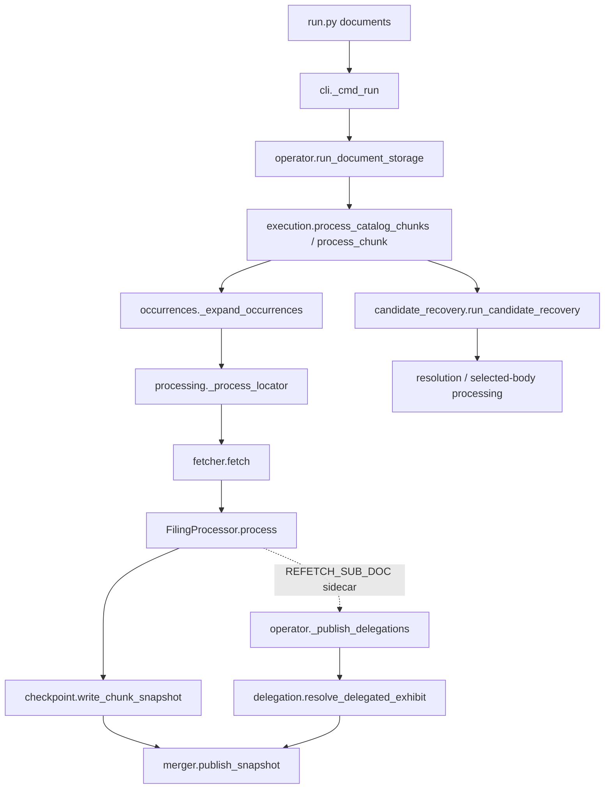

# Legacy `document_storage` Processing Trace

## Status and purpose

This is a source/test audit of the old behavior, not a porting specification. S10's
replacement is specified in [S10 processing](S10_processing.md). The legacy package
remains available until migration acceptance; this trace records what its normal path
actually did and what it failed to preserve.

## Execution paths

### Operator and worker path

1. [`run.py`](../../../run.py) dispatches `documents` to
   [`document_storage.cli`](../../../edgar_sec/pipelines/document_storage/cli.py).
   `_cmd_run` accepts `--catalog-plan` or a hand-authored JSON `chunks` plan. Both
   call `operator.run_document_storage` with `mode="fixture"`; the catalog plan is
   passed as both the work order and catalog plan. `_cmd_fill` is a separate operation
   that calls `fixture_operator.fill_fixture` and uses live fetching to populate a
   fixture.
2. [`operator.run_document_storage`](../../../edgar_sec/pipelines/document_storage/operator.py)
   validates the run/catalog-fixture lineage, creates a fetcher and transient chunks
   directory, and calls `execution.process_catalog_chunks`, `process_chunk_stream`, or
   `process_chunks` according to its input.
3. [`execution.process_chunk`](../../../edgar_sec/pipelines/document_storage/execution.py)
   deduplicates document locators, expands catalog occurrences through
   [`occurrences._expand_occurrences`](../../../edgar_sec/pipelines/document_storage/occurrences.py),
   and processes the resulting work items. A locator without a catalog occurrence gets
   a synthetic occurrence row.
4. Ordinary work enters
   [`processing._process_locator`](../../../edgar_sec/pipelines/document_storage/processing.py):
   `fetcher.fetch(locator)` → `FilingProcessor.process(...)` → a checkpoint batch.
   Bundle candidates instead enter
   [`candidate_recovery.run_candidate_recovery`](../../../edgar_sec/pipelines/document_storage/candidate_recovery.py),
   which fetches the accession bundle, resolves descriptors in
   [`resolution.py`](../../../edgar_sec/pipelines/document_storage/resolution.py),
   processes requested/recovered bodies or falls back to ordinary fetch, then emits
   outcome rows.
5. The processor may add a delegated exhibit to a sidecar. After workers complete,
   `operator._publish_delegations` runs a second resolution/acquisition pass through
   [`delegation.resolve_delegated_exhibit`](../../../edgar_sec/pipelines/document_storage/delegation.py).
   [`merger.publish_snapshot`](../../../edgar_sec/pipelines/document_storage/merger.py)
   writes the snapshot artifacts and then updates the publication pointer.

### Fetch and processing behavior

- [`FixtureArchiveFetcher.fetch`](../../../edgar_sec/pipelines/document_storage/fetching.py)
  searches locator-derived keys across fixtures and can fall back to the accession
  `<accession>.txt` submission bundle. The live fetcher has archive URL resolution and
  fallback behavior; acquisition records the requested locator separately from the
  selected serving source.
- `fixture_operator.fill_fixture` uses a thread pool for absent locator keys, stores
  `source_payload` when available (otherwise selected bytes), and writes the manifest
  after SQLite updates. For an SGML acquisition, the locator-keyed fixture value can be
  the full source envelope rather than only the selected child. Existing fixture bytes
  can backfill metadata without a refetch. This fixture fill is distinct from
  `documents run` and has no demonstrated automatic retry loop.
- SGML acquisition records ordered child descriptors but retains one selected body;
  the descriptors do not hold every sibling payload. The fetcher tests pin this
  property with `test_envelope_records_every_header_in_envelope_order` and
  `test_envelope_records_carry_no_payload`.
- [`FilingProcessor.process`](../../../edgar_sec/pipelines/document_storage/processor.py)
  routes from the effective selected body's `content_route`, not just the requested
  locator suffix. Binary bodies bypass text normalization. Other routes call
  `engine.forms.normalize.normalize_document(selected_payload, form=locator.form, ...)`.
  It then calls the form plugin evaluator except for paper stubs. The annual evaluator
  may return `REFETCH_SUB_DOC` for EX-13 delegation.
- For non-binary routes, `FilingProcessor` encodes `NormalizationResult.text` into
  `ProcessedDocument.payload`. `_process_locator` passes this to the snapshot's
  `raw_payload` column. The ordinary run therefore persists normalized text under a
  field named as if it were source bytes.
- Candidate acquisition resolution uses the selected bundle descriptor; mirrored
  worker tests pin that a bundle child's own filename routes an XML child even when
  its requested locator ends in `.txt`.

## Persistence and observed defects

| Observed behavior | Evidence | S10 disposition |
|---|---|---|
| Normal processing computes metadata, but `_process_locator` passes `metadata_map={}` to the snapshot batch. Checkpoint metadata becomes `{}`; candidate recovery also omits the processor's full metadata. | `processing.py::_process_locator`; `checkpoint.py`; `candidate_recovery.py` | Return typed `ProcessingResult` metadata directly; do not route through legacy snapshot columns. |
| Normalized text is written in `raw_payload`; original response bytes and normalized HTML/text are not both represented. Acquisition source provenance is not persisted in snapshot rows. | `processor.py::FilingProcessor.process`; `processing.py::_process_locator`; `test_worker.py::test_worker_does_not_persist_acquisition_provenance` | Preserve source and selected-body digests separately in S9; S10 reports derived representation/digest without payload publication. |
| Ordinary fetch failures become `missing` regardless of `FetchResult.status`; completed chunks have no retry-failed-locator path. `_skipped_result` resets missing/failed counts on chunk reuse. | `processing.py::_process_locator`; `execution.py::_skipped_result`; README retry caveat | Keep `failed`, `not_filed`, `ambiguous`, and `skipped` distinct; retry only through S9's explicit attempt policy. |
| Catalog run identity pins fixture IDs but not fixture BLOB digests, so an incomplete resume can see changed fixture content. | `document_storage/README.md` run-identity caveat; `test_catalog_run.py` | S9 fixtures verify exact response digests; S10 fingerprints include selected-body digest and processing policy. |
| The hand-authored JSON plan accepts absent/empty structure and is not a published plan schema. | `cli.py::_plan_to_inputs`; package README records no in-repository producer | S9 accepts only a validated pinned S6 bundle. |
| A positive explicit worker request bypasses the cgroup-derived worker ceiling. | `execution.py::resolved_worker_count`; repository resource-allocation contract | Derive workers and in-flight processing bodies from available resources; don't carry forward the override behavior. |
| The evaluator can create acquisition through a second pass, outside an immutable S6 target plan. | `processor.py`; `processing.py`; `operator.py::_publish_delegations`; `test_delegation.py` | Exhibit/primary assessment is diagnostic-only. S6 declares all targets before S9. |
| Snapshot merge may discard invalid chunks while publishing remaining chunks; schema checks focus on names rather than Arrow types. | `merger.py::publish_snapshot`; package README schema caveat | S10 returns isolated per-target results; it does not merge or publish durable payload snapshots. |

## Test evidence and confidence boundary

The mirrored suite covers CLI/operator dispatch, fetch outcomes, route selection,
fixture fill, candidate recovery, delegation, checkpoints, run fingerprints, and review
artifacts. Relevant modules include:

- [`test_operator_and_cli.py`](../../../tests/pipelines/document_storage/test_operator_and_cli.py)
- [`test_worker.py`](../../../tests/pipelines/document_storage/test_worker.py)
- [`test_fetching.py`](../../../tests/pipelines/document_storage/test_fetching.py)
- [`test_processor.py`](../../../tests/pipelines/document_storage/test_processor.py)
- [`test_delegation.py`](../../../tests/pipelines/document_storage/test_delegation.py)
- [`test_catalog_run.py`](../../../tests/pipelines/document_storage/test_catalog_run.py)
- [`test_fixture_operator.py`](../../../tests/pipelines/document_storage/test_fixture_operator.py)

Fixtures under `tests/fixtures/document_storage/` include synthetic normalization and
SGML cases such as `html_bundle.sgm`, `missing_requested.sgm`,
`duplicate_requested.sgm`, `nested_delimiters.sgm`, and `amendment_alias.sgm`. They
are valuable regression cases for mechanical behavior; they do not establish
real-filing parser parity, broad classifier accuracy, exact source/derived retention,
or a reliable retry model.

S10 retains effective selected-child routing, explicit binary/paper handling,
per-target failure isolation, and deterministic processor identity. It replaces legacy
delegation, chunk snapshots, mutable payload rows, and run-mode inference with the
S9-pinned `StagedBodyRef`, metadata-only results, a receipt-gated lifecycle, and
optional S7 review artifacts.
