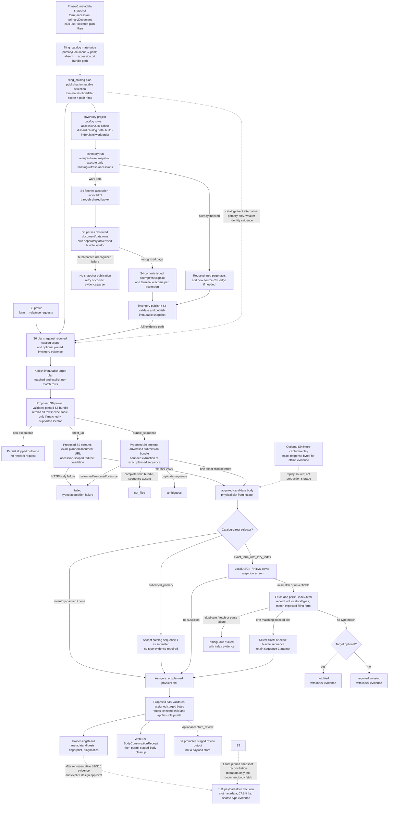

# Accession-to-document acquisition decision tree

This is the contract map from Phase-1 filing metadata through catalog selection,
inventory, target planning, and the proposed acquisition/processing handoffs. It
separates implemented behavior, proposed behavior, and frozen legacy behavior; a
calendar-era label is never a substitute for an observed locator or a pinned target.

## Status and entry point

- **Implemented:** `filing_catalog` materialization/plans; S1–S6 inventory and
  profile-based target planning; S2/S3/S4 fixture, parser, and worker foundations;
  S7 review foundations. `document_planning` is a separate pipeline from the older
  `filing_catalog` locator-plan contract.
- **Proposed, not implemented:** S9 acquisition and S10 transient processing. There
  is no `edgar_sec/pipelines/document_acquisition/` package in the current tree.
- **Documentation reconciliation:** `implementation.md` reports S1–S6 implemented
  and `document_planning` has profile, catalog-scope, inventory-evidence, matching,
  publication, operator, and CLI modules. The detailed
  [S6 target-plan subplan](../S6_target_plans.md) still labels profile planning
  design-only; update that status/spec alongside implementation review. Current
  matching permits bundle-sequence retrieval for unlinked exhibits only, not
  unlinked primaries as the broader design text proposes.
- **Legacy-only:** `document_storage` still contains its old date/name candidate gate,
  bundle-recovery behavior, and evaluator-driven delegation. It is frozen during the
  replacement and is not an implementation source for S6/S9/S10.
- **Evidence gate:** S0's stratified historical page survey has not established broad
  era/parser coverage. Era layout descriptions below summarize observed examples and
  legacy behavior; they are not universal guarantees.

A form selection and primary-document link are not currently supplied together as a
manual one-filing `filing_catalog` input. `filing_catalog materialize` reads a published
Phase-1 metadata snapshot; its SEC submission rows carry `form`, `accession_number`, and
`primary_document`. `filing_catalog plan` then filters the materialized catalog by
form/date/cohort and other plan criteria. When no primary filename exists,
materialization derives `<accession>.txt` and marks the path source as bundle. A primary
link is therefore upstream metadata, not a manually submitted target or fetched body.
The published catalog plan records filing scope and locator hints; it is not an
inventory observation or proof that the hinted body is the statutory primary. An
arbitrary URL is not passed directly to S9. See
[the accession-flow roadmap](../../implementation.md),
[S6 target plans](../S6_target_plans.md), and
[catalog source and matching rules](../document_planning/specs.md).

Code anchors for the implemented path are `engine/submissions/filings.py`,
`pipelines/filing_catalog/materialization.py` and `planner.py`,
`pipelines/document_inventory/snapshot/projection.py`, and
`pipelines/document_planning/planner.py` / `matching.py`. The date-gated legacy
candidate path is in `pipelines/document_storage/candidates.py` and
`candidate_recovery.py`; ordinary URL/bundle fallbacks and SGML selection are in
`document_storage/fetching.py` and `engine/document/unpacking/unpacker.py`.

## End-to-end flow

## Component handoffs

| Owner | Input contract | Output contract | Decision boundary |
|---|---|---|---|
| `filing_catalog materialize` / `plan` | Materialize reads a Phase-1 metadata snapshot. Plan selects catalog rows by form/date/cohort and selection options; `primary_document` originates in the Phase-1 filing row. | Materialization emits a durable catalog; a separate plan publishes selected accession/form/date scope and locator fields. Missing `primary_document` materializes as `<accession>.txt` with bundle path provenance. | This is not a CLI for entering one arbitrary form+URL. Catalog path hints do not become inventory rows or verify body type. |
| Inventory project | Validated filing-catalog plan, optional base snapshot, refresh/branch policy. | Accession facts, source-CIK edges, and an index-page work order/manifest. | Projects catalog plan locators away: `primary_document`, `document_path`, and `archive_url` do not enter the index work order. It constructs `-index.html` from accession identity; accession is the fetch/dedup grain. |
| S2/S4/S3 inventory run | Missing/explicitly refreshed accession work items, shared broker or pinned fixture bytes. | Typed page outcomes/checkpoints plus observed document/data rows and separate bundle URL/size metadata. | Known accessions reuse snapshot facts; fetch/parse failure is never empty inventory. No child body is acquired here. S0 evidence gates final historical parser acceptance. |
| Inventory publish / S5 | Validated cohort, committed S4 results, expected parent snapshot. | Cumulative immutable inventory snapshot and current pointer advanced only after complete validation. | Failed or unrecognized accessions prevent publication; inventory stores observed index facts, not targets or payloads. |
| S6 target planning (implemented) | Required pinned catalog plan; optional pinned S5 snapshot; versioned profile. | Immutable target-plan bundle with one target row per request/candidate and explicit status/provenance/retrieval locator. | Without a snapshot only primary catalog-direct planning is valid. With a snapshot it is the sole locator evidence; never fall back to catalog paths. Current code allows bundle-sequence locators for unlinked exhibits only. |
| S9 acquisition (proposed) | Validated S6 plan bundle, pinned source provenance, supported matched locators. | Append-only attempts/outcomes, exact source and selected-body digests, transient staged body reference, and for lazy recovery a target-to-physical-slot resolution record. | Default path executes exact planned locator. Only catalog-direct `exact_form_with_lazy_index` may fetch/parse `-index.html`, after the defined local identity suspicion. It records the new evidence without changing S5/S6. |
| S10 processing (proposed) | Acquired S9 body assigned to the immutable S6 target. | Per-target `ProcessingResult`; optional S7 review reference; S9 consumption receipt after verified read. | Processes only the resolved body. It does not discover targets; a processing/cover diagnostic cannot revise S6 intent or cause S9 work. |
| S11 payload design (gated) | Reviewed representative S9 acquisition and S10 processing evidence. | A reviewed storage decision record; candidate relations separate physical slots, CAS links, sparse type evidence, and target-slot assignments. | No durable payload store is authorized before approval. Metadata-only reconciliation consumes pinned S5 facts downstream and does not alter S5/S6 schemas. |

The full inventory path is catalog materialization → catalog plan → S5 inventory
publication → S6 plan → S9 acquisition → S10 processing. The catalog-direct route
skips S5 only for a primary-only profile and intentionally has weaker evidence. Its
lazy-index path is an explicit selector-authorized exception, not a fallback for an
accession missing from a selected inventory snapshot.

## S6 planning decisions

The catalog plan always defines the accession scope and form used to select the profile
rule. The optional snapshot changes only the locator evidence source.

| Planning input/evidence | Primary request | Companion/exhibit request | Resulting provenance |
|---|---|---|---|
| Catalog plan only | Accept a safe same-accession direct path only when the catalog occurrence has a non-empty `primary_document` that agrees with `document_path`. If materialization supplied `<accession>.txt` because `primary_document` was absent, current planning returns `unresolved / no_usable_primary_path`. A match means locator validation, not that the body has filing-form type. | Reject a non-primary profile before planning. | `source_origin=catalog_direct`, `availability_evidence=catalog_metadata`; no inventory entry ID. |
| Catalog plan + pinned snapshot, accession present | Match observed `document_type` to filing form and declared aliases. Never pick sequence 1 by position. An unlinked primary currently becomes `unresolved / no_usable_retrieval_locator`. | Match only the profile's declared exhibit/data-file type against observed table rows. Current code allows an unlinked **exhibit** with positive observed sequence and advertised bundle URL to use `bundle_sequence`; unlinked primary/data-file/graphic rows remain unresolved. | `source_origin=inventory_index`, `availability_evidence=index_html`; catalog document path is ignored as a locator. |
| Catalog plan + pinned snapshot, accession absent | `unresolved / accession_not_indexed`. | Same, regardless of optionality. | `inventory_index`; no catalog fallback. Publish S5 evidence and make a new S6 plan to resolve. |

For a recognized indexed page, one usable type match becomes `matched`; multiple
matches become `ambiguous` and no candidate is selected; no match becomes
`not_filed` for an optional request or `required_missing` for a required request. One
matching row with no usable locator is `unresolved`, not absent.

To prevent extraction regression for pre-2000 filings where no individual links exist,
both unlinked primaries and unlinked exhibits with an observed positive sequence and
advertised bundle URL resolve to `bundle_sequence`. Current code's limitation to exhibits
is a tracked alignment item; the target contract requires that both primary and
companion exhibits can be extracted from `<accession>.txt` either separately or together.
A failed/unrecognized page cannot be treated as `not_filed`; S5 does not publish such
a page as an observed empty result. Catalog-only planning rejects a non-primary profile
before emitting a plan.

Package requests are separate from observed child matching: current planning may emit
an XBRL ZIP `constructed_candidate` from an advertised bundle URL, but that is not an
observed inventory entry and is not executable acquisition evidence until S0
establishes availability. A missing bundle URL leaves the package request unresolved.
The proposed S9 work order executes only matched direct/bundle locators; constructed
candidates stay skipped rather than turning into an opportunistic download.

## Retrieval decisions from observed index rows

S6 derives the retrieval mode from the selected row's evidence, not from a date-era
table:

1. **Usable observed child link:** validate the same-accession archive URL and emit
   `retrieval_mode=direct_url`, with that child URL as `target_url`.
2. **No usable child link:** if the index advertises a safe accession `.txt` bundle
   and the selected row has an observed positive sequence, emit `bundle_sequence`
   with the bundle URL and exact sequence. This applies equally to:
   - Pre-2000 submissions where the entire submission (primary and exhibits) is
     unlinked and lives in the bundle.
   - Later-era submissions where the primary has a direct link but one or more
     companion exhibits lack individual links.
   Never infer sequence from row order, filename, or type.
3. **Neither supported locator is usable:** emit `unresolved / no_usable_retrieval_locator`.
   Do not synthesize a bundle URL or treat a missing catalog primary as an envelope.

For the initial catalog-direct fetch, the locator is direct-only; S6 does not promote
an absent catalog link into an envelope guess. The profile selector may separately
authorize post-fetch lazy index resolution as described below. The plan records target
role and requested type as intent. Inventory-backed S6 does not currently carry its
observed `document_type` as a promised SGML-header assertion. S9 records the selected
child's actual `<TYPE>` as provenance; validating it against a pinned inventory row
would require a versioned S6 plan field. See [S6 matching](../S6_target_plans.md) and
[S9 extraction](run/extraction.md).

## Catalog-direct primary selectors and lazy recovery

Catalog-only planning remains primary-only. The profile selector is binary:

| Selector | Initial slot behavior | Identity/recovery behavior |
|---|---|---|
| `submitted_primary` | Fetch the catalog primary link, anchored to physical sequence 1. | Accept as submitted; do not inspect type or fetch an index. `slot_types` stays empty unless evidence is observed independently. |
| `exact_form_with_lazy_index` | Fetch the same sequence-1 candidate. The expected statutory type is the filing form, independent of `target_role=primary`, the index primary designation, or sequence number. | Run a bounded local screen. An ASCII SGML `<TYPE>` mismatch/missing/unverifiable type or an HTML cover evaluator that fails to verify the filing form is an inversion suspicion and triggers a single lazy index lookup. A unique index row with matching observed `document_type` chooses the actual physical slot; no sequence/name guess is allowed. |

`exact_form` is dropped. The lazy selector is conditional by design: a positive HTML
cover result avoids the index request but is heuristic and does not prove exact type.
HTML has no reliable SGML `<TYPE>` field. A 404 or other transport failure does not
trigger recovery; normal S9 retry/failure rules apply. If the lazy lookup is recognized
but has no filing-form row, report a typed absence with index evidence; duplicates are
ambiguous, and failed/unrecognized index responses are failures, not absence.

For catalog-direct selection, the initial payload remains associated with slot 1 even
when it is an exhibit. Lazy lookup may enrich metadata for every observed sequence
and acquire a separate matching slot. Keep the index rows/type observations, payload
links, and target-to-selected-slot assignment separate. S10 receives only the final
selected body. This selector-authorized S9 lookup does not publish or mutate an S5
snapshot.

The local screen and the index's `document_type` answer different questions. The
screen decides whether to spend a request; only an index/bundle metadata row creates a
`slot_types` fact. A positive local SGML/HTML screen is recorded in the target
resolution and does not populate that relation. Preserve evaluator version/outcome
and index-response/parser provenance with the resolution. Do not treat cover-boundary
diagnostics in S10 as another recovery trigger.

---

## Era context: observed layouts versus selection rules

The legacy-era columns describe tendencies and the behavior that exists in frozen
`document_storage`; the **replacement rule** column is normative for the proposed
pipeline. S6 and S9 do not branch on `filing_era`.

| Filing era | Layout evidence / common case | Frozen `document_storage` behavior | Replacement acquisition rule |
|---|---|---|---|
| 1993–1999 | Child rows have no individual links; one concatenated SGML submission file. Child sequence/type metadata is on index; bytes are inside envelope. | `<accession>.txt` fallback used at every date when `primary_document` is absent. Full-submission fallback for ordinary requests; heuristic SGML selection by type, name, seq 1. | S6 selects observed index type. Both unlinked primary and unlinked exhibits with observed sequences use `bundle_sequence`. Proposed S9 streams the envelope and extracts exact planned sequence with no degradation. |
| 2000–2004 | Transition era: primary often has a direct link; exhibits may be unlinked. High risk of Sequence 1 inversion (exhibits before primary). | `candidate_decision` date gate (2000–2004) with Item 601 filename regex. Bundles fetched to find lowest-sequence primary; dual-writes primary + exhibit. | No date/name gate. S6 matches observed type from S3 index, bypassing Sequence 1 inversion. Linked primaries use `direct_url`; unlinked exhibits use `bundle_sequence`. If no index, cover evaluator gates catalog primary. |
| 2005–present | Individual archive links for most documents; envelopes still present as backup. 2011+ adds iXBRL viewer links and Data Files table. | Old fetcher retains era-independent full-submission fallback; prefers archive-root basename over XSL rendering. | Use observed link/type evidence. Direct links use `direct_url`. Any remaining unlinked exhibits use `bundle_sequence`. S9 streams only validated target locators without heuristic fallback. |

---

## Worked examples by form and era

The following concrete scenarios illustrate how the decision tree operates across
different filing eras, document formats, and exhibit link states.

### Example 1: Pre-2000 Form 10-K with exhibits (1994, Pure SGML, ASCII)
- **Filing:** Form `10-K`, Accession `0000950123-94-000687` (Johnson & Johnson).
- **Index state:** `has_index = True`. The `-index.html` table lists:
  - Seq 1: Type `10-K`, Description `FORM 10-K, JOHNSON & JOHNSON`, size 60,710, **no link**.
  - Seq 4: Type `EX-13`, Description `ANNUAL REPORT TO STOCKHOLDERS`, size 144,384, **no link**.
  - Advertised bundle: `0000950123-94-000687.txt` (231,224 bytes).
- **Profile request:** Primary `10-K` (required), Exhibit `EX-13` (optional).
- **Planning (S6):**
  - Primary matches Seq 1 $\to$ `retrieval_mode = bundle_sequence`, `target_url = .../0000950123-94-000687.txt`, `sequence = 1`.
  - Exhibit matches Seq 4 $\to$ `retrieval_mode = bundle_sequence`, `target_url = .../0000950123-94-000687.txt`, `sequence = 4`.
- **Acquisition (S9):**
  - Worker streams bundle `0000950123-94-000687.txt` to staging.
  - S9c extracts exact sequence 1 for Primary; computes `selected_sha256`.
  - S9c extracts exact sequence 4 for Exhibit; computes `selected_sha256`.
  - Both targets succeed as `status = "acquired"` with zero regression or missing-link errors.
- **Processing (S10):**
  - S9 records the observed ASCII header `<TYPE>10-K` as provenance. S10 processes
    the primary as route `TEXT` with 10-K cover rules; it does not use the header as a
    target-identity assertion.
  - Exhibit is route `TEXT`; normalizes with generic no-cover profile.

### Example 2: 2000–2004 Form 10-K with Sequence 1 inversion (2002, Mixed links, HTML)
- **Filing:** Form `10-K`, Accession `0000999999-02-000123`.
- **Index state:** `has_index = True`. The `-index.html` table lists:
  - Seq 1: Type `EX-23.1`, Filename `dex231.htm`, link `dex231.htm` (Inverted exhibit).
  - Seq 2: Type `10-K`, Filename `form10k.htm`, link `form10k.htm` (True primary).
  - Seq 3: Type `EX-21`, Filename `subsidiaries.txt`, **no link**.
  - Advertised bundle: `0000999999-02-000123.txt`.
- **Profile request:** Primary `10-K` (required), Exhibit `EX-21` (optional).
- **Planning (S6):**
  - Planner matches `document_type == "10-K"`, completely ignoring Seq 1!
  - Primary resolves to Seq 2 $\to$ `retrieval_mode = direct_url`, `target_url = .../form10k.htm`.
  - Exhibit resolves to Seq 3 $\to$ `retrieval_mode = bundle_sequence`, `sequence = 3`.
- **Acquisition (S9):**
  - Primary streams `form10k.htm` directly $\to$ `acquired`.
  - Exhibit streams bundle $\to$ extracts Seq 3 $\to$ `acquired`.
- **Outcome:** Sequence 1 inversion is completely bypassed at planning time with zero regex
  heuristics, while unlinked exhibit is retrieved safely via bundle sequence.

### Example 3: 2001 Form 10-K without a pinned index (Catalog-Direct, Lazy Recovery)
- **Filing:** Form `10-K`, Accession `0000888888-01-000456`.
- **Plan state:** no inventory snapshot is pinned (catalog-only run).
- **Catalog metadata:** Catalog lists `primary_document = dex231.htm` (misindexed Seq 1 exhibit).
- **Profile:** primary target with `catalog_direct_selection = exact_form_with_lazy_index`.
- **Initial acquisition:** S9 fetches the catalog URL into physical slot 1. The expected type is `10-K`; the slot is not asserted to be primary by its sequence.
- **ASCII case:** S9 reads the bounded SGML header, observes `<TYPE>EX-23.1`, and triggers lazy index lookup.
- **HTML case:** S9 runs the versioned cover evaluator. No verified `10-K` cover is a suspicion trigger, not proof of exhibit identity, so it triggers the same lookup.
- **Lazy lookup:** a recognized `-index.html` reports Seq 1 as `EX-23.1` and Seq 2 as `10-K`. S9 records both slot types, acquires Seq 2 from its exact direct or bundle locator, and assigns the target to slot 2. Seq 1 remains available as an acquired slot if durable storage has been approved.
- **Processing:** S10 receives only the slot-2 body under the same S6 `target_id`; its own cover diagnostic cannot trigger further lookup.
- With `submitted_primary`, the same catalog link would be accepted as submitted at slot 1, with no local screen or index request.

### Example 4: Post-2005 Form 20-F / 8-K (2018, Direct Links & iXBRL)
- **Filing:** Form `20-F`, Accession `0001193125-18-000789`.
- **Index state:** `has_index = True`.
  - Seq 1: Type `20-F`, Filename `form20f.htm`, link `/ix?doc=/Archives/.../form20f.htm`.
  - Seq 2: Type `EX-4.1`, Filename `ex4-1.htm`, direct link `ex4-1.htm`.
- **Planning (S6):**
  - Primary matches Seq 1; resolves viewer link to direct archive path $\to$ `retrieval_mode = direct_url`.
  - Exhibit matches Seq 2 $\to$ `retrieval_mode = direct_url`.
- **Acquisition & Processing (S9/S10):**
  - Both stream direct URLs.
  - S10 unrolls inline-XBRL tags for Form 20-F visible text normalization and emits
    its 20-F cover-boundary diagnostic.

---

## S9 acquisition outcomes

Proposed S9 validates the pinned S6 plan and creates a work order that retains every target row.
Only `status=matched` rows with a supported `direct_url` or `bundle_sequence` are
executable. It validates a locator, streams the exact response to managed staging,
enforces the response-byte ceiling, and keeps source-response and selected-body
provenance distinct. Redirects must remain inside the accession archive boundary.

| Retrieval / observation | Acquisition result | Next action |
|---|---|---|
| Direct URL returns a complete verified response | `acquired`; direct source and selected body are the same bytes. | Give S10 the staged body reference. |
| Direct URL returns HTTP 404 or another transport/body failure | `failed` (404 is `http_not_found`), not `not_filed`. | Use S9's explicit retry policy if retryable; do not fall back to bundle or another path. |
| Bundle fully parses and requested sequence occurs once | `acquired`; retain separate envelope and selected-child digests/paths. | Give only the exact selected child to S10; record actual SGML header fields as provenance. |
| Valid complete bundle contains no requested sequence | `not_filed`. | Terminal target outcome; do not choose a different sequence. |
| More than one child has the requested sequence | `ambiguous`. | No body is selected. |
| Bundle fetch fails, is oversized/truncated, or is structurally invalid | `failed`. | No successful selected-body reference. |
| S6 row was non-matched or unsupported | Proposed `skipped`, with its S6 status retained in the plan/work order. | No HTTP request; retry cannot make it executable. |
| Catalog-direct `submitted_primary` body acquired | `acquired` at physical sequence 1; no type assertion. | Give the slot-1 body to S10; do not fetch an index. |
| Catalog-direct `exact_form_with_lazy_index` body screen finds no suspicion | `acquired` at sequence 1; HTML cover success remains heuristic. | Give slot 1 to S10; no index request or type-evidence row is implied. |
| Catalog-direct screen suspects inversion; recognized index has one row matching filing form | Acquire/lookup the observed direct or exact bundle slot and record the target-to-slot resolution; preserve slot-1 evidence. | Give only the selected slot to S10. Sparse type evidence records each observed index row. |
| Lazy index is recognized but has no expected-form row | `not_filed` for optional, `required_missing` for required, with index provenance. | Never infer sequence or silently use another candidate. |
| Lazy index has duplicate matches / fetch or parse fails | `ambiguous` / `failed`, respectively, with index provenance. | Never infer sequence or silently use another candidate. |

For an inventory-backed bundle target, the observed S6 sequence remains authoritative;
S9 does not use a selected header mismatch to find a replacement. The explicit
catalog-direct lazy policy is different: it may fetch the index after the sequence-1
body screen suspects mismatch and then selects by the index's observed `document_type`.
S9 fixture capture stores exact response bytes in its evidence store; it is not the
future durable payload store. See [S9 acquisition](../S9_acquisition.md),
[bounded extraction](run/extraction.md), and
[fixture storage](fixtures/storage.md).

## S10 processing and representation decisions

S10 joins each acquired body to its S9 work-order row by `target_id`, verifies and
processes that same staged file, then emits one metadata-only result per target. The
effective selected document path chooses the byte route; the planned role chooses the
normalization context. The filing form is not a route and `target_type` is not an
assertion about the selected SGML header.

| Input role / effective route | Processing contract | Representation/result boundary |
|---|---|---|
| Primary + `MARKUP`/`RENDERED` | Form-aware normalizer, without retaining stage-trace copies. | Keep raw source identity separate from normalized text; no XBRL fact extraction. |
| Primary + `TEXT` | ASCII flat `.txt` is byte-identical pass-through; other text uses the form profile. | `text_verbatim` for ASCII identity; otherwise normalized text. |
| Standalone exhibit + text/markup | Generic no-cover profile; do not apply the filing form's cover rules. | Exhibit remains its own planned target and result. |
| `XML` | Validate one XML document with DTD/external entities disabled. | `xml_verbatim` aliases the source bytes; no semantic extraction or rewriting. |
| `BINARY` | No text normalization. | Metadata-only binary result; PDF extraction is deferred. |
| `PAPER` | Record the fixed paper stub. | Never follow the off-archive document-control reference. |
| `UNKNOWN` | Do not guess a conversion. | `unrecognized` with route diagnostic. |

Path routing is independent of era and form. A rendered XSL path (including a nested
`.xml` filename) follows the rendered/HTML route; a flat `.xml` follows XML validation.
Route handling does not fetch an alternate archive-root candidate in S10.

If a primary's cover-required profile finds no cover boundary, S10 emits
`cover_boundary_not_detected`; it does not reclassify the primary, refetch a bundle,
or replan. An optional exhibit assessment is diagnostic-only. If S10 has fully read
and verified the selected bytes, it writes the S9 `BodyConsumptionReceipt` even when
later processing fails or is unrecognized. Admission refusal before reading or digest
mismatch has no receipt, so S9 retains the staged body. Cleanup follows only after the
matching receipt is durable. See [S10 processing](../S10_processing.md).

## Explicitly excluded recovery branches

- No automatic S9/S10 index lookup, filename search, era-based reclassification, or
  target replacement. The sole exception is catalog-direct
  `exact_form_with_lazy_index`, which authorizes one bounded lookup only after its
  defined body-screen suspicion.
- No fallback from a missing inventory accession to its catalog primary link.
- No fallback from a direct URL 404 or transient failure to the bundle, another URL,
  or sequence 1.
- No comparison between a fetched bundle child's `<TYPE>` and a pinned S5 row in the
  ordinary inventory-backed path until a future versioned S6 contract carries that
  observed type. Catalog-direct lazy recovery instead selects by its freshly fetched
  index rows under the explicit selector.
- No S10 evaluator action that schedules an exhibit. Companion targets such as EX-13
  must be in the S6 profile/plan before acquisition begins.
- No durable raw/normalized payload publication before S11 review and explicit
  approval.

If correct document-type evidence is required without accepting the selector's
conditional suspicion screen, or companion targets are required, publish the S5
inventory and generate a new S6 plan. The inventory snapshot, target plan, acquisition
run, slot resolution, and processing result remain separate immutable or independently
versioned artifacts.
