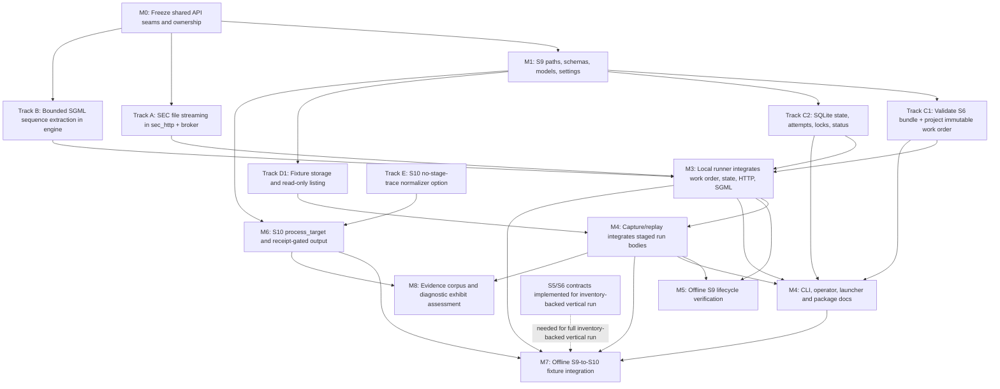

# S9 Document Acquisition: Implementation Plan

This plan sequences the command-oriented contracts in this directory into a local,
single-host implementation. The S9 package and S10 processing service are design-only
today. The first pass includes plan projection, run/status, local SEC acquisition,
fixture replay, and a separate S10 per-target processing service with fixture-driven
verification. It does not include remote live workers, durable payload publication,
or legacy package removal.

## 1. Readiness and parallelization

**Ready to begin implementation in bounded tracks.** The S6 input bundle, S9 run and
handoff schemas, path ownership, state transitions, local transport limits, exact
bundle selection, fixture evidence, and command behavior are specified in the linked
contracts. The tracked-code audit confirms there is no replacement S9 package yet.
Implementation should begin with a short interface-freeze task, then establish the
shared S9 types/paths before command services are split among implementers.

Readiness is scoped, not an assertion that every acquisition mode is unblocked:

- File-backed SEC streaming is a required Layer 2 prerequisite. `SecHttpClient` and
  `SecBroker` currently return buffered response bytes; S9 must not call
  `get_bytes()` and describe that path as streaming.
- Exact sequence selection for legacy bundles requires a bounded Layer 3 parser. The
  bytes-based `unpack_sgml_submission()` remains a parity oracle, not the production
  large-envelope path.
- The first S9 implementation is local. Remote live work remains deferred until an
  aggregate cross-host SEC rate policy is enforced. S0's historical parser acceptance
  and live operational rollout gates also remain in force; they do not prevent the
  offline implementation or fixture-driven verification from starting.
- S9 can validate and consume a conforming published S6 bundle independently of S5/S6
  internals. The current S6 tracked-code audit is still partial, and S5's canonical
  relation-schema ownership cleanup is required before S6's inventory-backed source
  adapter can be treated as complete. Until those upstream contracts are implemented,
  S9 tests use pinned target-plan fixtures; a full S5-to-S6-to-S9 vertical claim waits.
- S10 is also design-only. The current normalizer always retains stage-trace copies;
  its opt-out mode is a separate engine/S10 task required before large-body S10
  processing and a future S9-to-S10 processing integration gate.
- S11's durable raw/derived payload store, PDF extraction, S12's vertical integration,
  and `document_storage` decommissioning are outside this implementation plan.

### Dependency graph

### Delegation boundaries

1. **Track A and Track B can start independently after M0.** Track A owns SEC transport
   and broker RPC changes only. Track B owns bounded envelope parsing only. Neither
   imports or depends on the S9 pipeline package.
2. **M1 is a single-owner integration contract.** One implementer establishes S9
   `paths.py`, `schemas.py`, `models.py`, `arrow_schemas.py`, and setting registration
   before command-service work is delegated. This prevents divergent handoff and
   persisted-row definitions.
3. **Projector, state persistence, and fixture storage can proceed concurrently after
   M1.** Projector owns S6 bundle validation and immutable work-order creation; state
   owns SQLite transitions and locks; fixture storage owns fixture manifest/SQLite
   BLOB persistence. Each consumes M1's records and paths rather than defining local
   copies.
4. **The live/local runner is an integration track.** It starts after the projector
   and state contracts are available and integrates the merged Track A and Track B
   APIs. Fixture replay uses the same extraction boundary without opening HTTP.
5. **The S10 no-trace normalizer change is independently delegatable.** It belongs to
   `engine.forms.normalize`, not S9; it can proceed from the S10 contract and its own
   tests while S9 services are being built.
6. **CLI/operator work follows service contracts.** It delegates to the same project,
   status, run, and fixture services; it does not duplicate planning, retry, or fixture
   behavior.
7. **The S10 body-processing service can start after M1 and M2E.** It processes
   fixture-backed `StagedBodyRef` values without waiting for the live S9 runner. The
   end-to-end fixture gate waits for both services; taxonomy rules wait for a labeled
   corpus.

## 2. Milestone breakdown

### M0: Freeze transport and parser seams

**Goal:** Resolve only the cross-layer interface details needed for independent
implementation; do not reopen settled S9 behavior.

#### Decisions to pin

- Add a file-backed SEC operation alongside, not in place of, `get_bytes()`. Preserve
  shared pacing, retry/failure-ledger policy, injected `session_factory`, and typed
  transport failures. Streamed bodies bypass the current byte-returning cache until a
  file-backed cache exists.
- Define how the broker request identifies a destination without accepting an
  unconfined worker-supplied path. The S9 runner owns generated staging paths; the
  broker boundary returns path/metadata handles and never sends body bytes over IPC.
- Keep every redirect check in the shared HTTP path and validate HTTPS, SEC archive
  host, and accession-directory scope before following it.
- Put `extract_bundle_sequence(source_path, destination, selector, ...)` in the engine
  unpacking package. It accepts primitive selectors and paths, returns typed metadata
  or failure, and imports no S9 models.

#### Exit criteria

- The `StreamedResponse`/typed failure shape, cancellation and cleanup behavior, broker
  staging ownership, and parser result/failure mapping are agreed against
  [bounded transport](run/transport.md) and [exact extraction](run/extraction.md).
- No changes weaken the existing byte-fetch API or the shared SEC rate limiter.

### M1: Shared S9 contracts and configuration (`Layer 4`)

**Goal:** Create the one source of truth all command and fixture services consume.

#### Target modules

- `edgar_sec/pipelines/document_acquisition/__init__.py`
- `edgar_sec/pipelines/document_acquisition/paths.py`
- `edgar_sec/pipelines/document_acquisition/schemas.py`
- `edgar_sec/pipelines/document_acquisition/models.py`
- `edgar_sec/pipelines/document_acquisition/arrow_schemas.py`
- S9-specific entry in `edgar_sec/foundation/runtime/settings/`
- `edgar_sec/pipelines/document_acquisition/README.md`
- Mirrored source and test package `__init__.py` files and focused tests under
  `tests/pipelines/document_acquisition/`

#### Contract owners

- `paths.py` owns validated run, staging, fixture, and review paths and delegates
  fixture layout to the shared fixture resolver.
- `schemas.py` owns lightweight run manifests, `StagedBodyRef`, and
  `BodyConsumptionReceipt`; `arrow_schemas.py` owns target/work-order Parquet schemas
  and imports S6's leaf schema directly.
- `models.py` owns immutable target, attempt, outcome, policy, lock, and report values.
- Settings register the finite response ceiling through the modular settings registry;
  worker requests remain optional upper bounds below the derived resource ceiling.

#### Verification criteria

- Safe-ID, digest, containment, symlink, and wrong-file-kind cases refuse without
  creating run or fixture state.
- S9 accepts only the pinned S6 schema versions and the documented catalog-direct
  null-inventory primary case.
- JSON/Arrow schema versions and target nullability match the published S6 contract;
  no `__init__.py` re-exports child symbols.

### M2A: Bounded SEC response streaming (`Layer 2`, Track A)

**Goal:** Add the shared brokered file-stream operation required by S9 without
materializing an HTTP response or changing existing byte consumers.

#### Target modules

- `edgar_sec/infra/sec_http/client.py` and, if needed, a focused sibling module
- `edgar_sec/infra/broker/sec_broker.py` and its client/daemon seam
- `edgar_sec/infra/sec_http/README.md` and `edgar_sec/infra/broker/README.md`
- Mirrored tests under `tests/infra/sec_http/` and `tests/infra/broker/`

#### Verification criteria

- Incremental response decoding, byte counting, and hashing honor the finite ceiling;
  partial, empty, oversized, failed, or cancelled transfers leave no adopted file.
- Redirects are rejected before an out-of-scope request is sent. Direct 404 remains
  `http_not_found`, not `not_filed`.
- Cache hits do not route through the buffered cache API; file-backed cache support is
  not required for this milestone.
- The shared broker still owns pacing, retry classification, and failure accounting;
  body bytes never enter broker RPC frames.
- Tests cover chunked/gzip responses, exact and exceeded bounds, `Retry-After`, timeout,
  redirect scope, cancellation cleanup, and digest parity using injected sessions.

### M2B: Bounded SGML sequence extraction (`Layer 3`, Track B)

**Goal:** Extract one S6-pinned sequence from a large legacy submission while preserving
the selected source bytes exactly.

#### Target modules

- A focused implementation in `edgar_sec/engine/document/unpacking/` (proposed
  `streaming.py`)
- `edgar_sec/engine/document/unpacking/README.md` and, if required, its parent package
  README layout
- `tests/engine/document/unpacking/test_streaming.py`

#### Verification criteria

- Chunk boundaries may split any delimiter or header field; the scanner stays bounded
  and does not materialize unselected document spans.
- One exact positive sequence is selected. A complete valid envelope without it maps
  to `sequence_not_found`; duplicate matches, malformed structure, invalid lengths,
  truncation, and source digest mismatch return typed failures and no adopted output.
- `<TEXT>` bytes are not decoded, trimmed, newline-normalized, or inferred from target
  type/filename. Small fixtures match the existing bytes parser where their contracts
  overlap.

### M2C: Projector and run-state substrate (`Layer 4`, Track C)

**Goal:** Implement offline plan projection and mutable state independently of HTTP.

#### Target modules

- `work_order.py` and `projector.py`
- `run_state.py` and `run_persistence.py`
- `commands/project.py` and `commands/status.py`
- Mirrored `tests/pipelines/document_acquisition/` tests for work-order validation,
  projection, SQLite persistence, locking, and status

#### Verification criteria

- Projection validates the complete S6 bundle, each declared part, digest, row count,
  schema, locator, and source-pin relationship before writing a deterministic run.
- Every S6 row remains in the work order. Only matched supported locators execute;
  skipped rows have stable reasons and cannot be scheduled.
- Identical projection reuses a validated run; corrupted or divergent prior state
  fails closed without overwrite.
- SQLite writes use bound values and transactions. Attempt history is append-only;
  each committed target outcome agrees with verified body files and typed retry data.
- Run locks are token-owned; status is read-only and derives progress from validated
  artifacts and state.

### M2D: Fixture store substrate (`Layer 4`, Track D)

**Goal:** Establish append-only fixture evidence storage while runner implementation
proceeds, using M1 schemas and paths.

#### Target modules

- `fixtures/` package for SQLite schema, BLOB lifecycle, fixture manifests, and models
- Fixture storage tests under `tests/pipelines/document_acquisition/fixtures/`
- `edgar_sec/pipelines/document_acquisition/fixtures/README.md` if implemented as a
  separate package under repository package documentation rules

#### Verification criteria

- Exact source response bytes are stored as SQLite BLOBs with verified digest and size;
  metadata/manifests remain descriptors, not body copies.
- Captures append and preserve earlier evidence; fixture paths are confined and schema
  versions agree between manifest and SQLite.
- Listing is read-only and does not hash every stored body. Replay verifies integrity
  before returning a managed staged-body reference.

### M2E: S10 no-stage-trace normalizer option (`Layer 3`)

**Owner:** S10 / `engine.forms.normalize`, not the S9 pipeline. This work can proceed
in parallel but is not a prerequisite for the S9 runner.

**Goal:** Add the contract's opt-out for stage-trace copies so downstream processing
does not retain repeated full-text representations unnecessarily.

#### Target modules

- `edgar_sec/engine/forms/normalize.py`
- Its mirrored normalizer tests under `tests/engine/forms/`
- `edgar_sec/engine/forms/README.md` if the package contract/layout changes

#### Verification criteria

- Existing callers keep the current trace behavior by default.
- `capture_stage_trace=False` returns equivalent normalization output and an empty
  trace; mirrored tests cover both modes and guard processor-visible results.

### M3: Local acquisition runner and lifecycle integration

**Dependencies:** M1, M2A, M2B, and M2C.

**Goal:** Run only projected executable targets through one local SEC broker, commit
each outcome safely, and support restart after interruption.

#### Target modules

- `runner.py`, `commands/run.py`, and common transport/extraction adapters in
  `edgar_sec/pipelines/document_acquisition/`
- Resource-bounded target scheduling, run locking, cancellation, and selected-body
  handoff to the S10 contract
- Mirrored runner and command tests under `tests/pipelines/document_acquisition/`

#### Verification criteria

- No-work runs create no network client. Only pending targets and explicitly selected
  retryable failures are scheduled; skipped and terminal targets make no request.
- Direct 404 is failed; `not_filed` is reserved for a complete valid bundle lacking
  the exact requested sequence; duplicates are ambiguous.
- Worker and in-flight body counts are resource-derived and bounded. Workers exchange
  paths and typed metadata, never full payload bytes.
- Completed target commits survive interruption; partial files are cleaned; resume
  validates prior state and never repeats an acquired target.
- A verified selected-body path/digest/size is exposed through `StagedBodyRef`.
  Cleanup refuses until the matching `BodyConsumptionReceipt` is durably recorded;
  tests use a fake consumer until S10 is implemented.

### M4: Fixture capture, replay, and local CLI/operator

**Dependencies:** M2C, M2D, and M3; fixture replay also requires M2B for bundle cases.
CLI service wiring can be prepared in parallel with M3 only after stable service
signatures are available; final operator tests require the merged services.

#### Target modules

- Fixture capture/list/replay services and `commands/fixture.py`
- `cli.py`, `operator.py`, command registration in `run.py`
- `edgar_sec/pipelines/document_acquisition/README.md`, pipeline/layer README tables,
  and mirrored tests under `tests/pipelines/document_acquisition/`

#### Verification criteria

- Fixture replay makes zero HTTP calls and returns bytes/digests identical to captured
  source or re-derived selected sequence.
- Capture is explicit promotion of an already acquired staged response, never a network
  operation. It does not publish payload snapshots.
- CLI and operator call the same service functions. Interactive run asks for separate,
  default-no network and retry confirmations; cancelled actions make no request.
- The launcher replaces the legacy `document_storage` route with the new S9 surface
  only when the local commands pass their focused tests. The legacy package itself is
  not deleted here.
- No distribution command/menu is registered in this local milestone.

### M5: Offline S9 acceptance gate

**Dependencies:** M3 and M4. A full inventory-backed vertical case also requires the
S5 relation-schema owner move and the S6 profile/target-plan implementation; neither
blocks S9 unit tests or use of a valid pinned S6 plan fixture. Full S10 processing is a
separate M6 implementation gate; a fake consumer may verify the S9 staged-body/receipt
boundary until `process_target` is implemented.

#### Verification criteria

- An offline fixture path exercises plan projection, fixture replay, run-state commit,
  status inspection, and the staged-body handoff without an HTTP request. A test
  consumer validates S9 receipt and cleanup behavior without claiming S10 processing.
- Keep the S9-consumer test against a pinned S6 contract fixture separate from the
  S5/S6 integration case. Do not describe a fixture-only run as end-to-end inventory
  planning until the upstream S5/S6 gates above pass.
- S9 package imports do not depend on `pipelines.document_storage`; S9 exposes only
  leaf path/schema contracts for a later S10 consumer.
- Focused tests and `check.py` smart/fast gates pass. The full unconditional repository
  suite is not part of this plan unless separately requested.

### M6: S10 per-target processing service

**Dependencies:** M1's S9 `StagedBodyRef`/receipt contracts and M2E's trace opt-out.
This service can be implemented against temporary fixture bodies while the S9 live
runner proceeds independently.

**Goal:** Process one already-acquired target into a deterministic, metadata-only
result, preserve route/role distinctions, and acknowledge consumption through S9's
receipt contract. Design details are in [S10 processing](../S10_processing.md).

#### Target modules

- `processing_models.py`, `processing.py`, and the S10 per-run coordinator under
  `edgar_sec/pipelines/document_acquisition/`
- `edgar_sec/engine/forms/normalize.py` for `capture_stage_trace=False`
- Mirrored tests under `tests/pipelines/document_acquisition/` and
  `tests/engine/forms/`
- Processing-review integration through the S7-owned review path only

#### Verification criteria

- `process_target` accepts only a `StagedBodyRef` matching the immutable S9 work-order
  row; no acquisition, index lookup, or target repair is reachable from S10.
- Tests cover each route, the role-selected profile, malformed XML, diagnostics,
  deterministic fingerprints, and independent per-target failures.
- The selected body is verified and processed from the same opened file/bytes. A
  matching receipt precedes cleanup; integrity failures and pre-read budget refusals
  leave the acquired body staged without a receipt.
- The normalizer's no-trace option preserves the existing output for current callers
  and avoids S10's intermediate full-text trace records.
- Route-specific working-set envelopes are measured before a route is enabled for
  parallel large-body processing. Until then, unsupported input is refused with a
  typed budget diagnostic rather than admitted on an unmeasured guess.
- Exhibit assessment remains disabled or `insufficient_evidence` until M8 passes its
  independent review gate; no `REFETCH_SUB_DOC` action is carried forward.

### M7: Offline S9-to-S10 fixture integration

**Dependencies:** M3, M4, and M6. S5/S6 inventory-backed planning is not required for
this fixture-only test, but its completion is required before claiming a full live
inventory-to-processing vertical path.

#### Verification criteria

- A pinned S6 plan fixture is projected, fixture-replayed, acquired into staging,
  processed by S10, acknowledged with the matching receipt, and cleaned up with no HTTP.
- Verify direct ASCII, direct HTML, a bundle-selected child with an effective route
  different from the envelope, binary, unrecognized, processing failure, and retry
  without reacquiring the body.
- Processing review contains metadata and only selected derived text; no S5/S6 schema
  or durable payload output is written.
- A valid selected body is not lost when an unrelated fixture sibling fails.

### M8: Exhibit taxonomy evidence and diagnostic shadow pass

**Dependencies:** M4 fixture capture and M6's stable result boundary. M8 can proceed
independently of M7's vertical integration.

**Goal:** Turn the proposed concepts in
[S10 exhibit assessment](../S10_exhibit_assessment.md) into a reviewed, versioned
diagnostic pack only after corpus and holdout evidence exist.

#### Verification criteria

- Curate exact response fixtures and labels across supported forms, issuers, document
  routes, positive exhibit bodies, real primary reports, ambiguous cases, and negatives.
- Verify legal codes and effective dates; split by issuer/accession to avoid near-copy
  leakage; report per-family and per-form false-positive/negative counts.
- Include evaluator/taxonomy/pack versions in fingerprints and review artifacts.
- Begin in diagnostic shadow mode. Do not allow findings to alter planned targets,
  processing status, or acquisition. Enabling any families requires a recorded
  acceptance decision; upload examples alone do not pass this gate.

## 3. Execution order and delegation

| Order | Workstream | Dependencies | Primary deliverables |
|---:|---|---|---|
| 0 | M0 interface freeze | Existing contracts | Broker staging/RPC and parser seams pinned |
| 1 | M1 shared S9 types/paths | M0 | Stable schemas, paths, settings, models |
| 2a | M2A SEC streaming | M0 | Additive brokered stream with bounded file output |
| 2b | M2B SGML extraction | M0 | Bounded exact-sequence engine API |
| 2c | M2C projection/state | M1 | Offline work order, SQLite state, project/status |
| 2d | M2D fixture store | M1 | SQLite BLOB evidence substrate |
| 2e | M2E S10 no-trace mode | S10 contract | Opt-out from retaining normalization stage traces |
| 3 | M3 local runner | M1, M2A–M2C | Resumable local SEC acquisition |
| 4 | M4 fixtures/CLI/operator | M2B, M2C, M2D, M3 | Local user surface and replay |
| 5 | M5 offline S9 gate | M3, M4 | Fixture-driven acquisition lifecycle verification |
| 6 | M6 S10 processing | M1, M2E | Typed per-target processing and S9 receipt integration |
| 7 | M7 offline vertical gate | M3, M4, M6 | Fixture-driven S9-to-S10 lifecycle verification |
| 8 | M8 exhibit assessment | M4, M6 | Holdout-evaluated, diagnostic-only taxonomy rules |

Parallel assignments should keep the shared S9 schema/path owner separate from
service implementers, and assign each lower-layer track to one owner per package. The
runner and CLI are integration assignments, not independent implementations of the
same command behavior.

## 4. Explicitly deferred work

- **Remote live distribution:** wait for a shared cross-host lease/service or an
  enforced per-host SEC rate budget. The existing distribution protocol is not
  authorization to multiply the local request limit.
- **Durable payload storage/publication:** wait for S11 and representative S9/S10
  evidence. Fixture SQLite BLOBs are replay evidence only.
- **PDF text extraction and constructed XBRL execution:** outside S9; availability is
  governed by S0/S11 decisions.
- **Historical parser acceptance and production rollout:** retain S0's evidence and
  operational gates; no live smoke test substitutes for them.
- **General large-body processing:** M6 must establish route-specific working-set
  evidence before enabling parallel processing above measured route envelopes. A
  finite acquisition limit alone is not a processing-memory guarantee.
- **S9-to-S10 inventory-backed vertical:** M7's fixture gate is separate from
  completing S5 relation-schema ownership and S6 profile/target-plan source adapters.
  The M6 S10 service consumes the pinned S6 artifact and does not implement those
  upstream APIs.
- **Enabled exhibit evaluator:** M8 is research and diagnostic shadow work; no rules
  are active until exact fixture evidence and a recorded acceptance decision exist.
- **Legacy `document_storage` deletion and full S12 vertical integration:** require
  separate acceptance after replacement APIs and artifact migration are proven.
