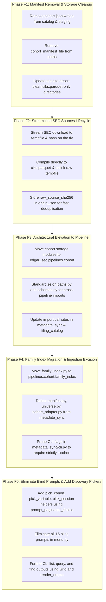

# Cohort Pipeline Evolution & Architectural Refinement: Follow-up Engineering Plan

This document establishes the follow-up engineering plan for completing the evolution of the **Cohort Subsystem into a first-class Layer 4 Pipeline** (`edgar_sec.pipelines.cohort`), eliminating redundant disk manifests, streamlining official SEC source retention, migrating cohort-adjacent metadata shims (such as company family indexing), and adding interactive CLI pagination.

---

## 1. Executive Summary & Problem Context

During the initial integration, cohorts evolved from an ad-hoc metadata planning parameter into a standalone input ingestion pipeline. However, several operational and architectural gaps remain in the current codebase that require a focused follow-up refactoring:

1. **Redundant On-Disk Manifests (`cohort.json`)**: Every cohort directory currently writes a redundant `cohort.json` file on disk despite `cohorts.sqlite` already maintaining the authoritative relational catalog, tags, counts, schema versions, and provenance JSON.
2. **Raw SEC File Retention**: Refreshing official sources (`cik_lookup.txt`, `company_tickers.json`) currently retains large uncompressed raw files under `source_snapshots/`. Compiling directly to Parquet and discarding the raw files while retaining only the source payload digest prevents disk bloat and duplicate work.
3. **Layer Placement & Package Alignment**: Cohort currently has files split across `edgar_sec.infra.storage.cohort` (Layer 2) and `edgar_sec.pipelines.cohort` (Layer 4). Because cohort represents a distinct input ingestion pipeline, its domain operations belong in Layer 4, with cross-pipeline dependencies mediated strictly via `paths.py` and `schemas.py`.
4. **Residual Metadata-Sync Shims**: Modules such as `family_index.py`, universe resolution, and cohort adapters still linger in `edgar_sec/pipelines/metadata_sync/` as shims. These must move to `edgar_sec.pipelines.cohort` alongside their mirrored test suites.
5. **Missing CLI & Menu Pagination**: The CLI commands (`cohort list`, `cohort query`, `cohort find`) and interactive console pickers currently dump unpaginated tables or rely on manual limits without interactive paging (`next`, `prev`, `quit`).

---

## 2. Issue 1: Elimination of On-Disk `cohort.json` Manifests

### 2.1 The Problem
In the current implementation:
- `CohortCatalog.write_manifest()` writes a `cohort.json` file inside `.artifacts/cohorts/<cohort_id>/`.
- Staging logic (`.stage-<cohort_id>-<uuid>/`) creates and validates `cohort.json`.
- `cohort_manifest_file(cohort_id)` is exposed on `CohortPaths`.
- When tags, names, or descriptions are modified via `rename_cohort` or `add_tags`/`remove_tags`, the SQLite database updates immediately, but disk `cohort.json` can become out of sync or requires duplicate writes.

### 2.2 Proposed Solution & Target State
- **SQLite Single Source of Truth**: All metadata (ID, human alias, row counts, distinct CIK count, schema version, dataset path, dataset SHA-256, origin JSON, pinned status, timestamps, and tags) lives solely in `cohorts.sqlite` (WAL mode).
- **Disk Artifact Minimization**: The directory `.artifacts/cohorts/<cohort_id>/` contains strictly one binary artifact:
  ```text
  .artifacts/cohorts/
  ├── cohorts.sqlite
  ├── cohorts.sqlite-wal
  ├── cohorts.sqlite-shm
  └── c-59508de79eafa64e/
      └── ciks.parquet
  ```
- **Code Modifications**:
  - Remove `CohortPaths.cohort_manifest_file()` and `MANIFEST_FILE_NAME`.
  - Remove `CohortCatalog.write_manifest()` and `CohortRecord.to_manifest()`.
  - Update atomic staging in `ingestion.py`, `sources.py`, and `operations.py` to write only `ciks.parquet` into `.stage-<cohort_id>-<uuid>/`, compute `file_sha256`, atomically rename to final directory, and insert into SQLite.
  - Export functionality: If an operator explicitly requests a JSON manifest export (e.g. `edgar-sec cohort info <id> --json`), the CLI formats and outputs the SQLite record directly to stdout or an explicit user-provided file path.

---

## 3. Issue 2: Streamlined Official Sources Lifecycle (Parquet-Only, Drop Raw Files)

### 3.1 The Problem
Currently, `sources.py` calls `_persist_raw_snapshot()`, which writes raw `.txt` (for `cik_lookup`) and `.json` (for `company_tickers`) into `.artifacts/cohorts/source_snapshots/<source_name>/<snapshot_id>.<suffix>`.
- The raw `cik-lookup-data.txt` file is ~35MB+ of uncompressed text.
- Over multiple refreshes, these raw snapshot files accumulate indefinitely on disk.
- Downstream pipelines never read the raw text; they exclusively consume the compiled, columnar `ciks.parquet`.

### 3.2 Proposed Solution & Target State
- **Stream, Compile, Discard**:
  - Fetch the remote SEC payload via `SecHttpClient` into a streaming temporary file (or in-memory stream for JSON).
  - Compute `raw_source_sha256 = sha256_text(payload)` (or streaming hasher) during download.
  - Check `source_active_pointers` / `cohorts` in `cohorts.sqlite`: If a pinned official cohort already exists with this identical `raw_source_sha256` in its `origin_json`, abort early (idempotent reuse, zero work).
  - Compile the stream directly into staging Parquet (`.stage-universe-<uuid>/ciks.parquet`).
  - Unlink the temporary raw file immediately upon compilation.
  - Atomically publish the Parquet directory and register in `cohorts.sqlite` with `origin_kind = 'official_source'` and:
    ```json
    {
      "source_name": "cik_lookup",
      "raw_source_sha256": "4a7b...",
      "fetched_at": "2026-10-08T12:00:00Z"
    }
    ```
- **Benefits**:
  - Eliminates redundant raw file storage on disk.
  - Zero disk accumulation across repeated source refreshes.
  - Fast, hash-based idempotency checks prevent unnecessary re-compilation.

---

## 4. Issue 3: Architectural Elevation: Move Cohort from Storage (Layer 2) to Pipeline (Layer 4)

### 4.1 The Problem & Boundary Analysis
Currently:
- Engine and storage logic live in `edgar_sec.infra.storage.cohort`.
- CLI and menus live in `edgar_sec.pipelines.cohort`.
- However, Cohort is functionally an **ingestion and dataset preparation pipeline**, analogous to `metadata_sync` and `filing_catalog`.
- Keeping domain ingestion rules, sampling, and SEC HTTP client fetching in `infra.storage` blurs the line between storage infrastructure and pipeline orchestration.

### 4.2 Cross-Pipeline Dependency Rules (`AGENTS.md:42`)
Per repository contract:
> "Cross-pipeline path/schema contract imports are limited to matching `paths.py` or `schemas.py` modules. These direct imports must be unaliased and acyclic; re-exports are confined to those owner modules."

If Cohort is elevated to a full pipeline (`edgar_sec.pipelines.cohort`):
- **Contract Boundary**:
  - `edgar_sec.pipelines.cohort.paths`: Defines `CohortPaths` (`artifacts_root / "cohorts"`), directory layout, and path security resolvers.
  - `edgar_sec.pipelines.cohort.schemas`: Defines canonical Parquet schemas (`COHORT_SCHEMA`, `CohortRecord`, `IngestionQuality`).
  - Downstream pipelines (`metadata_sync`, `filing_catalog`) import directly and acyclically from `edgar_sec.pipelines.cohort.paths` and `edgar_sec.pipelines.cohort.schemas`.
- **Relocation of Pipeline Modules**:
  Move from `edgar_sec/infra/storage/cohort/` to `edgar_sec/pipelines/cohort/`:
  - `catalog.py` -> `edgar_sec/pipelines/cohort/catalog.py`
  - `ingestion.py` -> `edgar_sec/pipelines/cohort/ingestion.py`
  - `operations.py` -> `edgar_sec/pipelines/cohort/operations.py`
  - `sources.py` -> `edgar_sec/pipelines/cohort/sources.py`
  - `query.py` -> `edgar_sec/pipelines/cohort/query.py`
  - `workspace.py` -> `edgar_sec/pipelines/cohort/workspace.py`
  - `paths.py` -> `edgar_sec/pipelines/cohort/paths.py`
  - `models.py` -> `edgar_sec/pipelines/cohort/schemas.py` (standardizing on pipeline schema conventions)
- **Generic Engine Remains in Layer 2**:
  - `edgar_sec.infra.storage.object_store` remains strictly in Layer 2 as a domain-agnostic storage primitive.

---

## 5. Issue 4: Migrate Cohort-Adjacent Metadata Logic & Eliminate Legacy Shims

### 5.1 Company Family Index Migration & Versioned Storage

Currently, `family_index.py` lives in `edgar_sec/pipelines/metadata_sync/family_index.py`:
- It builds company-family clusters and operating entity assignments over the full SEC registrant universe.
- It is an entity classification process that operates over cohorts, not part of metadata chunk synchronization.

#### 1. Bivariate Versioning Identity
The Family Index is a content-addressed derivative with a bivariate derivation:
$$\text{family\_index\_id} = \text{hash}(\text{universe\_roster\_id}, \;\text{universe\_dataset\_sha256}, \;\text{taxonomy\_rules\_fingerprint})[:16]$$
- **If the SEC publishes a new universe snapshot**: A new family index is compiled for the new registrants.
- **If taxonomy rules or wordlists change** (`domain.taxonomy.family_vocab`): A new family index is compiled over the *same* universe without overwriting historical runs.

#### 2. Storage Location: Dedicated Subdirectory under `cohorts_root`
Rather than polluting the root `.artifacts/cohorts/` with non-cohort tables or co-locating inside a universe folder (which breaks when taxonomy rules change for the same universe), the Family Index lives in a dedicated namespaced subdirectory:
```text
.artifacts/cohorts/
├── cohorts.sqlite                  # Tracks cohorts, family indices, and active pointers
├── c-59508de79eafa64e/             # CIK cohorts (strictly ciks.parquet)
│   └── ciks.parquet
├── universe-1dddc0e9b6076010/      # Universe cohort (strictly ciks.parquet)
│   └── ciks.parquet
└── family_index/                   # Taxonomy & entity classification domain
    └── f-aae3b440001ca841/         # Content-addressed family assignment
        └── company_family.parquet
```

#### 3. Path Helpers in `CohortPaths`
```python
FAMILY_INDEX_DIR_NAME = "family_index"
FAMILY_INDEX_FILE_NAME = "company_family.parquet"


class CohortPaths:
    ...

    @property
    def family_indices_root(self) -> Path:
        return self.cohorts_root / FAMILY_INDEX_DIR_NAME

    def family_index_dir(self, family_index_id: str) -> Path:
        canonical_id = (
            family_index_id
            if family_index_id.startswith("f-")
            else f"f-{family_index_id[:16]}"
        )
        return self.family_indices_root / canonical_id

    def family_index_file(self, family_index_id: str) -> Path:
        return self.family_index_dir(family_index_id) / FAMILY_INDEX_FILE_NAME
```

#### 4. Elimination of `family_index.manifest.json` via SQLite
Just like `cohort.json` is eliminated, disk manifests for family indices are deleted in favor of `cohorts.sqlite`:
- **Table `family_indices`** in `cohorts.sqlite`:
  ```sql
  CREATE TABLE IF NOT EXISTS family_indices (
      family_index_id      TEXT PRIMARY KEY,  -- "f-<hash[:16]>"
      universe_cohort_id   TEXT NOT NULL REFERENCES cohorts(cohort_id),
      rules_fingerprint    TEXT NOT NULL,
      registrant_count     INTEGER NOT NULL,
      entity_family_count  INTEGER NOT NULL,
      spv_family_count     INTEGER NOT NULL,
      dataset_path         TEXT NOT NULL,     -- relative path from cohorts_root
      created_at           TEXT NOT NULL
  );
  ```
- **Active Pointer in `source_active_pointers`**:
  `source_active_pointers` records `source_name = 'family_index'` pointing to the active `f-<id>`.
- **Zero-Typing Automatic Resolution**:
  Commands such as `cohort sample --group-family` resolve the active family index automatically via `catalog.get_active_source_pointer("family_index")` without prompting the user for paths.

#### 5. Migration Actions
1. Move `family_index.py` from `metadata_sync` to `edgar_sec.pipelines.cohort.family_index`.
2. Connect Console Option `2. Assign company families for the universe` directly to `edgar_sec.pipelines.cohort.family_index`.
3. In `metadata_sync`: Consumers that need family assignments read the published artifact via `edgar_sec.pipelines.cohort.paths`.
4. Move mirrored test `tests/pipelines/metadata_sync/test_family_index.py` to `tests/pipelines/cohort/test_family_index.py`.

### 5.2 Excise Ingestion Commands & Delete Legacy Modules in `metadata_sync`

**Why `metadata_sync` Should NOT Inherit These Commands:**
Historically, `metadata_sync` was the sole pipeline in the repository, so it was forced to handle raw file intake (`manifest.py`, `--input`), SEC web scraping/universe compilation (`universe.py`, `source_registry.py`, `--universe`), and roster set differences (`--roster`).

Now that Cohort is an independent, dedicated ingestion and dataset preparation pipeline (`edgar_sec.pipelines.cohort`), **`metadata_sync` should NOT inherit, re-export, or wrap those commands**:
1. **Single Responsibility**: `metadata_sync` synchronizes submission metadata for an assigned roster of CIKs. It should never parse raw CSVs, sniff delimiters, or fetch raw SEC universes.
2. **Symmetry Across Downstream Consumers**: Both `metadata_sync` and `filing_catalog` become identical downstream consumers: both accept strictly `--cohort <id_or_name>`.
   - If an operator has a custom CSV: they run `edgar-sec cohort import --input data.csv --name tech_ciks` first, then `edgar-sec metadata plan --cohort tech_ciks`.
   - If an operator wants the full universe: they run `edgar-sec metadata plan --cohort universe`. The cohort pipeline already pins `universe` as a named cohort.
   - The legacy `--roster` flag (from the old `sources compare`) is completely obsolete and replaced by `--cohort`.

**Concrete Excisions from `metadata_sync`:**
- **Delete `metadata_sync/manifest.py`**: Completely removed. Ingestion is 100% owned by `edgar_sec.pipelines.cohort.ingestion`.
- **Delete `metadata_sync/universe.py`**: Completely removed. Official universe publishing is 100% owned by `edgar_sec.pipelines.cohort.sources`.
- **Delete `metadata_sync/cohort_adapter.py`**: The simple 5-line DuckDB read from `ciks.parquet` into a `Roster` is encapsulated directly inside `metadata_sync/options.py` when resolving `--cohort`.
- **Prune CLI Flags (`metadata_sync/cli.py`)**: Drop `--input`, `--roster`, and `--universe` from `_add_cohort_source`. `metadata plan` accepts only `--cohort <name_or_id>`.
- **Simplify `PlanOptions` (`metadata_sync/options.py`)**: Remove `input_path`, `registry_id`, `universe`, `_refuse_mixed_cohort`, and `universe_cohort()`. `PlanOptions` only stores `cohort: str`.
- **Delete Obsolete Test Files**:
  - `tests/pipelines/metadata_sync/test_manifest.py` -> excised; ingestion tests live in `tests/pipelines/cohort/test_ingestion.py`.
  - `tests/pipelines/metadata_sync/test_universe.py` -> excised; universe tests live in `tests/pipelines/cohort/test_sources.py`.
  - `tests/pipelines/metadata_sync/test_cohort_adapter.py` -> excised.

---

## 6. Issue 5: Discovery Deficits & Interactive Pagination via Existing Runtime Primitives

### 6.1 Audit of Current Discovery Deficits
An audit of `edgar_sec/pipelines/cohort/` reveals **15 interactive prompts in `menu.py`** and **14 CLI parameters in `options.py`** that currently provide zero discovery mechanisms, forcing operators to memorize or blindly type hashes, paths, or variable names:

#### Interactive Console (`menu.py`): 15 Blind Prompts Across 9 Workflows
1. `_import` (L80): `prompt_text("Input file")` — blind file path typing; zero discovery of files in `uploads/` or data directories.
2. `_prompt_workspace("use")` (L112): `prompt_text("Session id")` — does not list or let user select from existing sessions in `workspace_sessions`.
3. `_prompt_workspace("bind")` (L114): `prompt_text("Cohort")` — requires typing/pasting 16-hex cohort IDs or names blindly.
4. `_prompt_workspace("let")` (L120): `prompt_text("Expression")` — does not show current session variables (`A`, `B`, `x`) or their definitions.
5. `_prompt_workspace("diff")` (L126): `prompt_text("Left variable")` — does not list active workspace variables.
6. `_prompt_workspace("diff")` (L127): `prompt_text("Right variable")` — does not list active workspace variables.
7. `_prompt_workspace("peek")` (L130): `prompt_text("Variable")` — does not list active workspace variables.
8. `_prompt_workspace("save")` (L135): `prompt_text("Variable")` — does not list active workspace variables.
9. `_prompt_workspace("drop")` (L140): `prompt_text("Variable")` — does not list active workspace variables.
10. `_sample` (L144): `prompt_text("Source cohort or source name")` — no picker for catalog cohorts or official sources (`universe`, `tickers`).
11. `_sample` (L171): `prompt_text("Family-index Parquet path")` — blind path typing; system already knows standard artifact layout.
12. `_query` (L180): `prompt_text("Cohort")` — blind typing of cohort ID.
13. `_inspect` (L191): `prompt_text("Cohort")` — blind typing of cohort ID.
14. `_maintain` (L195): `prompt_text("Cohort")` — blind typing of cohort ID.
15. `_delete` (L209): `prompt_text("Cohort to delete")` — blind typing of cohort ID.

#### Direct CLI Subcommands (`options.py`): 14 Unchecked Identifier Arguments
Positional or required arguments in `info`, `rename`, `tag`, `untag`, `delete`, `query`, `sample`, `workspace use`, `bind`, `diff`, `peek`, `save`, `drop`, and `merge` require exact identifiers without shell completion or discovery before execution.

---

### 6.2 Reuse Existing Runtime Pagination & Pickers (Do Not Reinvent)
The repository already provides robust interactive pagination and output rendering in `edgar_sec.foundation.runtime`:
1. **Interactive Selection via `prompt_paginated_choice` (`foundation.runtime.interactive`)**:
   - `prompt_paginated_choice(items: Sequence[PickItem], page_size=DEFAULT_PAGE_SIZE, prompt_label="Choice")` already provides:
     - Automatic page-chunking (`[n] Next page`, `[p] Previous page`).
     - Inline interactive filtering (`/query` search over labels and keys).
     - Direct numeric item selection (`1-N`).
     - Configurable page size via `settings.interactive.DEFAULT_PAGE_SIZE` (default 15, env `INTERACTIVE_PAGE_SIZE`).
   - **Console Picker Helpers for `menu.py`**:
     - `pick_cohort(catalog, *, prompt_label="Select Cohort") -> CohortRecord | None`: Replaces prompts #3, #10, #12, #13, #14, #15. Maps cohorts to `PickItem(key=record.cohort_id, label=f"{record.name or record.cohort_id[:10]} ({record.row_count:,} CIKs, {record.origin_kind})", value=record)`.
     - `pick_workspace_variable(workspace, *, prompt_label="Select Variable") -> str | None`: Replaces prompts #5, #6, #7, #8, #9. Lists active session variables with their row counts and expression definitions.
     - `pick_workspace_session(store, *, prompt_label="Select Session") -> str | None`: Replaces prompt #2. Lists existing sessions from `workspace_sessions`.
     - `pick_upload_file(base_dir="uploads") -> Path | None`: Replaces prompt #1. Scans and presents available CSV/TSV/TXT/Parquet files.
     - Standard artifact fallback: Replaces prompt #11 by automatically resolving `company_family.parquet` from standard paths, prompting only on override.
2. **Structured Output Rendering via `render_output` (`foundation.runtime.render`)**:
   - The CLI commands (`list`, `query`, `find`) use `render_output([Grid(headers=..., rows=...)], title=...)`.
   - Binds `--limit` and `--offset` / `--page` directly to the SQLite/DuckDB pagination queries (`LIMIT ? OFFSET ?`), returning structured aligned grids without unbuffered wall-of-text dumps.

---

## 7. Phased Implementation Roadmap



### Detailed Phase Specifications

#### Phase F1: Manifest Removal & Storage Cleanup
- **Target Files**:
  - `edgar_sec/infra/storage/cohort/catalog.py` (or `pipelines/cohort/catalog.py`)
  - `edgar_sec/infra/storage/cohort/paths.py`
  - `edgar_sec/infra/storage/cohort/ingestion.py`
  - `edgar_sec/infra/storage/cohort/operations.py`
  - `tests/infra/storage/cohort/test_catalog.py`
  - `tests/infra/storage/cohort/test_ingestion.py`
- **Deliverables**:
  - Remove all disk writes of `cohort.json`.
  - Validate that `.stage-*` directories and final cohort directories contain strictly `ciks.parquet`.
  - Update tests checking `manifest_path` to verify `catalog.get_cohort()` directly.

#### Phase F2: Streamlined SEC Sources Lifecycle
- **Target Files**:
  - `edgar_sec/infra/storage/cohort/sources.py`
  - `tests/infra/storage/cohort/test_sources.py`
- **Deliverables**:
  - Refactor `refresh_official_source` and `publish_*`: Stream directly, hash, write `ciks.parquet`, and unlink the raw payload.
  - Store `raw_source_sha256` in SQLite `origin_json`.
  - Assert that `.artifacts/cohorts/source_snapshots/` raw directories are no longer created.

#### Phase F3: Architectural Elevation to Pipeline
- **Target Files**:
  - Relocate `edgar_sec/infra/storage/cohort/*` to `edgar_sec/pipelines/cohort/*`.
  - Establish `edgar_sec/pipelines/cohort/paths.py` and `edgar_sec/pipelines/cohort/schemas.py`.
  - Update `edgar_sec/pipelines/metadata_sync/` and `edgar_sec/pipelines/filing_catalog/` import paths.
  - Relocate tests from `tests/infra/storage/cohort/` to `tests/pipelines/cohort/`.
  - Remove empty `edgar_sec/infra/storage/cohort/` directory.

#### Phase F4: Family Index Migration, Ingestion Excision & Shim Removal
- **Target Files**:
  - Move `edgar_sec/pipelines/metadata_sync/family_index.py` to `edgar_sec/pipelines/cohort/family_index.py`.
  - Move `tests/pipelines/metadata_sync/test_family_index.py` to `tests/pipelines/cohort/test_family_index.py`.
  - Add `family_indices` table to `cohorts.sqlite` schema and active pointer tracking in `source_active_pointers`.
  - Add `family_indices_root`, `family_index_dir`, and `family_index_file` to `CohortPaths`.
  - Delete `family_index.manifest.json` generation (metadata tracked in SQLite).
  - Delete `edgar_sec/pipelines/metadata_sync/manifest.py`.
  - Delete `edgar_sec/pipelines/metadata_sync/universe.py`.
  - Delete `edgar_sec/pipelines/metadata_sync/cohort_adapter.py`.
  - Delete obsolete test files: `test_manifest.py`, `test_universe.py`, `test_cohort_adapter.py`.
  - Prune `edgar_sec/pipelines/metadata_sync/cli.py` (`_add_cohort_source` drops `--input`, `--roster`, `--universe`; requires `--cohort`).
  - Simplify `edgar_sec/pipelines/metadata_sync/options.py` (`PlanOptions` stores only `cohort: str`).
  - Connect console menu option 2 to `cohort.family_index` with automatic path resolution.

#### Phase F5: CLI & Interactive Pagination via Existing Runtime Components
- **Target Files**:
  - `edgar_sec/pipelines/cohort/cli.py`
  - `edgar_sec/pipelines/cohort/menu.py`
  - `tests/pipelines/cohort/test_cli.py`
  - `tests/pipelines/cohort/test_menu.py`
- **Deliverables**:
  - Integrate `prompt_paginated_choice` from `edgar_sec.foundation.runtime.interactive` into `menu.py` for picking cohorts and official sources with filtering and page navigation.
  - Integrate `render_output` with `Grid` from `edgar_sec.foundation.runtime.render` for formatted table output in `cohort list`, `cohort query`, and `cohort find`.
  - Wire `--limit` and `--offset` / `--page` parameters to query limits and table render headers.

---

## 8. Verification & Architectural Non-Regression Strategy

When this plan is executed in subsequent turns:
1. **Layer Boundary Verification**:
   - `check.py` with `layer-boundary` scanner will verify that cross-pipeline imports are strictly restricted to `paths.py` and `schemas.py` per `AGENTS.md`.
2. **Zero Shims Policy**:
   - `legacy-shims` scanner will verify that no forwarding aliases or compatibility shims remain in `metadata_sync` or `infra.storage`.
3. **Storage & Disk Checks**:
   - Verify zero `cohort.json` files exist in `.artifacts/cohorts/`.
   - Verify zero raw `.txt`/`.json` snapshots exist in `.artifacts/cohorts/source_snapshots/`.
4. **Deterministic Gate**:
   - All targeted unit tests in `tests/pipelines/cohort/`, `tests/pipelines/metadata_sync/`, and `tests/pipelines/filing_catalog/` must run and pass deterministically.
