# Cohort Pipeline Evolution & Architectural Refinement: Follow-up Engineering Plan

This document establishes the follow-up engineering plan for completing the evolution of the **Cohort Subsystem into an independent Pipeline** (`edgar_sec.pipelines.cohort`), eliminating redundant disk manifests, streamlining official SEC source retention, migrating cohort-adjacent metadata shims (such as company family indexing), standardizing on generic cohort diffing, and adding structured output rendering and interactive CLI pickers.

---

## 1. Executive Summary & Problem Context

During the initial integration, cohorts evolved from an ad-hoc metadata planning parameter into a standalone dataset management subsystem. However, several operational and architectural gaps remain in the current codebase that require a focused follow-up refactoring:

1. **Redundant On-Disk Manifests (`cohort.json`)**: Every cohort directory currently writes a redundant `cohort.json` file on disk despite `cohorts.sqlite` maintaining the authoritative relational catalog, tags, counts, schema versions, and provenance JSON.
2. **Raw SEC Snapshot Retention & Legacy Comparison Coupling**: Refreshing official sources (`cik_lookup.txt`, `company_tickers.json`) currently retains large uncompressed raw files under `source_snapshots/`. Compiling directly to canonical `ciks.parquet` and replacing ad-hoc raw-file comparison with generic cohort-to-cohort diffing eliminates disk bloat and deletes legacy registry tables.
3. **Layer Placement & Consumer Cohort Resolution**: While cohort orchestration belongs in Layer 4 (`edgar_sec.pipelines.cohort`), cross-pipeline import rules (`AGENTS.md:42`) forbid `metadata_sync` or `filing_catalog` from importing catalog resolution logic from another Layer 4 pipeline. The storage catalog, paths, and canonical schemas must remain in Layer 2 (`edgar_sec.infra.storage.cohort`), allowing all Layer 4 pipelines to import downward cleanly.
4. **Command Surface & Scope Separation**: Source management commands (`sources refresh`, `sources compare`) lingering in `metadata_sync` violate single-responsibility boundaries. All source management and set comparison belong in `edgar-sec cohort`, leaving `metadata_sync` with strictly `--cohort` as a dataset input selector for `plan` and `augment`.
5. **Company Family Index Decoupling**: The classification engine already lives in Layer 3 (`edgar_sec.engine.company_family.assignment`). The publication pipeline must live in `pipelines.cohort`, and consumers (`filing_catalog.planner`) must consume published artifacts via standard Layer 2 paths and catalog pointers rather than importing cross-pipeline publication functions.
6. **Interactive Navigation & Structured Formatting Gaps**: While headless CLI commands already support pagination (`list` and `query` accept `--limit`/`--offset`; `find` accepts `--limit`/`--page`), their output currently dumps raw tab-separated lines rather than structured `Grid` displays, and interactive menus (`menu.py`) prompt for blind manual typing of hashes, paths, and variables without inline paginated pickers.

---

## 2. Issue 1: Manifest Elimination, Staging Leases & Concurrency Safety

### 2.1 The Problem
In the current implementation:
- `CohortCatalog.write_manifest()` writes a redundant `cohort.json` file inside `.artifacts/cohorts/<cohort_id>/`.
- Staging logic creates and validates `cohort.json`.
- `cohort_manifest_file(cohort_id)` is exposed on `CohortPaths`.
- When tags, names, or descriptions are modified, the SQLite database updates immediately, but disk `cohort.json` can become out of sync or requires duplicate writes.

### 2.2 Proposed Solution & Target State
- **SQLite Single Source of Truth**: All metadata (ID, human alias, row counts, distinct CIK count, schema version, dataset path, dataset SHA-256, origin JSON, pinned status, timestamps, and tags) lives solely in `cohorts.sqlite` (WAL mode).
- **Disk Artifact Minimization**: The directory `.artifacts/cohorts/<cohort_id>/` contains strictly binary Parquet datasets:
  ```text
  .artifacts/cohorts/
  ├── cohorts.sqlite                  # Authoritative catalog (SQLite WAL mode)
  ├── .publication.lock               # Inter-process exclusive publication lock
  └── c-59508de79eafa64e/
      └── ciks.parquet                # Canonical columnar dataset (1 row per CIK)
  ```
  *(Note: SQLite `-wal` and `-shm` files are transient engine files managed by SQLite WAL mode and are not guaranteed or tracked as repository artifacts.)*
- **Code Modifications**:
  - Remove `CohortPaths.cohort_manifest_file()` and `MANIFEST_FILE_NAME`.
  - Remove `CohortCatalog.write_manifest()` and `CohortRecord.to_manifest()`.
  - Update atomic staging in `ingestion.py`, `sources.py`, and `operations.py` to write Parquet datasets into `.stage-<cohort_id>-<uuid>/`, compute `file_sha256`, atomically rename to final directory, and insert into SQLite under lock.
  - Export functionality: If an operator explicitly requests a JSON manifest export (e.g. `edgar-sec cohort info <id> --json`), the CLI formats and outputs the SQLite record directly to stdout or an explicit user-provided file path.

### 2.3 Publication Locking, Safe Leases & Scoped Pruning
To prevent race conditions between publication and maintenance sweeps:

1. **Exclusive Publication File Lock (`PublicationLock`)**:
   - Mirrors `edgar_sec.infra.storage.dag.publication.PublicationLock`: uses `fcntl.flock(fd, fcntl.LOCK_EX)` on `.artifacts/cohorts/.publication.lock`.
   - **Publishing**: Moving the staging folder (`os.replace`) and committing the SQLite catalog row occur inside `with PublicationLock(paths.publication_lock_path):`.
   - **Sweeping**: Staging cleanup and orphan pruning also acquire `with PublicationLock(paths.publication_lock_path):`.
   - **Safety Guarantee**: Maintenance sweeps can never inspect the filesystem while a staged directory is being renamed or registered. The race window is eliminated.

2. **Multi-Attribute Staging Leases & Heartbeat Cadence**:
   - Transient staging directories (`.stage-<cohort_id>-<uuid>/`) write a `.stage.lease` file:
     ```json
      {
        "host": "hostname",
        "pid": 12345,
        "created_at": "2026-10-08T12:00:00Z",
        "heartbeat": "2026-10-08T12:05:00Z"
      }
      ```
    - **Publisher Cadence**: Long-running ingestion or source downloads update `heartbeat` every 30 seconds.
   - **Abandonment Protocol**: Under `PublicationLock`, a staging folder is reclaimed only if:
     - The lease `host` matches the local host AND `psutil.pid_exists(pid)` is False. If the local PID is alive, the directory is **never** reclaimed, protecting active processes.
      - If `host` differs (e.g. leftover from a container restart with a new hostname), `heartbeat` must be older than `MAX_STAGING_LEASE_SECONDS` (7,200s / 2 hours).
    - **Missing or Corrupt Lease**: A staging folder with a missing or unparseable lease is quarantined; deletion requires `folder_mtime > 86400s` or explicit `--force`.
   - The `.stage.lease` is unlinked inside the staging folder immediately prior to `os.replace` under `PublicationLock`.

3. **Scoped Directory Pruning & Retained Datasets**:
    - Cohort orphan pruning is **strictly restricted** to recognized cohort directory patterns (`c-[a-f0-9]{16}`). It never enters `family_index/` or workspace state. Historical raw payload cleanup is separately opt-in through `--clean-raw-snapshots`, scoped only to `source_snapshots/`.
   - **Retained Datasets (`delete --keep-dataset`)**:
     When a cohort is deleted with `--keep-dataset`, it is recorded in a SQLite table:
     ```sql
      CREATE TABLE IF NOT EXISTS detached_cohort_datasets (
          cohort_id     TEXT PRIMARY KEY,
          dataset_path  TEXT NOT NULL,
          dataset_sha256 TEXT NOT NULL,
          detached_at   TEXT NOT NULL
      );
     ```
      Additionally, a sentinel file `.detached` is placed inside `c-<cohort_id>/.detached`. Orphan pruning preserves detached datasets unless `--clean-detached` is explicitly passed.
   - **Manual `rm -rf` & Catalog Corruption Handling**:
      - If an operator manually removes a directory (`rm -rf`): `cohort maintain --clean-missing` detects missing datasets and purges dead catalog rows, skipping pinned cohorts, active source pointers, and registered family indices with a warning.
     - If `cohorts.sqlite` is corrupt or unavailable: pruning **refuses to run** (`CatalogUnavailableError: catalog database unavailable or corrupt`), ensuring no files are deleted when catalog state cannot be verified.

---

## 3. Issue 2: Streamlined Official Sources Lifecycle & Generic Cohort Diff

### 3.1 The Problem: Raw File Retention & Legacy Ad-Hoc Comparison
Currently:
- `sources.py` calls `_persist_raw_snapshot()`, which writes raw `.txt` and `.json` into `.artifacts/cohorts/source_snapshots/`.
- Legacy `metadata_sync/registry.py` coupled raw files to an ad-hoc registry (`.artifacts/metadata/registry/<registry_id>/`) and produced custom parquet tables (`listing_observations`, `registrant_registry`, `new_ciks`, `augmentation_worklist`, `effective_cik_roster`).
- This legacy tool existed only because cohorts did not exist yet; operators had to compare raw CSVs against SEC JSON files.
- In reality, all downstream pipelines (`metadata_sync` plan and augment, `filing_catalog`) **exclusively consume CIKs**. Ticker symbols are never used during submission metadata synchronization or filing catalog indexing.

### 3.2 Proposed Solution & Target State

#### 1. Canonical 1-Row-Per-CIK Official Datasets (`ciks.parquet`)
Official SEC sources compile directly to standard canonical `ciks.parquet` datasets:
- **Universe (`cik_lookup`)**: Full historical SEC registrant universe (~987k CIKs).
- **Operating Tickers (`company_tickers`)**: Operating SEC filers (~10k CIKs).
- **Single Canonical Format**: Both sources store strictly `(ordinal: int64, cik_padded: string, name: string)` sorted by numeric CIK.
- **Canonical Name Selection**: For operating filers with multiple listings in `company_tickers.json`, the canonical name is chosen by taking the first non-empty, trimmed title in deterministic source order:
  ```sql
  first(nullif(trim(raw_name), '') ORDER BY source_order)
      FILTER (WHERE nullif(trim(raw_name), '') IS NOT NULL)
  ```
- **Zero Companion Files Needed**: By standardizing comparison on cohorts, no secondary listing tables are required.

#### 2. Byte-Preserving Deduplication & Timestamp Invariance
- **Byte-Preserving Hash**:
  Because `SecHttpClient.get_bytes()` returns raw `bytes`, the digest is computed directly over the raw payload bytes:
  $$\text{raw\_source\_sha256} = \text{hashlib.sha256}(payload\_bytes)\text{.hexdigest()}$$
- **Composite Deduplication Key**:
  $$\text{dedup\_key} = \text{hash}(\text{source\_name}, \;\text{raw\_source\_sha256}, \;\text{parser\_version}, \;\text{schema\_version})$$
  When refreshing:
  1. Download payload bytes via `SecHttpClient.get_bytes()`.
  2. Compute `raw_source_sha256 = hashlib.sha256(payload_bytes).hexdigest()`.
  3. Query `cohorts.sqlite`: If an official cohort matches `dedup_key`, verify its `ciks.parquet` exists and matches `dataset_sha256`. If intact, ensure active pointer is set and exit early (zero re-work, preserving existing `observed_at` timestamps). If missing or corrupt, recompile and overwrite.
  4. Write temporary conversion files in staging, compile `ciks.parquet`, and unlink intermediate files immediately upon publication under `PublicationLock`.
- **HTTP Cache & Existing Files**: Stopping raw snapshot writes to `.artifacts/cohorts/source_snapshots/` does not remove the HTTP client cache (`.artifacts/http_cache/`). Historical raw snapshots from prior runs remain on disk until pruned by an operator maintenance command (`cohort maintain --clean-raw-snapshots`).

#### 3. Generic Cohort Diff (`edgar-sec cohort diff`)
Replace specialized, ticker-specific comparison with **generic cohort diffing**:
- An operator with a curated input imports it first: `edgar-sec cohort import --input curated.csv --name curated`.
- They run generic diff against any official source or custom cohort:
  ```bash
  # Compare curated against operating tickers
  edgar-sec cohort diff curated tickers

  # Compare curated against full universe
  edgar-sec cohort diff curated universe

  # Compare two user cohorts
  edgar-sec cohort diff tech_q1 tech_q2
  ```
- **DuckDB Execution**: Uses [`operations.diff_cohorts(left_dataset, right_dataset)`](../../edgar_sec/infra/storage/cohort/operations.py), computing:
  - `left_only_count` (CIKs in left but not right)
  - `right_only_count` (CIKs in right but not left, e.g. new active filers)
  - `union_count` and intersection counts
  - Sample preview tuples for both deltas
- **Optional Delta Export**:
  `edgar-sec cohort diff curated tickers --save-right-delta new_filers`
  Publishes the delta as a new canonical cohort, immediately consumable by `metadata augment --cohort new_filers`.
- **Complete Retirement of Legacy Registry**: Deletes `metadata_sync/registry.py:compare_sources()`, `source_registry.py`, and the entire `.artifacts/metadata/registry/` directory tree.

---

## 4. Issue 3: Architectural Layer Reconciliation & Scope Separation

### 4.1 Cross-Pipeline Boundary Analysis (`AGENTS.md:42`)
The repository contract strictly prohibits cross-pipeline imports outside matching `paths.py` and `schemas.py` modules:
> "Cross-pipeline path/schema contract imports are limited to matching `paths.py` or `schemas.py` modules. These direct imports must be unaliased and acyclic; re-exports are confined to those owner modules."

If `CohortCatalog` and cohort dataset contracts were moved into `edgar_sec.pipelines.cohort` (Layer 4), downstream pipelines (`metadata_sync` and `filing_catalog`) would be **unable to resolve cohorts by name or query SQLite** without violating the cross-pipeline boundary scanner (`layer-boundary`).

### 4.2 Reconciled Architectural Layout & Tracked Specs Supersession
To maintain full compliance with `AGENTS.md` and keep imports acyclic and downward-only:

1. **Storage Substrate Remains in Layer 2 (`edgar_sec.infra.storage.cohort`)**:
   - `edgar_sec.infra.storage.cohort.catalog`: `CohortCatalog`, SQLite WAL connection, table definitions, and cohort resolution (`resolve_cohort_identifier`).
   - `edgar_sec.infra.storage.cohort.paths`: `CohortPaths` (artifact layout, path containment security, `publication_lock_path`).
   - `edgar_sec.infra.storage.cohort.models`: `CohortRecord`, `IngestionQuality`, canonical schemas.
   - **Pointer Invariant**: `CohortCatalog.set_active_source_pointer()` directly validates that the target cohort exists in `cohorts`, has `origin_kind == 'official_source'`, and is pinned (`pinned == 1`).
   - **Downstream Legality**: Layer 4 pipelines (`metadata_sync`, `filing_catalog`, and `pipelines.cohort`) import downward from Layer 2 `edgar_sec.infra.storage.cohort` without cross-pipeline violations.

2. **Pipeline Subsystem in Layer 4 (`edgar_sec.pipelines.cohort`)**:
   - `cli.py`: Command-line entry points (`edgar-sec cohort ...`).
   - `menu.py`: Interactive console workflows and pickers.
   - `workspace.py`: Interactive REPL sessions and variable scoping.
   - `ingestion.py`: Ingestion workflow parsing CSV/TSV/text files.
   - `sources.py`: Source refresh orchestration.
   - `operations.py`: Cohort algebra (union, intersect, difference), generic diff, and stratified sampling.
   - `family_index.py`: Full-universe family index publication workflow.

> [!IMPORTANT]
> **Tracked Documentation Supersession List**:
> This plan formally supersedes and requires updates across:
> 1. [roadmap/cohort/spec.md](spec.md): Reconciles Layer 2 storage vs. Layer 4 pipeline boundary.
> 2. [roadmap/cohort/storage_spec.md](storage_spec.md): Reconciles Parquet-only storage, `PublicationLock`, and removal of disk `cohort.json`.
> 3. [roadmap/cohort/operations_spec.md](operations_spec.md): Reconciles placement of ingestion, sources, and operations in Layer 4 pipelines; generic diffing.
> 4. [roadmap/cohort/cli_spec.md](cli_spec.md): Moves source refresh and generic diff into cohort CLI; removes `[c]` from metadata sync; documents pickers and formatted output.
> 5. [roadmap/cohort/integration_spec.md](integration_spec.md): Supersedes §2.3 requirement for `scratch/migrate_legacy_cohorts.py` (no migration script).
> 6. [roadmap/cohort/plan.md](plan.md): Updates phased deliverables.
> 7. Package READMEs: `infra/storage/cohort`, `infra/storage`, `pipelines/cohort`, `pipelines/metadata_sync`, `pipelines`.

---

## 5. Issue 4: Company Family Index & Downstream Contracts

### 5.1 Decoupled Architecture & Downstream Consumer Contract
- **Engine (Layer 3)**: The entity classification algorithms, SPV classification, and vocabulary heuristics already exist in `edgar_sec.engine.company_family.assignment`.
- **Publication (Layer 4)**: The workflow that reads the universe cohort, invokes the Layer 3 engine, and publishes `company_family.parquet` moves from `metadata_sync.family_index` to `edgar_sec.pipelines.cohort.family_index`.
- **Downstream Consumer Contract (`filing_catalog.planner`)**:
  - Publication is a **strict prerequisite**: `filing_catalog.planner` **stops building the index on-the-fly**.
  - Consumers resolve the active artifact path via Layer 2 catalog and paths:
    ```python
    catalog = CohortCatalog(cohort_paths)
    record = catalog.get_active_family_index(universe_cohort_id)
    ```
  - **Fail-Closed Verification Semantics**: `filing_catalog.planner` verifies:
    1. `record.universe_cohort_id == active_universe_cohort_id` (stale if universe changed).
    2. `record.rules_fingerprint == current_rules_fingerprint()` (stale if heuristics changed).
    3. `path.is_file() and file_sha256(path) == record.dataset_sha256` (corrupt if digest mismatches).
    4. Parquet schema contains required columns `(cik_padded, entity_family_id, spv_family_id, is_operating)`.
    If any check fails, fails closed immediately with an actionable `FamilyIndexNotFoundError`.

### 5.2 Identity Width, Dedicated Active Pointers & Security
1. **Identity Width**: Consistent with `family_index_id()`, the family index identifier is strictly **32 hexadecimal characters** (`^[a-f0-9]{32}$`), derived from `canonical_hash(payload)[:32]`.
2. **Dedicated Active Pointer Table**: `source_active_pointers` in `catalog.py` validates that targets exist in `cohorts` as official `CohortRecord`s. Active family indices are tracked in a dedicated table in `cohorts.sqlite`:
   ```sql
   CREATE TABLE IF NOT EXISTS active_family_indices (
       universe_cohort_id TEXT NOT NULL REFERENCES cohorts(cohort_id),
       family_index_id    TEXT NOT NULL,
       rules_fingerprint  TEXT NOT NULL,
       dataset_path       TEXT NOT NULL,
       dataset_sha256     TEXT NOT NULL,
       pinned_at          TIMESTAMP DEFAULT CURRENT_TIMESTAMP,
       PRIMARY KEY (universe_cohort_id)
   );
   ```
3. **Secure Path Resolution**:
   `CohortPaths` validates 32-hex IDs and verifies directory containment:
   ```python
   _FAMILY_INDEX_ID_RE = re.compile(r"^[a-f0-9]{32}$")


   class CohortPaths:
       ...

       @property
       def family_indices_root(self) -> Path:
           return self.cohorts_root / "family_index"

       def family_index_dir(self, family_index_id: str) -> Path:
           if not _FAMILY_INDEX_ID_RE.match(family_index_id):
               raise ValueError(
                   f"invalid family index identifier: {family_index_id!r}"
               )
           target = (self.family_indices_root / family_index_id).resolve()
           if target.parent != self.family_indices_root.resolve():
               raise ValueError("path traversal detected in family index id")
           return target

       def family_index_file(self, family_index_id: str) -> Path:
           return self.family_index_dir(family_index_id) / "company_family.parquet"
   ```

### 5.3 Explicit Path Obligation for Family Sampling
Consistent with prior directives and established behavior in `operations.sample_cohort()`:
- When `--group-family` is specified, `--family-index <path>` **remains strictly required and explicit**.
- The CLI command `cohort sample` will **not** silently fall back to an active catalog pointer. If `--group-family` is set without `--family-index`, the command fails closed with an explicit error.

---

## 6. Issue 5: Command Ownership & CLI Decoupling

### 6.1 Clean Command Ownership & Removal of Sources from `metadata_sync`
To maintain strict single-responsibility boundaries, all source management and comparison commands are moved to `edgar-sec cohort`. `metadata_sync` retains **zero source management surface**:

| Pipeline Subsystem | Command Interface | Ownership & Responsibilities |
| :--- | :--- | :--- |
| **`edgar-sec metadata`** | `plan --cohort <id_or_name> [--limit <n>]` | Consumes canonical cohort dataset via Layer 2 `CohortCatalog`. Strips `--input`, `--roster`, and `--universe`. |
| **`edgar-sec metadata`** | `augment --base-snapshot-id <id> --cohort <id_or_name> [--new-snapshot-id <id>]` | Consumes delta cohort dataset. Strips `--input`, `--roster`, and `--universe`. |
| **`edgar-sec metadata`** | *(sources commands deleted)* | Completely removed from `metadata_sync`. `_add_cohort_source()` and `[c]` console menu entry are deleted. |
| **`edgar-sec cohort`** | `sources refresh --source {company_tickers, cik_lookup}` | Official SEC source download, deduplication, and compilation to Parquet. |
| **`edgar-sec cohort`** | `diff <cohort_a> <cohort_b> [--save-left-delta <name>] [--save-right-delta <name>]` | Generic set difference and cardinality comparison between any two cohorts. |

### 6.2 Source Pointer Aliases vs. Catalog Display Names
To avoid conflating user-assigned display names with official system source pointers:
- The authoritative keys in `source_active_pointers` remain `cik_lookup` and `company_tickers`.
- `CohortCatalog.resolve_cohort_identifier(id_or_name)` defines a deterministic alias mapping:
  - `"universe"` maps to source key `"cik_lookup"`.
  - `"tickers"` maps to source key `"company_tickers"`.
- If an operator passes `--cohort universe` or `--cohort tickers`, the catalog resolves the active snapshot ID from `source_active_pointers` under the corresponding source key.

### 6.3 Maintenance & Garbage Collection Grammar
Explicit maintenance commands manage system hygiene:
```bash
# Read-only integrity audit: check SQLite, datasets, orphans, and stale leases
edgar-sec cohort doctor

# Mutating maintenance: select one or more explicit cleanup actions
edgar-sec cohort maintain [--clean-stale-staging] [--clean-orphans] [--clean-missing] [--clean-detached] [--clean-raw-snapshots] [--all] [--force]
```

`--all` combines stale staging, orphan, and missing-row cleanup only. `--force`
applies to quarantined unparseable staging leases; live local PIDs are never
reclaimed. Maintenance does not inspect workspace sessions, and no cleanup runs
automatically at process startup.

### 6.4 Interactive Pickers & Structured Grid Presentation
1. **Interactive Console Pickers (`menu.py`)**:
   Use `edgar_sec.foundation.runtime.interactive.prompt_paginated_choice` to replace blind text typing:
   - `pick_cohort(catalog)`: Lists available cohorts with CIK counts, tags, and origin kinds. Synthetically prepends active source aliases:
     - `[universe] (Active SEC Universe, 987k CIKs)`
     - `[tickers] (Active Operating Filers, 10k CIKs)`
   - `pick_workspace_variable(workspace)`: Replaces blind typing in `diff`, `peek`, `save`, and `drop`.
   - `pick_workspace_session(store)`: Replaces blind typing in `workspace use`.
   - `pick_upload_file(base_dir="uploads")`: Replaces blind file path typing in `import`.
2. **Headless CLI Output Formatting**:
   Format outputs of `cohort list` (using `--limit`/`--offset`), `cohort query` (using `--limit`/`--offset`), and `cohort find` (using `--limit`/`--page`) using `render_output` with `Grid` from `edgar_sec.foundation.runtime.render`, replacing tab-separated raw dumps with aligned tables.

---

## 7. Phased Implementation Roadmap

```mermaid
flowchart TD
    subgraph PhaseF1["Phase F1: Manifest Removal, Publication Locking & Staging Hardening"]
        F1_1["Remove cohort.json writes from catalog & staging"]
        F1_2["Implement PublicationLock for atomic rename & SQLite insert"]
        F1_3["Add .stage.lease with host/pid & scoped orphan pruning"]
        F1_4["Add detached_cohort_datasets table & maintain command"]
    end

    subgraph PhaseF2["Phase F2: Official SEC Sources Lifecycle & Generic Diff"]
        F2_1["Compile company_tickers directly to canonical ciks.parquet"]
        F2_2["Retire legacy registry & replace comparison with generic cohort diff"]
        F2_3["Raw-bytes deduplication key & structured origin provenance"]
        F2_4["Unlink intermediate conversion files & stop raw writes"]
    end

    subgraph PhaseF3["Phase F3: Architectural Layer Alignment & Doc Sync"]
        F3_1["Retain catalog, paths, and models in infra.storage.cohort (Layer 2)"]
        F3_2["Relocate CLI, menus, and workflows to pipelines.cohort (Layer 4)"]
        F3_3["Update tracked roadmap specs and package READMEs"]
    end

    subgraph PhaseF4["Phase F4: Family Index Decoupling & CLI Specialization"]
        F4_1["Relocate family index publication to pipelines.cohort.family_index"]
        F4_2["Add active_family_indices table and 32-hex secure paths"]
        F4_3["Move sources refresh & generic diff to cohort CLI; strip from metadata"]
        F4_4["Add source alias resolution (universe/tickers) in CohortCatalog"]
    end

    subgraph PhaseF5["Phase F5: Interactive Pickers & Output Formatting"]
        F5_1["Add pick_cohort with active source aliases via prompt_paginated_choice"]
        F5_2["Add workspace variable, session, and upload file pickers"]
        F5_3["Format CLI list, query, and find outputs using Grid and render_output"]
    end

    PhaseF1 --> PhaseF2
    PhaseF2 --> PhaseF3
    PhaseF3 --> PhaseF4
    PhaseF4 --> PhaseF5
```



### Implementation Status & Detailed Phase Specifications

| Phase | Description | Status | Remaining Scope |
|---|---|---|---|
| **Phase F1** | Manifest Removal, Locking & Leases | **Landed** | None |
| **Phase F2** | Official SEC Sources & Generic Diff | **Largely Landed** | Direct DuckDB conversion for `company_tickers` (zero intermediate CSV) |
| **Phase F3** | Architectural Layer Alignment | **Pending** | Realign package ownership: move workflows/operations to `pipelines.cohort` |
| **Phase F4** | Family Index Decoupling & Consumer Cutover | **Landed** | Fully completed; verified in full test suite |
| **Phase F5** | Interactive Pickers & Output Presentation | **Landed** | Fully completed; verified in full test suite |

---

#### Phase F1: Manifest Removal, Publication Locking & Staging Hardening
- **Target Modules**: `infra/storage/cohort/catalog.py`, `infra/storage/cohort/paths.py`, `infra/storage/cohort/ingestion.py`.
- **Implemented**:
  - Removed all disk writes of `cohort.json` and eliminated manifest path/model APIs; SQLite WAL is authoritative.
  - Implemented `PublicationLock` (`.publication.lock`) using re-entrant thread local and `fcntl.flock`.
  - Implemented `.stage.lease` recording `{host, pid, created_at, heartbeat}` with background heartbeat daemon.
  - Implemented session-independent doctor and maintenance loaders; doctor uses read-only SQLite access and never creates an absent catalog.
  - Implemented explicit maintenance actions for staging, orphans, missing rows, detached data, and historical raw snapshots under `PublicationLock`.
  - Added detached-dataset registry rows and `.detached` markers; missing-row cleanup protects pinned cohorts, active source pointers, and registered family indices.
  - Kept cleanup explicit; doctor and maintenance bypass workspace initialization and session cleanup.

#### Phase F2: Official SEC Sources Lifecycle & Generic Diff
- **Target Modules**: `infra/storage/cohort/sources.py`, `pipelines/cohort/cli.py`, `infra/storage/cohort/operations.py`.
- **Implemented**:
  - Moved official source refresh into `edgar-sec cohort sources refresh`.
  - Implemented byte-preserving `sha256_bytes(payload)` deduplication, avoiding redundant re-work and re-fetching.
  - Eliminated writing new raw `.txt`/`.json` snapshots to disk.
  - Implemented generic `edgar-sec cohort diff <cohort_a> <cohort_b>` supporting source aliases (`universe`, `tickers`), `--save-left-delta`, `--save-right-delta`, and ASCII `Grid` diff presentation.
- **Remaining**:
  - Compile `company_tickers.json` directly to canonical `ciks.parquet` in DuckDB in a single pass without intermediate `.ticker-rows-*.csv` files.

#### Phase F3: Architectural Layer Alignment & Tracked Documentation
- **Target Modules**: `infra/storage/cohort/*`, `pipelines/cohort/*`, docs in `roadmap/cohort/`.
- **Status**: **Pending**
- **Remaining**:
  - Retain strictly storage primitives in Layer 2 (`edgar_sec.infra.storage.cohort`): `catalog.py`, `paths.py`, `models.py`.
  - Relocate pipeline workflows, parsing, operations, search, and workspace execution to Layer 4 (`edgar_sec.pipelines.cohort`): `ingestion.py`, `sources.py`, `operations.py`, `query.py`, `workspace.py`.
  - Ensure downstream pipelines (`metadata_sync`, `filing_catalog`) import downward only from Layer 2 storage modules.
  - Synchronize tracked package READMEs and architecture specs.

#### Phase F4: Family Index Decoupling & CLI Specialization
- **Target Modules**: `pipelines/cohort/family_index.py`, `filing_catalog/family_index.py`, `filing_catalog/planner.py`, `metadata_sync/*`.
- **Status**: **Landed & Verified**
- **Delivered**:
  - Relocated full-universe company family index publication to `edgar_sec.pipelines.cohort.family_index`.
  - Added `active_family_indices` catalog table in `cohorts.sqlite` and 32-hex secure path validation in `CohortPaths.family_index_dir`.
  - Severed cross-pipeline import in `filing_catalog.planner`; created read-only consumer validator in `pipelines.filing_catalog.family_index.resolve_active_family_index()` that reads from `CohortCatalog` and fails closed (`FamilyIndexNotFoundError`) if missing, stale, or corrupt.
  - Incorporated `family_index_id` into `plan_identity()`.
  - Purged `metadata_sync` of `sources refresh`, `sources compare`, and `family_index.py`. Deleted all obsolete shims (`manifest.py`, `universe.py`, `cohort_adapter.py`, `source_registry.py`, `registry.py`).

#### Phase F5: Interactive Pickers & Output Presentation
- **Target Modules**: `pipelines/cohort/menu.py`, `pipelines/cohort/cli.py`.
- **Status**: **Landed & Verified**
- **Delivered**:
  - Implemented `pick_cohort` (prepending active aliases `universe` and `tickers`), `pick_workspace_variable`, `pick_workspace_session`, and `pick_upload_file` using `prompt_paginated_choice`.
  - Replaced manual text prompts in `menu.py` with paginated pickers.
  - Formatted `cohort list`, `cohort query`, and `cohort find` outputs with aligned `Grid` and `render_output`.

---

## 8. Verification & Architectural Non-Regression Strategy

When this plan is executed in subsequent turns:
1. **Layer Boundary Verification**:
   - `check.py` with `layer-boundary` scanner will verify that Layer 4 pipelines import downward cleanly from Layer 2 `infra.storage.cohort` and that cross-pipeline imports are strictly restricted per `AGENTS.md`.
2. **Zero Shims Policy**:
   - `legacy-shims` scanner will verify that no forwarding aliases or compatibility shims remain in `metadata_sync` or `infra.storage`.
3. **Storage & Disk Checks**:
   - Verify zero `cohort.json` files exist in `.artifacts/cohorts/`.
   - Verify zero new raw `.txt`/`.json` snapshots are written to `.artifacts/cohorts/source_snapshots/`.
4. **Targeted Verification Gate**:
   - Targeted unit tests in `tests/pipelines/cohort/`, `tests/pipelines/metadata_sync/`, and `tests/pipelines/filing_catalog/` must run and pass deterministically via `check.py`.
