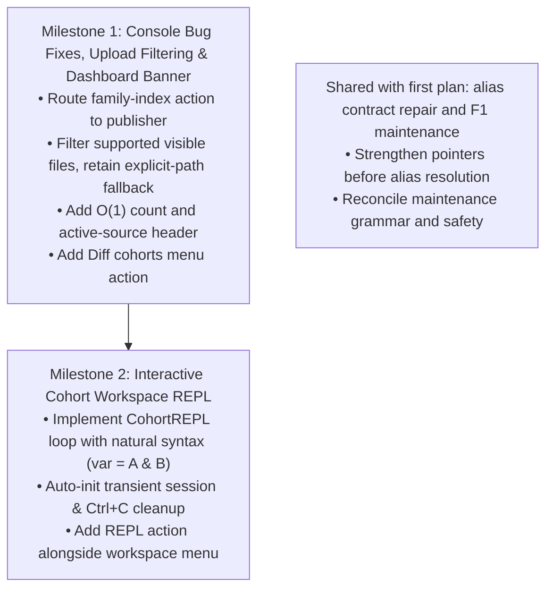

# Cohort Subsystem: Console, CLI, REPL & Maintenance Audit (Follow-up Phase 2)

This specification audits the **Cohort Management Console** (`edgar_sec.pipelines.cohort.menu`) and **CLI grammar** (`cli.py`, `options.py`), comparing their operational maturity against the **Snapshot DAG Console** (`edgar_sec.infra.storage.dag.menu`), cataloging runtime errors and UX shortcomings, and designing the **Interactive Cohort Workspace REPL** and upload file filtering.

---

## 1. Executive Summary & Problem Context

The first slice of follow-up changes successfully eliminated on-disk `cohort.json` manifests, decoupled family index publication to `pipelines.cohort.family_index`, severed downstream cross-pipeline imports in `filing_catalog.planner`, and added paginated pickers and `Grid` output formatting.

However, real-world terminal usage highlights four prominent issues:
  1. **Console Runtime NameError**: Selecting `Refresh & manage official sources` -> `Assign company families` referenced an undefined `_assign_families` handler.
   2. **Unfiltered Upload Pickers**: `pick_upload_file()` listed arbitrary files in `uploads/` (such as `.md` documentation files) instead of filtering for supported dataset extensions.
3. **Clumsy Workspace Navigation**: The numbered workspace submenu requires repeated manual session selection and exits back to the menu after each action. An opt-in **interactive REPL** should auto-initialize a transient session, accept natural algebraic commands, and clean up its own session on `Ctrl+C` or `exit`.
4. **Missing Relational Algebra in Console**: The primary analytical command `cohort diff` exists in the CLI, but is completely absent from the interactive console menu.

---

## 2. Comparison: Snapshot DAG Console vs. Cohort Console

| Dimension | Snapshot DAG Console (`storage.dag.menu`) | Cohort Console (`pipelines.cohort.menu`) | Severity & Impact |
|---|---|---|---|
| **Telemetry & Dashboard Banner** | **$O(1)$ Repository Status**: Displays root, active `HEAD` pointer, branch, lineage depth, anchor ID, relation counts, branch/tag counts, and proactively flags pending/stale runs (`Staged Runs: X detected`). | **$O(N)$ Unbounded Scan**: Runs `while True: catalog.list_cohorts(500)` on every menu render. Hardcodes `Family Index: cohort pipeline`. Omits active source pointers (`universe`, `tickers`), workspace session status, and staging runs. | **Medium (Perf & UX)**: Sluggish rendering on large catalogs and zero operational visibility into active pointers or in-flight leases. |
| **Interactive Diffing** | Full branch/snapshot comparison and checkout. | **Completely Missing**: CLI implements `cohort diff`, but there is **no menu action** to diff cohorts interactively. | **High (Missing Feature)**: Core relational set algebra is inaccessible to interactive users. |
| **Workspace & REPL Experience** | N/A (linear DAG commits). | **Fragmented 12-item submenu**: Prompts for session IDs on every action, delegating to headless CLI executions. Needs a dedicated, stateful REPL. | **High (UX)**: High friction for iterative cohort exploration. |
| **Upload File Selection** | Filtered and typed file selection. | **Unfiltered Directory Listing**: Shows Markdown and documentation files alongside CSVs in `uploads/`. | **Medium (UX)**: Operator confusion and parser failures on non-data files. |
| **Maintenance & Health Tools** | **Comprehensive Operations**: `status`, `doctor` (integrity audit of manifests, parts, digests), `gc` (reclaims unreferenced objects & stale stages), and `compact` (S8 relation compaction). | Only exposes Rename, Tag, and Delete. **No health check, no stale staging GC, and no orphan pruning**. | **High (Operational Risk)**: Operators cannot audit database-to-disk consistency or clean aborted runs from the console. |

---

## 3. Discovered Bugs & Menu Discrepancies

### Bug 1: Runtime `NameError` in `_source_menu`
In `edgar_sec/pipelines/cohort/menu.py`:
```python
def _source_menu() -> None:
    actions = make_menu(
        menu_action("Refresh official source", _refresh_source),
        menu_action("Assign company families", _assign_families),  # <--- CRITICAL BUG
        MenuSeparator(),
    )
    run_interactive_menu("Official Sources & Taxonomy", actions)
```
- **Cause**: `_assign_families` was refactored into `_publish_family_index` at the main menu level, but `_source_menu` was left referencing the deleted function.
- **Impact**: Selecting `Refresh & manage official sources` -> `Assign company families` immediately crashes with `NameError: name '_assign_families' is not defined`.
- **Fix**: Remove the redundant submenu entry or route it directly to `_publish_family_index`.

---

### Bug 2: Unfiltered Upload Directory Listing
In `edgar_sec/pipelines/cohort/menu.py:pick_upload_file()`:
```python
files = (
    sorted((path for path in directory.iterdir() if path.is_file()), key=str)
    if directory.is_dir()
    else []
)
```
- **Cause**: Takes all files in `uploads/` indiscriminately.
- **Impact**: Shows `10-k.md`, `FORMATTING_GUIDELINES.md`, etc., which fail upon ingestion.
- **Fix**: Filter by supported dataset extensions:
  ```python
  SUPPORTED_UPLOAD_EXTENSIONS = {".csv", ".tsv", ".txt", ".text", ".parquet"}
  files = [
      p for p in sorted(directory.iterdir(), key=str)
      if p.is_file() and not p.is_symlink()
      and p.suffix.lower() in SUPPORTED_UPLOAD_EXTENSIONS and not p.name.startswith(".")
  ]
  ```
  If no supported files are found, display an informative warning and prompt for an explicit file path.

---

### Bug 3: Missing `diff` Menu Action
- **Cause**: `build_menu()` omitted `diff` when assembling the interactive options.
- **Specification Divergence**: `roadmap/cohort/cli_spec.md` line 48 specified Option 2 as:
  `2. Diff cohorts (Curated vs Official sources or custom sets)`.
- **Fix**: Add `menu_action("Diff cohorts", _diff_cohorts)` prompting for left/right cohorts via `pick_cohort()`, rendering the diff grid, and offering an optional delta save.

---

### Bug 4: Blind Manual Text Prompt for Family Index in `_sample()`
In `edgar_sec/pipelines/cohort/menu.py`:
```python
if prompt_choice("Group by company family?", [("1", "No"), ("2", "Yes")], default="1") == "2":
    arguments.append("--group-family")
    arguments.extend(("--family-index", prompt_text("Family-index Parquet path")))
```
- **Disposition**: The explicit `--family-index` path is a required fail-closed contract in [followup_plan.md](followup_plan.md#52-explicit-path-obligation-for-family-sampling) and [operations_spec.md](operations_spec.md#43-family-grouping--spv-filtering). Auto-resolving the active pointer here would conflict with that contract.
- **Allowed UX improvement**: A future picker may select a concrete index file, but it must pass that selected path explicitly and must not infer an index from the catalog pointer.

---

### Bug 5: $O(N)$ Unbounded Cohort Scanning on Every Menu Render
In `edgar_sec/pipelines/cohort/menu.py:_header()`:
```python
while True:
    page = catalog.list_cohorts(limit=500, offset=offset)
    count += len(page)
    if len(page) < 500:
        break
    offset += len(page)
```
- **Impact**: Every menu refresh materializes and discards Python dataclasses for all cohorts in SQLite just to compute a count.
- **Fix**: Add $O(1)$ `CohortCatalog.cohort_count()` running `SELECT count(*) FROM cohorts`.

---

### Bug 6: Source Alias Resolution Disparity
- **Cause**: `"universe"` and `"tickers"` are handled ad-hoc in `metadata_sync/options.py` and `cohort/cli.py` via local dictionary translation.
- **Impact**: `CohortCatalog.resolve_cohort_identifier("universe")` fails with `CohortIdentifierError: Ambiguous or short hash prefix 'universe'`. As a result, downstream callers like `filing_catalog.planner._resolve_cohort()` cannot accept `--cohort universe` or `--cohort tickers`.
- **Disposition**: Alias support is already required by [followup_plan.md §6.2](followup_plan.md#62-source-pointer-aliases-vs-catalog-display-names), but is missing from `CohortCatalog.resolve_cohort_identifier()`. Treat this as a first-plan contract gap. Reserved aliases take precedence over exact user names as stated in [cli_spec.md §4](cli_spec.md#4-short-hash-prefix-resolution--identifier-lookups).
- **Implementation gate**: Resolve the source pointer only when it points to an existing `official_source` cohort pinned in the catalog. Fail with an actionable `CohortIdentifierError` when the pointer is absent, dangling, or invalid. Strengthen `set_active_source_pointer()` first; its current behavior permits arbitrary registered cohorts.
- **Proposed mapping**:
  ```python
  if id_or_name in {"universe", "tickers"}:
      source_name = "cik_lookup" if id_or_name == "universe" else "company_tickers"
      snapshot_id = self.get_active_source_pointer(source_name)
      if snapshot_id is None:
          raise CohortIdentifierError("no active source cohort is published")
      record = self.get_cohort(snapshot_id)
      if record is None or record.origin_kind != "official_source" or not record.pinned:
          raise CohortIdentifierError("active source pointer is invalid")
      details = json.loads(record.origin_json)
      if not isinstance(details, dict) or details.get("source_name") != source_name:
          raise CohortIdentifierError("active source pointer belongs to a different source")
      return record
   ```

---

## 3.1 Reconciliation, Edge Cases & Readiness

This section is authoritative where this audit differs from [followup_plan.md](followup_plan.md). Implement shared storage and lifecycle work once under the first plan; this plan owns only its additional console and REPL behavior.

Follow-up plan 2 is not ready as a whole: M1, M2, and centralized alias/pointer validation are implemented and verified; F1 maintenance grammar and safety remain unresolved.

| Area | Current disposition | Readiness constraint |
|---|---|---|
| Console bugs, upload filtering, diff action, and count query | Independent of the first plan and implemented in the current worktree. | Tests cover callback routing, cancellation, case-insensitive supported extensions (including `.text`), hidden files, directories, symlinks, explicit-path validation, delta selection, and the count/source-pointer header. |
| Family-index sampling path | The auto-resolution proposal is rejected because the first plan requires an explicit `--family-index` path. | Any picker must select a concrete file and pass that explicit path; missing or stale active pointers must not silently choose one. |
| Source aliases | Central resolution and pointer validation are implemented in the current worktree, closing a first-plan contract gap. | Tests cover reserved-name precedence, absent/dangling pointers, non-official/unpinned targets, and source-key mismatch; metadata_sync and cohort CLI now use the catalog resolver. |
| Detached datasets, maintenance, GC, and doctor | Shared with the first plan's unfinished F1. Do not implement a second catalog table or sweep engine from this plan. | Use one reconciled grammar (`maintain --clean-missing --prune-orphans`; `gc --clean-stale-staging --clean-raw-snapshots --clean-detached`) after resolving F1's stale `--prune-manifests` flag. Preserve `.detached`, exclude non-cohort namespaces, refuse destructive work on an unavailable/corrupt catalog, reject symlink escapes, and serialize publication/detach/pruning under one lock. Missing rows still referenced by active pointers, aliases, or family-index records must be reported/refused rather than silently purged. |
| Workspace REPL | Implemented as an opt-in command and submenu action; the existing workspace CLI, session store, and paginated menu pickers remain supported. | Assignment delegates to the existing restricted `parse_expression()` API; it does not call Python `eval()` or `exec()`. Commands use simple line dispatch and quoted argument splitting. An explicit session avoids changing the process-wide active-session pointer; exit, EOF, or Ctrl+C clears only the transient session and its aliases. |
| Direct ticker conversion and Layer 2/4 realignment | Already tracked as F2/F3 in the first plan; remove the duplicate milestones here. | Preserve first-non-empty trimmed-name selection in source order, reject malformed JSON/CIKs deterministically, retain byte-based source identity, and keep intermediate cleanup bounded and failure-safe. Relocation must preserve direct Layer 2 imports for consumers and avoid compatibility shims. |

### Status Matrix

| Milestone | Status | Scope |
|---|---|---|
| M1 | Implemented and verified (42 focused tests passed). | Route family-index action to its publisher, filter uploads, use a count query, and add interactive diff with at most one delta publication per invocation. |
| M2 | Implemented and verified (32 focused tests passed). | Add an opt-in REPL using the simple, bounded `parse_expression` API while retaining current workspace CLI and menu workflows. |
| M3 | Split ownership. | Alias resolution and pointer validation are implemented; maintenance and detached-dataset work remains first-plan F1 and requires command-grammar reconciliation. |
| M4 | Removed from this plan's implementation scope. | Continue under first-plan F2/F3 to avoid duplicated or contradictory work. |

### Deferred Edge-Case Decisions

- Use the first plan's lease contract: local live PIDs are never reclaimed; remote leases expire only after two hours; missing/corrupt leases are quarantined and deleted only after one day or explicit force. Reconcile PID reuse and malformed/future timestamps before GC implementation.
- The first plan's `--prune-manifests` flag is obsolete after manifest removal; decide whether to drop it before publishing the shared maintenance CLI grammar.
- `doctor` must distinguish missing files, digest mismatch, unreadable Parquet, and schema mismatch, and must not repair or delete anything implicitly.
- Diffing a cohort against itself is valid and yields empty deltas; the console therefore offers a single optional delta per run to avoid a partially published two-delta operation if the second name conflicts.

---

## 4. Interactive Cohort Workspace REPL Design

The REPL is an opt-in workflow alongside the existing workspace menu and headless CLI. The existing paginated session and variable pickers remain available; a separate REPL action or command may open the algebraic prompt.

### 4.1 Target REPL Session Experience

```text
================================================================================
Cohort Workspace REPL (DuckDB Set Algebra Engine)
Session: repl_<id> (transient)
Type 'help' for command syntax, 'exit' or Ctrl+C to close the transient session.
================================================================================
cohort> bind A universe
A -> universe

cohort> bind B tickers
B -> tickers

cohort> diff A B
Cohort Diff
  Set           Members
  A             <count>
  B             <count>
  Intersection  <count>
  Left only     <count>
  Right only    <count>
  Union         <count>

cohort> let tech = A & tech_ciks
tech -> <expression-id>

cohort> peek tech 5
Ordinal  CIK         Name
0        0000320193  Apple Inc.
...

cohort> vars
Variable  Kind        Target ID
A         cohort      c-<universe-id>
B         cohort      c-<tickers-id>
tech      expression  <expression-id>

cohort> save tech tech_universe_q3 --tags tech,q3
saved c-<cohort-id>

cohort> exit
closed transient session repl_a8f19c
```

### 4.2 Statement Grammar & Dispatch

The REPL handles one input line at a time. A small command dispatcher handles verbs; assignment lines split once at `=` and pass the right-hand expression to `CohortWorkspace.let_expression()`.

```text
<assignment> ::= ["let" <ws>+] <variable> <ws>* "=" <ws>* <expression>
<command>    ::= <verb> [<ws>+ <argument>]*
```

- Commands are tokenized with `shlex.split()` so names containing spaces can be quoted. No command invokes a shell.
- Malformed assignments and command errors print an error and return to the prompt.

### 4.3 Expression Parsing

The REPL reuses the existing set-expression API; it does not define another AST or evaluator.

```text
<expression> ::= <term> ( ("+" | "&" | "-") <term> )*
<term>       ::= <name> | "(" <expression> ")"
```

`CohortWorkspace.let_expression()` delegates to `operations.parse_expression()`, which accepts only cohort names and `+`, `&`, `-` set operators. It parses a restricted syntax tree; the REPL does not execute Python expressions. Existing parser validation and complexity limits remain authoritative.

### 4.4 Command Grammar & Shorthands

| Command Syntax | Shorthand | Action |
|---|---|---|
| `bind <alias> [cohort]` | `b <alias> [cohort]` | Binds alias to a cohort ID, name, or source (`universe`, `tickers`). If cohort is omitted, opens `pick_cohort()`. |
| `let <var> = <expr>` | `<var> = <expr>` | Evaluates algebraic expression (`A + B`, `A & B`, `A - B`, `(A + B) - C`) and stores expression node. |
| `diff <var1> <var2>` | `d <var1> <var2>` | Computes cardinalities (union, intersect, deltas) and prints aligned grid. |
| `peek <var> [limit]` | `p <var>` | Shows first $N$ rows (default: 10) of the variable. |
| `vars` / `list` | `ls` | Displays an aligned `Grid` of all active variables in the session. |
| `save <var> <name> [--tags t1,t2]` | `s <var> <name>` | Evaluates expression and registers the final Parquet dataset as a permanent cohort. |
| `drop <var>` | `rm <var>` | Drops the variable alias from the session. |
| `clear` | — | Clears all variables in the active session. |
| `use <session_id>` | — | Switches to or activates a named persistent session. |
| `help` | `?` | Displays the cheat sheet of algebraic operators (`+`, `&`, `-`) and commands. |
| `exit` / `quit` / `Ctrl+C` / `Ctrl+D` | `q` | Exits the REPL and auto-prunes transient sessions. |

### 4.5 Lifecycle & Signal Handling Mechanics
1. **Auto-Initialization**:
   - Running the opt-in REPL generates a transient session ID and verifies it is unused before creating it.
   - The REPL addresses its session explicitly; it does not update the process-wide active-session pointer, so concurrent terminals cannot switch each other's context.
2. **Signal Handling (`SIGINT` / `Ctrl+C` & `Ctrl+D`)**:
   - The loop catches `KeyboardInterrupt` and `EOFError`.
   - Exit and interruption clear aliases and transient session metadata only for the session created by this invocation; immutable expression objects remain in the shared object store.
   - A selected persistent session is never deleted; `use` changes only the REPL's local workspace.

---

## 5. Maintenance & Garbage Collection Engine (Shared with F1)

This plan does not define a second maintenance implementation. Use F1's catalog, lock, lease, detached-dataset, and sweep contracts. The following gaps must be resolved before implementation:

1. **Detached Dataset Tracking**:
   - `cohort delete <id> --keep-dataset` inserts into `detached_cohort_datasets`:
     ```sql
     CREATE TABLE IF NOT EXISTS detached_cohort_datasets (
         cohort_id    TEXT PRIMARY KEY,
         dataset_path TEXT NOT NULL,
         detached_at  TEXT NOT NULL
     );
     ```
   - Writes `.detached` marker file inside the dataset directory.
2. **Maintenance safety decisions**:
   - Reconcile F1's `--prune-manifests` flag with manifest removal before wiring parser options.
   - `clean-missing` must not remove pinned/active rows or rows referenced by workspace aliases or family-index records; report and refuse those cases.
   - `doctor` is read-only and must distinguish an absent catalog from a corrupt catalog without creating/reinitializing it.
   - Orphan scans operate only on recognized cohort directory names, preserve detached records/markers, and never traverse symlinks or non-cohort namespaces.

---

## 6. Implementation Phasing & Milestones



### Milestone Deliverables

- **Milestone 1 (Immediate)**:
  1. Fix `_source_menu` in `menu.py` to eliminate `NameError`.
  2. Filter visible upload files by supported extensions (`.csv`, `.tsv`, `.txt`, `.text`, `.parquet`), exclude symlinks, and validate the explicit-path fallback.
  3. Implement $O(1)$ `catalog.cohort_count()` and rich status header in `menu.py`.
  4. Add `_diff_cohorts()` to `menu.py` with `pick_cohort()` prompts and delta save.
- **Milestone 2**:
  1. Implement `CohortREPL` in `edgar_sec/pipelines/cohort/repl.py` (or `menu.py`).
  2. Wire REPL auto-init, natural syntax parsing, and `Ctrl+C` transient session cleanup.
  3. Add a distinct REPL menu action without removing the existing workspace menu.
- **Milestone 3**:
  This work is owned by the first plan's pointer/alias contract and F1 maintenance scope; it is not a second implementation milestone here.
- Direct ticker conversion and Layer 2/4 relocation remain first-plan F2/F3 work and are removed from this plan's milestone graph.
