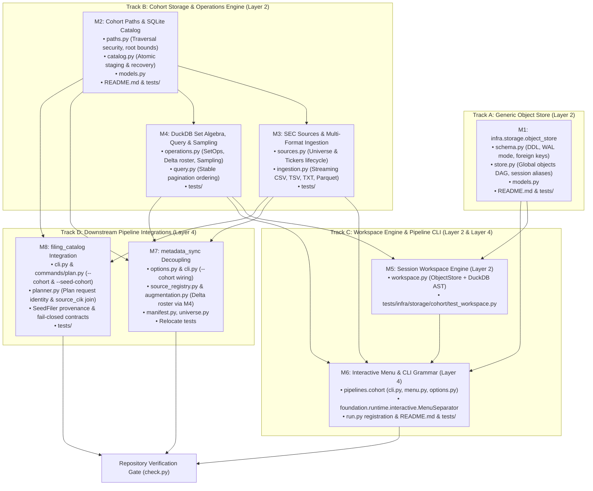

# Cohort Management & Object Store: Implementation Milestones & Plan

This document establishes the milestone-by-milestone engineering plan for implementing the **Generic Object Store** (`edgar_sec.infra.storage.object_store`), the **Cohort Storage Engine** (`edgar_sec.infra.storage.cohort`), and the **Cohort Pipeline CLI Orchestrator** (`edgar_sec.pipelines.cohort`), as specified in `roadmap/cohort/spec.md`.

---

## 1. Parallelization Analysis & Dependency Graph

The work is partitioned into **four decoupled tracks** designed to enforce repository layering and maximize concurrent development:



### Parallel Execution Opportunities
1. **Track A and Track B start immediately and run in parallel**:
   - `object_store` has zero dependencies on SEC, CIK, Parquet, or DuckDB.
   - `cohort.paths`, `catalog.py`, and `sources.py` depend only on SQLite, PyArrow, and DuckDB.
2. **Inside Track B, M3 (Sources/Ingestion) and M4 (Set Algebra/Query/Sampling) proceed concurrently** once M2 (Paths & Catalog) is established.
3. **M6 (CLI & Console) requires M1, M3, M4, and M5**:
   - Console intake requires M3 (`ingestion.py`), algebra requires M4, and workspace commands require M5.
4. **M7 (metadata_sync Decoupling) explicitly requires M2, M3, and M4**:
   - Roster loading requires M2/M3; augmentation delta planning requires M4 (`execute_delta_roster`).
5. **M8 (filing_catalog Integration) requires M2 and M3**:
   - Deterministic and policy planners consume datasets ingested and cataloged via M2/M3.

---

## 2. Milestone Breakdown & Detailed Specifications

---

### Milestone 1: Generic Object Store Subsystem (`Track A`, Layer 2)
**Goal**: Build a domain-agnostic, single-user hierarchical object store with global immutable expression DAG nodes, movable session aliases, target validation, connection hardening (`PRAGMA foreign_keys = ON`), and lazy TTL cleanup in Layer 2.

#### Target Modules:
- `edgar_sec/infra/storage/object_store/__init__.py`
- `edgar_sec/infra/storage/object_store/schema.py`
- `edgar_sec/infra/storage/object_store/models.py`
- `edgar_sec/infra/storage/object_store/store.py`
- `edgar_sec/infra/storage/object_store/README.md`
- `tests/infra/storage/object_store/__init__.py`
- `tests/infra/storage/object_store/test_schema.py`
- `tests/infra/storage/object_store/test_store.py`

#### Exact Signatures:
```python
# models.py
@dataclass(frozen=True, slots=True)
class StoredObject:
    object_id: str  # SHA-256 hash of canonical JSON AST
    schema_name: str
    parent_object_id: str | None
    data: str
    created_at: str


@dataclass(frozen=True, slots=True)
class SessionAlias:
    session_id: str
    alias_name: str
    target_id: str  # Validated against objects.object_id OR cohorts.cohort_id
    created_at: str
    updated_at: str


# store.py
class ObjectStore:
    def __init__(self, db_path: Path | str) -> None: ...
    def initialize_schema(self) -> None: ...
    def touch_session(self, session_id: str, description: str = "") -> None: ...
    def upsert_object(
        self,
        *,
        object_id: str,
        schema_name: str,
        data: str,
        parent_object_id: str | None = None,
    ) -> StoredObject: ...
    def get_object(self, object_id: str) -> StoredObject | None: ...
    def upsert_alias(
        self, session_id: str, alias_name: str, target_id: str
    ) -> SessionAlias: ...
    def get_alias_target(
        self, session_id: str, alias_name: str
    ) -> str | None: ...
    def list_aliases(self, session_id: str) -> dict[str, str]: ...
    def drop_alias(self, session_id: str, alias_name: str) -> bool: ...
    def clear_session(
        self, session_id: str
    ) -> None: ...  # Clears aliases, preserves global objects
    def clean_expired_sessions(self, max_age_seconds: int = 86400) -> int: ...
    def set_active_session(self, session_id: str) -> None: ...
    def get_active_session(self) -> str: ...
    def list_sessions(self) -> list[str]: ...
```

#### Verification Criteria:
- Unit tests verify SQLite WAL mode, foreign keys enabled per connection, global expression immutability across sessions, alias target validation refusing non-existent targets, active session fallback to `"default"`, and lazy 24h TTL cleanup.

---

### Milestone 2: Cohort Paths & SQLite Catalog (`Track B`, Layer 2)
**Goal**: Establish `.artifacts/cohorts/` directory layout with path traversal security, relative path storage in SQLite, atomic staging (`.stage-<cohort_id>-<uuid>/`), manifest generation (`cohort.json`), and SQLite `CohortCatalog` shared in `cohorts.sqlite`.

#### Target Modules:
- `edgar_sec/infra/storage/cohort/__init__.py`
- `edgar_sec/infra/storage/cohort/paths.py`
- `edgar_sec/infra/storage/cohort/models.py`
- `edgar_sec/infra/storage/cohort/catalog.py`
- `edgar_sec/infra/storage/cohort/README.md`
- `tests/infra/storage/cohort/__init__.py`
- `tests/infra/storage/cohort/test_paths.py`
- `tests/infra/storage/cohort/test_catalog.py`

#### Exact Signatures:
```python
# models.py
@dataclass(frozen=True, slots=True)
class CohortRecord:
    cohort_id: str  # c-<roster_id[:16]>
    name: str | None
    description: str
    manifest_schema_ver: str
    origin_kind: str
    origin_json: str
    roster_id: str  # SHA-256 of sorted CIK text
    row_count: int
    distinct_cik_count: int
    dataset_sha256: str  # SHA-256 of physical Parquet file
    dataset_path: str  # Relative path from cohorts_root
    pinned: bool
    created_at: str
    updated_at: str
    tags: tuple[str, ...] = ()


# catalog.py
class CohortCatalog:
    def __init__(self, paths: CohortPaths) -> None: ...
    def initialize_schema(self) -> None: ...
    def register_cohort(
        self,
        *,
        cohort_id: str,
        name: str | None = None,
        description: str = "",
        origin_kind: str,
        origin_details: dict[str, Any] | None = None,
        roster_id: str,
        row_count: int,
        distinct_cik_count: int,
        dataset_sha256: str,
        dataset_path: str,
        pinned: bool = False,
        tags: Sequence[str] = (),
    ) -> CohortRecord: ...
    def get_cohort(self, id_or_name: str) -> CohortRecord | None: ...
    def list_cohorts(
        self,
        *,
        tag: str | None = None,
        pinned_only: bool = False,
        search: str | None = None,
        limit: int = 100,
        offset: int = 0,
    ) -> list[CohortRecord]: ...
    def rename_cohort(self, cohort_id: str, new_name: str) -> None: ...
    def add_tags(self, cohort_id: str, tags: Sequence[str]) -> None: ...
    def remove_tags(self, cohort_id: str, tags: Sequence[str]) -> None: ...
    def delete_cohort(
        self,
        cohort_id: str,
        purge_dataset: bool = True,
        *,
        force: bool = False,
    ) -> bool: ...
    def resolve_cohort_identifier(
        self, id_or_name: str, *, min_prefix_len: int = 7
    ) -> CohortRecord: ...
    def set_active_source_pointer(
        self, source_name: str, active_snapshot_id: str
    ) -> None: ...
    def get_active_source_pointer(self, source_name: str) -> str | None: ...
```

#### Verification Criteria:
- Unit tests verify path traversal rejection (`..`, `/`), relative path conversions, atomic staging rename, manifest generation, 16-hex collision refusal, prefix lookup ambiguity refusal, and purge containment within `cohorts_root`.
- Deletion tests verify refusal when cohort is pinned, referenced by active source pointers, or referenced by workspace aliases.

---

### Milestone 3: Official Sources & Multi-Format Ingestion (`Track B`, Layer 2)
**Goal**: Build official SEC source acquisition/management (`sources.py`) and multi-format intake (`ingestion.py`) with streaming DuckDB parsers, strict row invariants, and missing-name defaults.

#### Target Modules:
- `edgar_sec/infra/storage/cohort/sources.py`
- `edgar_sec/infra/storage/cohort/ingestion.py`
- `tests/infra/storage/cohort/test_sources.py`
- `tests/infra/storage/cohort/test_ingestion.py`

#### Exact Signatures:
```python
# sources.py
def refresh_official_source(
    source_name: str,
    *,
    client: SecHttpClient,
    paths: CohortPaths,
    catalog: CohortCatalog,
) -> CohortRecord: ...
def publish_universe_source(
    raw_path: Path, *, paths: CohortPaths, catalog: CohortCatalog
) -> CohortRecord: ...
def publish_tickers_source(
    raw_path: Path, *, paths: CohortPaths, catalog: CohortCatalog
) -> CohortRecord: ...
def swap_active_source_pointer(
    source_name: str, snapshot_id: str, *, catalog: CohortCatalog
) -> None: ...
def resolve_active_source(
    source_name: str, *, catalog: CohortCatalog
) -> CohortRecord | None: ...


# ingestion.py
@dataclass(frozen=True, slots=True)
class IngestionQuality:
    total_raw_rows: int
    usable_rows: int
    rejected_rows: int
    duplicate_rows: int


@dataclass(frozen=True, slots=True)
class IngestResult:
    cohort: CohortRecord
    quality: IngestionQuality


def ingest_file_to_cohort(
    input_path: Path | str,
    *,
    catalog: CohortCatalog,
    paths: CohortPaths,
    name: str | None = None,
    description: str = "",
    tags: Sequence[str] = (),
    limit: int | None = None,
    delimiter: str | None = None,
) -> IngestResult: ...
```

#### Verification Criteria:
- Unit tests verify `total_raw_rows = usable_rows + rejected_rows + duplicate_rows`.
- Verify missing names default to `""` in 1-column TXT parsing.
- Baseline ingestion tests verify correct row parsing against fixtures (`cik_sec_mini.csv`, etc.).
- Heavy throughput benchmarks are placed in `scratch/bench_cohort_txt.py` outside unit test gates.

---

### Milestone 4: DuckDB Set Algebra, Query & Composable Sampling (`Track B`, Layer 2)
**Goal**: Implement concrete set algebra execution (`union`, `intersect`, `difference`), delta roster materialization, AST compilation, stable pagination ordering, and deterministic MD5 modulo / seeded random sampling.

#### Target Modules:
- `edgar_sec/infra/storage/cohort/operations.py`
- `edgar_sec/infra/storage/cohort/query.py`
- `tests/infra/storage/cohort/test_operations.py`
- `tests/infra/storage/cohort/test_query.py`

#### Exact Signatures:
```python
# operations.py
SetOpKind = Literal["union", "intersect", "difference"]


def execute_set_operation(
    left_dataset: Path,
    right_dataset: Path,
    op: SetOpKind,
    output_dataset: Path,
) -> int: ...


def execute_delta_roster(
    requested_dataset: Path,
    base_cik_map_dataset: Path,
    output_dataset: Path,
) -> int: ...  # Materializes delta roster for augmentation


def diff_cohorts(
    left_dataset: Path,
    right_dataset: Path,
    *,
    left_name: str = "A",
    right_name: str = "B",
    sample_limit: int = 5,
) -> SetDiffReport: ...


def sample_cohort(
    source_dataset: Path,
    output_dataset: Path,
    *,
    method: Literal["modulo", "random"] = "modulo",
    rate_percent: float | None = None,
    sample_limit: int | None = None,
    seed: int = 42,
    family_index_dataset: Path | None = None,
    group_by_family: bool = False,
    exclude_spv: bool = False,
) -> int: ...


# query.py
def query_cohort_members(
    dataset_path: Path,
    *,
    cik: str | None = None,
    name_substr: str | None = None,
    limit: int = 25,
    offset: int = 0,
) -> (
    tuple[int, list[CohortMember]]
): ...  # Ordered strictly by ordinal ASC


def find_across_cohorts(
    catalog: CohortCatalog,
    *,
    cik: str | None = None,
    name_substr: str | None = None,
    limit: int = 25,
    offset: int = 0,
) -> (
    tuple[int, list[CohortMatch]]
): ...  # Ordered strictly by cohort_id ASC, ordinal ASC
```

#### Verification Criteria:
- Unit tests verify set algebra operations, name coalescing, and delta roster anti-join generation.
- Pagination tests verify stable ordering (`ordinal ASC` and `cohort_id ASC, ordinal ASC`) without duplicate or omitted records across adjacent pages.
- Modulo sampling tests verify deterministic cross-run outputs.
- Family sampling verifies `FamilyIndexNotFoundError` when index is missing.

---

### Milestone 5: Session Workspace Engine (`Track C`, Layer 2)
**Goal**: Build the stateful/stateless workspace engine in Layer 2 delegating session lifecycle and alias pointers to `ObjectStore`.

#### Target Modules:
- `edgar_sec/infra/storage/cohort/workspace.py`
- `tests/infra/storage/cohort/test_workspace.py`

#### Exact Signatures:
```python
class CohortWorkspace:
    def __init__(
        self,
        paths: CohortPaths,
        catalog: CohortCatalog | None = None,
        store: ObjectStore | None = None,
        session_id: str | None = None,
    ) -> None: ...
    def switch_session(self, session_id: str) -> None: ...
    def bind_alias(self, alias_name: str, cohort_id_or_name: str) -> None: ...
    def let_expression(
        self, var_name: str, expression_str: str
    ) -> str: ...
    def diff(self, var1: str, var2: str) -> SetDiffReport: ...
    def peek(self, var_name: str, limit: int = 10) -> list[CohortMember]: ...
    def save(
        self,
        var_name: str,
        output_name: str,
        *,
        description: str = "",
        tags: Sequence[str] = (),
    ) -> CohortRecord: ...
    def drop_var(self, var_name: str) -> bool: ...
    def clear(self) -> None: ...
    def list_variables(self) -> list[WorkspaceVariable]: ...
    def serialize_expression(self, expression_str: str) -> dict[str, Any]: ...
```

#### Verification Criteria:
- Tests verify multi-step chained expressions, advancing pointers across immutable object nodes, and serialization without dataset materialization.
- Verifies `store` and `catalog` use the exact same SQLite database file (`paths.catalog_file`).

---

### Milestone 6: Interactive Menu & CLI Grammar (`Track C`, Layer 4)
**Goal**: Implement the user-facing CLI and interactive console menus in `edgar_sec.pipelines.cohort`, add `MenuSeparator` in `foundation.runtime.interactive`, and register `run.py`.

#### Target Modules:
- `edgar_sec/foundation/runtime/interactive.py` (add `MenuSeparator`)
- `edgar_sec/pipelines/cohort/__init__.py`
- `edgar_sec/pipelines/cohort/options.py`
- `edgar_sec/pipelines/cohort/menu.py`
- `edgar_sec/pipelines/cohort/cli.py`
- `edgar_sec/pipelines/cohort/README.md`
- `run.py` (register launcher entry pointing to `edgar_sec.pipelines.cohort.cli`)
- `tests/foundation/runtime/test_interactive.py` (add separator tests)
- `tests/pipelines/cohort/__init__.py`
- `tests/pipelines/cohort/test_cli.py`
- `tests/pipelines/cohort/test_menu.py`

#### Commands Implemented:
- `import`, `list`, `info`, `rename`, `tag`, `untag`, `delete`
- `query`, `find`, `sample`
- `workspace` (`init`, `use`, `current`, `sessions`, `bind`, `let`, `diff`, `peek`, `save`, `drop`, `clear`, `clean`) with `--session` flag
- `merge` with `--expr` (optional `--name` when `--serialize` is passed)
- `console` (interactive grouped menu)

#### Verification Criteria:
- Interactive tests verify `MenuSeparator` does not consume numeric selection keys and renders crisp dividers.
- CLI tests verify exit codes, prefix ambiguity errors, and lazy boot TTL cleanup invocation.

---

### Milestone 7: `metadata_sync` Decoupling & Plan Wiring (`Track D`, Layer 4)
**Goal**: Remove legacy cohort paths from `metadata_sync/paths.py`, wire `--cohort` into `options.py` and `cli.py`, adapt `CohortRecord` to `Roster`, wire delta rosters via M4 into `augmentation.py`, and relocate tests.

#### Dependencies:
- **Requires M2, M3, and M4**.

#### Target Modules:
- `edgar_sec/pipelines/metadata_sync/paths.py` (excise legacy cohort paths)
- `edgar_sec/pipelines/metadata_sync/options.py` (add `cohort` field & roster adapter)
- `edgar_sec/pipelines/metadata_sync/cli.py` (add `--cohort` argument)
- `edgar_sec/pipelines/metadata_sync/manifest.py` (delegate to `CohortCatalog`)
- `edgar_sec/pipelines/metadata_sync/universe.py` (resolve active universe via `sources`)
- `edgar_sec/pipelines/metadata_sync/source_registry.py` (delegate refresh to `sources`)
- `edgar_sec/pipelines/metadata_sync/augment_flow.py` (use `CohortCatalog` picker)
- `edgar_sec/pipelines/metadata_sync/augmentation.py` (use `operations.execute_delta_roster`)
- `tests/pipelines/metadata_sync/test_planner.py`
- `tests/pipelines/metadata_sync/test_augmentation.py`

#### Verification Criteria:
- Unit tests verify `metadata plan --cohort <id_or_name>` resolves and plans correctly.
- Augmentation delta planning verifies correct anti-join execution against base snapshots.

---

### Milestone 8: `filing_catalog` Integration & Plan Identity Caching (`Track D`, Layer 4)
**Goal**: Wire `--cohort` and `--seed-cohort` into the real filing catalog seams (`cli.py`, `commands/plan.py`, `planner.py`), join on `source_cik`, include cohort ID and dataset hash in request fingerprints to prevent cached plan collisions, and enforce fail-closed / empty-cohort guarantees.

#### Dependencies:
- **Requires M2 and M3**.

#### Target Modules:
- `edgar_sec/pipelines/filing_catalog/cli.py` (add `--cohort` and `--seed-cohort`)
- `edgar_sec/pipelines/filing_catalog/commands/plan.py` (pass options to planner)
- `edgar_sec/pipelines/filing_catalog/planner.py`:
  - `plan()`: add `cohort_id` and `cohort_dataset_sha256` to request dictionary, bind `WHERE try_cast(source_cik AS BIGINT) IN (SELECT try_cast(cik_padded AS BIGINT) FROM read_parquet(?))`.
  - `plan_policy()`: convert cohort rows to `SeedFiler` instances, update request fingerprint.
- `tests/pipelines/filing_catalog/test_planner.py`
- `tests/pipelines/filing_catalog/test_cli.py`

#### Verification Criteria:
- Unit tests verify different `--cohort` arguments produce distinct plan IDs (no cached plan reuse).
- Unit tests verify joins on `source_cik` correctly constrain candidate targets.
- Unit tests verify empty cohorts produce 0 planned targets.
- Unit tests verify unresolvable/corrupt cohorts fail closed immediately with nonzero exit code.
- Unit tests verify mutual exclusion between `--seed-cohort` and `--seed-csv`.

---

## 3. Execution Roadmap & Checklist

| Order | Track | Milestone | Dependencies | Primary Deliverables | Est. Effort |
|:---:|:---:|---|---|---|:---:|
| **1** | Track A | **M1: Generic Object Store** | None | `infra.storage.object_store`, models, store, schema tests | 0.5 days |
| **2** | Track B | **M2: Cohort Paths & Catalog** | None | `infra.storage.cohort.paths`, `catalog.py`, models, tests | 0.5 days |
| **3** | Track B | **M3: SEC Sources & Ingestion** | M2 | `sources.py`, `ingestion.py`, tests | 0.5 days |
| **4** | Track B | **M4: Set Algebra & Sampling** | M2 | `operations.py`, `query.py`, sampling, tests | 0.5 days |
| **5** | Track C | **M5: Workspace Engine** | M1, M4 | `workspace.py`, AST SQL generation, tests | 0.5 days |
| **6** | Track C | **M6: Layer 4 CLI & Console** | M1, M3, M4, M5 | `pipelines.cohort` (`cli.py`, `menu.py`, `options.py`), `run.py` | 0.5 days |
| **7** | Track D | **M7: metadata_sync Decoupling** | M2, M3, M4 | `options.py`, `cli.py`, `augmentation.py`, tests | 0.5 days |
| **8** | Track D | **M8: filing_catalog Integration** | M2, M3 | `cli.py`, `commands/plan.py`, `planner.py`, tests | 0.5 days |

---

## 4. Documentation & Verification Deliverables

### 4.1 Package README Deliverables
Every new package owns a normative `README.md` conforming to repository documentation standards:
- `edgar_sec/infra/storage/object_store/README.md`
- `edgar_sec/infra/storage/cohort/README.md`
- `edgar_sec/pipelines/cohort/README.md`
- Updates to `edgar_sec/infra/storage/README.md`, `edgar_sec/pipelines/README.md`, and root `README.md`.

### 4.2 Package `__init__.py` Deliverables
Every new package (source and mirrored test packages) must own an `__init__.py` without barrel re-exports:
- Source: `infra/storage/object_store/`, `infra/storage/cohort/`, `pipelines/cohort/`
- Tests: `tests/infra/storage/object_store/`, `tests/infra/storage/cohort/`, `tests/pipelines/cohort/`

### 4.3 Focused Quality Gate Tests
- `MenuSeparator`: verify numeric key bypass and divider rendering in `tests/foundation/runtime/test_interactive.py`.
- Identifier resolution: test 7-char prefix collisions (>1 matches fails closed; 0 match reports not found; <7 chars raises error).
- Concurrent duplicate imports: verify idempotent disk reuse without file corruption.
- Active/pinned deletion refusal: assert SQLite foreign key and catalog validation blocks deletion.
- `filing_catalog`: assert plan caching distinguishes cohorts by ID and digest, joins bind to `source_cik`, empty cohort produces 0 targets, and missing cohort fails closed.
- Heavy benchmarks ($100\text{k}+$ lines) isolated in `scratch/bench_cohort_txt.py` outside the deterministic test gate.
