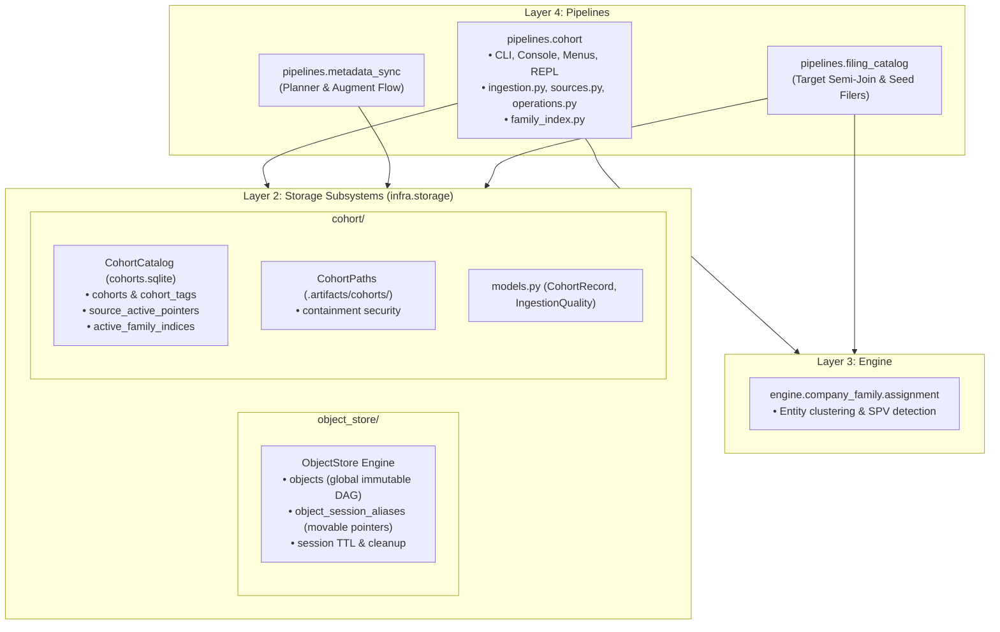

# Cohort Management Subsystem: Architecture Specification

This specification formalizes the transformation of cohorts from ephemeral planning parameters into a **first-class, content-addressed dataset management subsystem**.

---

## 1. Architectural Principles & Layer Boundaries

In strict compliance with `AGENTS.md` (strict downward-only layered architecture, no upward or cross-pipeline imports):

- **Storage & Engine (Layer 2)**:
  - `edgar_sec.infra.storage.object_store`: Generic single-user hierarchical object store for immutable expression DAGs, session aliasing, and lazy TTL lifecycle.
  - `edgar_sec.infra.storage.cohort`: Domain-specific cohort storage, SQLite WAL catalog (`cohorts.sqlite`), path security resolvers (`CohortPaths`), and canonical data models (`models.py`).
  - Stored at `.artifacts/cohorts/` as a sibling to pipeline roots.
- **Pipeline Subsystem (Layer 4)**:
  - `edgar_sec.pipelines.cohort`: Operator CLI commands, interactive console menus, REPL workspace, ingestion workflows, official SEC source lifecycle, set algebra, generic cohort diffing, composable sampling, and family index publication.
- **Downstream Consumers (Layer 4)**:
  - `edgar_sec.pipelines.metadata_sync` (Phase 01) and `edgar_sec.pipelines.filing_catalog` (Phase 02) import downward cleanly from `infra.storage.cohort` (`catalog.py`, `paths.py`, `models.py`).



---

## 2. Specification Directory Structure

To maintain modularity and prevent monolithic document growth, the detailed contracts are partitioned into focused domain specifications:

| Specification Document | Scope & Responsibilities |
|---|---|
| [storage_spec.md](storage_spec.md) | ObjectStore schema, session aliasing, `cohorts.sqlite` catalog schema, canonical Parquet schema, staging `.stage.lease`, and scoped directory pruning. |
| [operations_spec.md](operations_spec.md) | Multi-format ingestion (`ingestion.py`), row quality invariant, official SEC sources lifecycle (`sources.py`), relational set algebra execution & AST compilation (`operations.py`), generic cohort diffing, and deterministic/seeded sampling. |
| [cli_spec.md](cli_spec.md) | Layer 4 package placement (`edgar_sec.pipelines.cohort`), `MenuSeparator` primitive, interactive console pickers, unified CLI grammar, short hash prefix matching ($\ge 7$ chars), and formatted output. |
| [integration_spec.md](integration_spec.md) | Downstream pipeline integrations (`metadata_sync`, `filing_catalog`), fail-closed semantics, empty cohort guarantees, mutual exclusion rules, and legacy migration policy. |
| [followup_plan.md](followup_plan.md) | Authoritative execution specification for manifest removal, generic cohort diffing, Layer 2/4 boundary reconciliation, family-index relocation, and interactive pagination. |
| [plan.md](plan.md) | Four-track implementation milestones (M1–M8), dependency DAG, test fixtures, package README deliverables, and verification checklist. |

---

## 3. High-Level Subsystem Layout

```text
edgar_sec/
├── infra/storage/
│   ├── object_store/                # Generic Object Store (Layer 2)
│   │   ├── __init__.py              # Package docstring only
│   │   ├── schema.py                # SQLite DDL (sessions, objects, aliases)
│   │   ├── store.py                 # ObjectStore engine (WAL mode, alias validation, TTL)
│   │   ├── models.py                # StoredObject, SessionAlias dataclasses
│   │   └── README.md                # Package contract documentation
│   └── cohort/                      # Cohort Storage Engine (Layer 2)
│       ├── __init__.py              # Package docstring only
│       ├── paths.py                 # CohortPaths (.artifacts/cohorts/ layout & traversal security)
│       ├── catalog.py               # SQLite CohortCatalog (WAL mode, cohorts, active pointers)
│       ├── models.py                # CohortRecord, CohortMember, IngestionQuality dataclasses
│       └── README.md                # Package contract documentation
└── pipelines/
    └── cohort/                      # Cohort Pipeline Orchestration (Layer 4)
        ├── __init__.py              # Package docstring only
        ├── cli.py                   # Unified CLI entrypoint (sources, diff, import, list, etc.)
        ├── menu.py                  # Interactive Console & REPL menus (paginated pickers)
        ├── options.py               # Typed CLI argument parser models
        ├── ingestion.py             # Multi-format streaming parser (CSV, TSV, TXT, Parquet)
        ├── sources.py               # SEC Universe & Tickers ingestion directly to ciks.parquet
        ├── operations.py            # DuckDB set algebra, AST compilation, sampling, diffing
        ├── query.py                 # Fast CIK/name search with pagination
        ├── workspace.py             # Session state delegating to ObjectStore
        ├── family_index.py          # Full-universe company family index publication
        └── README.md                # Package contract documentation
```

---

## 4. Key Guarantees & Constraints

1. **Acyclic Downward Imports**: Storage code in Layer 2 has zero imports from Layer 4 (`pipelines`) or Layer 5 (`apps`). Downstream pipelines import downward from Layer 2 `infra.storage.cohort`.
2. **Deterministic Binary Reproducibility**: Parquet datasets enforce strict column schemas, numeric CIK ascending sort, and fixed zstd writer settings.
3. **Fail-Closed Downstream Execution**: If a specified cohort is missing or corrupt in downstream pipelines (`metadata_sync`, `filing_catalog`), planning fails immediately with a nonzero exit code.
4. **Content-Addressed Invariance**: `roster_id` is computed from the sorted CIK text stream, guaranteeing identical sets yield identical IDs regardless of input format or column layout.
5. **Zero Backward-Compatibility Shims**: No legacy wrapper modules or runtime fallback reads against `.artifacts/metadata/cohorts/`.
