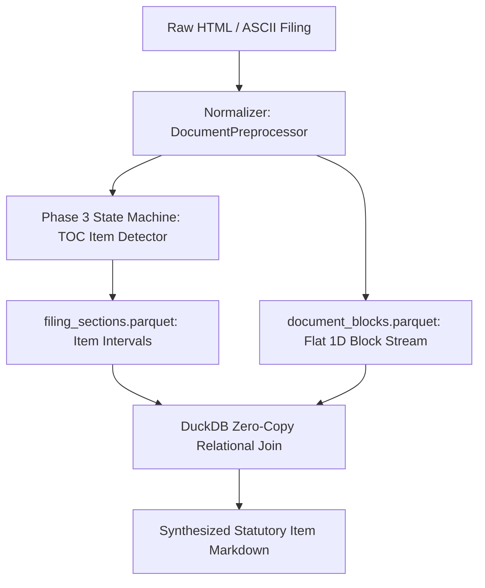
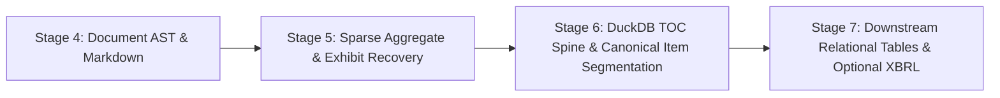
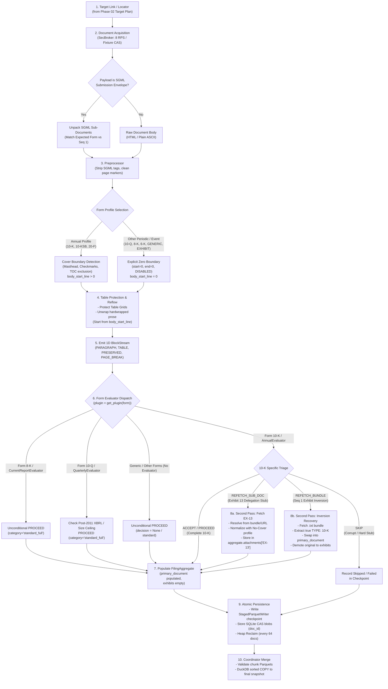
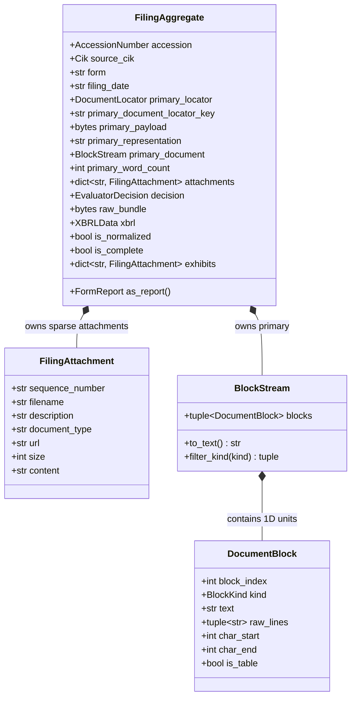

# Architecture & Product Roadmap (v2)

Binding architectural vision and engineering roadmap for the SEC EDGAR analytical warehouse.
This document establishes the forward-looking specifications for downstream engine, domain aggregate,
and analytical capabilities.

---

## 1. Executive Summary & Design Vision

### 1.1 Architectural Layers & Invariants
The codebase operates under a strict **acyclic downward-only layered architecture** enforced mechanically by the `layer-boundary` policy scanner in `check.py`:

```text
Layer 5: apps/            edgar_sec.apps.viewer
                           └── Read-only consumers of published artifacts
Layer 4: pipelines/       edgar_sec.pipelines.{metadata_sync, filing_catalog, document_storage}
                           └── Batch orchestration (Plan, Worker, Merger, Second Pass)
Layer 3: engine/          edgar_sec.engine.{forms, reflow, tables, document}
                           └── Deterministic transformation, normalization, reflow, and triage
Layer 2: infra/           edgar_sec.infra.{sec_http, storage}
                           └── Rate limiting, network transport, DuckDB, Atomic IO, SQLite CAS
Layer 1: domain/          edgar_sec.domain.{identity, document, forms, submissions}
                           └── Primitives (Cik, AccessionNumber), schemas, DTOs, Aggregate roots
Layer 0: foundation/      edgar_sec.foundation.{hashing, regex, serialization, runtime, scanners}
                           └── Zero-dependency utilities, settings registry, resource allocator
```

#### Layer Dependency Rules (Mechanically Enforced)
- **Apps (Layer 5)** may import from: `pipelines`, `engine`, `infra`, `domain`, `foundation`. Nothing below `apps/` may import `apps/`.
- **Pipelines (Layer 4)** may import from: `engine`, `infra`, `domain`, `foundation`. Never `apps`.
- **Engine (Layer 3)** may import from: `infra`, `domain`, `foundation`. Never `pipelines` or `apps`.
- **Infra (Layer 2)** may import from: `domain`, `foundation`. Never `engine`, `pipelines`, or `apps`.
- **Domain (Layer 1)** may import from: `foundation`. Never `infra`, `engine`, `pipelines`, or `apps`.
- **Foundation (Layer 0)** has **zero** internal dependencies on upper layers.

### 1.2 Core Tenets
1. **DuckDB-Native Analytical Warehousing**: Process collections out-of-core via columnar Parquet files; never build monolithic, in-memory representations of entire filings.
2. **Cgroup-Aware Resource Budgeting**: Derive threads, memory limits, and batch sizes from system limits (`derive_resources()`), with active heap reclamation (`reclaim()`). Never size workers from raw CPU count or DuckDB defaults.
3. **Deterministic Immutability & Resumability**: Work units are divided by content-addressed plans, executed in atomic chunks, and merged via sorted COPY.
4. **Zero Backward-Compatibility Shims**: Direct imports from leaf submodules; no barrel re-exports in `__init__.py` and zero deprecated aliases.
5. **Temporal Invariance**: The warehouse supports filings across all three SEC eras (1990–2000 unformatted ASCII, 2001–2010 HTML, and 2011–present iXBRL) using a unified, geometry-first representation.

---

## 2. Domain Models & Data Structures

### 2.1 The Virtual AST & Block Stream (`domain/document/blocks.py`)
Rather than forcing document normalization into constructing a recursive, deeply nested AST (`SectionNode[children=[ParagraphNode, TableNode]]`), `edgar_sec` separates physical block extraction from statutory sectioning.

Normalization emits a **Flat 1D Stream of Typed Blocks** ([blocks.py](../edgar_sec/domain/document/blocks.py)):

```python
from collections.abc import Iterator
from dataclasses import dataclass
from enum import StrEnum

class BlockKind(StrEnum):
    """Semantic block classification for normalized documents."""
    PARAGRAPH = "paragraph"      # Reflowed continuous prose line
    TABLE = "table"              # HTML table tags or untagged ASCII table block
    PRESERVED = "preserved"      # Verbatim text, signatures, preformatted lists
    PAGE_BREAK = "page_break"    # Source or synthetic page boundary marker

@dataclass(frozen=True, slots=True)
class DocumentBlock:
    """One immutable contiguous block of text within a normalized document."""
    block_index: int             # 0-indexed position in document stream
    kind: BlockKind
    text: str                    # Unwrapped prose or preserved table text
    raw_lines: tuple[str, ...]   # Original lines prior to unwrapping
    char_start: int              # Byte/character offset start in normalized text
    char_end: int                # Byte/character offset end in normalized text

    @property
    def is_table(self) -> bool:
        return self.kind == BlockKind.TABLE

@dataclass(frozen=True, slots=True)
class BlockStream:
    """An ordered, immutable sequence of DocumentBlocks representing an entire document."""
    blocks: tuple[DocumentBlock, ...]

    def __len__(self) -> int:
        return len(self.blocks)

    def __iter__(self) -> Iterator[DocumentBlock]:
        return iter(self.blocks)

    def __getitem__(self, index: int) -> DocumentBlock:
        return self.blocks[index]

    def to_text(self) -> str:
        """Materialize full plain-text document."""
        return "\n\n".join(b.text for b in self.blocks if b.text)

    def filter_kind(self, kind: BlockKind) -> tuple[DocumentBlock, ...]:
        return tuple(b for b in self.blocks if b.kind == kind)
```

### 2.2 The Sparse Filing Aggregate (`domain/document/aggregate.py`)
To prevent in-memory bloat while providing rich entity ergonomics, `edgar_sec` uses a **Sparse Aggregate Model** inspired by `edgartools`'s `Filing` and Domain-Driven Design aggregate roots.
Only universal invariants are held in the base root; secondary exhibits and raw submission envelopes remain unpopulated by default.

```python
from dataclasses import dataclass, field
from typing import Optional, Mapping, Any
from edgar_sec.domain.identity import Cik, AccessionNumber
from edgar_sec.domain.document.locator import DocumentLocator
from edgar_sec.domain.document.blocks import BlockStream
from edgar_sec.domain.forms.decisions import EvaluatorDecision

@dataclass(frozen=True, slots=True)
class FilingAttachment:
    """Secondary exhibit or attachment belonging to an SEC filing submission.
    
    Inspired by edgartools's Attachment model: provides metadata upfront
    with lazy acquisition of content on demand.
    """
    sequence_number: str                # Filing sequence order ("1", "2", ...)
    filename: str                       # e.g. "ex-21.htm", "d123456dex101.htm"
    description: str                    # Filer description or standard lookup
    document_type: str                  # e.g. "EX-13", "EX-21", "EX-10.1", "10-K"
    url: str                            # HTTPS SEC archive URL
    size: Optional[int] = None
    content: Optional[str] = None       # Populated lazily if refetched

@dataclass(slots=True)
class FilingAggregate:
    """Universal aggregate root representing one SEC filing submission.
    
    Adheres to the sparse acquisition contract:
    - Primary accession document is acquired by default (~2MB).
    - Secondary exhibits remain empty unless an evaluator triggers delegation.
    - Raw submission bundle is None unless fetched for legacy recovery.
    - xbrl slot remains None unless hydrated via downstream fact marts.
    - SOLE OWNER of filing-level attachments, bundles, and optional XBRL data.
    """
    accession: AccessionNumber
    source_cik: Cik
    form: str
    filing_date: str
    
    primary_locator: DocumentLocator
    primary_document_locator_key: str
    
    # Primary payload & normalization
    primary_payload: Optional[bytes] = None
    primary_representation: str = "raw"
    primary_document: Optional[BlockStream] = None
    primary_word_count: int = 0
    
    # Secondary exhibits & attachments (sparse)
    attachments: dict[str, FilingAttachment] = field(default_factory=dict)
    decision: Optional[EvaluatorDecision] = None
    
    # Archival bundle & extension slots (owned at filing level)
    raw_bundle: Optional[bytes] = None  # Populated only on bundle refetch
    xbrl: Optional[Any] = None          # Unpopulated XBRLData extension slot (0 bytes overhead)

    @property
    def exhibits(self) -> dict[str, FilingAttachment]:
        """Exhibits subset of attachments (document_type starts with 'EX-')."""
        return {k: v for k, v in self.attachments.items() if v.document_type.upper().startswith("EX-")}

    @property
    def is_normalized(self) -> bool:
        return self.primary_document is not None

    @property
    def is_complete(self) -> bool:
        if self.decision is None:
            return self.primary_payload is not None
        if self.decision.is_stub:
            target = self.decision.target_exhibit
            return target is not None and target in self.attachments
        return True

    def as_report(self) -> "FormReport":
        """Polymorphic projection into specialized form report model (inspired by edgartools filing.obj())."""
        from edgar_sec.engine.forms.registry import get_form_plugin
        plugin = get_form_plugin(self.form)
        return plugin.build_report(self)
```

### 2.3 Polymorphic Form Projections (`domain/forms/reports.py`)
Out of roughly 500 distinct SEC form types, only periodic corporate reports (10-K, 10-Q, 20-F, 8-K) contain statutory Items, TOCs, and exhibits. Forms like **Form 4** (Insider Trading XML) or **Form 13F** (Institutional Holdings Table) have **zero sections, zero TOC, and zero narrative items**.
Putting `sections` or form-specific fields directly onto `FilingAggregate` would create dead fields.

#### Ownership Contract: FilingAggregate vs FormReport
- **`FilingAggregate` is the sole owner of all filing submission artifacts**: the primary document, attachments/exhibits collections, SGML envelopes, and optional `xbrl` interactive data packages.
- **`FormReport` is a view/projection over `FilingAggregate`**: it holds `filing: FilingAggregate` and provides form-family specific accessors. It does **not** duplicate `xbrl` or exhibit collections; it accesses them via delegation to `self.filing`.

#### Shared Base: `CompanyReport`
`AnnualReport` (10-K), `QuarterlyReport` (10-Q), and `CurrentReport` (8-K) are all corporate periodic/event reports that share similar structural concepts (Item/Section bookmarks, Item text/markdown extraction, exhibit lookups). They inherit from a common `CompanyReport` base:

```python
from abc import ABC
from dataclasses import dataclass
from typing import Optional, Mapping, Any
from decimal import Decimal
from datetime import date
from edgar_sec.domain.document.aggregate import FilingAggregate, FilingAttachment
from edgar_sec.domain.document.blocks import BlockStream, DocumentBlock, BlockKind

@dataclass
class FormReport(ABC):
    """Abstract base class for all form-family projections."""
    filing: FilingAggregate

    @property
    def xbrl(self) -> Optional[Any]:
        """Delegates XBRL access to the filing aggregate root."""
        return self.filing.xbrl

    @property
    def exhibits(self) -> dict[str, FilingAttachment]:
        """Delegates exhibits access to the filing aggregate root."""
        return self.filing.exhibits

@dataclass
class CompanyReport(FormReport):
    """Base projection for corporate periodic and current reports (10-K, 10-Q, 8-K)."""
    sections: Optional[dict[str, tuple[int, int]]] = None       # Item code -> (start_block, end_block)

    def item(self, item_code: str) -> str:
        """Materialize plain-text for a specific Item via block slice."""
        if not self.sections or item_code not in self.sections:
            raise KeyError(f"Item '{item_code}' not present in filing {self.filing.accession}")
        start, end = self.sections[item_code]
        if not self.filing.primary_document:
            return ""
        blocks = self.filing.primary_document.blocks[start : end + 1]
        return "\n\n".join(b.text for b in blocks if b.text)

@dataclass
class AnnualReport(CompanyReport):
    """Specialized projection for 10-K, 10-KSB, 20-F annual filings (Items 1–16)."""
    disclosures: Optional[dict[str, Any]] = None                # Thematic section cartography (e.g. Risk spans)

@dataclass
class QuarterlyReport(CompanyReport):
    """Specialized projection for 10-Q quarterly filings (Part I Financial Info & Part II Other Info)."""
    pass  # Follows CompanyReport item mechanics; detailed modeling deferred

@dataclass
class CurrentReport(CompanyReport):
    """Specialized projection for 8-K event filings (Numbered event items 1.01, 2.01, etc.)."""
    pass  # Follows CompanyReport item mechanics; detailed modeling deferred

@dataclass
class ReportingOwner:
    cik: str
    name: str
    is_director: bool
    is_officer: bool
    officer_title: Optional[str]

@dataclass
class InsiderOwnershipReport(FormReport):
    """Specialized projection for Form 3, 4, 5 insider equity ownership (XML/DOM)."""
    reporting_owners: list[ReportingOwner]
    non_derivative_transactions: list[dict[str, Any]]
    derivative_transactions: list[dict[str, Any]]

@dataclass
class HoldingPosition:
    cusip: str
    name_of_issuer: str
    title_of_class: str
    value: Decimal
    shares_or_principal: int

@dataclass
class InstitutionalHoldingsReport(FormReport):
    """Specialized projection for Form 13F institutional manager holdings (XML table)."""
    holdings: list[HoldingPosition]
```

> [!IMPORTANT]
> **Boundary: Table Preservation vs. Fact Extraction**
> - **Table Geometry Preservation**: In `edgar_sec`, the table engine exists solely to protect table borders and alignment from being corrupted during prose unwrapping, emitting clean, discrete `TABLE` blocks (`kind == BlockKind.TABLE`).
> - **No Statement Reconstruction in Core Engine**: We do **not** claim or attempt to reconstruct financial statements via geometry-first table parsing across 1990–present.
> - **No Regex Fact Extraction**: Core pipelines do **not** extract financial facts using regex from tables or prose. Semantic financial statement classification, fact extraction, and measurement tuples are downstream analytical tasks that may leverage LLM assistance or specialized domain models.

#### SEC Form Families Catalog
The repository models five distinct form families, with unmodeled forms handled via generic fallback:
1. **Periodic & Current Corporate Filings**: `10-K`, `10-K/A`, `10-Q`, `10-Q/A`, `8-K`, `8-K/A`, `20-F`, `40-F`.
2. **Insider & Beneficial Ownership**: `Form 3`, `Form 4`, `Form 5`, `Schedule 13D`, `Schedule 13G`.
3. **Institutional Holdings**: `Form 13F` (`13F-HR`, `13F-NT`).
4. **Offerings & Registration**: `Form D`, `Form S-1`, `Form S-3`.
5. **Fund Reporting**: `N-PORT`, `N-CEN`.

---

### 2.4 The XBRL Extension Slot & Data Model
In modern filings (post-2011), the SEC provides 6 XML linkbases per submission (`.xsd`, `_lab.xml`, `_pre.xml`, `_cal.xml`, `_def.xml`, and `_htm.xml`).

```python
@dataclass(frozen=True, slots=True)
class XBRLFact:
    """Atomic numeric or narrative XBRL measurement."""
    concept: str                          # e.g. "us-gaap:Revenues"
    value: Decimal | str
    period_start: Optional[date]
    period_end: date
    unit: str
    decimals: Optional[int]
    dimensions: dict[str, str] = field(default_factory=dict)

@dataclass(slots=True)
class XBRLStatement:
    """Logical financial statement classified by standard accounting role."""
    statement_type: str                   # BalanceSheet, IncomeStatement, CashFlow
    role_name: str
    facts: list[XBRLFact]

@dataclass(slots=True)
class XBRLData:
    """Encapsulates parsed XBRL facts and statement hierarchies."""
    statements: dict[str, XBRLStatement]
    all_facts: list[XBRLFact]
```

#### Architectural Rationale: Why XBRL is an Extension Slot rather than Default
1. **Filing-Level Ownership**: `XBRLData` is an optional, filing-level artifact owned by `FilingAggregate.xbrl`. Projections like `AnnualReport` access it via delegation without storing redundant state.
2. **Temporal Invariance**: The SEC only mandated interactive XBRL data in 2011. Pre-2011 filings are text/HTML only. Relying on XBRL for core ingestion creates a severe historical regime break, leaving 1990–2010 filings unparsable.
3. **Decoupling Fact Extraction**: Core storage ingestion focuses on normalized text, clean table blocks, and document integrity. High-level fact extraction is a downstream task (with potential LLM assistance) rather than hardcoded regexes inside ingestion workers.
4. **Memory & Footprint Bounds**: Parsing full XBRL linkbases in Python (`lxml`) consumes 100MB–300MB of RAM per filing, risking OOM kills in high-throughput worker pools.
5. **Zero-Overhead Integration**: XBRL is modeled as an unpopulated extension slot (`xbrl: Optional[XBRLData] = None`) on `FilingAggregate`. When enabled, an independent pipeline writes directly to `xbrl_facts.parquet`, and DuckDB dynamically joins facts by `doc_id` on demand.

---

## 3. Subsystem Blueprints & SPI Protocols

### Blueprint A: The Virtual AST (Flat 1D Blocks + TOC Spine)
The hierarchical document tree is **materialized on demand** by joining flat physical blocks with the TOC index:



#### Zero-Copy DuckDB Projection
Statutory items (e.g. Item 1A Risk Factors) across hundreds of thousands of filings are extracted without parsing JSON ASTs:

```sql
SELECT 
    sec.doc_id,
    sec.item_code,
    b.text
FROM read_parquet('filing_sections.parquet') sec
JOIN read_parquet('document_blocks.parquet') b
  ON b.doc_id = sec.doc_id 

 AND b.block_index BETWEEN sec.start_block_index AND sec.end_block_index
WHERE sec.item_code = '1A';
```

---

### Blueprint B: The `FormPlugin` SPI & Adaptive Scope Evaluator (`engine/forms/`)
Forms register with an inversion-of-control registry. Each plugin owns its structural validation and returns a decision instructing the storage runner what acquisition scope is required.

```python
from enum import Enum
from typing import Protocol, Optional

class DecisionAction(str, Enum):
    ACCEPT = "accept"                     # Primary document satisfies form requirements (98% of cases)
    REFETCH_EXHIBIT = "refetch_exhibit"   # Need targeted exhibits (e.g. EX-13, EX-21 subsidiaries, EX-10)
    REFETCH_BUNDLE = "refetch_bundle"     # Need full SGML bundle (.txt) (archival or Sequence 1 inversion)
    REFETCH_SUMMARY_XML = "refetch_summary_xml"  # Need FilingSummary.xml (statement maps)
    SKIP = "skip"                         # Corrupted, truncated, or unparseable stub

@dataclass(frozen=True, slots=True)
class RefetchDecision:
    action: DecisionAction
    target_exhibit_types: tuple[str, ...] = ()  # e.g. ("EX-13", "EX-21.1")
    target_urls: tuple[str, ...] = ()           # Direct explicit URLs if known
    reason: Optional[str] = None

class FormPlugin(Protocol):
    @property
    def family(self) -> str: ...
    @property
    def aliases(self) -> tuple[str, ...]: ...
    
    def evaluate(self, filing: FilingAggregate) -> RefetchDecision: ...
    def normalize(self, doc: BlockStream) -> BlockStream: ...
    def build_report(self, filing: FilingAggregate) -> FormReport: ...
```

#### Example: Research Pipeline Injecting a Custom Evaluator
Because blobs in `edgar_sec` are content-addressed by `doc_id = sha256(accession + ":" + document_path)`, storing additional exhibits or full bundles requires zero storage schema changes:

```python
from edgar_sec.engine.forms.protocols import FormEvaluator
from edgar_sec.domain.document.aggregate import FilingAggregate
from edgar_sec.engine.forms.decisions import DecisionAction, RefetchDecision

class CorporateGraphEvaluator(FormEvaluator):
    """Custom evaluator fetching Form 10-K primary documents AND Exhibit 21 (Subsidiaries)."""
    def evaluate(self, filing: FilingAggregate) -> RefetchDecision:
        if "EX-21" not in filing.exhibits and "EX-21.1" not in filing.exhibits:
            return RefetchDecision(
                action=DecisionAction.REFETCH_EXHIBIT,
                target_exhibit_types=("EX-21", "EX-21.1"),
                reason="Extracting global corporate ownership graph"
            )
        return RefetchDecision(action=DecisionAction.ACCEPT)
```

---

### Blueprint C: Sequence 1 Exhibit Inversion Recovery
When filers uploaded exhibit attachments before the primary form in pre-2005 EDGAR submissions, the SEC's API erroneously recorded Sequence 1 (`ex231.txt`, `amendedarticles.txt`) as `primaryDocument`.

#### Detection & Recovery Protocol:
1. **Evaluator Detection**: The Form 10-K evaluator detects the absence of the statutory Form 10-K SEC masthead and the presence of exhibit cues (`RE_EXHIBIT_START`).
2. **Refetch Trigger**: The evaluator returns `RefetchDecision(action=REFETCH_BUNDLE, reason="Sequence 1 exhibit inversion detected")`.
3. **Delegation**: The pipeline fetches `<accession>.txt` via the managed rate limiter, unpacks the SGML documents, locates the true primary Form 10-K document (the document with `TYPE: 10-K`), and resumes normalization.

---

### Blueprint D: The No-Cover Reflow Contract
Periodic forms (10-K, 10-Q, 20-F) require cover boundary detection, checkmark inference, and TOC exclusion before prose reflow.
Conversely, **exhibits and event filings (8-K, 6-K, GENERIC) have no cover pages**.

1. **Explicit Zero Boundary**:
   - `cover_boundary.start_line = 0`, `cover_boundary.end_line = 0`, `method = DISABLED`.
   - `body_start_line = 0`.
2. **Reflow Gating**:
   - Documents under no-cover profiles execute `reflow_ascii` starting directly from **line 0**, unwrapping hardwrapped paragraphs across the entire file without searching for non-existent Item headings.

---

### Blueprint E: Progressive Hydration & DuckDB-Native Warehouse Matrix
In Spring Boot, an Entity maps to multiple relational tables joined by `@Id (doc_id)`. In `edgar_sec`, `doc_id = sha256(accession + ":" + document_path)` serves as the immutable foreign key across all downstream Parquet datasets:

| Downstream Layer / Pipeline | Parquet Warehouse Artifact | Populated Aggregate / Report Field |
| :--- | :--- | :--- |
| **Pipeline: `metadata_sync`** | `company_profiles.parquet` | `filing.source_cik`, `filing.metadata` |
| **Pipeline: `filing_catalog`** | `filing_targets.parquet` | `filing.primary_locator`, `filing.identity` |
| **Pipeline: `document_storage`** | `normalized_documents/snapshots/.../parts/*.parquet` | `filing.primary_payload`, `filing.primary_document` (`BlockStream`) |
| **Stage 6: TOC Spine (Phase 3)** | `filing_sections/snapshots/.../sections.parquet` | `annual_report.sections` (`Item 1`, `Item 7`) |
| **Stage 6: Disclosure Cartography** | `filing_cartography/snapshots/.../bookmarks.parquet` | `annual_report.disclosures` (Tariffs, Subsidies) |
| **Stage 7: Analytical Tables** | `table_blocks/snapshots/.../tables.parquet` | Preserved tabular blocks (cell-grain dataset) |
| **Plugin: Form 4 (Insider)** | `insider_transactions/snapshots/.../parts/*.parquet` | `insider_report.non_derivative_transactions` |
| **Plugin: Form 13F (Holdings)** | `institutional_holdings/snapshots/.../parts/*.parquet` | `holdings_report.holdings` |
| **Optional: Standalone XBRL** | `xbrl_facts/snapshots/.../facts.parquet` | `filing.xbrl` (`XBRLData`) |

---

## 4. Track 2 Phased Feature Roadmap



### Stage 4: Document AST & Markdown Generation
- **Objective**: Provide structured, block-level text representations for analytical pipelines and LLM ingestion.
- **Deliverables**:
  - Linear `DocumentBlock` 1D stream emission in normalizer (`domain/document/blocks.py`).
  - Native GFM Markdown renderer converting reflowed paragraphs and protected tables into clean markdown.

### Stage 5: Sparse Aggregate & Multi-Scope Exhibit Recovery
- **Objective**: Formally transition storage pipelines to the `FilingAggregate` root and eliminate Sequence 1 exhibit inversion anomalies.
- **Deliverables**:
  - Implement `FilingAggregate` and `FilingAttachment` in Layer 1 (`edgar_sec/domain/document/aggregate.py`).
  - Integrate exhibit inversion detection in `edgar_sec/engine/forms/plugins/evaluators/annual.py`.
  - Expand `edgar_sec/pipelines/document_storage/delegation.py` to resolve primary forms from `<accession>.txt` bundles.
  - Implement the no-cover reflow gating (`body_start_line = 0`) in `edgar_sec/engine/forms/normalize.py`.

### Stage 6: DuckDB TOC Spine & Canonical Item Segmentation (Phase 3)
- **Objective**: Segment Form 10-K and 10-Q documents into canonical statutory Items without string slicing or coordinate drift.
- **Deliverables**:
  - Deterministic state machine detecting Item boundaries (`Item 1`, `Item 1A`, `Item 7`, `Item 8`).
  - Publish `filing_sections.parquet` storing `(doc_id, item_code, start_block_index, end_block_index)`.

### Stage 7: Downstream Relational Tables & Optional XBRL
- **Objective**: Cross-modal analytical queries joining text blocks, TOC sections, and preserved table cells.
- **Deliverables**:
  - Relational table extraction (cell-grain Parquet dataset).
  - Unpopulated extension slot on `FilingAggregate` for optional `*-xbrl.zip` processing.

# Phase 2.5 Execution Lifecycle & Sparse Aggregate Architecture

Comprehensive specification and operational diagrams for taking an SEC filing link, acquiring, normalizing, triaging, recovering exhibits, populating the `FilingAggregate`, and persisting to Parquet/SQLite.

---

## 1. End-to-End System Flow (From Link to Storage)



---

## 2. Detailed Step-by-Step Lifecycle

### Step 1: Input Specification (Phase 02 Target Link)
Each work unit enters from `filing_targets.parquet`:
- **Identity**: `source_cik`, `accession`, `form`, `filing_date`.
- **Target Location**: `document_path` (e.g. `edgar/data/1018724/000101872420000004/amzn-20191231x10k.htm`).
- **Archive URL**: SEC HTTPS archive URL or local fixture CAS URI.
- **Computed Key**: `document_locator_key = sha256(accession + ":" + document_path)`.

### Step 2: Document Acquisition
- **Production Mode**: Managed Unix-socket `SecBroker` enforcing aggregate 8.0 RPS token bucket across processes with warm-cache probe.
- **Fixture / Offline Mode**: Local SQLite CAS (`fixture.sqlite`) looking up by content-addressed key.
- **Output**: Immutable `raw_bytes`.

### Step 3: Unpacking & Format Triage
- If payload begins with `<SUBMISSION>` or contains `<DOCUMENT>` tags:
  - `unpack_sgml_submission(raw_bytes)` extracts `list[SgmlSubDocument]`.
  - **Form Matching**: Prioritizes matching target form type (`10-K`, `10KSB`, `10-K/A`) rather than naively selecting Sequence 1.
- If payload is raw HTML or plain text:
  - Bypasses unpacking; passes directly to preprocessor.

### Step 4: Preprocessing & Profile Selection
- **Preprocessor**:
  - Strips outer envelope SGML headers.
  - Normalizes ASCII/UTF-8 character encodings.
  - Detects page marker comments (`<PAGE>`, form feeds).
- **Profile Selection**:
  - **Cover Profiles** (`10-K`, `10-KSB`, `20-F`): Runs regex-based cover boundary detector to identify SEC masthead, checkmark grids, and TOC anchors. Sets `body_start_line > 0`.
  - **No-Cover Profiles** (`GENERIC`, `8-K`, `6-K`, `10-Q`, `EXHIBIT`): Cover boundary is explicitly disabled (`start_line=0, end_line=0, method=DISABLED`). Sets `body_start_line = 0`.

### Step 5: Table Protection & Reflow
- **Table Preservation**: Untagged ASCII table borders (columns, spacing) and HTML `<table>` elements are locked into preformatted boundaries.
- **Prose Reflow**:
  - For cover documents: unwraps hardwrapped lines starting *after* `body_start_line`.
  - For no-cover documents: unwraps hardwrapped lines starting directly from **line 0 to EOF**. (Resolves the defect where no-cover forms skipped reflow entirely).
- **Block Stream Emission**: Emits 1D sequence of `DocumentBlock` records (`PARAGRAPH`, `TABLE`, `PRESERVED`, `PAGE_BREAK`).

---

### Step 6: Evaluator Triage Architecture (Generic vs Form-Specific)

Document triage operates through a pluggable SPI dispatch (`plugin = get_plugin(locator.form)`):

#### 6.1 Generic Form & Company Report Evaluation
The default contract across all ~500 SEC forms is lightweight and conservative:
1. **Unmodeled Forms & Fallback (`plugin.evaluator is None`)**:
   - Proceeds unconditionally with `decision = None`. The primary document is stored as-is without stub delegation.
2. **Current Reports (`Form 8-K`, `CurrentReportEvaluator`)**:
   - An 8-K is an event report and has no annual report or Exhibit 13 to delegate to.
   - Evaluator proceeds unconditionally with `DecisionAction.PROCEED`, `category="standard_full"`, `confidence=1.0`.
3. **Quarterly Reports (`Form 10-Q`, `QuarterlyReportEvaluator`)**:
   - Fast paths: Post-2011 XBRL mandate (`post_2011_xbrl_full`) and payload size ceiling checks (`ASCII_SIZE_CEILING = 300_000`, `HTML_SIZE_CEILING = 750_000`).
   - Normal text evaluation proceeds with `DecisionAction.PROCEED`, `category="standard_full"`.

#### 6.2 Specific Form 10-K Annual Evaluator (`AnnualEvaluator`)
The Form 10-K family is uniquely subject to historical delegation stubs and pre-2005 sequence inversions:
1. **Sequence 1 Exhibit Inversion Detection**:
   - Condition: First 3,000 characters match `_RE_EXHIBIT_START` AND lack `_RE_10K_HEADER`.
   - Decision: `REFETCH_BUNDLE` (target: `"10-K"`, category: `"exhibit_primary_inversion"`).
2. **Exhibit 13 Financial Delegation Stub**:
   - Condition: Windowed anchor scan identifies Item 7/8 explicitly incorporating financial statements by reference from Exhibit 13.
   - Decision: `REFETCH_SUB_DOC` (target: `"EX-13"`).
3. **Self-Contained Standard**:
   - Condition: Complete 10-K document (or post-2011 XBRL mandate).
   - Decision: `ACCEPT` (`is_stub = False`, `category = "standard_full"`).

---

### Step 7: Second Pass Delegation Execution (Annual Report Recovery)
- **Case A: Sequence 1 Inversion Recovery (`10-K` only)**:
  1. Pipeline fetches full `<accession>.txt` submission bundle.
  2. Unpacks sub-documents searching specifically for `TYPE: 10-K` (or `10KSB`, `10-K/A`).
  3. Re-runs normalization on the true Form 10-K text $\rightarrow$ assigns to `primary_document`.
  4. Stores the original mislabeled exhibit (e.g. `ex231.txt`) into `attachments["EX-23.1"]`.
- **Case B: Exhibit 13 Financial Delegation (`10-K` only)**:
  1. Resolves Exhibit 13 filename from bundle or filing index.
  2. Normalizes Exhibit 13 under No-Cover profile (`body_start_line = 0`).
  3. Stores normalized Exhibit 13 into `attachments["EX-13"]`.

---

## 3. How `FilingAggregate` is Populated



### Aggregate Population Invariants:
1. **Sparse by Default**:
   - `primary_payload` and `primary_document` (`BlockStream`) are populated during Step 5.
   - `attachments` is an empty dictionary (`{}`) for all forms unless Exhibit 13 delegation or exhibit inversion recovery runs on Form 10-K.
   - `raw_bundle` is `None` unless fetched during recovery; in workers, raw bundle bytes are ephemeral and discarded after sub-document extraction to respect the 512 MiB memory budget.
   - `xbrl` is `None` by default (0 bytes overhead).
2. **Exhibit View**:
   - `filing.exhibits` is a dynamic property filtering `attachments` where `document_type.upper().startswith("EX-")`.
3. **Polymorphic Projections**:
   - Calling `filing.as_report()` inspects `filing.form` and returns the appropriate `CompanyReport` projection (`AnnualReport`, `QuarterlyReport`, `CurrentReport`) without duplicating aggregate state.

---

## 4. Current Phase 2.5 Defaults & Operating Parameters

| Parameter | Current Default Value | Architectural Purpose |
| :--- | :--- | :--- |
| **Worker Concurrency** | Process pool (`ProcessPoolExecutor`) | Eliminates Python GIL bottleneck during CPU-bound text unwrapping and regex parsing. |
| **Worker Budgeting** | `auto_worker_count(512 MiB)` | Cgroup-aware worker sizing via `derive_resources()`. Prevents OOM kills in containers. |
| **Process Recycling** | `max_tasks_per_child = 8` | Recycles worker processes to eliminate glibc arena fragmentation and heap bloat. |
| **Heap Reclamation** | `RECLAIM_INTERVAL = 64` | Calls `reclaim()` (`gc.collect()` + `malloc_trim(0)`) every 64 documents. |
| **SEC Rate Limiting** | `8.0 RPS` (token bucket) | Central Unix-socket limiter preventing IP bans across concurrent workers. |
| **Chunk Sizing** | `1000` filings per chunk | Resumable unit size; smaller chunks for test runs (`100`). |
| **Checkpoint Storage** | `chunk-XXXXX.parquet` | Staged atomic Parquet writer with `.tmp` staging and ID deduplication. |
| **Parquet Compression** | `zstd` (`row_group_size = 128_000`) | High compression ratio with fast columnar scan performance in DuckDB. |
| **Second Pass Delegation** | Single bounded attempt | Max 1 bundle fetch per stub; prevents unbounded retry network stalls. |
| **No-Cover Reflow Gate** | `body_start_line = 0` | Forces prose unwrapping from line 0 to EOF for all non-cover filings/exhibits. |

---

## 5. Sign-Off Checklist & Invariants

- [ ] **Clean Evaluator Boundary**: General company reports (8-K, 10-Q, Generic) proceed directly; only Form 10-K invokes Exhibit 13 delegation and Sequence 1 inversion detection.
- [ ] **Sparse Acquisition Guarantee**: Default execution acquires only the primary document (~2MB). Monolithic bundles (50MB–200MB) are fetched strictly as fallback recovery for 10-K inversions or stubs.
- [ ] **No-Cover Reflow Contract**: Documents under no-cover profiles unwrap paragraphs from line 0 without searching for non-existent Item headings.
- [ ] **Sibling Inversion Swap**: When Sequence 1 is an exhibit, the true primary form is restored as `primary_document`, and the exhibit is preserved in `attachments`.
- [ ] **Ownership Separation**: `FilingAggregate` is the sole owner of submission artifacts (`attachments`, `xbrl`, `raw_bundle`); `FormReport` is a lightweight view with zero duplicate storage fields.
- [ ] **Parquet Contract Preservation**: Existing Parquet schemas and DuckDB analytical query compatibility remain 100% intact.
