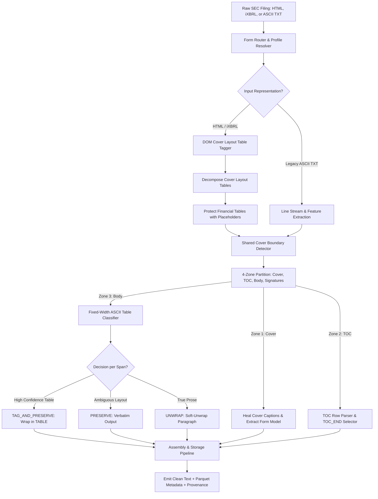

# SEC Filing Normalization & Processing Pipeline: Architectural Plan & Empirical Foundation

---

## 1. Executive Summary & Core Mission

The SEC EDGAR archive spans over 30 years (1993–present) across three distinct filing eras:
1. **Legacy Plain ASCII / SGML (1993–2005)**: Hard-wrapped at 80 columns with monospace space-padded financial tables.
2. **Early / Modern HTML (2000–present)**: HTML tables used both for true tabular data and for multi-column cover-page layout positioning.
3. **iXBRL / Inline XBRL (2018–present)**: HTML with embedded financial taxonomy tags (`ix:nonFraction`, `ix:continuation`).

The mission of the **Phase 2.5 Processing System** (`phases/025_webpage_storage/`) is to transform raw, messy EDGAR submissions into **clean, normalized, searchable, and structured text** for downstream research and LLM/regex extraction (Phase 3/4), without destroying table layouts or losing data.

---

## 2. The Governing Invariants & Asymmetric Safety

Every decision in the pipeline follows one governing invariant:

> **"Missing a prose unwrap is merely an inconvenience; unwrapping or flattening a financial table corrupts scientific data."**

- Financial statements, balance sheets, executive compensation grids, and signature blocks must remain **fixed-width, space-aligned, and intact**.
- Only unambiguous narrative prose paragraphs are eligible for soft-unwrap and reflow.
- When ambiguous, the system **preserves source layout exactly** and leaves it untagged.
- The pipeline never requires or emits artificial synthetic markers into final published canonical text.

---

## 3. The 4-Zone Document Topology

A periodic SEC filing (10-K, 10-Q, 20-F) contains four distinct physical zones:

```text
┌──────────────────────────────────────────────────────────────────────────┐
│ 1. COVER PAGE ZONE                                                       │
│    - Starts: COVER_START (SEC banner, Form title, Registrant name)       │
│    - Contains: Checkbox grids, 12(b) tables, Float/Shares (Annual only)  │
│    - Ends: COVER_END (before Table of Contents or Body Root)             │
├──────────────────────────────────────────────────────────────────────────┤
│ 2. TABLE OF CONTENTS (TOC) ZONE (Optional)                               │
│    - Starts: "Table of Contents" or dense dot-leader item index          │
│    - Contains: Dense list of Part/Item names with trailing page numbers  │
│    - Ends: TOC_END (before the actual narrative body)                    │
├──────────────────────────────────────────────────────────────────────────┤
│ 3. SUBSTANTIVE BODY ZONE                                                 │
│    - Starts: BODY_START (First non-TOC structural Item, e.g., Item 1)   │
│    - Contains: Narrative prose, financial statements, footnote tables   │
│    - Processing: ASCII table protection, prose reflow, entity extraction │
├──────────────────────────────────────────────────────────────────────────┤
│ 4. CLOSING / SIGNATURES & EXHIBITS ZONE                                  │
│    - Starts: "SIGNATURES" / "Item 15/16 Exhibits"                        │
│    - Contains: Officer signatures, exhibit index, certifications (302/906)│
└──────────────────────────────────────────────────────────────────────────┘
```

---

## 4. Empirical Feature Store & Probe Dataset Inventory

The pipeline algorithms are calibrated against a comprehensive multi-million-row feature store generated in `.artifacts/scratch/`:

```text
.artifacts/scratch/
  ├── table_lines.parquet                 # 32.2 MB | 4,372,035 rows | 27 line-level geometric & lexical features
  ├── table_flagged_lines.parquet         # 1.7 MB  | 49,087 rows    | Fast-audit table-positive candidate lines
  ├── table_paragraphs.parquet           # 958 KB  | 37,758 rows    | Paragraph-level aggregate statistics
  ├── table_regions.parquet              # 54.8 KB | 3,723 rows     | Connected multi-paragraph table region verdicts
  ├── table_span_context.parquet         # 118.8 KB| 1,931 rows     | Table boundary lead-in context & blank lines
  ├── table_vocab.parquet                # 159.4 KB| 20,571 words   | Vocabulary distribution: table vs prose frequency
  ├── table_docs.parquet                 # 9.6 KB  | 521 documents  | Document-level modal width, lines, chars
  ├── txt_content_anchors.parquet        # 42.8 KB | 521 documents  | Document-level recommended anchor lines
  ├── txt_content_anchor_events.parquet  # 3.6 MB  | 127,606 events | Structural anchor event logs across filings
  ├── item_sequence_events.parquet       # 220 KB  | Event traces   | Part/Item transition sequence events
  └── item_sequence_summary.parquet      # 38.9 KB | Summary stats  | Part/Item transition probability summary
```

---

## 5. Line & Paragraph Feature Engineering (`table_lines` & `table_paragraphs`)

To separate fixed-width ASCII tables from narrative prose with zero data corruption, the pipeline computes 27 geometric and lexical features per line:

### A. Core Line-Level Features (from 4.37M line corpus)

| Feature Name | Type | Definition & Discriminative Value |
| :--- | :--- | :--- |
| `width` | `int16` | Total line character width. |
| `width_rel` | `float` | Line width relative to the document's modal line width (tables often extend past modal prose width). |
| `density` | `float` | Non-whitespace character count / total line length. |
| `n_gaps` | `int16` | Count of multi-space whitespace gutters ($\ge 2$ spaces). Critical multi-column indicator. |
| `gap_starts` | `string` | Space-delimited string of column start offsets (e.g. `"24 42 60"`). Used to check column alignment across lines. |
| `n_num` | `int16` | Count of discrete numeric tokens on the line. |
| `num_starts` | `string` | Column offsets where numeric values begin. |
| `n_numcells` | `int16` | Count of numeric cells aligned inside detected whitespace gutters. |
| `cell_num_starts` | `string` | Coordinates of gutter-aligned numeric cells. |
| `sep_frac` | `float` | Fraction of line composed of separator characters (`-`, `=`, `_`). |
| `n_sep_runs` | `int16` | Count of contiguous separator underline runs (e.g. `------   ------`). |
| `is_full_sep` | `bool` | True if line is a full-width divider row. |
| `has_dotleader` | `bool` | True if line contains dot-leader series (`. . . . . .`). |
| `leading_ws` | `int16` | Leading whitespace indentation offset. |
| `upper_frac` | `float` | Fraction of alphabetic characters that are uppercase. |
| `aligned_prev` | `bool` | True if gap or number start coordinates match the preceding line within $\pm 1$ column. |
| `p_table` | `float` | Logistic model probability that the line belongs to a fixed-width table. |
| `prosefn_rate` | `float` | Sentence-level punctuation and prose word density. |

### B. Paragraph-Level Aggregate Features (from 37.7K paragraph corpus)

Double-newline blocks aggregate line features to prevent single-line noise from breaking table regions:
- `modal_gap_support`: Count of lines sharing the paragraph's modal whitespace column coordinates.
- `modal_num_support`: Count of lines sharing modal numeric column coordinates.
- `gap_line_frac`: Proportion of lines containing $\ge 2$ whitespace gutters.
- `numcell_line_frac`: Proportion of lines containing gutter-aligned numbers.
- `width_std`: Standard deviation of line widths within the paragraph.
- `ends_period` / `ends_colon`: Paragraph punctuation termination indicators.

---

## 6. Empirical Corpus Measurements & Probe Findings

### A. Cover Start & Anchor Prevalence (521 TXT Corpus Probe)

| Signal / Anchor | Prevalence in Corpus | Role in Architecture |
| :--- | :---: | :--- |
| **Generic `FORM ...` Line** | **100.0%** (521/521) | **Tier 1 Identity Anchor** (Defines `COVER_START` cluster) |
| **SEC Banner** (`SECURITIES AND EXCHANGE COMMISSION`) | **99.8%** (520/521) | **Tier 1 Identity Anchor** |
| **Registrant Name** | **99.8%** (520/521) | **Tier 1 Identity Anchor** |
| **`Indicate by check mark`** | **97.1%** (506/521) | Supporting Cover Shape Signal |
| **Commission File Number** | **85.0%** (443/521) | Supporting Cover Shape Signal |
| **Aggregate Market Value (Public Float)** | **83.1%** (433/521) | Annual-Only Cover Shape Signal |
| **Accelerated Filer Checkbox** | **57.6%** (300/521) | Supporting Signal (**Cannot be sole start anchor**) |
| **Shares Outstanding Note** | **37.6%** (196/521) | Annual-Only Supporting Signal |
| **Explicit `<PAGE>` Markers** | **85.2%** (444/521) | Page Boundary Span Signal |

### B. Bidirectional Boundary & Transition Results

- **73.3%** of filings contained `documents incorporated by reference`.
- **38.6%** had an explicit `TABLE OF CONTENTS` header.
- **72.7%** received an accurate forward boundary from the incorporated-reference detector.
- **97.7%** had at least one semantic body anchor (MD&A, risk factors, forward-looking statements).
- **18 Filings Uncovered Adversarial Same-Line Continuations**:
  - `Part III hereof.`
  - `Part III- Portions of the Proxy Statement for the...`
  - `Part III of this Form 10-K to the extent stated herein.`
  - **Rule Established**: A `PART`/`ITEM` line followed by lowercase prose on the same line is **continuation prose**, not a structural section heading.
- **58 Filings Contained Multi-Reference Lines**:
  - `Parts I, II, and III` or `Items 10, 11, 12, and 13`.
  - **Rule Established**: Multi-reference lines inside incorporated-reference text are internal prose lists, rejected as section boundaries.

### C. Structural vs. TOC Sequence Distance Metrics

| Sequence Type | Median Next-Item Distance | Median Prose Lines Before Next Item |
| :--- | :---: | :---: |
| **TOC Sequence (Untagged/Tagged)** | **1–2 lines** | **0 lines** |
| **Substantive Body Sequence** | **~400 lines** | **~285 lines** |

- Combining strict item sequences with PART sequence and non-strict fallbacks yielded a validated body anchor in **98.7% of filings**.

### D. Cover Prefix vs. Body N-Gram Contrast Probe (515 Filings)

| Term or N-Gram | Present in Cover Prefix | Present in Body | Body-Only Filings | Classification Role |
| :--- | :---: | :---: | :---: | :--- |
| `collective bargaining` | **0** | **132** | 132 | **High-Confidence Tier 3 Body Anchor** |
| `labor union` | **0** | **53** | 53 | **High-Confidence Tier 3 Body Anchor** |
| `market segments` | **0** | **31** | 31 | **High-Confidence Tier 3 Body Anchor** |
| `worldwide` | 2 | 180 | 180 | Strong Body Anchor |
| `employees` | 9 | 431 | 424 | Strong Body Anchor |
| `customers` | 10 | 373 | 365 | Strong Body Anchor |
| `suppliers` | 5 | 195 | 192 | Strong Body Anchor |
| `facilities` | 11 | 365 | 362 | Strong Body Anchor |
| `competition` | 22 | 385 | 367 | Strong Body Anchor |
| `forward looking` | 17 | 93 | 89 | Supporting Tier 2 Anchor (Occurs in some TOCs) |
| `safe harbor` | 15 | 119 | 115 | Supporting Tier 2 Anchor (Occurs in some TOCs) |
| `not applicable` | 86 | 342 | 268 | **Weak / Form-Like (Rejected as body anchor)** |
| `omitted` | 7 | 348 | 344 | **Weak / Form-Like (Rejected as body anchor)** |

### E. Forward-Looking Statements Distance Probe

- Forward-looking text appeared in **73.4%** (378/515) of filings.
- In **35.7%** of filings (135/378), safe harbor statements occurred $>500$ lines deep in Part I, establishing that it cannot serve as an early stopping anchor.

### F. Double-Newline Paragraph Bag-of-Words (BoW) Probe

- Tested double-newline paragraph units following the first non-TOC `ITEM 1`:
  - **Score 2 (Clear Body-Like)**: **91.5%** (440/481 filings)
  - **Score 1 (Ambiguous)**: **1.5%** (7/481 filings)
  - **Score 0 (Cover/Form-Like)**: **7.1%** (34/481 filings)
- Recurring introductory body predicates: `provides`, `operates`, `manufactures`, `sells`, `develops`, `distributes`, `manages`.
- Recurring forward-looking predicates: `may`, `will`, `could`, `believes`, `expects`, `intends`.

### G. Cover-Start and Boundary Contracts

The cover detector is capability-gated by the resolved form-family profile. It
does not activate merely because arbitrary text contains `registrant`, `form`,
or `incorporated`.

```text
CoverProfile
  -> boundary capability or disabled
  -> representation support
  -> cover-label/table policy
  -> healing/evidence policy
```

The shared boundary result distinguishes four regions:

```text
COVER_START
    -> beginning of the connected cover-shaped identity/field cluster
COVER_END
    -> end of cover-specific processing
TOC_END
    -> end of dense TOC processing, when present
BODY_START
    -> beginning of substantive body prose/table processing
```

`COVER_START` requires one generic identity signal plus one independent cover
shape signal in the first page or bounded opening window:

```text
identity: FORM ..., SEC banner, registrant
shape: COVER_LABELS cluster, commission file number,
       Indicate by check mark, aggregate market value,
       accelerated filer, or shares outstanding
```

`accelerated filer` and `shares outstanding` are supporting signals, not
universal start anchors. `COVER_LABELS` is the shared source for cover-field
vocabulary; the detector must not duplicate those labels in form-specific
regexes.

`COVER_END` is selected by a bounded forward scan from the cover cluster and,
when necessary, a bounded backward confirmation from the first reliable body
root or substantive introductory paragraph. A full reverse scan for the last
`PART II` is an offline/fallback diagnostic only.

### H. Incorporated-Reference Resolution

Only profiles that enable the optional incorporated-reference capability inspect
that phrase. The phrase identifies a possible continuation block, not an
immediate end:

```text
cover fields
    -> incorporated-reference prose/table
    -> complete logical continuation unit
    -> next TOC or validated body root
    -> COVER_END immediately before that root
```

The detector handles prose and tables in both representations:

```text
ASCII:
    double newline = paragraph boundary
    single newline = artificial wrap
    connected aligned rows = table unit

HTML:
    paragraph/list item/cell/table = semantic unit
    hidden metadata = ignored
```

Embedded references do not end the block:

```text
Parts I, II, and III
Items 10, 11, 12, and 13
Part I, Item 1 and Part II, Items 5-8
```

A PART/ITEM candidate is rejected as a transition when it has multiple
references, contains same-line continuation text such as `Part III hereof.`,
is followed by lowercase non-bullet prose, or remains inside the same logical
paragraph/list/table unit. A left-stripped and right-trimmed single heading such
as `PART I`, `PART I.`, or `ITEM 1. BUSINESS` requires following TOC/body
sequence evidence before acceptance.

### I. Page-Marker Span Detection

Page markers are detected by a dedicated span-producing function rather than a
single boundary regex. Initial forms include:

```text
-1-
Page 1
1 of 125
<PAGE>
<PAGE> 1
```

`F-1`-style markers require contextual opt-in because they can be SEC form
identifiers. Page spans provide positional evidence and source offsets; they do
not independently define `COVER_END`.

### J. Non-Mutating Healing View

Boundary and body detection use a logical analysis view without mutating the
canonical source:

```text
original source
    -> exact output and source spans

analysis view
    -> join ASCII soft wraps within paragraphs
    -> preserve double-newline boundaries
    -> preserve table/list/HTML semantic units
    -> run phrase, heading, BoW, and body-anchor detection
    -> map decisions back to original offsets
```

This view allows split incorporated-reference phrases and introductory prose to
be analyzed as complete units while preserving financial tables and ambiguous
layout verbatim.

### K. Shared Bag-of-Words Body Confirmation

BoW is a shared scorer, not a per-form implementation. Profiles supply evidence
packs containing body terms, verbs, n-grams, cover/form exclusions, stopwords,
and weights.

```text
score_unit(logical_unit, context, profile_evidence_pack)
    -> score: 0 | 1 | 2
    -> class: cover_like | ambiguous | body_like
    -> confidence, matched features, novelty features, source span, reason
```

Score semantics are stable:

```text
2 = clear body-like prose after structural guards
1 = ambiguous; continue searching
0 = cover/form/TOC/table-like or unusable for body confirmation
```

The common caller skips headings, `Omitted`, `Not Applicable`, bullets, tables,
and signatures before scoring substantive double-newline paragraphs. Document-
local vocabulary absent from the cover/reference prefix can strengthen the
score, while terms such as `omitted` and `not applicable` remain weak because
they occur in both form and body contexts.

Annual, quarterly, offering, and future profiles reuse the same scorer and
caller. They change only their evidence packs, such as:

```text
annual:    business, operations, subsidiaries, market segments
quarterly: quarter, period, operating update, results
offering:  prospectus, proceeds, subscription, selling shareholders
```

Forward-looking/safe-harbor language is a later confirmation, not a required
early stop: it appears in roughly 73% of relevant filings and can occur more
than 500 lines after the body anchor.

---

## 7. End-to-End Pipeline Execution Flow



---

## 8. Detailed Decision Engine Specifications

### A. The 3-Action Span Decision Model

| Action | Meaning | Criteria |
| :--- | :--- | :--- |
| **`UNWRAP`** | Soft-unwraps hard-wrapped prose lines into single fluid paragraphs. | $\ge 2$ content lines, modal width compatible, high alphabetic density, no numeric columns, no table gutters. |
| **`PRESERVE`** | Preserved **100% verbatim**; no tags added. | Ambiguous layout, justified double spaces, signature blocks (`/s/`, `By:`), short form rows, item captions. |
| **`TAG_AND_PRESERVE`** | Preserved verbatim inside standard `<TABLE>...</TABLE>` tags. | High-confidence fixed-width table: repeated multi-column whitespace gutters (`modal_gap_support` $\ge 2$), repeated numeric column alignments (`modal_num_support` $\ge 2$), or dash/equal grid borders. |

### B. Indented Bullets & List Preservation Rule

Indented prose lists are **not** table layouts:
```text
Source (80-col wrap):
    (a) The company manufactures widgets and sells them
        throughout the United States and Canada.

Normalized:
    (a) The company manufactures widgets and sells them throughout the United States and Canada.
```
- **Rule**: Retains base marker and indentation (`(a)`, `(1)`, `•`, `*`, `1.`), but joins indented continuation lines into a single fluid paragraph.

### C. Signature & Officer Blocks Rule

Blocks containing combinations of:
- `/s/`, `By:`, `Signature:`, `Name:`, `Title:`, `Date:`
- Multiple short, highly indented lines without numeric data
- **Action**: Always marked `PRESERVE` (never unwrapped, never tagged as table).

### D. Table Bridging Rule (`table_regions.parquet`)

- Single or double blank lines inside a connected ASCII financial table **must not** split the table span.
- When column alignment coordinates (`gap_starts`, `num_starts`) match across blank lines, the region is unified into a single `<TABLE>` block.

---

## 9. Case Matrix & Failure Mode Handling

| Case / Scenario | Expected Handling | Primary Evidence Recorded |
| :--- | :--- | :--- |
| **Existing Tagged Financial Table** | Preserve exact; protect with placeholder | Tagged HTML `<TABLE>` span |
| **Untagged Dotted TOC** | Preserve exact; identify `TOC_END` | Dense Item sequence + dot leaders + page suffixes |
| **TOC Followed by Repeated `ITEM 1`** | `BODY_START` at repeated Item 1 | Previous TOC sequence + substantive prose following Item 1 |
| **No TOC, Clean `PART I / ITEM 1` Sequence** | `BODY_START` at Item 1 | `PART I` followed by `ITEM 1` and prose distance |
| **Same-Line Continuation (`Part III hereof.`)** | Reject as heading; keep in cover | Lowercase prose following heading token |
| **Multi-Reference Line (`Parts I and II`)** | Reject as heading; keep in cover | Multiple Part/Item references on a single line |
| **Cover Spills onto Pages 2 & 3** | Delay boundary search | Page marker analysis + continued cover layout |
| **`ITEM 1` in an Exhibit or Footnote** | Reject as `BODY_START` | Located after `SIGNATURES` / exhibit index, no Part I |
| **Signature Block** | `PRESERVE` (Verbatim, no tags) | `/s/`, `By:`, `Title:`, short-line sequence |
| **Indented Bullet List** | `UNWRAP` (Preserve marker & indent) | Bullet prefix (`(a)`, `(1)`, `•`) + continuation prose |
| **Justified Prose with Double Spaces** | `PRESERVE` / `UNWRAP` | Absence of repeated column alignment coordinates |
| **Malformed Open `<TABLE>` Tag** | Protect through document EOF | Table restoration diagnostic error |

---

## 10. Subsystem Ownership & Codebase Organization

```text
defs/
  sec_forms/                 # Form taxonomies, universal vocabulary, and cover evidence
    forms/
      annual/                # 10-K & 20-F: taxonomy, float/shares/incorporated vocabulary, healing rules
      quarterly/             # 10-Q: taxonomy, comparison evidence
      current_report/        # 8-K & 6-K: dotted Item taxonomy
      profiles.py            # Composed cover profiles
    cover/                   # Cover boundary detector, cluster start, backward body confirmation
  tables/                    # Table AST, HTML templates, TOC detectors, ASCII table classifiers
    classifiers/             # Fast layout rules, numeric density, whitespace gutter analysis
    toc_parser.py            # Unified TOC sequence and dot-leader parser
  text/                      # Soft-wrap joining, date healing, whitespace normalization
phases/
  025_webpage_storage/       # Pipeline orchestration, DOM preprocessing, parquet storage emission
```

---

## 11. Production Promotion Criteria for Research Rules

No heuristic or classifier from `phases/025_webpage_storage/scratch/untagged_reflow/` graduates to production `defs/` or `phases/025_webpage_storage/` until it satisfies:

1. **Isolated Unit Test**: Dedicated unit tests covering normal and adversarial edge cases.
2. **Case-Matrix Fixture**: Reproducible fixture from the 521-file historical corpus.
3. **Auditable Decision Trace**: Emits named evidence and confidence scores (never black-box).
4. **Zero Data Corruption (IoU & Recall)**: 100% recall on table preservation with zero flattened financial tables.
5. **Document-Level Holdouts**: Validated across chronological holdout sets (never line-level random splits).
6. **Precedence Invariant**: Form-specific rules isolated to `defs/sec_forms/forms/<form>/`; generic engine remains 100% form-neutral.
