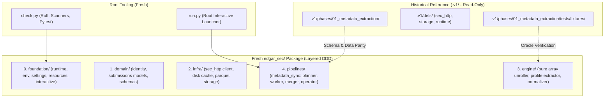
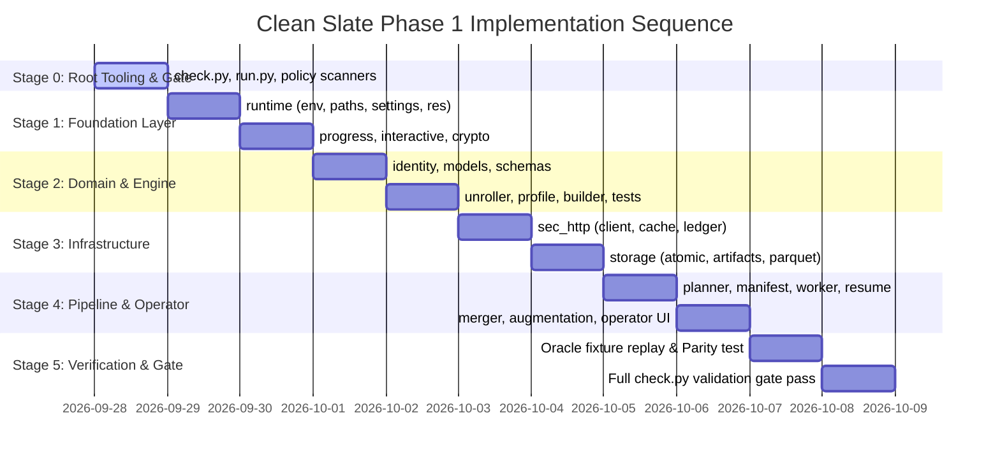

# Plan: Phase 1 Clean Slate Implementation (`edgar_sec.pipelines.metadata_sync`)

> [!NOTE]
> **Status:** Active Execution Plan for the Clean Slate v2 Branch  
> **Repository Context:** All legacy v1 code (`defs/`, `phases/`, legacy `run.py`, and `check.py`) has been moved to `.v1/` as a read-only historical specification. The repository root is a 100% clean workspace. We are constructing the production v2 architecture from the ground up without legacy shims or technical debt.

---

## 1. Executive Strategy: True Clean Slate

With the legacy codebase archived under `.v1/`, we are liberated from backward-compatibility constraints. We do not need shims, facade bridges, or dual-running adapters.



### Clean Slate Invariants
1. **Zero Legacy Technical Debt**: No JSONL chunk backends, no 700-line `paths.py` god-classes, no fake unifications.
2. **Strict Acyclic Downward Layers**: CI-enforced dependency flow:
   `pipelines` &rarr; `engine` &rarr; `infra` &rarr; `domain` &rarr; `foundation`.
3. **Preserved Operator Ergonomics**: Root `python run.py` provides an immediate interactive menu wizard—no copying or pasting verbose CLI flags to run partitions.
4. **Automated Quality Gate**: Root `python check.py` validates ruff formatting, ruff lint, 14 policy scanners, and test suites.
5. **Bit-for-Bit Schema & Data Parity**: Uses `.v1` golden fixtures (`recent_submissions.json`, `historical_submissions.json`, `mismatched_arrays.json`) to guarantee 100% data parity.

---

## 2. Complete Inventory of Components to Create

Because the root workspace is clean, the implementation encompasses **Root Tooling**, the **`edgar_sec` Package Layers**, and the **Test Harness**.

```text
edgar-sec/ (v2 Root)
│
├── check.py                              # [ROOT TOOLING] Quality gate: ruff format, lint, policy scanners, pytest
├── run.py                                # [ROOT TOOLING] Interactive launcher menu and CLI dispatcher
├── ruff.toml                             # [CONFIG] Linter and formatter rules
├── .env                                  # [CONFIG] Local environment variables (SEC User-Agent contact)
│
├── edgar_sec/                            # [CORE PACKAGE]
│   ├── __init__.py                       # Package root (exposes __version__)
│   │
│   ├── foundation/                       # [LAYER 0: Zero SEC Domain Knowledge]
│   │   ├── __init__.py
│   │   ├── crypto.py                     # Canonical SHA-256 file and string fingerprinting
│   │   ├── checks.py                     # Repository policy scanner engine (integrated into check.py)
│   │   └── runtime/
│   │       ├── __init__.py
│   │       ├── env.py                    # Secure .env / environment loader (no direct os.environ leaks)
│   │       ├── settings.py               # Typed settings resolution (SEC contact, timeouts, concurrency)
│   │       ├── paths.py                  # Scoped root layout (artifacts_root, cache_root)
│   │       ├── resources.py              # Hardware concurrency derived from CPU/RAM (derive_resources)
│   │       ├── partitions.py             # Partition ID parsing (1-3,5) & worker distribution
│   │       ├── progress.py               # tqdm progress adapters & logging redirects
│   │       └── interactive.py            # Generic terminal prompt and interactive menu runner
│   │
│   ├── domain/                           # [LAYER 1: Pure Leaf Models & Invariants]
│   │   ├── __init__.py
│   │   ├── identity.py                   # Cik, AccessionNumber (immutable validated value objects)
│   │   └── submissions/
│   │       ├── __init__.py
│   │       ├── models.py                 # EntityProfile, FilingRecord, SubmissionsAggregate
│   │       └── schemas.py                # Explicit PyArrow Schema (v1.0.0 matching canonical output)
│   │
│   ├── infra/                            # [LAYER 2: Concrete External Adapters]
│   │   ├── __init__.py
│   │   ├── sec_http/
│   │   │   ├── __init__.py
│   │   │   ├── client.py                 # Thread-safe SEC HTTP transport (4 RPS token bucket, UA headers)
│   │   │   ├── cache.py                  # Local disk response cache with TTL
│   │   │   └── ledger.py                 # Failure / retry ledger (recording 404s, 429 backoff)
│   │   └── storage/
│   │       ├── __init__.py
│   │       ├── atomic.py                 # Atomic JSON read/write & canonical JSON serialization
│   │       ├── artifacts.py              # Current snapshot pointer management (current/)
│   │       └── parquet.py                # Immutable PyArrow chunk writer & atomic dataset publisher
│   │
│   ├── engine/                           # [LAYER 3: Pure Transformation Logic - Zero Network/IO]
│   │   ├── __init__.py
│   │   └── submissions/
│   │       ├── __init__.py
│   │       ├── builder.py                # PyArrow Table assembler from unrolled records
│   │       ├── unroller.py               # Columnar parallel array unroller & chronological sorter
│   │       ├── profile.py                # Entity profile extractor (SIC, tickers, addresses)
│   │       └── helpers.py                # Type coercion, date parsing, null normalization
│   │
│   └── pipelines/                        # [LAYER 4: Multi-Threaded Batch Orchestration]
│       ├── __init__.py
│       └── metadata_sync/
│           ├── __init__.py
│           ├── paths.py                  # Scoped metadata pipeline directory layout
│           ├── manifest.py               # CIK CSV ingestion (uploads/cik-sec.csv) & validation
│           ├── planner.py                # Deterministic chunk and partition assignment
│           ├── worker.py                 # Thread pool worker fetching SEC submissions & writing chunks
│           ├── checkpoints.py            # Chunk-level resumability and attempt manifests
│           ├── augmentation.py           # Delta planning against baseline snapshots
│           ├── source_registry.py        # SEC source discovery (company_tickers.json)
│           ├── merger.py                 # Partition & canonical dataset validator and publisher
│           ├── operator.py               # Interactive terminal wizard (connecting callbacks to interactive)
│           └── cli.py                    # Unified CLI: {plan, preview, run, status, merge, interactive}
│
└── tests/                                # [UNIFIED TEST SUITE]
    ├── conftest.py                       # Global pytest fixtures and offline isolation
    ├── fixtures/                         # Canonical test fixtures (from .v1 oracle sets)
    │   ├── cik_sec_mini.csv
    │   ├── recent_submissions.json
    │   ├── historical_submissions.json
    │   └── mismatched_arrays.json
    ├── foundation/                       # Unit tests for runtime, env, crypto, settings
    ├── domain/                           # Unit tests for CIK, models, schema validation
    ├── engine/                           # Unit tests for array unroller, profile extractor, normalizer
    ├── infra/                            # Unit tests for HTTP transport, cache, parquet storage
    └── pipelines/                        # End-to-end pipeline integration & parity tests
```

---

## 3. Detailed Component Specifications

### 3.1. Root Tooling (`check.py` and `run.py`)

#### `check.py` (The Quality Gate)
- Replaces legacy `.v1/check.py`.
- Integrates `ruff format --check`, `ruff check`, policy scanners, and `pytest`.
- Supports `--fix` (auto-format and safe fixes) and `--scan` (policy scanners only).
- Enforces downward-only layer boundary checks.

#### `run.py` (The Root Interactive Launcher)
- Replaces legacy `.v1/run.py`.
- When invoked with no arguments (`python run.py`), it renders a clean terminal menu:
  ```text
  EDGAR SEC Pipeline Launcher (v2)
    1. Metadata Sync (Phase 01) - Interactive wizard
    0. Exit
  ```
- Selecting `1` delegates immediately to `edgar_sec.pipelines.metadata_sync.operator`.
- When passed CLI flags (`python run.py metadata plan --input uploads/cik-sec.csv`), it forwards directly to `edgar_sec.pipelines.metadata_sync.cli`.

---

### 3.2. Foundation Layer (`edgar_sec/foundation/`)

- **`runtime/env.py`**:
  - Implements `get_env(key, default=None)` and loads `.env` securely.
  - Guarantees zero `os.environ` leaks across the entire codebase, satisfying the `environment-access` policy scanner.
- **`runtime/settings.py`**:
  - Typed dataclass configuration (`SecSettings`, `RuntimeSettings`) resolving user-agent contact, SEC timeouts, rate limits, and artifacts directories.
- **`runtime/paths.py`**:
  - Minimal root paths resolver (`artifacts_root`, `cache_root`). Never attempts to predict phase-internal directory structures.
- **`runtime/resources.py`**:
  - `derive_resources()` dynamically detects system CPU cores and RAM to compute safe worker pool concurrency limits.
- **`runtime/partitions.py`**:
  - `parse_id_selection(spec)` parses ranges like `1-5,7`.
  - `divide_ids_among_workers(ids, worker_count)` partitions work items evenly across threads.
- **`runtime/progress.py`**:
  - `make_tqdm_callback` formats progress bars with throughput (records/sec) and accurate ETAs.
  - `logging_redirect_tqdm()` prevents standard logging from corrupting progress bars.
- **`runtime/interactive.py`**:
  - Generic interactive loop supporting options, input prompting, and partition execution callbacks.
- **`crypto.py`**:
  - `file_sha256(path)` and `canonical_hash(data)` for plan hashing and data integrity checks.
- **`checks.py`**:
  - Contains the core policy scanners (environment-access, sql-boundary, storage-boundary, secrets-leakage, clean-exit, file-length, regex-alternations).

---

### 3.3. Domain Layer (`edgar_sec/domain/`)

- **`identity.py`**:
  - `Cik`: Immutable, 10-digit zero-padded or numeric CIK value object.
  - `AccessionNumber`: Formatted SEC accession number (`0000320193-23-000106`).
- **`submissions/models.py`**:
  - `EntityProfile`: Frozen dataclass capturing firm metadata (name, SIC, tickers, exchanges, former names, addresses).
  - `FilingRecord`: Frozen dataclass capturing individual filing event observations.
  - `SubmissionsAggregate`: Complete aggregate root for an SEC entity.
- **`submissions/schemas.py`**:
  - `SUBMISSION_METADATA_SCHEMA_V1`: Explicit PyArrow Schema matching the production canonical schema bit-for-bit (55+ typed columns).

---

### 3.4. Infrastructure Layer (`edgar_sec/infra/`)

- **`sec_http/client.py`**:
  - Thread-safe HTTP client with token bucket rate limiter enforcing SEC 4 RPS (under 10 RPS limit).
  - Proper SEC User-Agent header formatting (`Sample Company Name AdminContact@domain.com`).
- **`sec_http/cache.py`**:
  - Local disk cache saving raw submissions JSON payloads with configurable TTL.
- **`sec_http/ledger.py`**:
  - Tracks non-retryable 404s and handles 429 backoff with exponential retry.
- **`storage/atomic.py`**:
  - `atomic_write_json`, `load_json`, and `canonical_json` for deterministic manifest serialization.
- **`storage/artifacts.py`**:
  - Snapshot pointer management (`manifests/metadata/snapshots/current/`) and version incrementing.
- **`storage/parquet.py`**:
  - Immutable PyArrow chunk writer and multi-chunk dataset merger.

---

### 3.5. Engine Layer (`edgar_sec/engine/submissions/`)

- **Strict Invariant**: Zero network, zero file I/O, 100% deterministic pure functions.
- **`unroller.py`**:
  - Unrolls columnar SEC JSON arrays (`accessionNumber`, `filingDate`, `reportDate`, `form`, etc.).
  - Handles mismatched array lengths and schema variations based on `mismatched_arrays.json`.
  - Sorts combined filings chronologically descending (`filingDate` DESC, `acceptanceDateTime` DESC).
- **`profile.py`**:
  - Extracts and normalizes firm profile data, mapping SIC codes, ticker lists, and address structures.
- **`builder.py`**:
  - Merges profile data with unrolled filings into a validated PyArrow `RecordBatch` / `Table` adhering to `SUBMISSION_METADATA_SCHEMA_V1`.

---

### 3.6. Pipeline Layer (`edgar_sec/pipelines/metadata_sync/`)

- **`manifest.py`**:
  - Validates `uploads/cik-sec.csv`, cleans CIKs, deduplicates, and generates input fingerprint.
- **`planner.py`**:
  - Slices CIKs into deterministic partitions (e.g. 5,000 CIKs) and chunks (e.g. 100 CIKs).
  - Emits immutable `plan.json`.
- **`worker.py`**:
  - Multi-threaded worker pool (`ThreadPoolExecutor`) acquiring SEC JSONs via `infra.sec_http`, normalizer via `engine.submissions`, and writing chunk Parquets.
- **`checkpoints.py`**:
  - Atomic chunk checkpointing allowing immediate resumption upon interruption.
- **`merger.py`**:
  - Validates all chunks in a partition, computes row counts and CIK coverage, publishes partition Parquet, and merges into the final canonical dataset.
- **`augmentation.py`**:
  - Delta planning: compares new CIK list against current snapshot, schedules delta chunks only, and merges with existing metadata.
- **`operator.py`**:
  - The interactive terminal wizard connecting to `edgar_sec.foundation.runtime.interactive`.
- **`cli.py`**:
  - Canonical CLI providing `plan`, `preview`, `run`, `status`, `merge`, `merge-partition`, and `interactive`.

---

## 4. Step-by-Step Implementation Sequence



### Milestone 0: Root Tooling & Policy Scanners
- [ ] Create `check.py` at workspace root (running ruff format, ruff lint, policy scanners, pytest).
- [ ] Create `run.py` at workspace root (launcher dispatcher).
- [ ] Create `edgar_sec/foundation/checks.py` (porting all 14 policy scanners into clean foundation).

### Milestone 1: Foundation Primitives
- [ ] Create `edgar_sec/foundation/runtime/env.py` (`get_env` securely reading `.env`).
- [ ] Create `edgar_sec/foundation/runtime/settings.py` (typed settings).
- [ ] Create `edgar_sec/foundation/runtime/paths.py` (base paths).
- [ ] Create `edgar_sec/foundation/runtime/resources.py` (`derive_resources`).
- [ ] Create `edgar_sec/foundation/runtime/partitions.py` (`parse_id_selection`, `divide_ids_among_workers`).
- [ ] Create `edgar_sec/foundation/runtime/progress.py` (`make_tqdm_callback`, `logging_redirect_tqdm`).
- [ ] Create `edgar_sec/foundation/runtime/interactive.py` (`run_interactive`, options menu).
- [ ] Create `edgar_sec/foundation/crypto.py` (`file_sha256`, `canonical_hash`).
- [ ] Create `tests/foundation/test_runtime.py`.

### Milestone 2: Domain Leaf Models & Schemas
- [ ] Create `edgar_sec/domain/identity.py` (`Cik`, `AccessionNumber`).
- [ ] Create `edgar_sec/domain/submissions/models.py` (`EntityProfile`, `FilingRecord`).
- [ ] Create `edgar_sec/domain/submissions/schemas.py` (`SUBMISSION_METADATA_SCHEMA_V1`).
- [ ] Create `tests/domain/test_identity.py` and `test_schemas.py`.

### Milestone 3: Engine Submissions Normalizer
- [ ] Copy oracle fixtures from `.v1/phases/01_metadata_extraction/tests/fixtures/` to `tests/fixtures/`.
- [ ] Create `edgar_sec/engine/submissions/unroller.py`.
- [ ] Create `edgar_sec/engine/submissions/profile.py`.
- [ ] Create `edgar_sec/engine/submissions/helpers.py`.
- [ ] Create `edgar_sec/engine/submissions/builder.py`.
- [ ] Create `tests/engine/test_normalizer.py` verifying against `recent_submissions.json`, `historical_submissions.json`, and `mismatched_arrays.json`.

### Milestone 4: Infrastructure & SEC Transport
- [ ] Create `edgar_sec/infra/sec_http/client.py` (thread-safe 4 RPS transport).
- [ ] Create `edgar_sec/infra/sec_http/cache.py` (disk cache).
- [ ] Create `edgar_sec/infra/sec_http/ledger.py` (`FailureLedger`).
- [ ] Create `edgar_sec/infra/storage/atomic.py` (`atomic_write_json`, `load_json`).
- [ ] Create `edgar_sec/infra/storage/artifacts.py` (`get_current_snapshot_pointer`, pointer updates).
- [ ] Create `edgar_sec/infra/storage/parquet.py` (chunk writer & dataset publisher).
- [ ] Create `tests/infra/test_sec_http.py` and `test_storage.py`.

### Milestone 5: Pipeline & Interactive Operator
- [ ] Create `edgar_sec/pipelines/metadata_sync/paths.py`.
- [ ] Create `edgar_sec/pipelines/metadata_sync/manifest.py`.
- [ ] Create `edgar_sec/pipelines/metadata_sync/planner.py`.
- [ ] Create `edgar_sec/pipelines/metadata_sync/worker.py`.
- [ ] Create `edgar_sec/pipelines/metadata_sync/checkpoints.py`.
- [ ] Create `edgar_sec/pipelines/metadata_sync/merger.py`.
- [ ] Create `edgar_sec/pipelines/metadata_sync/augmentation.py`.
- [ ] Create `edgar_sec/pipelines/metadata_sync/source_registry.py`.
- [ ] Create `edgar_sec/pipelines/metadata_sync/operator.py`.
- [ ] Create `edgar_sec/pipelines/metadata_sync/cli.py`.
- [ ] Connect `run.py` to `metadata_sync.operator`.

### Milestone 6: Verification, Oracle Parity & End-to-End Gate
- [ ] Run `python run.py` and execute interactive `Preview` on `cik_sec_mini.csv`.
- [ ] Execute `python check.py --fix` and `python check.py`.
- [ ] Verify 100% clean pass across all 14 policy scanners.
- [ ] Verify 100% bit-for-bit schema and data parity against `.v1` reference output.

---

## 5. Verification & Parity Gate

| Check | Requirement | Verification Method |
| :--- | :--- | :--- |
| **Clean Scanners** | All 14 repository policy scanners pass cleanly | `python check.py --scan` |
| **Acyclic Imports** | Downward-only imports enforced (`pipelines` &rarr; `engine` &rarr; `infra` &rarr; `domain` &rarr; `foundation`) | AST Layer Scanner in `check.py` |
| **Schema Identity** | Parquet schema exactly matches canonical Schema v1.0.0 | `assert new_schema.equals(old_schema)` |
| **Deterministic Data** | Processing `cik_sec_mini.csv` produces identical values to `.v1` output | PyArrow table equality assertion |
| **Interactive Mode** | Can launch via `python run.py` and navigate numeric prompts | Interactive smoke test |
| **Zero Live Network in Tests** | Unit & pipeline test suites run offline | Recorded fixture mocks in `conftest.py` |
