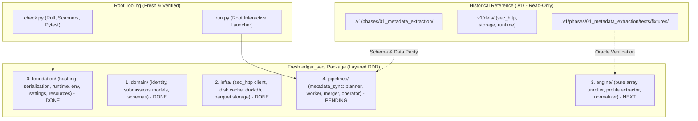

# Plan: Phase 1 Clean Slate Implementation (`edgar_sec.pipelines.metadata_sync`)

> [!NOTE]
> **Status:** Phase 1 feature-complete, with documented scope reductions
> **Progress:** Milestones 0, 1, 2, 3, 4, 5, 6, and 6.1 implemented and passing
> all quality gates. Every `metadata_sync` source module now has a mirrored test
> file. A parity audit against the v1 reference found four v1 capabilities that
> are **deliberately not carried forward** and one that was **missing and has
> been restored**; they are enumerated in §10 rather than being implied by the
> "complete" label.
> **Repository Context:** All legacy v1 code has been moved to `.v1/` as a read-only historical specification. The repository root is a 100% clean workspace. We are constructing the production v2 architecture from the ground up without legacy shims or technical debt.

---

## 1. Executive Strategy: True Clean Slate & Core Invariants

With the legacy codebase archived under `.v1/`, we are liberated from backward-compatibility constraints. We do not maintain shims, facade bridges, or dual-running adapters.



### Architectural & Non-Regression Invariants (Enforced in AGENTS.md)
1. **Strict Downward-Only Layer Boundaries**:
   - `pipelines (L4)` &rarr; `engine (L3)` &rarr; `infra (L2)` &rarr; `domain (L1)` &rarr; `foundation (L0)`.
   - No upward imports, no circular dependencies. Automatically verified by the AST `layer-boundary` scanner.
2. **Zero Backward-Compatibility Shims & Zero Barrel Re-Exports**:
   - Never create legacy alias shims, forwarding functions, or compatibility facades.
   - Package `__init__.py` files must **never** re-export child module symbols. Callers must import from the canonical leaf module directly (e.g., `from edgar_sec.domain.identity import Cik`, `from edgar_sec.infra.storage.duckdb import connect`).
   - This prevents premature loading of heavy C-extensions (DuckDB, PyArrow) and guarantees explicit symbol ownership.
3. **Cgroup & Heap Memory Non-Regression**:
   - Concurrency is calculated dynamically via `derive_resources()` using cgroups v1/v2, `/proc/meminfo`, and psutil.
   - Heap reclamation (`malloc_trim(0)` + `gc.collect()`) runs at batch intervals via `reclaim()`.
   - DuckDB connections are hardened with strict thread limits, memory limits, and temp directories.
4. **Decoupled Quality Gate**:
   - `python check.py --fix` only auto-formats and applies safe lint fixes (< 0.5s; does NOT run tests).
   - `python check.py --fast` runs static checks in ~1s (formatting, linter, policy scanners; skips tests).
   - `python check.py` runs the full verification suite (formatting, linter, dynamic scanners, and pytest).

---

## 2. Component Inventory & Implementation Status

```text
edgar-sec/ (v2 Root)
│
├── check.py                              # [DONE] Quality gate: ruff format, lint, dynamic scanners, pytest
├── run.py                                # [DONE] Interactive launcher menu and CLI dispatcher
├── ruff.toml                             # [DONE] Linter and formatter configuration
│
├── edgar_sec/                            # [CORE PACKAGE]
│   ├── __init__.py                       # [DONE] Root package metadata
│   │
│   ├── foundation/                       # [LAYER 0: Zero SEC Domain Knowledge - 100% COMPLETE]
│   │   ├── __init__.py                   # [DONE] Package docstring (no barrel re-exports)
│   │   ├── checks.py                     # [DONE] Policy scanner runner iterating ALL_SCANNERS
│   │   ├── hashing.py                    # [DONE] file_sha256 (64KB chunks), sha256_bytes
│   │   ├── serialization.py              # [DONE] canonical_json (sorted keys, compact), canonical_hash
│   │   ├── scanners/                     # [DONE] Modular policy scanners (env, paths, secrets, clean_exit, length, layers, resources)
│   │   └── runtime/
│   │       ├── __init__.py               # [DONE] Package docstring (no barrel re-exports)
│   │       ├── env.py                    # [DONE] Zero-leak environment & .env loader (get_env, get_env_int, etc.)
│   │       ├── paths.py                  # [DONE] ProjectPaths (artifacts_root, cache_root), resolve_paths
│   │       ├── resources.py              # [DONE] cgroup v1/v2, /proc/meminfo, derive_resources, auto_worker_count
│   │       ├── memory.py                 # [DONE] reclaim (malloc_trim + gc), sha256_text (1MB streaming view)
│   │       ├── partitions.py             # [DONE] parse_id_selection, divide_ids_among_workers
│   │       ├── progress.py               # [DONE] make_tqdm_callback, make_merge_progress_callback
│   │       ├── interactive.py            # [DONE] prompt_choice, prompt_text, run_interactive_menu
│   │       └── settings/                 # [DONE] Modular spec providers: sec.py, paths.py, runtime.py, __init__.py
│   │
│   ├── domain/                           # [LAYER 1: Pure Leaf Models & Invariants - 100% COMPLETE]
│   │   ├── __init__.py                   # [DONE] Package docstring (no barrel re-exports)
│   │   ├── identity.py                   # [DONE] Cik (10-digit zero padded), AccessionNumber (NNNNNNNNNN-YY-NNNNNN)
│   │   └── submissions/
│   │       ├── __init__.py               # [DONE] Package docstring (no barrel re-exports)
│   │       ├── models.py                 # [DONE] EntityProfile, FilingRecord, SubmissionsAggregate
│   │       └── schemas.py                # [DONE] Canonical SUBMISSION_METADATA_SCHEMA (v1.0.0, 16 top-level cols)
│   │
│   ├── infra/                            # [LAYER 2: Concrete External Adapters - 100% COMPLETE]
│   │   ├── __init__.py                   # [DONE] Package docstring (no barrel re-exports)
│   │   ├── sec_http/
│   │   │   ├── __init__.py               # [DONE] Package docstring (no barrel re-exports)
│   │   │   ├── client.py                 # [DONE] Thread-safe SecHttpClient (adaptive pacing, caching, headers)
│   │   │   ├── cache.py                  # [DONE] SQLite WAL zstd SqlCache with TTL and embedded FailureLedger
│   │   │   ├── rate_limit.py             # [DONE] Adaptive token bucket rate limiter (8.0 RPS, throttle backoff)
│   │   │   ├── retry.py                  # [DONE] Exponential retry policy with jitter
│   │   │   ├── errors.py                 # [DONE] PermanentHttpError, RetryExhausted, ResponseTooLargeError
│   │   │   └── metrics.py                # [DONE] HttpMetrics counters
│   │   └── storage/
│   │       ├── __init__.py               # [DONE] Package docstring (no barrel re-exports)
│   │       ├── atomic.py                 # [DONE] atomic_write_bytes, atomic_write_text, atomic_write_json
│   │       ├── duckdb.py                 # [DONE] Hardened connect(), concat_to_parquet, null/key validation
│   │       └── parquet.py                # [DONE] write_parquet_table (zstd, 128k row group), count_parquet_rows
│   │
│   ├── engine/                           # [LAYER 3: Submissions Normalizer - NEXT TO IMPLEMENT]
│   │   ├── __init__.py                   # Package docstring
│   │   └── submissions/
│   │       ├── __init__.py               # Package docstring
│   │       ├── helpers.py                # Date parsing (YYYY-MM-DD), type coercion, null normalization
│   │       ├── profile.py                # Firm identity, addresses, former names extraction
│   │       ├── unroller.py               # Parallel arrays unroller, chronological sorting, accession deduplication
│   │       ├── builder.py                # PyArrow Table assembler matching SUBMISSION_METADATA_SCHEMA
│   │       └── normalizer.py             # Master normalize_submission pure functional entry point
│   │
│   └── pipelines/                        # [LAYER 4: Multi-Threaded Batch Orchestration - PENDING]
│       ├── __init__.py                   # Package docstring
│       └── metadata_sync/
│           ├── __init__.py               # Package docstring
│           ├── paths.py                  # Scoped metadata pipeline directory layout (.artifacts/metadata/...)
│           ├── manifest.py               # CIK CSV ingestion & input SHA-256 fingerprinting
│           ├── planner.py                # Deterministic chunk (1000 CIK) & partition planning (plan.json)
│           ├── checkpoints.py            # Atomic chunk checkpoint verification & discovery
│           ├── worker.py                 # Resumable multi-threaded worker fetching submissions & writing chunk Parquets
│           ├── merger.py                 # DuckDB coordinator merge: out-of-core sorted concat_to_parquet
│           ├── augmentation.py           # Delta planning against base snapshots
│           ├── source_registry.py        # SEC listing source discovery
│           ├── operator.py               # Interactive terminal wizard
│           └── cli.py                    # Unified CLI command surface
│
└── tests/                                # [UNIFIED TEST SUITE]
    ├── fixtures/                         # [DONE] Canonical test fixtures from .v1 oracle sets
    │   ├── cik_sec_mini.csv              # [DONE] 10 golden test CIKs
    │   ├── recent_submissions.json       # [DONE] Reference company submission payload
    │   ├── historical_submissions.json   # [DONE] Reference historical submission payload
    │   └── mismatched_arrays.json        # [DONE] Edge-case ragged/mismatched columnar arrays
    ├── foundation/                       # [DONE] Unit tests for runtime, env, memory, hashing, settings
    ├── domain/                           # [DONE] Unit tests for CIK, models, schema validation
    ├── infra/                            # [DONE] Unit tests for HTTP transport, cache, DuckDB, Parquet storage
    ├── engine/                           # [PENDING] Unit tests for engine submissions normalizer
    └── pipelines/                        # [PENDING] End-to-end pipeline integration & parity tests
```

---

## 3. Specifications for Remaining Components

### 3.1. Layer 3 Engine: Submissions Normalizer (`edgar_sec/engine/submissions/`)

**Contract**: 100% pure computation. Zero disk I/O, zero network calls, zero stateful side-effects.

#### 1. Constants & Base URLs (`helpers.py`)
- `SEC_ARCHIVE_BASE = "https://www.sec.gov/Archives/edgar/data"`
- `SEC_SUBMISSIONS_BASE = "https://data.sec.gov/submissions"`
- `ACCESSION_RE = re.compile(r"^\d{10}-\d{2}-\d{6}$")`

#### 2. Helpers Surface (`helpers.py`)
- `add_anomaly(anomalies: list[dict], code: str, detail: str, source: str = "") -> None`: Standard anomaly recorder appending `{"code": code, "detail": detail, "source": source}`.
- `resolve_alias(payload: dict, aliases: list[str]) -> tuple[str | None, Any | None, bool, list[dict]]`:
  - Case-insensitive search over `payload.keys()`.
  - Canonical key selection.
  - Conflict detection: if multiple alias forms exist with differing values, emits `alias_conflict` anomaly.
- `accession_normalized(raw: str | None) -> str | None`: Strips hyphens, validates 18 digits. Returns `None` if invalid.
- `build_archive_url(cik_padded: str, accession_raw: str | None, primary_document: str | None) -> tuple[str | None, str | None]`:
  - Formats: `{SEC_ARCHIVE_BASE}/{int(cik_padded)}/{accession_normalized}/{primary_doc}`.
  - Returns `(url, fallback_reason)`. If primary doc is missing or stub (`.txt`, `0001.htm`), returns reason (`primary_document_missing`, `primary_document_stub:{doc}`).
- `normalize_items(value: Any) -> list[str]`:
  - If `None`: returns `[]`.
  - If `list`: returns `[str(x) for x in value]`.
  - If `str`: comma-splits and strips whitespace (handling historical filing item formats).
- `to_bool(value: Any) -> bool | None`: Handles `1/0`, `"true"/"false"`, `"1"/"0"`. Preserves `None`.
- `to_int(value: Any) -> int | None`: Parses numeric values, handling strings safely. Returns `None` if invalid.
- `normalize_cik_padded(raw: Any) -> str`: Normalizes raw CIK to 10-digit zero-padded string.

#### 3. Firm Profile & Structural Normalization (`profile.py`)
- `PROFILE_KEYS`: All 23 top-level SEC submission profile keys (`cik`, `entityType`, `sic`, `sicDescription`, `ownerOrg`, `name`, `tickers`, `exchanges`, `ein`, `lei`, `description`, `website`, `investorWebsite`, `category`, `fiscalYearEnd`, `stateOfIncorporation`, `stateOfIncorporationDescription`, `phone`, `flags`, `formerNames`, `addresses`, `filings`, etc.).
- `ADDRESS_KEYS`: `street1`, `street2`, `city`, `stateOrCountry`, `zipCode`, `stateOrCountryDescription`, `country`, `countryCode`, `foreignStateTerritory`, `isForeignLocation`.
- `address_field(raw_key: str) -> str`: Maps camelCase address keys to snake_case.
- `normalize_address(value: Any, anomalies: list[dict], source: str) -> dict | None`:
  - Missing address key (`None`) &rarr; returns `None`.
  - Empty dict `{}` &rarr; returns all-null dict (preserves "supplied but empty" vs "not supplied").
  - Maps keys via `address_field()`; coerces `is_foreign_location` with `to_bool`.
  - Unrecognized keys are recorded under `unknown_address_keys` anomaly and omitted from the struct.
- `zip_listings(tickers: Any, exchanges: Any, anomalies: list[dict]) -> list[dict]`:
  - Zips by index. Length mismatch pads shorter side with `None` and records `listings_length_mismatch`.
- `normalize_former_names(value: Any, anomalies: list[dict]) -> list[dict]`:
  - Handles SEC 3-element lists `[name, from, to]` and dicts `{"name": ..., "from": ..., "to": ...}`.

#### 4. Columnar Array Unrolling & Oracle Invariants (`filings.py`)
- `FILING_ARRAY_KEYS`: 16 parallel column names (`accessionNumber`, `filingDate`, `reportDate`, `acceptanceDateTime`, `act`, `form`, `fileNumber`, `filmNumber`, `items`, `core_type`, `size`, `isXBRL`, `isInlineXBRL`, `isXBRLNumeric`, `primaryDocument`, `primaryDocDescription`).
- **Ragged Array Rule**: `row_count = max(lengths.values()) if lengths else 0`. Missing or shorter arrays pad with `None`; **never truncate**. Records `filing_array_length_mismatch`.
- **Preserve Source Order (No Invented Sorting)**: Filings preserve exact input order: `recent` filings first (index 0..N), followed by `historical` files in order. Never sort by filingDate.
- **First-Occurrence-Wins Dedup**:
  - Deduplicate on `accession_number_normalized`.
  - First occurrence wins. If subsequent duplicate has conflicting core metadata (`form`, `filing_date`, `report_date`, `primary_document`), record `accession_conflict` anomaly.
- `normalize_submission_files(files: Any, anomalies: list[dict]) -> list[dict]`: Normalizes historical file descriptors (`name`, `FilingCount`, `FilingFrom`, `FilingTo`).

#### 5. Row Assembly & Schema Conformance (`builder.py`)
- `normalize_submissions(...) -> dict[str, Any]`:
  ```python
  def normalize_submissions(
      payload: dict,
      *,
      cik_padded: str,
      input_name: str,
      snapshot_id: str,
      fetched_at: str,
      source_url: str,
      byte_count: int,
      historical_payloads: list[tuple[str, str, dict | None]],
      historical_errors: list[str],
      response_sha256: str = "",
  ) -> dict[str, Any]:
  ```
  - Populates all **28 canonical schema fields** matching `SUBMISSION_METADATA_SCHEMA`:
    1. `cik` (str)
    2. `snapshot_id` (str)
    3. `fetched_at` (str)
    4. `source_url` (str)
    5. `response_sha256` (str)
    6. `byte_count` (int)
    7. `schema_version` (str: "1.0.0")
    8. `status` (str: "ok" | "partial" | "failed")
    9. `error` (str | None)
    10. `anomalies` (list[dict])
    11. `extra_fields` (canonical JSON str | None)
    12. `identity` (struct: name, former_names)
    13. `classification` (struct: entity_type, sic_code, sic_description, owner_org, filer_category)
    14. `identifiers` (struct: ein, lei)
    15. `contact` (struct: phone, website, investor_website, description)
    16. `incorporation` (struct: state, state_description)
    17. `reporting` (struct: fiscal_year_end)
    18. `insider_transactions` (struct: owner_exists, issuer_exists)
    19. `addresses` (struct: mailing, business)
    20. `listings` (list of struct: ticker, exchange)
    21. `filings` (list of filing structs, 21 fields)
    22. `submission_files` (list of struct: name, filing_count, filing_from, filing_to)
    23. `input_name` (str)
    24. `input_fingerprint` (str)
    25. `chunk_id` (int | None)
    26. `historical_files_total` (int)
    27. `historical_files_failed` (int)
    28. `historical_records_total` (int)
  - Empty string values in `website`, `description`, `investor_website` are preserved as `""`, not converted to `None`.
  - Missing `filings.recent` yields `status="ok"` with 0 filings and a `recent_missing` anomaly (not `partial` or `failed`).
  - Terminal statuses:
    - `"ok"`: payload parsed without terminal historical errors.
    - `"partial"`: historical errors occurred but at least one filing record was extracted.
    - `"failed"`: unparseable top-level payload or zero filings extracted with errors.
- `validate_row_shapes(row: dict) -> None`: Validates row types against `SUBMISSION_METADATA_SCHEMA`.
- `build_submission_table(rows: list[dict[str, Any]]) -> pa.Table`: Converts normalized row dicts into an Arrow Table conforming strictly to `SUBMISSION_METADATA_SCHEMA`.

---

### 3.2. Layer 4 Pipelines: Metadata Sync (`edgar_sec/pipelines/metadata_sync/`)

**Chunking Invariant**: The default Phase 1 chunk size is **1,000 CIKs**, sourced directly from `edgar_sec.foundation.runtime.settings.runtime.DEFAULT_CHUNK_SIZE`. Mini-runs and test suites override `chunk_size` via CLI or options (e.g. `chunk_size = 2` or `10` for `cik_sec_mini.csv`).

1. **`paths.py`**:
   - Pipeline directory structure:
     - Plan: `.artifacts/metadata/plans/{plan_id}/plan.json`
     - Transient checkpoints: `.artifacts/transient/metadata/{plan_id}/chunk_{chunk_id:04d}.parquet`
     - Snapshot publishing: `.artifacts/metadata/snapshots/{snapshot_id}/metadata.parquet`
     - Current pointer: `.artifacts/metadata/snapshots/current/`

2. **`manifest.py`**:
   - Reads input CSV (default `uploads/cik-sec.csv` or user specified `tests/fixtures/cik_sec_mini.csv`).
   - Normalizes CIKs to 10-digit zero-padded strings.
   - Computes deterministic input SHA-256 fingerprint.

3. **`planner.py`**:
   - Partitions CIK list into fixed-size chunks (`options.chunk_size`, defaulting to 1,000 CIKs).
   - Generates deterministic `plan.json` recording schema version, timestamp, total CIK count, chunk count, and chunk boundaries.

4. **`checkpoints.py`**:
   - Discovers completed chunk Parquet files (`chunk_{chunk_id:04d}.parquet`).
   - Validates row counts and schema compliance. Enables instant restart after interruption without re-fetching completed chunks.

5. **`worker.py`**:
   - Worker execution loop:
     - Takes a chunk of CIKs.
     - For each CIK: checks `SqlCache` or requests via `SecHttpClient`.
     - Calls `normalize_submissions` in `engine`.
     - Accumulates row dicts, calls `build_submission_table`, and writes an atomic chunk Parquet file via `write_parquet_table`.
     - Calls `reclaim()` at regular intervals to return glibc arena memory to the OS.

6. **`merger.py`**:
   - Coordinator merge using DuckDB:
     - Scans all chunk checkpoints.
     - Validates zero missing CIKs, zero null primary keys, and no duplicate accessions.
     - Uses `concat_to_parquet` with `ORDER BY cik` for out-of-core sorted final dataset creation.
     - Emits `metadata.manifest.json` with record count, chunk count, and SHA-256 digests.

7. **`augmentation.py`**:
   - Delta planner: Given a new CIK list or source, compares against the current published snapshot.
   - Schedules work only for new or updated CIKs.
   - Merges delta Parquet into a new published snapshot.

8. **`operator.py` & `cli.py`**:
   - Interactive wizard supporting:
     1. Plan generation
     2. Status & resume inspect
     3. Run partition / all chunks
     4. Merge completed chunks into snapshot
     5. Augment existing snapshot
   - CLI commands matching all wizard actions.
   - Root `run.py` delegates directly to `operator.py`.

---

## 4. Execution Sequence & Checklists

### Milestone 0: Root Tooling & Policy Scanners
- [x] Create `check.py` at workspace root (decoupled `--fix`, `--fast`, `--scan`, `--test`, full gate).
- [x] Create `run.py` at workspace root (launcher dispatcher).
- [x] Create `edgar_sec/foundation/checks.py` and modular scanner registry (`ALL_SCANNERS`).
- [x] Create `AGENTS.md` and `README.md` defining strict v2 contracts.

### Milestone 1: Foundation Primitives (Layer 0)
- [x] Create `edgar_sec/foundation/hashing.py` and `serialization.py`.
- [x] Create `edgar_sec/foundation/runtime/env.py` (zero `os.environ` leaks).
- [x] Create `edgar_sec/foundation/runtime/paths.py` (base paths).
- [x] Create `edgar_sec/foundation/runtime/resources.py` (`derive_resources`, `auto_worker_count`).
- [x] Create `edgar_sec/foundation/runtime/memory.py` (`reclaim`, `sha256_text`).
- [x] Create `edgar_sec/foundation/runtime/partitions.py` (`parse_id_selection`, `divide_ids_among_workers`).
- [x] Create `edgar_sec/foundation/runtime/progress.py` (`make_tqdm_callback`).
- [x] Create `edgar_sec/foundation/runtime/interactive.py` (`prompt_choice`, `run_interactive_menu`).
- [x] Create modular `edgar_sec/foundation/runtime/settings/` (`sec.py`, `paths.py`, `runtime.py`, `__init__.py`).
- [x] Create `tests/foundation/test_runtime.py` (all tests passing).

### Milestone 2: Domain Leaf Models & Schemas (Layer 1)
- [x] Create `edgar_sec/domain/identity.py` (`Cik`, `AccessionNumber`).
- [x] Create `edgar_sec/domain/submissions/models.py` (`EntityProfile`, nullable `FilingRecord`, `SubmissionsAggregate`).
- [x] Create `edgar_sec/domain/submissions/schemas.py` (`SUBMISSION_METADATA_SCHEMA` v1.0.0, 28 top-level columns, terminal statuses `ok`, `partial`, `failed`).
- [x] Create `tests/domain/test_identity.py` and `tests/domain/test_schemas.py` (all tests passing).

### Milestone 3: Infrastructure Adapters (Layer 2)
- [x] Create `edgar_sec/infra/sec_http/errors.py`, `metrics.py`, `rate_limit.py`, `retry.py`.
- [x] Create `edgar_sec/infra/sec_http/cache.py` (SQLite WAL, zstd compression, TTL, FailureLedger).
- [x] Create `edgar_sec/infra/sec_http/client.py` (`SecHttpClient`).
- [x] Create `edgar_sec/infra/storage/atomic.py` (atomic byte/text/json writes).
- [x] Create `edgar_sec/infra/storage/duckdb.py` (hardened connection, `concat_to_parquet`).
- [x] Create `edgar_sec/infra/storage/parquet.py` (`write_parquet_table`, `count_parquet_rows`).
- [x] Create `tests/infra/test_sec_http.py` and `tests/infra/test_storage.py` (all tests passing).

### Milestone 4: Engine Submissions Normalizer (Layer 3) - COMPLETE
- [x] Golden fixtures ready under `tests/fixtures/` (`recent_submissions.json`, `historical_submissions.json`, `mismatched_arrays.json`, `cik_sec_mini.csv`).
- [x] Create `edgar_sec/engine/submissions/helpers.py` (`resolve_alias`, `build_archive_url`, `normalize_items`, `to_bool`, `to_int`, `accession_normalized`).
- [x] Create `edgar_sec/engine/submissions/profile.py` (`normalize_address`, `zip_listings`, `normalize_former_names`).
- [x] Create `edgar_sec/engine/submissions/filings.py` (max-length ragged array unroller, source-order preservation, first-occurrence dedup on normalized accession, `normalize_submission_files`).
- [x] Create `edgar_sec/engine/submissions/builder.py` (`normalize_submissions`, `validate_row_shapes`, `build_submission_table`).
- [x] Create `tests/engine/test_normalizer.py` verifying against all 3 golden submission fixtures (21 tests).
- [x] Oracle parity confirmed by direct diff against `.v1` across 7 payload cases: byte-identical on every field except the `submission_files.url` key, which is dropped because it is not a `SUBMISSION_FILE_STRUCT` field and fails the Arrow build.

### Milestone 5: Pipeline & Interactive Operator (Layer 4) - COMPLETE
- [x] Create `edgar_sec/pipelines/metadata_sync/paths.py`.
- [x] Create `edgar_sec/pipelines/metadata_sync/manifest.py`.
- [x] Create `edgar_sec/pipelines/metadata_sync/planner.py` (1,000 CIK default chunk size, content-derived `plan_id`).
- [x] Create `edgar_sec/pipelines/metadata_sync/checkpoints.py`.
- [x] Create `edgar_sec/pipelines/metadata_sync/sec_client.py` (`SubmissionsClient`, injected `SecHttpClient`).
- [x] Create `edgar_sec/pipelines/metadata_sync/worker.py` (threaded, machine-derived worker count, resumable chunks).
- [x] Create `edgar_sec/pipelines/metadata_sync/merger.py` (single-stage validated DuckDB merge; duplicate accessions warn, duplicate/null CIKs fail).
- [x] Create `edgar_sec/pipelines/metadata_sync/operator.py`.
- [x] Create `edgar_sec/pipelines/metadata_sync/cli.py` (`plan`, `status`, `run`, `merge`, `augment`).
- [x] `run.py` dispatches to `metadata_sync.operator` (verified: `python run.py metadata --help`).
- [x] Layer 2 addition: `SecHttpClient.get_json_ex` (returns `byte_count`/`response_sha256`) and `session_factory` (test seam).

### Milestone 6: Verification, Oracle Parity & End-to-End Gate - COMPLETE
- [x] Replay `cik_sec_mini.csv` end-to-end (plan -> run -> checkpoint -> merge -> publish) offline via a scripted transport, asserting schema, row count, CIK ordering, and the `current` pointer (`tests/pipelines/test_end_to_end.py`).
- [x] Validate normalized Parquet against legacy `.v1` golden reference (row-level diff, 7 cases).
- [x] Verify resume semantics: a completed chunk is never refetched.
- [x] Create `metadata_sync/smoke_test.py` as a standalone, credential-gated live script outside the pytest gate, refusing non-preview artifacts roots.
- [x] Run full gate `.venv/bin/python check.py` (format, lint, all scanners, 113 tests passing).
- [x] Add `tests/foundation/test_scanners.py` so a loosened policy scanner fails the gate.

### Milestone 6.1: Delta Augmentation - COMPLETE
- [x] Create `edgar_sec/pipelines/metadata_sync/augmentation.py` (`plan_delta`, `base_snapshot_ciks`, `augment`).
- [x] Create `edgar_sec/pipelines/metadata_sync/source_registry.py` (content-addressed immutable `company_tickers` snapshots).
- [x] Wire `augment` into the CLI and the interactive operator.
- [x] Verify: a snapshot with N CIKs augmented with K new CIKs publishes N+K rows, preserves base rows byte-for-byte, and refetches only the K new CIKs.

---

## 10. v1 Parity Scope Decisions (added by the parity audit)

A line-by-line audit of the v1 Phase 1 closure (28 modules, 5,909 loc) against
v2 found the pipeline functionally complete but the *record* of that completion
inaccurate: several v1 capabilities had been dropped without being recorded, one
was wired to nothing, and the pipeline published a wrong plan whenever an
operator set a documented environment variable. Each item below is a decision,
not an oversight, and each is stated in
`edgar_sec/pipelines/metadata_sync/README.md` under **Deliberate gaps**.

### Restored

- **Curated-versus-source projection.** v1's `core/registry.py` built a
  registrant registry, listing observations, a new-CIK set, an augmentation
  worklist, an effective CIK input CSV, and a diff, and exposed them as
  `compare_sources`. v2 shipped neither the projection nor a CLI path to the
  source snapshots that existed beside it, leaving 215 loc of `source_registry`
  with zero production callers. v2 now has `registry.py`, `sources refresh`, and
  `sources compare`, restoring the input side of the augmentation story: the
  worklist and effective CSV feed the existing `augment --input` flow.

### Retired, deliberately

- **Persisted project configuration.** v1's `core/config.py` wrote
  `.artifacts/metadata/config.json` through `--configure`. Not carried forward.
  Effective settings are CLI flag → environment/`.env` → code default, and
  `plan.json` records what a run used. v1's stale-plan guard is not lost with
  it: `load_plan` re-derives the plan id from the plan's own recorded inputs and
  now also rejects a plan whose `schema_version` or `plan_format_version`
  differs from the running build.
- **Two-stage merge protocol.** v1's `merge-partition` published finalized
  per-partition artifacts bound to the plan by `plan_hash` and
  `artifact_sha256`, and a final merge consumed only those. v2 validates every
  chunk directly against the canonical schema and publishes one sorted snapshot.
  All of AGENTS.md §4.3's requirements are kept. Partition-level intermediates,
  receipts, and chunk-free report regeneration are not. Merge *progress* events,
  which v1 emitted and v2 had dropped, are restored.
- **`preview` command.** v1 listed `preview` in its five-command lifecycle. v2's
  bounded, credential-gated, non-publishing `smoke_test.py` performs the same
  function and is documented as the replacement; it is not a CLI subcommand.
- **Merge-only snapshot rename.** `--snapshot-id` existed on `merge` but was
  never read by the options boundary, while workers had already stamped every
  row with the plan id. Rather than wire a late rename that would publish an
  artifact whose rows disagreed with it, snapshot identity is plan-derived
  throughout.

### Corrected defects found by the audit

- `runtime.chunk_size` and `runtime.partition_count` were registered settings
  that nothing read: the CLI supplied module constants, so
  `RUNTIME_CHUNK_SIZE=2` still produced a plan recording `1000`. The CLI now
  resolves the registry at the options boundary, and the unsupported `config=True`
  flags on those two specs were removed.
- `load_plan` recorded `schema_version` and displayed it in `status` but never
  enforced it; a forged version was accepted.
- `build_plan` derived partitions by modulo with no coverage assertion.
- `worker.run_partition` and `augmentation.augment_from_manifest` were exported
  and documented with no caller; `engine/submissions/helpers.normalize_cik_padded`
  was an unused weaker duplicate of `domain.identity.Cik`.
- Six `metadata_sync` source modules had no mirrored test file, and Parquet
  write atomicity and the `max_response_bytes` permanent-failure classification
  were unverified. All now have named tests.
