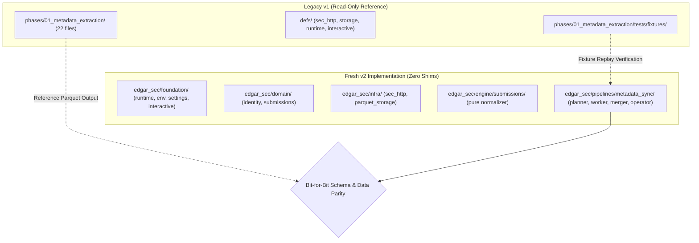
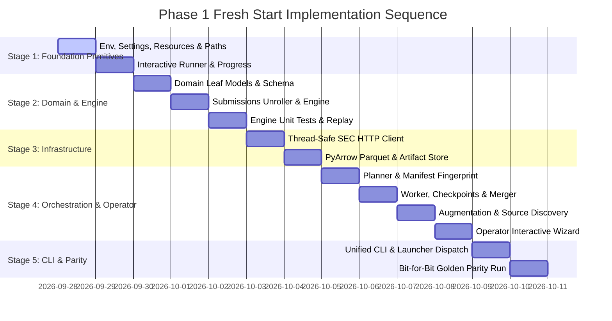

# Plan: Phase 1 Fresh Start Implementation (`edgar_sec.pipelines.metadata_sync`)

> [!NOTE]
> **Status:** Proposed Implementation Plan for Execution  
> **Target Scope:** Fresh implementation of Phase 1 (SEC Submissions Metadata Extraction) within the clean `edgar_sec/` v2 namespace, treating `phases/01_metadata_extraction/` and `defs/` strictly as read-only reference specifications.

---

## 1. Executive Strategy: The "Clean Room" Approach

Rather than attempting an in-place mutation with fragile backwards-compatibility shims, we implement Phase 1 **completely fresh** under a dedicated top-level package namespace: `edgar_sec/`.



### Why a Fresh Start Works Best
1. **Zero Backward-Compatibility Debt**: No deprecated JSONL fallback paths, no legacy `ChunkBackend` wrappers, and no 700-line `paths.py` god-class dependencies.
2. **Side-by-Side Coexistence**: The existing 1,409 tests in `defs/tests` and `phases/` continue passing cleanly. We break nothing during construction.
3. **Preserved Operator Ergonomics**: Retains the beloved interactive terminal wizard (`run.py` launcher menu and partition wizard) so operators never have to copy-paste verbose CLI commands.
4. **Pure Acyclic Architecture**: Built from the ground up to satisfy downward-only layer imports (`pipelines` &rarr; `engine` &rarr; `infra` &rarr; `domain` &rarr; `foundation`).
5. **Golden Reference Grounding**: The existing Phase 01 test fixtures (`recent_submissions.json`, `historical_submissions.json`, `mismatched_arrays.json`) and output schemas provide automated oracle testing.

---

## 2. Complete Trace: Files Used by Phase 1 in v1

To guarantee that no concurrency primitives, environment policies, or operational capabilities are lost during the fresh start, we performed an exhaustive trace of all files consumed by Phase 1 in v1.

### 2.1. Domain & Pipeline Files (`phases/01_metadata_extraction/`)

| File in v1 | Lines / Size | Primary Responsibility & Invariants |
| :--- | :--- | :--- |
| `run.py` | 208 lines | Production entry point shim; launches interactive operator wizard when `--chunk-id` is omitted. |
| `operator.py` | 604 lines | Interactive operator UI wizard (`interactive_wizard`, menu choices, status rendering, augmentation workflow). |
| `cli.py` | 338 lines | Canonical CLI surface (`plan`, `preview`, `run`, `status`, `merge`, `merge-partition`, `configure`, `discover-sources`, `refresh-company-tickers`). |
| `smoke_test.py` | 74 lines | Offline smoke test verifying plan generation and preview sample. |
| `core/application.py` | 520 lines | Top-level lifecycle orchestrator: `build_plan`, `preview_sample`, `run_chunk`, `run_partition_with_automerge`, `get_status`, `merge`. |
| `core/planning.py` | 215 lines | Deterministic chunk slicing, CIK partition assignment, and plan hash verification. |
| `core/input_manifest.py` | 118 lines | Ingestion of `uploads/cik-sec.csv`, header validation, CIK zero-padding, and fingerprinting. |
| `core/chunks.py` | 195 lines | Chunk boundary calculations, plan hashing, and chunk selection. |
| `core/checkpoints.py` | 185 lines | Chunk-level resumability, attempt tracking, and failure recording. |
| `core/config.py` | 245 lines | `ProjectConfig`, `RunOptions`, plan validation, and CLI option reconciliation. |
| `core/paths.py` | 139 lines | Typed domain path layout for Phase 1 (snapshots, registries, sources, chunks). |
| `core/merge.py` | 720 lines | Partition merger, chunk integrity validation, CIK coverage verification, merge report derivation, and final dataset publication. |
| `core/augmentation.py` | 385 lines | Incremental snapshot logic: compares source snapshot against base snapshot, plans delta chunks, merges new/updated CIKs. |
| `core/source_registry.py` | 260 lines | Discovers and snapshots SEC raw source feeds (company listings, CIK mappings). |
| `core/registry.py` | 290 lines | Manifest publication, snapshot pointer management (`current/`), artifact cataloging. |
| `core/schemas.py` | 155 lines | Explicit PyArrow Schema (`METADATA_EXTRACTED_SCHEMA_V1`) and terminal status constants. |
| `core/sec_client.py` | 135 lines | SEC submissions endpoint URL construction (`/submissions/CIK{cik:010d}.json`). |
| `core/fetch.py` | 45 lines | Network fetch adapter passing JSON payloads to the normalizer. |
| `core/storage.py` | 80 lines | Facade resolving chunk backends and dataset stores from `defs.storage`. |
| `core/normalize/builder.py` | 280 lines | Coordinates entity profile and filing array unrolling into PyArrow `RecordBatch`. |
| `core/normalize/filings.py` | 225 lines | Unrolls parallel JSON arrays (`accessionNumber`, `filingDate`, etc.) and sorts filings chronologically. |
| `core/normalize/profile.py` | 135 lines | Extracts `EntityProfile` fields (SIC, addresses, former names, tickers). |
| `core/normalize/helpers.py` | 120 lines | Type coercion, date parsing, JSON array alignment, and null normalization. |

### 2.2. Infrastructure & Runtime Primitives in `defs/` Consumed by Phase 1

| Module in `defs/` | Imported Symbols | Critical Functionality & Architectural Constraints |
| :--- | :--- | :--- |
| `defs.runtime.env` | `get_env` | **Security Invariant**: Resolves `.env` and environment variables without calling `os.environ` directly (enforced by `check.py` policy scanner). |
| `defs.runtime.settings` | `runtime.py`, `specs.py` | Typed settings resolution (SEC contact email, user-agent, timeouts, concurrency limits). |
| `defs.runtime.config_io` | `read_json_config`, `write_json_config` | Atomic reading and writing of `.artifacts/metadata/config.json`. |
| `defs.runtime.resources` | `derive_resources` | Computes safe worker thread counts and memory budgets based on hardware CPU cores/RAM. |
| `defs.runtime.partitions` | `parse_id_selection`, `divide_ids_among_workers` | Parses partition range strings (`1-3,5`) and distributes partition IDs across worker threads. |
| `defs.runtime.progress` | `make_tqdm_callback`, `make_merge_progress_callback` | Adapts pipeline progress events to `tqdm` progress bars with accurate ETAs and throughput. |
| `defs.runtime.interactive` | `InteractivePhase`, `run_interactive`, `ExtraAction` | **Interactive Runner**: Provides the interactive partition loop: (1) Preview, (2) Run Partition, (3) Show Commands, (4) Status, (5) Merge Partition, (6) Final Merge. |
| `defs.runtime.registry` | `LauncherEntry`, `ENTRIES`, `find_entry` | Static registry for the root `python run.py` launcher menu. |
| `defs.runtime.artifacts` | `get_current_snapshot_pointer`, `update_current_snapshot_pointer`, `artifact_id`, `next_snapshot_id` | Manages snapshot pointers under `manifests/metadata/snapshots/current/`. |
| `defs.runtime.cli` | `coalesce` | Precedence helper: CLI explicit flags > `config.json` > defaults. |
| `defs.sec_http` | `make_sec_http_client`, `resolve_sec_transport_profile`, `FailureLedger`, `HttpCache` | Thread-safe HTTP transport, 4 RPS token bucket, exponential retry backoff, and failure tracking. |
| `defs.storage` | `make_chunk_backend`, `DEFAULT_STORAGE_FORMAT`, `pa` | PyArrow dataset writing, chunk writer factory, and PyArrow re-export. |
| `defs.storage` (JSON/Hash) | `atomic_write_json`, `canonical_json`, `load_json`, `file_sha256` | Deterministic JSON serialization and SHA-256 file fingerprinting. |

---

## 3. Full Scope of the Fresh `edgar_sec` Implementation

The fresh Phase 1 implementation requires creating the foundational primitives alongside domain, infra, engine, and pipeline modules.

```text
edgar_sec/
├── foundation/                           # [LAYER 0: Zero SEC Domain Knowledge]
│   ├── crypto.py                         # SHA-256 fingerprinting helpers (from defs.storage.hashing)
│   └── runtime/
│       ├── env.py                        # Secure .env / environment resolution (from defs.runtime.env)
│       ├── settings.py                   # Typed settings resolution (from defs.runtime.settings)
│       ├── paths.py                      # Scoped root layout: artifacts_root, cache_root
│       ├── resources.py                  # Hardware concurrency derived from CPU/RAM (from defs.runtime.resources)
│       ├── partitions.py                 # Partition ID parsing & worker distribution (from defs.runtime.partitions)
│       ├── progress.py                   # tqdm progress callbacks & logging redirects (from defs.runtime.progress)
│       └── interactive.py                # Generic partition interactive menu runner (from defs.runtime.interactive)
│
├── domain/                               # [LAYER 1: Pure Leaf Models & Invariants]
│   ├── identity.py                       # Cik, AccessionNumber (validated value objects)
│   └── submissions/
│       ├── models.py                     # EntityProfile, FilingRecord, SubmissionsAggregate
│       └── schemas.py                    # Explicit PyArrow Schema (v1.0.0 matching canonical output)
│
├── infra/                                # [LAYER 2: Concrete External Adapters]
│   ├── sec_http/
│   │   ├── client.py                     # Thread-safe SEC HTTP transport (4 RPS pacing, user-agent)
│   │   ├── cache.py                      # Local response cache with TTL
│   │   └── ledger.py                     # Failure / retry ledger
│   └── storage/
│       ├── atomic.py                     # Atomic JSON read/write & canonical JSON serialization
│       ├── artifacts.py                  # Current snapshot pointers & artifact cataloging
│       └── parquet.py                    # Immutable PyArrow chunk writer & atomic dataset publisher
│
├── engine/                               # [LAYER 3: Pure Transformation Logic - Zero Network/IO]
│   └── submissions/
│       ├── builder.py                    # RecordBatch assembly from unrolled records
│       ├── unroller.py                   # Unrolls recent + historical SEC JSON arrays
│       ├── profile.py                    # Extracts EntityProfile fields
│       └── helpers.py                    # Clean type conversions & date parsing
│
└── pipelines/                            # [LAYER 4: Multi-Threaded Batch Orchestration]
    └── metadata_sync/
        ├── paths.py                      # Scoped metadata pipeline directory layout
        ├── manifest.py                   # CIK CSV validation, deduplication, and fingerprinting
        ├── planner.py                    # Deterministic chunk and partition assignment
        ├── worker.py                     # Thread pool worker fetching CIKs & writing chunk Parquets
        ├── checkpoints.py                # Chunk-level resumability and attempt manifests
        ├── augmentation.py               # Delta planning against baseline snapshots
        ├── source_registry.py            # SEC source discovery & snapshotting
        ├── merger.py                     # Partition & canonical dataset validator and publisher
        ├── operator.py                   # Interactive wizard (connecting callbacks to run_interactive)
        └── cli.py                        # Unified CLI: {plan, preview, run, status, merge, interactive}
```

---

## 4. Retaining the Interactive Runner & Root Launcher (`run.py`)

To eliminate the need for copy-pasting CLI commands, the fresh implementation fully preserves the **interactive terminal menu** across two levels:

### 4.1. The Pipeline Operator Wizard (`operator.py`)
`edgar_sec.pipelines.metadata_sync.operator` defines an `InteractivePhase` instance with callbacks matching the lifecycle:

```python
# edgar_sec/pipelines/metadata_sync/operator.py
from edgar_sec.foundation.runtime.interactive import ExtraAction, InteractivePhase, run_interactive

def interactive_wizard(options: RunOptions, config: ProjectConfig) -> int:
    phase = InteractivePhase(
        ensure_plan=lambda: ensure_plan(options),
        preview=lambda: preview_sample(options),
        status=lambda: get_status(options),
        run_partition=lambda part_id: run_partition_with_automerge(options, part_id),
        partition_command=lambda part_id: format_partition_cmd(part_id),
        merge_partition=lambda part_id: merge_one_partition(options, part_id),
        merge_final=lambda: merge(options),
        extra_actions=(
            ExtraAction("d", "Discover and snapshot raw source feeds", lambda: discover_sources(options)),
            ExtraAction("r", "Discover and snapshot CIK registries", lambda: discover_registries(options)),
            ExtraAction("a", "Plan augmentation run against base metadata", lambda: plan_augmentation(options)),
        ),
    )
    return run_interactive(phase)
```

When launched, the operator is presented with the clear, numbered menu:
```text
Current plan: mode=fresh CIKs=1000 chunks=10
  source: .artifacts/metadata/sources/company_tickers/snapshots/company_tickers_20260928.json

Options:
  1. Preview
  2. Run partition (auto-merges on full success)
  3. Show partition commands
  4. Show status
  5. Merge a partition from its chunks
  6. Merge all partition artifacts into the final dataset
  d. Discover and snapshot raw source feeds
  r. Discover and snapshot CIK registries
  a. Plan augmentation run against base metadata
  0. Exit

Choice [2]:
```

### 4.2. Root Launcher Entry (`python run.py`)
In `defs/runtime/registry.py`, we register the fresh pipeline so it appears directly in the root menu:

```python
# defs/runtime/registry.py
LauncherEntry(
    id="metadata-v2",
    label="Metadata Sync (v2 Fresh)",
    description="fresh v2 SEC submissions metadata extraction wizard",
    module="edgar_sec.pipelines.metadata_sync.operator",
),
```

The operator simply runs:
```bash
python run.py
# Selects 'Metadata Sync (v2 Fresh)' from the numbered menu!
```
Or dispatches directly without typing flags:
```bash
python run.py metadata-v2
```

---

## 5. Detailed Step-by-Step Implementation Sequence



### Milestone 1: Foundation Primitives (`edgar_sec/foundation/`)
- [ ] Create `edgar_sec/foundation/runtime/env.py` (resolving `.env` securely via `get_env`, satisfying scanner).
- [ ] Create `edgar_sec/foundation/runtime/settings.py` (typed settings for SEC contact, timeouts, concurrency).
- [ ] Create `edgar_sec/foundation/runtime/paths.py` (base `artifacts_root` and `cache_root` layout).
- [ ] Create `edgar_sec/foundation/runtime/resources.py` (`derive_resources` hardware calculation).
- [ ] Create `edgar_sec/foundation/runtime/partitions.py` (`parse_id_selection`, `divide_ids_among_workers`).
- [ ] Create `edgar_sec/foundation/runtime/progress.py` (`make_tqdm_callback`, `logging_redirect_tqdm`).
- [ ] Create `edgar_sec/foundation/runtime/interactive.py` (`InteractivePhase`, `run_interactive`, `ExtraAction`).
- [ ] Create `edgar_sec/foundation/crypto.py` (canonical SHA-256 fingerprinting).

### Milestone 2: Domain Leaf Models & Pure Engine Normalization
- [ ] Create `edgar_sec/domain/identity.py` (`Cik`, `AccessionNumber`).
- [ ] Create `edgar_sec/domain/submissions/models.py` (`EntityProfile`, `FilingRecord`).
- [ ] Create `edgar_sec/domain/submissions/schemas.py` (`SUBMISSION_METADATA_SCHEMA_V1`).
- [ ] Create `edgar_sec/engine/submissions/builder.py`, `unroller.py`, `profile.py`, `helpers.py`.
- [ ] Create `edgar_sec/tests/engine/test_submissions_normalizer.py` verifying against existing fixtures:
  - `recent_submissions.json`
  - `historical_submissions.json`
  - `mismatched_arrays.json`

### Milestone 3: Infrastructure & SEC Transport
- [ ] Create `edgar_sec/infra/sec_http/client.py` (4 RPS thread-safe client with user-agent enforcement).
- [ ] Create `edgar_sec/infra/sec_http/cache.py` (local JSON response cache with TTL).
- [ ] Create `edgar_sec/infra/sec_http/ledger.py` (`FailureLedger` recording non-retryable 404s).
- [ ] Create `edgar_sec/infra/storage/atomic.py` (atomic JSON writes, canonical serialization).
- [ ] Create `edgar_sec/infra/storage/artifacts.py` (snapshot pointer management).
- [ ] Create `edgar_sec/infra/storage/parquet.py` (atomic PyArrow chunk writer & final dataset publisher).
- [ ] Create `edgar_sec/tests/infra/test_sec_http.py` and `test_parquet_storage.py`.

### Milestone 4: Batch Pipeline Orchestration & Interactive Operator
- [ ] Create `edgar_sec/pipelines/metadata_sync/paths.py` (typed metadata directory layout).
- [ ] Create `edgar_sec/pipelines/metadata_sync/manifest.py` (CIK CSV ingestion & validation).
- [ ] Create `edgar_sec/pipelines/metadata_sync/planner.py` (deterministic partition/chunk assignments).
- [ ] Create `edgar_sec/pipelines/metadata_sync/worker.py` (thread-pool worker execution).
- [ ] Create `edgar_sec/pipelines/metadata_sync/checkpoints.py` (atomic checkpoint records).
- [ ] Create `edgar_sec/pipelines/metadata_sync/merger.py` (partition validation & final dataset assembly).
- [ ] Create `edgar_sec/pipelines/metadata_sync/augmentation.py` (delta planning against base snapshots).
- [ ] Create `edgar_sec/pipelines/metadata_sync/source_registry.py` (raw SEC source discovery).
- [ ] Create `edgar_sec/pipelines/metadata_sync/operator.py` (interactive menu wizard using `run_interactive`).
- [ ] Create `edgar_sec/pipelines/metadata_sync/cli.py` (`plan`, `preview`, `run`, `status`, `merge`).

### Milestone 5: Root Launcher Integration & Parity Verification
- [ ] Add `metadata-v2` entry in `defs/runtime/registry.py` pointing to `edgar_sec.pipelines.metadata_sync.operator`.
- [ ] Run `python run.py metadata-v2` to verify full interactive loop.
- [ ] Replay test against `phases/01_metadata_extraction/tests/fixtures/cik_sec_mini.csv`.
- [ ] Compare output Parquet schema and row content against v1 output for 100% data parity.
- [ ] Run policy scanners (`check.py --scan`) to ensure 0 lint errors, 0 raw `os.environ` calls, and 0 layer violations.

---

## 6. Verification & Parity Gate

| Check | Requirement | Verification Method |
| :--- | :--- | :--- |
| **Acyclic Imports** | No upward imports (`foundation` knows nothing of SEC; `engine` knows nothing of HTTP) | AST Layer Scanner in `check.py` |
| **Schema Identity** | Parquet schema must exactly match Schema v1.0.0 | `assert new_schema.equals(old_schema)` |
| **Deterministic Data** | Processing `cik_sec_mini.csv` produces identical row values | PyArrow table equality assertion |
| **Interactive Mode** | Can launch via `python run.py metadata-v2` or `python -m edgar_sec.pipelines.metadata_sync.operator` | Interactive smoke test |
| **No Live Network in Tests** | Unit & pipeline test suites run offline | Recorded fixture mocks in `conftest.py` |
| **Zero Code Leaks** | No direct `os.environ` or hardcoded `.artifacts` strings | Clean pass on all 14 `check.py` policy scanners |

---

## 7. Deprecation & Cutover Criteria

When Milestone 5 completes:
1. `edgar_sec/pipelines/metadata_sync` becomes the canonical producer of `submission_metadata.parquet`.
2. Downstream Phase 02 (`pipelines/filing_catalog`) can point seamlessly to the new Parquet output with **zero code modifications**, because the schema is 100% identical.
3. The legacy `phases/01_metadata_extraction/` can be archived or safely retired without disrupting any other part of the system.
