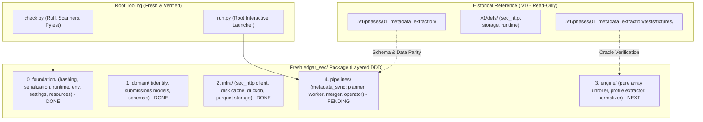

# Plan: Phase 1 Clean Slate Implementation (`edgar_sec.pipelines.metadata_sync`)

> [!NOTE]
> **Status:** Active Execution Plan for the Clean Slate v2 Branch  
> **Progress:** ~60% Completed (Milestone 0, 1, 2, 4 fully implemented, tested, and passing all quality gates).  
> **Repository Context:** All legacy v1 code has been moved to `.v1/` as a read-only historical specification. The repository root is a 100% clean workspace. We are constructing the production v2 architecture from the ground up without legacy shims or technical debt.

---

## 1. Executive Strategy: True Clean Slate & Core Invariants

With the legacy codebase archived under `.v1/`, we are liberated from backward-compatibility constraints. We do not maintain shims, facade bridges, or dual-running adapters.



### Architectural & Non-Regression Invariants (Enforced in AGENTS.md)
1. **Strict Downward-Only Layer Boundaries**:
   - `pipelines (L4)` &rarr; `engine (L3)` &rarr; `infra (L2)` &rarr; `domain (L1)` &rarr; `foundation (L0)`.
   - No upward imports, no circular dependencies. Automatically verified by the AST `layer-boundary` scanner.
2. **Zero Backward-Compatibility Shims & Zero Barrel Re-Exports**:
   - Never create legacy alias shims, forwarding functions, or compatibility facades.
   - Package `__init__.py` files must **never** re-export child module symbols. Callers must import from the canonical leaf module directly (e.g., `from edgar_sec.domain.identity import Cik`, `from edgar_sec.infra.storage.duckdb import connect`).
   - This prevents premature loading of heavy C-extensions (DuckDB, PyArrow) and guarantees explicit symbol ownership.
3. **Cgroup & Heap Memory Non-Regression**:
   - Concurrency is calculated dynamically via `derive_resources()` using cgroups v1/v2, `/proc/meminfo`, and psutil.
   - Heap reclamation (`malloc_trim(0)` + `gc.collect()`) runs at batch intervals via `reclaim()`.
   - DuckDB connections are hardened with strict thread limits, memory limits, and temp directories.
4. **Decoupled Quality Gate**:
   - `python check.py --fix` only auto-formats and applies safe lint fixes (< 0.5s; does NOT run tests).
   - `python check.py --fast` runs static checks in ~1s (formatting, linter, policy scanners; skips tests).
   - `python check.py` runs the full verification suite (formatting, linter, dynamic scanners, and pytest).

---

## 2. Component Inventory & Implementation Status

```text
edgar-sec/ (v2 Root)
│
├── check.py                              # [DONE] Quality gate: ruff format, lint, dynamic scanners, pytest
├── run.py                                # [DONE] Interactive launcher menu and CLI dispatcher
├── ruff.toml                             # [DONE] Linter and formatter configuration
│
├── edgar_sec/                            # [CORE PACKAGE]
│   ├── __init__.py                       # [DONE] Root package metadata
│   │
│   ├── foundation/                       # [LAYER 0: Zero SEC Domain Knowledge - 100% COMPLETE]
│   │   ├── __init__.py                   # [DONE] Package docstring (no barrel re-exports)
│   │   ├── checks.py                     # [DONE] Policy scanner runner iterating ALL_SCANNERS
│   │   ├── hashing.py                    # [DONE] file_sha256 (64KB chunks), sha256_bytes
│   │   ├── serialization.py              # [DONE] canonical_json (sorted keys, compact), canonical_hash
│   │   ├── scanners/                     # [DONE] Modular policy scanners (env, paths, secrets, clean_exit, length, layers, resources)
│   │   └── runtime/
│   │       ├── __init__.py               # [DONE] Package docstring (no barrel re-exports)
│   │       ├── env.py                    # [DONE] Zero-leak environment & .env loader (get_env, get_env_int, etc.)
│   │       ├── paths.py                  # [DONE] ProjectPaths (artifacts_root, cache_root), resolve_paths
│   │       ├── resources.py              # [DONE] cgroup v1/v2, /proc/meminfo, derive_resources, auto_worker_count
│   │       ├── memory.py                 # [DONE] reclaim (malloc_trim + gc), sha256_text (1MB streaming view)
│   │       ├── partitions.py             # [DONE] parse_id_selection, divide_ids_among_workers
│   │       ├── progress.py               # [DONE] make_tqdm_callback, make_merge_progress_callback
│   │       ├── interactive.py            # [DONE] prompt_choice, prompt_text, run_interactive_menu
│   │       └── settings/                 # [DONE] Modular spec providers: sec.py, paths.py, runtime.py, __init__.py
│   │
│   ├── domain/                           # [LAYER 1: Pure Leaf Models & Invariants - 100% COMPLETE]
│   │   ├── __init__.py                   # [DONE] Package docstring (no barrel re-exports)
│   │   ├── identity.py                   # [DONE] Cik (10-digit zero padded), AccessionNumber (NNNNNNNNNN-YY-NNNNNN)
│   │   └── submissions/
│   │       ├── __init__.py               # [DONE] Package docstring (no barrel re-exports)
│   │       ├── models.py                 # [DONE] EntityProfile, FilingRecord, SubmissionsAggregate
│   │       └── schemas.py                # [DONE] Canonical SUBMISSION_METADATA_SCHEMA (v1.0.0, 16 top-level cols)
│   │
│   ├── infra/                            # [LAYER 2: Concrete External Adapters - 100% COMPLETE]
│   │   ├── __init__.py                   # [DONE] Package docstring (no barrel re-exports)
│   │   ├── sec_http/
│   │   │   ├── __init__.py               # [DONE] Package docstring (no barrel re-exports)
│   │   │   ├── client.py                 # [DONE] Thread-safe SecHttpClient (adaptive pacing, caching, headers)
│   │   │   ├── cache.py                  # [DONE] SQLite WAL zstd SqlCache with TTL and embedded FailureLedger
│   │   │   ├── rate_limit.py             # [DONE] Adaptive token bucket rate limiter (8.0 RPS, throttle backoff)
│   │   │   ├── retry.py                  # [DONE] Exponential retry policy with jitter
│   │   │   ├── errors.py                 # [DONE] PermanentHttpError, RetryExhausted, ResponseTooLargeError
│   │   │   └── metrics.py                # [DONE] HttpMetrics counters
│   │   └── storage/
│   │       ├── __init__.py               # [DONE] Package docstring (no barrel re-exports)
│   │       ├── atomic.py                 # [DONE] atomic_write_bytes, atomic_write_text, atomic_write_json
│   │       ├── duckdb.py                 # [DONE] Hardened connect(), concat_to_parquet, null/key validation
│   │       └── parquet.py                # [DONE] write_parquet_table (zstd, 128k row group), count_parquet_rows
│   │
│   ├── engine/                           # [LAYER 3: Submissions Normalizer - NEXT TO IMPLEMENT]
│   │   ├── __init__.py                   # Package docstring
│   │   └── submissions/
│   │       ├── __init__.py               # Package docstring
│   │       ├── helpers.py                # Date parsing (YYYY-MM-DD), type coercion, null normalization
│   │       ├── profile.py                # Firm identity, addresses, former names extraction
│   │       ├── unroller.py               # Parallel arrays unroller, chronological sorting, accession deduplication
│   │       ├── builder.py                # PyArrow Table assembler matching SUBMISSION_METADATA_SCHEMA
│   │       └── normalizer.py             # Master normalize_submission pure functional entry point
│   │
│   └── pipelines/                        # [LAYER 4: Multi-Threaded Batch Orchestration - PENDING]
│       ├── __init__.py                   # Package docstring
│       └── metadata_sync/
│           ├── __init__.py               # Package docstring
│           ├── paths.py                  # Scoped metadata pipeline directory layout (.artifacts/metadata/...)
│           ├── manifest.py               # CIK CSV ingestion & input SHA-256 fingerprinting
│           ├── planner.py                # Deterministic chunk (1000 CIK) & partition planning (plan.json)
│           ├── checkpoints.py            # Atomic chunk checkpoint verification & discovery
│           ├── worker.py                 # Resumable multi-threaded worker fetching submissions & writing chunk Parquets
│           ├── merger.py                 # DuckDB coordinator merge: out-of-core sorted concat_to_parquet
│           ├── augmentation.py           # Delta planning against base snapshots
│           ├── source_registry.py        # SEC listing source discovery
│           ├── operator.py               # Interactive terminal wizard
│           └── cli.py                    # Unified CLI command surface
│
└── tests/                                # [UNIFIED TEST SUITE]
    ├── fixtures/                         # [DONE] Canonical test fixtures from .v1 oracle sets
    │   ├── cik_sec_mini.csv              # [DONE] 10 golden test CIKs
    │   ├── recent_submissions.json       # [DONE] Reference company submission payload
    │   ├── historical_submissions.json   # [DONE] Reference historical submission payload
    │   └── mismatched_arrays.json        # [DONE] Edge-case ragged/mismatched columnar arrays
    ├── foundation/                       # [DONE] Unit tests for runtime, env, memory, hashing, settings
    ├── domain/                           # [DONE] Unit tests for CIK, models, schema validation
    ├── infra/                            # [DONE] Unit tests for HTTP transport, cache, DuckDB, Parquet storage
    ├── engine/                           # [PENDING] Unit tests for engine submissions normalizer
    └── pipelines/                        # [PENDING] End-to-end pipeline integration & parity tests
```

---

## 3. Specifications for Remaining Components

### 3.1. Layer 3 Engine: Submissions Normalizer (`edgar_sec/engine/submissions/`)

**Invariant**: Layer 3 is 100% pure computation. Zero disk I/O, zero network calls, zero stateful side-effects.

1. **`helpers.py`**:
   - `parse_date(val: Any) -> str | None`: Parses dates to ISO `YYYY-MM-DD`. Returns `None` on invalid/missing input.
   - `safe_int(val: Any) -> int | None`: Parses integers, strips commas/spaces, returns `None` on failure.
   - `safe_float(val: Any) -> float | None`: Parses floats, handles NaN/Inf, returns `None` on failure.
   - `normalize_str(val: Any) -> str | None`: Strips whitespace, returns `None` if empty string or None.
   - `clean_list(val: Any) -> list[str]`: Ensures output is a list of strings, filtering nulls.

2. **`profile.py`**:
   - `extract_entity_profile(raw_data: dict[str, Any], cik_padded: str) -> dict[str, Any]`:
     - Identity: `cik`, `entity_name` (`name`), `entity_type`, `sic`, `sic_description`.
     - Classification: `category`, `fiscal_year_end`, `state_of_incorporation`, `state_of_incorporation_description`.
     - Listings: `tickers` (list of str), `exchanges` (list of str), `ein`.
     - Addresses: `mailing` and `business` addresses (street1, street2, city, stateOrCountry, zipCode, stateOrCountryDescription).
     - `former_names`: list of former company names with date ranges.

3. **`unroller.py`**:
   - Columnar unrolling of SEC filings:
     - Input SEC JSONs contain `filings.recent` with parallel columnar lists (`accessionNumber`, `filingDate`, `reportDate`, `acceptanceDateTime`, `act`, `form`, `fileNumber`, `filmNumber`, `items`, `size`, `isXBRL`, `isInlineXBRL`, `primaryDocument`, `primaryDocDescription`).
     - Ragged array handling: Column lists can have mismatched lengths (tested by `mismatched_arrays.json`). Clip arrays to the length of `accessionNumber` or pad with `None` where missing.
     - Merging historical files: When historical payloads are present (`files` array), unroll and append their records.
     - Deduplication: Deduplicate filings by `accessionNumber`. If duplicates exist, preserve the entry with the latest `acceptanceDateTime`.
     - Sorting: Chronological descending sort order: `filingDate` DESC, `acceptanceDateTime` DESC.

4. **`builder.py`**:
   - `build_submission_table(profile_data: dict[str, Any], filings: list[dict[str, Any]], cik_padded: str, status: str, payload_sha256: str, anomalies: list[dict[str, Any]]) -> pa.Table`:
     - Creates a 1-row PyArrow `Table` matching `SUBMISSION_METADATA_SCHEMA` exactly.
     - Top-level fields:
       1. `cik` (string)
       2. `status` (string, must be in `{"ok", "partial", "failed"}`)
       3. `processed_at` (timestamp[us, "UTC"])
       4. `payload_sha256` (string)
       5. `entity_name` (string)
       6. `entity_type` (string)
       7. `sic` (string)
       8. `sic_description` (string)
       9. `category` (string)
       10. `fiscal_year_end` (string)
       11. `state_of_incorporation` (string)
       12. `state_of_incorporation_description` (string)
       13. `addresses` (struct: mailing, business)
       14. `former_names` (list of structs)
       15. `listings` (list of structs: ticker, exchange)
       16. `filings` (list of filing structs)
       17. `anomalies` (list of anomaly structs)

5. **`normalizer.py`**:
   - Master entry point:
     ```python
     def normalize_submissions(
         raw_recent: dict[str, Any],
         cik: str,
         raw_historical: list[dict[str, Any]] | None = None,
         payload_sha256: str = "",
     ) -> pa.Table:
     ```
   - Gracefully handles empty, missing, or corrupted input by logging an anomaly and returning a table with `status="partial"` or `status="failed"`.

---

### 3.2. Layer 4 Pipelines: Metadata Sync (`edgar_sec/pipelines/metadata_sync/`)

1. **`paths.py`**:
   - Pipeline directory structure:
     - Plan: `.artifacts/metadata/plans/{plan_id}/plan.json`
     - Transient checkpoints: `.artifacts/transient/metadata/{plan_id}/chunk_{chunk_id:04d}.parquet`
     - Snapshot publishing: `.artifacts/metadata/snapshots/{snapshot_id}/metadata.parquet`
     - Current pointer: `.artifacts/metadata/snapshots/current` (symlink or atomic JSON pointer)

2. **`manifest.py`**:
   - Reads input CSV (e.g. `uploads/cik-sec.csv` or `tests/fixtures/cik_sec_mini.csv`).
   - Normalizes CIKs to 10-digit zero-padded strings.
   - Computes deterministic input SHA-256 fingerprint.

3. **`planner.py`**:
   - Partitions CIK list into fixed-size chunks (default 1,000 CIKs, or 100 for mini runs).
   - Generates deterministic `plan.json` recording schema version, timestamp, total CIK count, chunk count, and chunk boundaries.

4. **`checkpoints.py`**:
   - Discovers completed chunk Parquet files.
   - Validates row counts and schema compliance. Enables instant restart after interruption without re-fetching completed chunks.

5. **`worker.py`**:
   - Worker execution loop:
     - Takes a chunk of CIKs.
     - For each CIK: checks `SqlCache` or requests via `SecHttpClient`.
     - Calls `normalize_submissions` in `engine`.
     - Accumulates batch tables and writes an atomic chunk Parquet file using `write_parquet_table`.
     - Calls `reclaim()` at regular intervals to return glibc arena memory to the OS.

6. **`merger.py`**:
   - Coordinator merge using DuckDB:
     - Scans all chunk checkpoints.
     - Validates zero missing CIKs, zero null primary keys, and no duplicate accessions.
     - Uses `concat_to_parquet` with `ORDER BY cik` for out-of-core sorted final dataset creation.
     - Emits `metadata.manifest.json` with record count, chunk count, and SHA-256 digests.

7. **`augmentation.py`**:
   - Delta planner: Given a new CIK list or source, compares against the current published snapshot.
   - Schedules work only for new or updated CIKs.
   - Merges delta Parquet into a new published snapshot.

8. **`operator.py` & `cli.py`**:
   - Interactive wizard supporting:
     1. Plan generation
     2. Status & resume inspect
     3. Run partition / all chunks
     4. Merge completed chunks into snapshot
     5. Augment existing snapshot
   - CLI commands matching all wizard actions.
   - Root `run.py` delegates directly to `operator.py`.

---

## 4. Execution Sequence & Checklists

### Milestone 0: Root Tooling & Policy Scanners
- [x] Create `check.py` at workspace root (decoupled `--fix`, `--fast`, `--scan`, `--test`, full gate).
- [x] Create `run.py` at workspace root (launcher dispatcher).
- [x] Create `edgar_sec/foundation/checks.py` and modular scanner registry (`ALL_SCANNERS`).
- [x] Create `AGENTS.md` and `README.md` defining strict v2 contracts.

### Milestone 1: Foundation Primitives (Layer 0)
- [x] Create `edgar_sec/foundation/hashing.py` and `serialization.py`.
- [x] Create `edgar_sec/foundation/runtime/env.py` (zero `os.environ` leaks).
- [x] Create `edgar_sec/foundation/runtime/paths.py` (base paths).
- [x] Create `edgar_sec/foundation/runtime/resources.py` (`derive_resources`, `auto_worker_count`).
- [x] Create `edgar_sec/foundation/runtime/memory.py` (`reclaim`, `sha256_text`).
- [x] Create `edgar_sec/foundation/runtime/partitions.py` (`parse_id_selection`, `divide_ids_among_workers`).
- [x] Create `edgar_sec/foundation/runtime/progress.py` (`make_tqdm_callback`).
- [x] Create `edgar_sec/foundation/runtime/interactive.py` (`prompt_choice`, `run_interactive_menu`).
- [x] Create modular `edgar_sec/foundation/runtime/settings/` (`sec.py`, `paths.py`, `runtime.py`, `__init__.py`).
- [x] Create `tests/foundation/test_runtime.py` (all tests passing).

### Milestone 2: Domain Leaf Models & Schemas (Layer 1)
- [x] Create `edgar_sec/domain/identity.py` (`Cik`, `AccessionNumber`).
- [x] Create `edgar_sec/domain/submissions/models.py` (`EntityProfile`, `FilingRecord`, `SubmissionsAggregate`).
- [x] Create `edgar_sec/domain/submissions/schemas.py` (`SUBMISSION_METADATA_SCHEMA` v1.0.0, terminal statuses `ok`, `partial`, `failed`).
- [x] Create `tests/domain/test_identity.py` and `tests/domain/test_schemas.py` (all tests passing).

### Milestone 3: Infrastructure Adapters (Layer 2)
- [x] Create `edgar_sec/infra/sec_http/errors.py`, `metrics.py`, `rate_limit.py`, `retry.py`.
- [x] Create `edgar_sec/infra/sec_http/cache.py` (SQLite WAL, zstd compression, TTL, FailureLedger).
- [x] Create `edgar_sec/infra/sec_http/client.py` (`SecHttpClient`).
- [x] Create `edgar_sec/infra/storage/atomic.py` (atomic byte/text/json writes).
- [x] Create `edgar_sec/infra/storage/duckdb.py` (hardened connection, `concat_to_parquet`).
- [x] Create `edgar_sec/infra/storage/parquet.py` (`write_parquet_table`, `count_parquet_rows`).
- [x] Create `tests/infra/test_sec_http.py` and `tests/infra/test_storage.py` (all tests passing).

### Milestone 4: Engine Submissions Normalizer (Layer 3) - CURRENT FOCUS
- [x] Golden fixtures ready under `tests/fixtures/` (`recent_submissions.json`, `historical_submissions.json`, `mismatched_arrays.json`, `cik_sec_mini.csv`).
- [ ] Create `edgar_sec/engine/submissions/helpers.py`.
- [ ] Create `edgar_sec/engine/submissions/profile.py`.
- [ ] Create `edgar_sec/engine/submissions/unroller.py`.
- [ ] Create `edgar_sec/engine/submissions/builder.py`.
- [ ] Create `edgar_sec/engine/submissions/normalizer.py`.
- [ ] Create `tests/engine/test_normalizer.py` verifying against all 3 golden submission fixtures.

### Milestone 5: Pipeline & Interactive Operator (Layer 4)
- [ ] Create `edgar_sec/pipelines/metadata_sync/paths.py`.
- [ ] Create `edgar_sec/pipelines/metadata_sync/manifest.py`.
- [ ] Create `edgar_sec/pipelines/metadata_sync/planner.py`.
- [ ] Create `edgar_sec/pipelines/metadata_sync/checkpoints.py`.
- [ ] Create `edgar_sec/pipelines/metadata_sync/worker.py`.
- [ ] Create `edgar_sec/pipelines/metadata_sync/merger.py`.
- [ ] Create `edgar_sec/pipelines/metadata_sync/augmentation.py`.
- [ ] Create `edgar_sec/pipelines/metadata_sync/source_registry.py`.
- [ ] Create `edgar_sec/pipelines/metadata_sync/operator.py`.
- [ ] Create `edgar_sec/pipelines/metadata_sync/cli.py`.
- [ ] Connect `run.py` to `metadata_sync.operator`.

### Milestone 6: Verification, Oracle Parity & End-to-End Gate
- [ ] Replay `cik_sec_mini.csv` end-to-end through `run.py metadata run`.
- [ ] Validate generated Parquet dataset schema and row count against legacy `.v1` golden reference.
- [ ] Run full gate `.venv/bin/python check.py` (format, lint, all scanners, 100% test pass).
