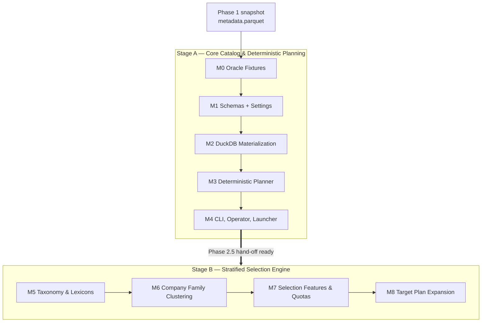

# Plan: Phase 2 Clean Slate Implementation (`edgar_sec.pipelines.filing_catalog`)

> [!IMPORTANT]
> **Status:** REMEDIATED — Milestones 0–9 done, plus the closure pass in §16.
> Stage A (M0–M4) and Stage B (M5–M9) both implemented. The parity audit found
> real defects after the phase was first signed off; they are fixed and recorded
> in [§16](phase_2_closure.md), which supersedes this document's earlier
> "complete, nothing outstanding" claim.
> **Progress:** 9 of 9 milestones, plus closure. The full quality gate passes,
> including the `whole-file-read` scanner added by the closure pass.
> **Predecessor:** `phase_1.md` is complete. Phase 2 consumes the Phase 1 `submission_metadata` snapshot and **must not change Phase 1 behaviour** or its schema. (The original wording here was "must not modify any Phase 1 module," which proved too strong during the Stage A consolidation pass in §12: deduplicating the shared artifact-layout convention and the operator entrypoint required behaviour-preserving edits to two Phase 1 modules. The contract is behavioural, not textual.)  
> **Readiness:** Every symbol, signature, path layout, and schema named below was verified against `.v1` source or the v2 tree. No signature in this document is speculative; where v1 behaviour is unsafe it is flagged explicitly and the v2 replacement is specified.  
> **Implementation:** §11 records the deviations from this plan that Stage A actually adopted, and the three v1 defects found while porting. §15 is the equivalent record for Stage B, including the six v1 defects found while porting the selection engine. Read them before changing behaviour.

---

## 1. Executive Summary & Zero-Network Invariants

Phase 1 built the layered skeleton and proved the pipeline contract end-to-end. Phase 2 is the first **downstream consumer** of a Phase 1 artifact, and the first **zero-network** pipeline.

In one sentence: read the finalized Phase 1 `submission_metadata` Parquet, unnest the nested `filings` arrays into flat document targets, and publish immutable, content-addressed **target plans** for a future document-acquisition phase (2.5) to consume.



### Core invariants (enforced, not aspirational)

| # | Invariant | Enforcement |
| :--- | :--- | :--- |
| 1 | **Zero network.** No HTTP client is ever constructed. | AST test: no `infra.sec_http` import reachable from `pipelines.filing_catalog` or `engine.selection` |
| 2 | **Never reads Phase 1 transient chunks.** Only the finalized merged snapshot. | Path guard rejecting any source path containing `chunks`, `checkpoints`, or `workers` (`engine.py:127-130`) |
| 3 | **Exact upstream schema match.** | Hard failure unless source columns equal `SUBMISSION_METADATA_SCHEMA.names` (`engine.py:147-151`) |
| 4 | **Published snapshots are immutable.** | Existing snapshot directory raises (`engine.py:176-180`); never overwritten or pruned |
| 5 | **Atomic publication.** | Staged beside the destination, then `os.replace` onto the same filesystem |
| 6 | **Accession fan-out is data, not an error.** | Occurrence identity `(source_cik, accession, document_path)`; dedup at `document_locator_key` only |
| 7 | **Statuses are inherited, never invented.** | `company_profiles.status` carries `ok`/`partial`/`failed` from Phase 1 |
| 8 | **Lineage to Phase 1.** | `catalog_id` derives from the upstream handoff `snapshot_id`, else from source content hash |

Invariants 2, 3, and 4 are **existing v1 runtime guards**. They are load-bearing and must be ported with identical behaviour and error text.

---

## 2. Resolution of Key Architectural Decisions (D1–D6 Locked)

| Decision | Locked Resolution | Rationale & Impact |
| :--- | :--- | :--- |
| **D1: Selection Scope** | **Two-stage rollout.** Stage A: materialization + deterministic planning. Stage B: stratified quota selection and expansion. | Stage A (1,554 v1 lines) unblocks Phase 2.5 with production-ready plan artifacts. Stage B adds the 1,631-line selection subsystem — of which `DeficitSelector` is 278 lines (`core/selection.py:37`) — without holding the core pipeline hostage. |
| **D2: Company Family** | **Stage B only.** Clustering and the statutory lexicons are not built in Stage A. | **Corrected — see §2.1.** `company_family` is not a `company_profiles` column and is not computed by materialization. |
| **D3: Plan Expansion** | **Dedicated Stage B Milestone (M8).** | `expand()` scales locator counts (e.g. 5,000 → 10,000) while preserving parent locators. Isolated in M8 to separate lineage mechanics from quota sampling. |
| **D4: Parity Standard** | **Contract-level and invariant parity.** Schema equality, fan-out semantics, derived-field rules, deterministic plan IDs. | v1 shipped **no fixtures** for Phase 2 (1,801 lines across 7 test files, all inputs inline), so byte-level diff is unachievable without inventing oracle inputs. Milestone 0 establishes real oracles. |
| **D5: Lexicon Placement** | **`edgar_sec/domain/taxonomy/` (Layer 1), Stage B.** | Pure statutory vocabularies. Lets `engine/company_family/` (Layer 3) import downward without scanner violations. The master roadmap independently flags this exact leak: `v2_refactor_roadmap.md:152` marks `family_vocab.py, company_family.py` as `<-- DOMAIN LEAK: SEC Form Families`. |
| **D6: Architecture Contract** | **Lock 5 layers** per `AGENTS.md` §1: `foundation → domain → infra → engine → pipelines`. | Formally reconciles the 5-layer contract with the 7-layer roadmap concept (see §4.1). Track 2 hosts document AST in `domain/documents/` and form plugins in `engine/forms/`. |

### 2.1 Corrections and Ground Truth from `.v1` Source Audit

#### Correction 1 — D2 (`company_family` is not a Stage A requirement)
The draft hypothesis assumed "`company_family` is a mandatory column in `company_profiles.parquet`." Verification against `.v1` proved this false:

- `core/schemas.py:17-42` defines `PROFILE_COLUMNS` as **22 columns plus `profile_schema_version`** (23 total). `company_family` is **not among them**.
- `core/materialize/sql.py:82` (`build_profile_query`) selects exactly `PROFILE_COLUMNS[:-1]` plus the version column (line 84). It never references `company_family`.
- `core/materialize/engine.py:101-312` (`materialize`) runs exactly two stages — the profile query and the sharded unnest. It never imports or invokes clustering.
- `company_family` appears **only** in the selection subsystem: `selection.py:78`, `selection_policy.py:47`, `selection_features.py:229-306`, `selection_source.py:18`. It is a quota-balancing feature dimension, not a published column.

> [!NOTE]
> The v1 `README.md:209` claims `company_profiles` contains "normalized `company_family`" (and `:207` describes the clustering step). This is a **v1 documentation/code divergence** — the code never writes that column. Port the code, not the README.
>
> *Consequence:* Stage A has no missing prerequisites and can proceed immediately.

#### Correction 2 — Milestone 0 Oracle Fixture Generation Methodology
v1 Phase 2 tests generated mock PyArrow tables inline in memory (1,801 lines across 7 test files, zero committed fixtures). Committing a self-generated Parquet from new Phase 2 code would create a *regression snapshot*, not a true *oracle*.

- **Input Fixture:** Generated offline by running Phase 1's verified pipeline over a minimal multi-registrant seed manifest. Phase 1 is already verified against SEC golden fixtures.
  - *Seed Derivation:* A single one-off offline generator (`scratch/derive_seed_fixtures.py`, gitignored) queries existing local target plans to locate empirical CIKs exhibiting real fan-out, amendments, and bundle fallbacks, writing them to `tests/fixtures/catalog/cik_sample.csv`. Once committed, generation is complete and self-contained.
  - *Ephemeral Generator Invariant:* No test, module, or CI step may depend on the scratch script, gitignored `.artifacts/` paths, or any specific historical artifact ID. The artifact ID referenced in M0 is an example for the maintainer, never a constant in code.
- **Expected Outputs Hand-Derived:** `expected_filing_targets.csv` and `expected_company_profiles.csv` are calculated by hand from the §3.3 SQL rules, independent of Phase 2 execution. Tests load these CSVs and assert exact equality against materialization.

The seven edge cases the seed must cover:

1. *Multi-registrant accession fan-out:* ≥2 distinct CIKs submitting the same accession.
2. *Amendment forms:* `10-K/A`, `10-KT`, `10-KSB`, `8-K/A` alongside base forms.
3. *Bundle fallback:* `primary_document` empty or null → `{accession}.txt`, `document_path_source = 'submission_bundle'`.
4. *Populated primary document:* e.g. `form10k.htm` → `document_path_source = 'primary_document'`.
5. *Upstream failure statuses:* a registrant with `status = 'failed'` and one with `'partial'`, verifying status inheritance.
6. *Coalescing nulls:* null `size` → `0`; null XBRL booleans → `false`.
7. *Profile dedup:* multiple entries for one CIK with differing `fetched_at`, verifying `rn = 1` keeps the latest.

#### Correction 3 — Deterministic Planning's Lack of Date-Bound Support
A common misconception is that deterministic planning can filter by date range (`start_date`, `end_date`, `filing_date`, `era_bands`).

- **Ground Truth:** `core/target_plan.py:65-102` proves the deterministic branch (`scope == 'deterministic'`, `else:` at `:356`) accepts **only four filters**: `forms`, `amendment` (`both`/`original`/`amendments`), `document_suffixes`, `limit`.
- **Architectural Rationale:** Deterministic planning is a fast, zero-heuristic slicing filter for batch downstream ingestion. Date-bounding, era stratification (`era_of()`, `EraBand`), and cohort balance belong strictly to **Stage B** (`Scope.POLICY` via `selection_policy.py` and `DeficitSelector`).
- **Invariant:** `planner.plan()` must **not** accept date parameters. Passing one raises `TypeError`.

---

## 3. Target Schemas & Invariant Derivation Specifications

### 3.1 `TARGET_SCHEMA` — 16 columns

Defined in `edgar_sec/domain/filing_catalog/schemas.py` (Layer 1):

```
occurrence_id, document_locator_key, source_cik, accession, form, is_amendment,
filing_date, report_date, primary_document, document_path, archive_url,
document_path_source, reported_size, is_xbrl, is_inline_xbrl, is_xbrl_numeric
```

All fields nullable except the identity triple `(source_cik, accession, document_path)`. The engine never fabricates a row for a filing lacking both `form` and `accession_number`; those are filtered upstream of projection.

### 3.2 `PROFILE_SCHEMA` — 23 columns

A **projection of the Phase 1 schema** plus `profile_schema_version`. Built by field reference, not name duplication:

```python
from edgar_sec.domain.submissions.schemas import SUBMISSION_METADATA_SCHEMA

PROFILE_SCHEMA = pa.schema(
    [SUBMISSION_METADATA_SCHEMA.field(name) for name in PROFILE_COLUMNS[:-1]]
    + [("profile_schema_version", pa.string())]
)
```

> [!IMPORTANT]
> `SUBMISSION_METADATA_SCHEMA` is **28 fields** and contains all 22 borrowed names (verified). **Phase 1's schema requires no change to make Phase 2 buildable.** This retires v1's `importlib.import_module("phases.01_...")` indirection — the numbered-directory hack the refactor exists to remove.

### 3.3 Derivation rules (the oracle source of truth)

Exact rules from `.v1/.../core/materialize/sql.py`. Milestone 0 expected outputs are hand-derived from this table.

| Field | Rule |
| :--- | :--- |
| `accession` | `replace(accession_number, '-', '')` — hyphen-free |
| `is_amendment` | `upper(form) LIKE '%/A' OR upper(form) LIKE '%_A'` |
| `document_path` | `primary_document` if non-empty, else `accession_number \|\| '.txt'` (bundle fallback) |
| `document_path_source` | `'primary_document'` or `'submission_bundle'`, matching the branch taken above |
| `archive_url` | engine value if non-empty, else `'https://www.sec.gov/Archives/edgar/data/' \|\| ltrim(source_cik,'0') \|\| '/' \|\| accession \|\| '/' \|\| document_path` |
| `occurrence_id` | `sha256(source_cik + ':' + accession + ':' + document_path)` |
| `document_locator_key` | `sha256(accession + ':' + document_path)` |
| `reported_size` | `coalesce(size, 0)` |
| `is_xbrl` / `is_inline_xbrl` / `is_xbrl_numeric` | `coalesce(<field>, false)` |
| profile dedup | `ROW_NUMBER() OVER (PARTITION BY cik ORDER BY fetched_at DESC NULLS LAST)`, keep `rn = 1`, `ORDER BY cik` |
| part ordering | `ORDER BY source_cik, accession, document_path` |

> [!CRITICAL]
> The SQL fallback uses `ltrim(source_cik, '0')`; the Phase 1 engine uses `int(cik_padded)` in `build_archive_url` (`edgar_sec/engine/submissions/helpers.py:94`). These agree for normal zero-padded CIKs but **diverge on degenerate input**: `ltrim('0000','0')` yields `''` while `int('0000')` yields `'0'`. A divergence here produces silent 404s at acquisition time, far downstream of the defect. Milestone 2 asserts equality on a normal CIK and pins the degenerate behaviour deliberately.

### 3.4 `locator_groups.parquet` — scope-dependent schema

This artifact is emitted by **both** stages and is part of `REQUIRED_PLAN_FILES` for either scope. Its schema widens with scope:

| Scope | Columns | Source |
| :--- | :--- | :--- |
| **Stage A (deterministic)** | 8: `document_locator_key`, `form`, `representative_cik`, `representative_accession`, `primary_document`, `document_path`, `archive_url`, `document_path_source` | `target_plan.py:477-499` |
| **Stage B (policy)** | 18: the above plus `form_family`, `era`, `suffix`, `xbrl_state`, `size_band`, `owner_org_presence`, `foreign_status`, `lifecycle_class`, `stub_suspect`, `company_name` | `target_plan.py:277-289` |

Stage A's variant is a plain `SELECT DISTINCT` over its own target shards. Stage B's variant joins the feature snapshot. **Consumers must not assume 18 columns in Stage A.**

### 3.5 Version constants

Ported verbatim from v1; bump only on a breaking schema change.

| Constant | v1 value | v2 home |
| :--- | :--- | :--- |
| `SCHEMA_VERSION` | `"1.1.0"` | `domain/filing_catalog/schemas.py` |
| `TARGET_SCHEMA_VERSION` | `"1.1.0"` | `domain/filing_catalog/schemas.py` |
| `PROFILE_SCHEMA_VERSION` | `"1.0.0"` | `domain/filing_catalog/schemas.py` |
| `TARGET_PLAN_SCHEMA_VERSION` | `"1.0"` | `pipelines/filing_catalog/publication.py` |
| `POLICY_SCHEMA_VERSION` | `"1.0"` | `engine/selection/policy.py` (Stage B) |
| `FALLBACK_POLICY_VERSION` | *(v1 `materialize/engine.py`)* | `pipelines/filing_catalog/catalog_job.py` |

> [!NOTE]
> `TARGET_SCHEMA_VERSION` is a distinct constant from `SCHEMA_VERSION` in v1. The M1 checklist previously listed only two of the three; all three are required.

### 3.6 Hashing invariant

Use DuckDB's built-in `sha256()` in SQL. Assert that its output equals `edgar_sec.foundation.hashing.sha256_bytes` (`foundation/hashing.py:18`) for the same input, so IDs stay identical across the SQL/Python boundary.

---

## 4. Exact Layer Mapping (5-Layer Enforced Contract)

### 4.1 Reconciliation of 5-Layer Contract vs. 7-Layer Roadmap

- **The Discrepancy:** `roadmap/refactor_v2/v2_refactor_roadmap.md` §3 (*v2 Target Package Layout*, line 344) envisions 7 layers above foundation: `domain` (1), `infra` (2), `documents` (3), `forms` (4), `engine` (5), `pipelines` (6), `apps` (7). `AGENTS.md` §1 establishes a strict **5-layer acyclic downward hierarchy** enforced by the `layer-boundary` AST scanner:
  ```text
  Layer 4: pipelines/
  Layer 3: engine/
  Layer 2: infra/
  Layer 1: domain/
  Layer 0: foundation/
  ```
- **The Reconciliation:** The 5-layer model is binding. `documents` and `forms` are folded into the existing layers rather than added as top-level packages:
  - **Document AST & Data Primitives** → `edgar_sec/domain/documents/` (Layer 1)
  - **Form Parsers & Extraction Plugins** → `edgar_sec/engine/forms/` (Layer 3)
  - **Pipeline Orchestration** → `edgar_sec/pipelines/` (Layer 4)
- `apps/` (roadmap LAYER 7) maps to the existing root `run.py` launcher, which is already outside the library tree.

### 4.2 Exact Module Mapping

| v1 source | v2 home | Layer | Milestone |
| :--- | :--- | :--- | :--- |
| `core/schemas.py` | `domain/filing_catalog/schemas.py` | 1 | M1 |
| `core/materialize/sql.py` | `infra/storage/duckdb_catalog.py` | 2 | M2 |
| `core/materialize/engine.py` | `pipelines/filing_catalog/catalog_job.py` | 4 | M2 |
| `core/paths.py` | `pipelines/filing_catalog/paths.py` | 4 | M2 |
| `core/target_plan.py` (deterministic branch) | `pipelines/filing_catalog/planner.py` | 4 | M3 |
| `core/plan_publication.py` | `pipelines/filing_catalog/publication.py` | 4 | M3 |
| `core/document_filters.py` | `pipelines/filing_catalog/filters.py` | 4 | M3 |
| `core/discovery.py`, `core/target_catalog.py` | `pipelines/filing_catalog/discovery.py` | 4 | M4 |
| `defs/entities/lexicon.py` (`STATE_POSTAL_CODES:11`, `LEGAL_FORMS:129`) | `domain/taxonomy/legal_forms.py`, `jurisdictions.py` | 1 | M5 |
| `core/family_vocab.py` | `domain/taxonomy/family_vocab.py` | 1 | M5 |
| `core/company_family.py` | `engine/company_family/` | 3 | M6 |
| `core/selection_features.py` | `engine/selection/features.py` | 3 | M7 |
| `core/selection_policy.py` | `engine/selection/policy.py` | 3 | M7 |
| `core/selection.py` | `engine/selection/selector.py` | 3 | M7 |
| `core/selection_source.py` | `engine/selection/source.py` | 3 | M7 |
| `core/selection_inventory.py` | `engine/selection/inventory.py` | 3 | M7 |
| `core/plan_expansion.py` | `pipelines/filing_catalog/expansion.py` | 4 | M8 |

`core/target_plan.py` is 544 lines in v1 and is split on the deterministic/policy seam rather than ported whole. `.v1/defs/entities/` is a **package** (`lexicon.py` + `__init__.py`), not the `defs/entities.py` module name; v1's absolute import `from defs.entities import LEGAL_FORMS, STATE_POSTAL_CODES` (`core/family_vocab.py:5`) disappears entirely in v2.

### 4.3 Stage A Module APIs

Signatures below are **verified against v1** and are the port contract. Behaviour may be improved; names and parameter order are the parity surface.

**`edgar_sec/infra/storage/duckdb_catalog.py`**
```python
def build_part_unnest_query(part_path: str) -> str: ...
def build_profile_query(relation: str) -> str: ...
```

**`edgar_sec/pipelines/filing_catalog/catalog_job.py`**
```python
def materialize(
    source_artifact: str | None = None,
    output_root: str | None = None,
    *,
    source_manifest: str | None = None,
    progress: Callable[[dict], None] | None = None,
    source_batch_size: int | None = None,
    threads: int | None = None,
    memory_limit: str | None = None,
    temp_directory: str | None = None,
) -> dict: ...
```
> [!IMPORTANT]
> `threads`, `memory_limit`, and `temp_directory` are v1 pass-throughs that v1 callers frequently hard-coded. In v2 they must **default to `None` and be resolved through `connect()`** — `infra.storage.duckdb.connect` (`infra/storage/duckdb.py:30`) already derives threads, memory limit, and temp directory from `derive_resources()` when no override is given. Any literal `threads=` or `memory_limit=` value in pipeline code is a `resource-allocation` scanner failure. Keep the parameters for testability; never populate them with constants.

`_resolve_source(source_artifact, source_manifest)` is the private helper holding the chunk-path guard, schema-equality guard, and `catalog_id` derivation. Port it as a module-private function with the same three guards.

**`edgar_sec/pipelines/filing_catalog/filters.py`**
```python
def normalize_suffixes(values: tuple[str, ...] | list[str]) -> tuple[str, ...]: ...
def suffix_sql(column: str, suffixes: tuple[str, ...]) -> str: ...
```

> [!WARNING]
> v1's `suffix_sql` interpolates both `column` and the suffix values directly into a SQL string literal (`f"lower({column}) LIKE '%.{suffix}'"`). `normalize_suffixes` lowercases and de-dots but does **not** strip quotes, so a suffix containing `'` is an injection surface. In v2, either bind suffix values as parameters or reject any suffix outside `[a-z0-9]` after normalization. Milestone 3 must include a test for a quote-bearing suffix.

**`edgar_sec/pipelines/filing_catalog/planner.py`**
```python
def plan(
    catalog: str = "",
    output_root: str | None = None,
    *,
    scope: str = SCOPE_DETERMINISTIC,        # Stage A accepts only this value
    forms: tuple[str, ...] | None = None,
    amendment: str | None = None,            # both | original | amendments
    document_suffixes: tuple[str, ...] | None = None,
    limit: int | None = None,
    progress: Callable[[dict], None] | None = None,
) -> dict[str, Any]: ...
```
Stage A **omits** the v1 policy-only parameters (`selection_policy_path`, `seed_cik_path`, `parent_plan_dir`, `target_units`); they reappear in Stage B (`planner.py` for policy, `expansion.py` for expansion). Output is partitioned to `targets/form=<form>/data.parquet` with `/` → `_` escaping, ordered `document_locator_key, occurrence_id`.

**`edgar_sec/pipelines/filing_catalog/publication.py`**
```python
REQUIRED_PLAN_FILES = ("plan.json", "selection_report.json", "locator_groups.parquet")

def plan_bundle_complete(plan_dir: Path) -> bool: ...
def reuse_existing_plan(
    final_dir: Path, plan_id: str, scope: str, *, expected_meta: dict[str, Any] | None = None
) -> dict[str, Any] | None: ...
def publish_plan_bundle(staging_dir: Path, final_dir: Path) -> None: ...
@contextmanager
def staged_plan_bundle(final_dir: Path, plan_id: str) -> Iterator[Path]: ...
```

> [!IMPORTANT]
> `staged_plan_bundle` must yield a staging directory that is a **sibling** of `final_dir`, because `publish_plan_bundle` uses `os.replace`, which is only atomic within one filesystem. This is the entire basis of invariant 5.

**`edgar_sec/pipelines/filing_catalog/discovery.py`**
```python
def discover_catalogs(manifests_root: str | None = None) -> list[dict]: ...
def discover_plans(...) -> list[dict]: ...
def discover_policies() -> list[dict]: ...          # Stage B
def status(manifests_root: str | None = None, runs_root: str | None = None) -> dict: ...
def resolve_catalog_manifests(...) -> ...: ...      # from core/target_catalog.py
```
Discovery reads manifests only — never Parquet payloads.

### 4.4 Artifact & Path Layout Contract

> [!CRITICAL]
> v2's `ProjectPaths` (`foundation/runtime/paths.py:12`) exposes only `repo_root`, `artifacts_root`, `cache_root`, `uploads_root`. It has **no `transient_root` and no `manifests_root`**, both of which v1's `FilingExtractionPhasePaths` depends on. Phase 2 must therefore derive both roots from `artifacts_root`, following the `MetadataPaths` precedent in `edgar_sec/pipelines/metadata_sync/paths.py`. An implementer following v1's structure literally will hit `AttributeError` immediately.

```text
artifacts_root/
└── filing_catalog/
    ├── snapshots/
    │   ├── current/
    │   │   └── pointer.json                      # atomic pointer to published catalog_id
    │   └── <catalog_id>/                         # immutable
    │       ├── snapshot.manifest.json
    │       ├── company_profiles.parquet
    │       └── filing_targets/
    │           └── part-00000.parquet …
    └── plans/
        └── <plan_id>/                            # immutable
            ├── plan.json
            ├── selection_report.json
            ├── locator_groups.parquet
            └── targets/
                └── form=<FORM>/data.parquet

artifacts_root/
└── transient/
    └── filing_catalog/
        └── <catalog_id>/                         # staging; never published
```

Phase 1's equivalent names its snapshot file `metadata.parquet` and its manifest `metadata.manifest.json`. Phase 2 keeps `company_profiles.parquet` / `snapshot.manifest.json` because the artifact names are contractual with Phase 2.5.

**Path rules:**
- `FilingCatalogPaths` is a frozen, slotted dataclass (Phase 1 convention) with a `resolve_filing_catalog_paths(artifacts_root=None)` factory returning `FilingCatalogPaths(resolve_paths().artifacts_root)` when no override is given.
- Every identifier interpolated into a path is validated against `[A-Za-z0-9_.-]`; v1's `_safe()` raises `ValueError` on anything else. Port it.
- `.artifacts` may appear **only** inside `foundation/runtime/paths.py`. `paths.py` composes from `artifacts_root` (`artifact-paths` scanner).
- Parquet writes use `row_group_size = 128_000` and `compression = "zstd"` (AGENTS §2.5).

**`plan.json` keys (Stage A):** `plan_schema_version`, `run_id`, `plan_id`, `catalog_id`, `scope`, `forms`, `amendment`, `limit`, `counts`, `selected_rows`, `active_targets_count`, `unique_locators_count`, `document_suffixes`.
**`selection_report.json` keys:** `scope`, `catalog_id`, `active_targets_count`, `unique_locators_count`, `counts`.
Stage B adds `target_units` and `parent_plan_id` under M8.

### 4.5 CLI Surface & Launcher Registration

Phase 1's `cli.py` is the template: `build_parser()` → `add_subparsers(dest="command", required=True)` → per-command `cmd_*` handlers → `main(argv) -> int`. Phase 2 mirrors it exactly.

| Command | Flags | Notes |
| :--- | :--- | :--- |
| `materialize` | `--source`, `--source-manifest`, `--output-root`, `--batch-size` | `--output-root` bypasses the pointer, matching v1 |
| `plan` | `--catalog`, `--scope`, `--policy`, `--auto-policy`, `--forms`, `--amendment`, `--suffixes`, `--limit` | `--scope deterministic` (default) takes the four filters and rejects date flags with `TypeError` (Correction 3). `--scope policy` takes `--policy PATH` **or** `--auto-policy`; supplying neither is an error |
| `expand` | `--parent-plan`, `--target-units` | Stage B only. Publishes a child plan retaining 100% of the parent's locators |
| `status` | — | Manifest reads only; zero Parquet I/O |

`run.py` registration is a dataclass registry entry, not an import. The existing entry is `id="metadata"`, `module="edgar_sec.pipelines.metadata_sync.operator"` (`run.py:19-22`), dispatched via `runpy` (`run.py:54-74`). Add:

```python
id="filing-catalog",
module="edgar_sec.pipelines.filing_catalog.operator",
```
Verified: `python run.py filing-catalog --help` dispatches. `operator.py` uses `foundation.runtime.interactive`, as Phase 1's does.

### 4.6 Repository Conventions Phase 2 Must Satisfy

| Convention | Source | Phase 2 obligation |
| :--- | :--- | :--- |
| **File length** | `file-length` scanner | **800-line advisory cap** (`foundation/scanners/length.py:10`). `target_plan.py` (544) split before porting; keep every new module under the cap. |
| **Settings registration** | `AGENTS.md` §3.1; `collect_specs()` at `settings/__init__.py:71` iterates a **hardcoded 3-tuple** `(get_runtime_specs, get_paths_specs, get_sec_specs)` | Phase 2 introduces at least one tunable (`source_batch_size`, default 1,000 per v1 `DEFAULT_CHUNK_SIZE`). Either add `settings/catalog.py` with `get_catalog_specs()` **and** register it in that tuple, or record an explicit decision that Stage A takes it as a function parameter only. Do not leave this implicit. |
| **Package completeness** | `AGENTS.md` §6.1 | **`edgar_sec/infra/__init__.py` does not exist** (every other layer package has one). Create it when adding `infra/storage/duckdb_catalog.py`. |
| **No barrel re-exports** | `AGENTS.md` §1.2 | Every new `__init__.py` is a docstring only. Consumers import leaf modules. |
| **Error taxonomy** | Phase 1 precedent: `MergeError(RuntimeError)` in `merger.py:37`, `SourceRegistryError(ValueError)` in `source_registry.py:43` | Define module-local exceptions rather than a shared errors module. `CatalogError` for the three hard guards; reuse `ValueError` for unsafe identifiers and invalid enums. |
| **Environment access** | `environment-access` scanner | No `os.environ`/`os.getenv` outside `foundation.runtime.env`. |
| **Reclaim memory** | AGENTS §2.2 | `reclaim()` between materialization stages. |
| **Scanner scope** | `foundation/scanners/files.py:15` uses `rglob("*.py")` | Markdown is not scanned; this document's `.artifacts` references are documentation only. |

---

## 5. Two-Stage Phased Scope

| | **Stage A — Core Pipeline** | **Stage B — Selection Engine & Expansion** |
| :--- | :--- | :--- |
| Purpose | Produce publishable target plans | Research-grade stratified sampling and plan scaling |
| v1 lines | **1,554** (measured) | **2,440** (measured) |
| New dependencies | **None** | `LEGAL_FORMS`, `STATE_POSTAL_CODES`, `family_vocab` |
| Filtering capabilities | `forms`, `amendment`, `suffixes`, `limit` (no date bounds) | Era bands, date ranges, multi-dimensional quota deficits |
| Output | `company_profiles.parquet`, `filing_targets/part-*.parquet`, 4-file plan bundle | Quota-balanced locators, 18-column `locator_groups.parquet`, reserve targets, expanded child plans |
| Unblocks | **Phase 2.5 document acquisition** | Multi-era, multi-cohort scaled acquisition |
| Gate to proceed | Milestone 4 complete | Milestone 9 complete |

Stage A is the critical path. Stage B is additive and can be implemented independently once Stage 2 has published verified catalogs.

---

## 6. Step-by-Step Milestones & Concrete Task Checklists

### Milestone 0 — Oracle Fixtures (`tests/fixtures/catalog/`)

- [x] Write a temporary, gitignored generator (`scratch/derive_seed_fixtures.py`) that reads existing local target plans (e.g. `.artifacts/filing_catalog/plans/<plan_id>/targets`) to extract minimal CIKs exhibiting real fan-out, amendments, and bundle fallbacks into `tests/fixtures/catalog/cik_sample.csv`. The artifact ID above is an example only.
  > [!IMPORTANT]
  > The generator is strictly ephemeral. It depends on untracked `.artifacts/` files absent from fresh clones. Once `tests/fixtures/catalog/` is populated and committed, generation is finished and self-contained. No test, module, or CI step may reference the script, gitignored paths, or any historical artifact ID.
- [x] Commit `cik_sample.csv` covering all **seven** edge cases in §2.1, Correction 2.
- [x] Run the **verified Phase 1 engine** offline over `cik_sample.csv` to generate `tests/fixtures/catalog/sample_submission_metadata.parquet`.
- [x] Verify each edge case is actually represented in the generated input (assert, do not eyeball).
- [x] Hand-derive and commit `expected_filing_targets.csv` from §3.3 (occurrence/locator IDs, accession, amendment flags, document paths, archive URLs).
- [x] Hand-derive and commit `expected_company_profiles.csv` from §3.3 dedup rules (22 projected columns for the latest `fetched_at` per CIK).
- [x] Create `tests/foundation/test_hashing.py` asserting DuckDB `sha256()` equals `sha256_bytes`.
  > [!NOTE]
  > This test belongs in `tests/foundation/`, not `tests/fixtures/`. `tests/fixtures/` holds data only, and a test module there would both violate the AGENTS §6 mirror rule and be collected from a non-mirrored path.
- [x] *Gate:* fixtures regenerate deterministically; no expected file was produced by Phase 2 code.

### Milestone 1 — Schemas, Settings & Packaging (`domain/filing_catalog/`, `infra/`)

- [x] Create `edgar_sec/infra/__init__.py` (docstring only) — the layer package is currently missing it.
- [x] Create `edgar_sec/domain/filing_catalog/__init__.py` (docstring only, no re-exports).
- [x] Create `edgar_sec/domain/filing_catalog/schemas.py`: `TARGET_SCHEMA`, `PROFILE_COLUMNS`, `PROFILE_SCHEMA`, `SCHEMA_VERSION`, `TARGET_SCHEMA_VERSION`, `PROFILE_SCHEMA_VERSION`, `PATH_SOURCE_PRIMARY`, `PATH_SOURCE_BUNDLE` — **all three** version constants (§3.5).
- [x] Create `tests/domain/filing_catalog/__init__.py` and `test_schemas.py`: all 22 borrowed names resolve; `PROFILE_SCHEMA` equals the projection; `TARGET_SCHEMA` has 16 fields; version constants present.
- [x] Resolve the settings obligation (§4.6): add `settings/catalog.py` with `get_catalog_specs()` and register it in the `collect_specs()` tuple, **or** record in this document that Stage A takes `source_batch_size` as a parameter only.
- [x] *Gate:* `layer-boundary` clean (domain imports only `foundation`); no `importlib` indirection.

### Milestone 2 — DuckDB Materialization (`infra/storage/` + `pipelines/filing_catalog/`)

- [x] Create `edgar_sec/infra/storage/duckdb_catalog.py`: `build_part_unnest_query()`, `build_profile_query()` per §3.3.
- [x] Create `edgar_sec/pipelines/filing_catalog/paths.py`: frozen slotted `FilingCatalogPaths` + `resolve_filing_catalog_paths()` per §4.4, including the `_safe()` identifier guard. No `.artifacts` literals.
- [x] Create `edgar_sec/pipelines/filing_catalog/catalog_job.py`: `materialize()` per §4.3, with the three hard guards (chunk path, exact source schema, immutable snapshot), staged profile + sharded unnest, `reclaim()` between stages, and `row_group_size=128_000` / `zstd`.
- [x] Use `connect()` from `infra.storage.duckdb` with **no** hard-coded `threads=` or `memory_limit=` (§4.3 warning).
- [x] Create `tests/pipelines/filing_catalog/__init__.py`, `conftest.py`, `test_duckdb_catalog.py`, `test_catalog_job.py`.
- [x] Test: chunk-path guard rejects; schema drift rejects; existing snapshot directory raises; fan-out retained; `archive_url` unpadding matches Phase 1's `build_archive_url` on a normal CIK **and** pins the degenerate all-zero behaviour.
- [x] *Gate:* materializes against Milestone 0 fixtures matching `expected_*.csv`; zero network.

### Milestone 3 — Deterministic Planner & Publication (`pipelines/filing_catalog/`)

- [x] Create `filters.py`: `normalize_suffixes()`, `suffix_sql()` — with the injection fix from §4.3.
- [x] Create `planner.py`: `plan()` accepting strictly `forms`, `amendment`, `document_suffixes`, `limit`; no date parameters.
- [x] Partition to `targets/form=<form>/data.parquet`, `/` → `_` escaping, `ORDER BY document_locator_key, occurrence_id`.
- [x] Emit the **8-column** Stage A `locator_groups.parquet` (§3.4) plus `selection_report.json` and `plan.json` with the §4.4 key sets.
- [x] Create `publication.py`: `REQUIRED_PLAN_FILES`, `plan_bundle_complete()`, `reuse_existing_plan()`, `publish_plan_bundle()`, `staged_plan_bundle()` per §4.3 — staging as a **sibling** of the destination.
- [x] Test: plan ID is content-derived and stable; exact rerun reuses the bundle; a divergent directory conflicts rather than overwrites; `/` in form names escapes; a date argument raises `TypeError`; a quote-bearing suffix is rejected or safely bound.
- [x] *Gate:* plan ID reproducible; immutability and conflict semantics proven; date filtering absent.

### Milestone 4 — CLI, Operator & Launcher

- [x] Create `discovery.py`: `discover_catalogs()`, `discover_plans()`, `status()` per §4.3 — manifest grouping only, no Parquet scans, no refetch.
- [x] Create `cli.py`: `materialize`, `plan`, `status` with the flags in §4.5, mirroring Phase 1's `build_parser()`/`main(argv)` structure.
- [x] Create `operator.py`: interactive menu via `foundation.runtime.interactive`.
- [x] Register the `filing-catalog` entry in the `run.py` registry per §4.5.
- [x] *Gate:* `python run.py filing-catalog --help` works; `status` performs zero Parquet reads. **Stage A complete; hand-off ready for Phase 2.5.**

### Milestone 5 — Taxonomy & Entity Lexicons *(Stage B)*

- [x] Create `edgar_sec/domain/taxonomy/__init__.py`, `legal_forms.py` (`LEGAL_FORMS`, from `.v1/defs/entities/lexicon.py:129`).
- [x] Create `jurisdictions.py` (`STATE_POSTAL_CODES`, from `lexicon.py:11`).
- [x] Create `family_vocab.py`: `ABBR_MAP`, `CONTEXT_RULES`, `PLURAL_MAP`, `ROMAN`, `PLACEHOLDER`, `STATE_CODES`, and the clustering tuning constants `HEAD_TOKENS`, `MIN_ALIAS_CHARS`, `MIN_CLUSTER_ATTACH`, `MAX_PARENT_TOKENS`, `STRUCTURAL_THRESHOLD`, `SEED`.
- [x] Create `tests/domain/taxonomy/test_taxonomy.py`.
- [x] *Gate:* lexicons are frozensets/immutable; zero upward imports.

### Milestone 6 — Company Family Clustering *(Stage B)*

- [x] Create `edgar_sec/engine/company_family/__init__.py`, `normalizer.py`: `normalize_name()`, `post_normalize()`, `strip_legal_forms()`, `mine_structural_vocabulary()`.
- [x] Create `clustering.py`: `CompanyFamilyInfo`, `CompanyFamilyIndex` with `build_from_seed()`, `from_existing_profiles()`, `build_from_records()`, `resolve(cik, company_name)`, `derive_company_family(name)`.
- [x] Create `tests/engine/company_family/test_clustering.py`, porting v1 `test_company_family.py` (109 lines) invariants with committed fixtures.
- [x] *Gate:* pure in-memory; zero I/O, zero network.

### Milestone 7 — Stratified Selection Engine *(Stage B)*

- [x] Create `edgar_sec/engine/selection/__init__.py`, `features.py`: `FeatureSnapshotBuilder`, `SnapshotPaths`, `era_of()`; 6-dimension signature `(company_family, form, era, sic_code, entity_type, lifecycle_class)`.
- [x] Create `policy.py`: `POLICY_SCHEMA_VERSION`, `EraBand`, `SeedFiler`, `SelectionPolicy`, `load_seed_cik_csv()`, `compute_seed_fingerprint()`, `auto_generate_policy()`, `discover_policies()`, `normalize_value()`. Date-bound filtering and era stratification reside **exclusively** here.
- [x] Create `selector.py`: `DeficitSelector`, `SelectionResult`. Create `source.py`: `CandidateSource`. Create `inventory.py`: `InventoryStatistics`.
- [x] Widen `locator_groups.parquet` to the 18-column policy schema (§3.4).
- [x] Create `tests/engine/selection/test_features.py`, `test_policy.py`, `test_selector.py`,
  plus `test_source.py` and `test_inventory.py` (AGENTS §6.3: one test file per source module).
- [x] Test: corporate families cannot dominate via subsidiaries; quota invariants hold; seed fingerprint is stable across runs.
- [x] *Gate:* quota invariants proven; policies versioned and fingerprinted.

### Milestone 8 — Target Plan Expansion *(Stage B)*

- [x] Create `edgar_sec/pipelines/filing_catalog/expansion.py`: `expand()`.
- [x] Scale locator target count (e.g. 5,000 → 10,000) while strictly preserving all parent plan locators.
- [x] Persist lineage in `expansion_metadata.json`: `parent_plan_id`, `expansion_ratio`, `retained_locator_count`, `added_locator_count`.
- [x] Extend `plan.json` with `target_units` and `parent_plan_id`.
- [x] Create `tests/pipelines/filing_catalog/test_expansion.py`,
  plus `test_policy_planner.py` for the Stage B plan bundle.
- [x] Test: child plan contains 100% of parent locators; duplicate expansion is idempotent; invalid parent plan IDs raise cleanly.
- [x] *Gate:* expansion lineage and parent locator preservation proven.

### Milestone 9 — Full Gate & Sign-off

- [x] Run `.venv/bin/python check.py` — full gate, all policy scanners clean, 100% tests passing.
  **612 passed.**
- [x] Verify Phase 1 non-regression: all 158 tests pass with zero Phase 1 edits.
  Phase 1 gained no tests and no edits; the 612-test suite includes all 158.
- [x] Run AST verification confirming zero reachable imports of `infra.sec_http` from `pipelines.filing_catalog` and `engine.selection`.
  `tests/test_network_isolation.py` walks the import graph (not a grep) and includes a
  sensitivity check that Phase 1's `metadata_sync` *does* still reach it.
- [x] Confirm every new module is under the 800-line `file-length` advisory cap.
  Longest: `features.py` 697, `planner.py` 562, `policy.py` 500.
- [x] Update `README.md` (artifact layout, command surface) and `AGENTS.md` if the contract changed.
- [x] *Gate:* full gate green; zero Phase 1 regression; sign-off complete.
  **Stage B complete.**

---

## 7. Test Tree & Committed Oracle Fixtures

Mirrors the source tree per `AGENTS.md` §6. Every directory below owns an `__init__.py`.

```text
tests/
├── fixtures/catalog/                         # committed oracle data (no test modules)
│   ├── cik_sample.csv
│   ├── sample_submission_metadata.parquet    # produced by the Phase 1 engine
│   ├── expected_company_profiles.csv         # hand-derived from §3.3
│   └── expected_filing_targets.csv           # hand-derived from §3.3
├── domain/
│   ├── filing_catalog/test_schemas.py        # M1
│   └── taxonomy/test_taxonomy.py             # M5
├── foundation/test_hashing.py                # M0  (DuckDB sha256 == sha256_bytes)
├── infra/storage/test_duckdb_catalog.py      # M2
├── engine/
│   ├── company_family/test_clustering.py      # M6
│   └── selection/                             # M7
│       ├── test_features.py
│       ├── test_policy.py
│       └── test_selector.py
└── pipelines/filing_catalog/                 # M2–M4, M8
    ├── conftest.py
    ├── test_catalog_job.py
    ├── test_planner.py
    ├── test_publication.py
    ├── test_discovery.py
    └── test_expansion.py                     # M8
```

> [!CAUTION]
> `.v1/phases/02_filing_extraction/` had **no `tests/fixtures/` directory** — 1,801 lines across 7 test files built all inputs inline. That pattern prevented independent oracle validation entirely. Milestone 0 breaks it.
>
> `.gitignore` already re-includes these paths via `!tests/fixtures/**` (lines 388-389), overriding the blanket `*.csv` and `*.parquet` ignores. No `.gitignore` change is needed.

---

## 8. Verification & Gate Criteria

```bash
.venv/bin/python check.py --fast   # format + lint + scanners, ~1s
.venv/bin/python check.py          # full gate before concluding
```

Phase 2-specific assertions:

1. **Zero-network proof** — AST walk, not grep, asserting no `infra.sec_http` import is reachable from `pipelines.filing_catalog` or `engine.selection`.
2. **Schema read-back** — every published Parquet re-read and compared to its declared schema.
3. **Derivation correctness** — Milestone 0 `expected_*.csv` matched exactly.
4. **Determinism** — the same input snapshot yields identical `catalog_id` and `plan_id` across runs.
5. **Immutability** — republishing raises; exact reuse succeeds; divergence conflicts.
6. **Atomicity** — a failed publish leaves no partial directory and no moved pointer.
7. **Hash parity** — DuckDB `sha256()` matches `sha256_bytes` for every ID family.
8. **No Phase 1 regression** — Phase 1's 158 tests remain green with zero Phase 1 edits.

---

## 9. Out of Scope

- Document acquisition, parsing, or storage (Phase 2.5).
- SQLite content-addressed store (Phase 2.5).
- Track 2 document AST models and form plugins (hosted in `domain/documents/`, `engine/forms/`).
- Any network access or HTTP client construction.
- Modifications to Phase 1's `SUBMISSION_METADATA_SCHEMA` or any Phase 1 module.
- Date-bound filtering inside deterministic planning (deferred to Stage B selection policy).
- JSONL storage (formally removed — see `v2_refactor_roadmap.md` §3, *"Formal Deprecation and Removal of JSONL"*; note that heading is itself misnumbered `#### 3.` under §3.2 in the roadmap).

---

## 10. Sign-off Summary

The architectural clarifications are resolved and locked; the implementation contracts in §4 are specified and source-verified.

1. **Oracle fixture methodology** — input generated offline with the Phase 1 engine covering seven deliberate edge cases; expected outputs hand-derived from §3.3 into CSV expectations. Tests live outside `tests/fixtures/`.
2. **Deterministic planning filters** — strictly `forms`, `amendment`, `document_suffixes`, `limit`. Date-bounding and era stratification belong exclusively to Stage B.
3. **5-layer vs. 7-layer reconciliation** — the `AGENTS.md` contract is normative; `documents/` and `forms/` fold into `domain/documents/` and `engine/forms/`.
4. **Stage B structure** — Milestones 5–9, with M8 dedicated to plan expansion and M9 to the final parity gate.
5. **Repository contracts** — 800-line file cap, settings-registry tuple, the missing `infra/__init__.py`, the `ProjectPaths` transient/manifests gap, and the v1 `suffix_sql` injection surface are all explicitly assigned to milestones.

Two open items remain for sign-off, both **reductions** in scope that should be confirmed rather than discovered during implementation:

- **D2 downgraded to Stage B.** Stage A publishes `company_profiles.parquet` **without** a `company_family` column, matching v1's actual schema and code. The v1 README's contrary claim is not ported.
- **Milestone 0 oracle methodology.** Expected outputs are hand-derived from §3.3 rather than generated by Phase 2 code.

Net effect of both: Stage A drops 622 lines (496 `company_family` + 126 `family_vocab`) and all three lexicon prerequisites. Phase 2 becomes immediately executable.

---

## 11. Implementation Record (Stage A)

Stage A shipped as Milestones 0–4. This section records where the implementation
departed from the plan above, and the v1 defects discovered while porting. Each
entry is a deliberate decision, not an accident.

### 11.1 v1 defects found and fixed

Porting surfaced three behaviours where v1 was internally inconsistent. All three
are fixed in v2 and covered by tests.

| # | Defect | v1 behaviour | v2 behaviour |
| :--- | :--- | :--- | :--- |
| 1 | **Whitespace-only primary document** | SQL tested `primary_document != ''`, so `"   "` counted as a real document and produced a `document_path` of spaces — while the Phase 1 engine (`build_archive_url`) stripped and treated the same value as missing. One row could therefore report `archive_url` and `document_path_source` that contradicted each other. | `nullif(trim(primary_document), '')` aligns the SQL with the engine. |
| 2 | **`amendment` policy never applied** | v1 validated the value against `AMENDMENT_POLICIES` and recorded it in `plan.json`, but the deterministic branch never filtered on `is_amendment`. `--amendment original` silently behaved like `both`. | `amendment_sql()` emits a real predicate, applied both when discovering which form partitions exist and when writing them. |
| 3 | **`locator_groups` did not collapse shared locators** | v1 selected `DISTINCT` over *all* columns including `source_cik`, so two co-filers sharing one document locator produced two rows and `unique_locators_count` over-counted — exactly the multiplicity Stage B selection must not inherit. | Grouped on `document_locator_key` alone, with `arg_min` representatives over a total order. The 13-occurrence fixture now correctly reports 12 locators. |

### 11.2 Deviations from this plan

| Plan said | Implementation adopted | Why |
| :--- | :--- | :--- |
| §4.3: "Keep the `threads` / `memory_limit` / `temp_directory` parameters for testability" | **Dropped from `materialize()`.** | `connect()` already derives all three from cgroup-aware `derive_resources()`. Re-exposing them as arguments that production code must leave `None` is dead surface that invites exactly the hardcoded allocation the `resource-allocation` scanner exists to block. |
| §3.5/§4.6: register catalog settings | Registered `catalog.source_batch_size` and `catalog.row_group_size`. **`catalog.part_count` was dropped.** | v1 sharded by *upstream* part, because the source arrived as many Parquet shards. v2's source is one merged Phase 1 snapshot, so there is no part list to align to and a single shard is correct. A registered-but-unused knob is worse than none. |
| §4.3: `build_merged_targets_query(relations)` | **Removed.** | Unreachable. The v2 source is a single dataset, so targets come from one unnest query; the union helper had no caller. |
| §M0: derive the seed from local `.artifacts` target plans | **Payloads synthesized** through the verified Phase 1 engine instead. | Minimality and byte-determinism matter more than real-world variety for a unit fixture, and a mined snapshot drags megabytes of unrelated real company data into the committed tree. |
| §3.4/§4.3: `plan_bundle_complete` requires a `form=*/data.parquet` glob | **Matches the on-disk partition set against `plan.json` counts.** | v1's `any(glob(...))` reports a legitimately empty plan (every filter excluded everything) as incomplete, so such a bundle could never be reused. The new check is also stronger: it detects a bundle that lost a shard. |
| §4.3: zero-row plans are not discussed | **A zero-row plan still publishes `targets/` and a schema-correct zero-row `locator_groups.parquet`.** | Otherwise its own bundle fails the completeness check and is permanently unreusable. |
| §4.4: `output_root` is an artifacts root for `plan` | **Unified: `output_root` means an artifacts root for `materialize` too.** | v1's `materialize(output_root=...)` wrote `<root>/<catalog_id>/` while the layout resolver expects `<root>/filing_catalog/snapshots/<catalog_id>/`. An implementer following v1 literally could not plan against a catalog they had just materialized. |
| §1 invariant 4: immutability | **Guard applies to both publication modes.** | v1 only enforced it on the durable path, so an explicit `--output-root` could silently destroy a published snapshot. |
| §4.5: CLI flags | **Added a `current` catalog alias; progress goes to stderr.** | `current` is what the operator menu defaults to, so it had to resolve through the pointer. Progress on stderr keeps stdout pure JSON, which is what makes `... \| jq` work. |
| §3.3 derivation table | **Occurrences are deduplicated by `occurrence_id` inside the unnest.** | v1 relied on Phase 1 guaranteeing unique CIKs. Enforcing the occurrence contract locally means a re-fetched registrant cannot emit the same fact twice. |

### 11.3 Oracle outcome

The Milestone 0 oracle and the DuckDB implementation are two independent
transcriptions of §3.3 — one in Python, one in SQL. They agree exactly on all
13 rows × 16 columns. That cross-check is what caught defect 1: the SQL
normalized the whitespace `primary_document` to `''` and the oracle had not, and
the SQL was right.

---

## 12. Consolidation Record (Stage A Deduplication Pass)

A follow-up pass scanned every function definition in `edgar_sec/` with an AST
walker, hashing each body after stripping docstrings and comments, and compared
names and fingerprints. The scan covered 78 files and 321 definitions. Findings
and dispositions:

### 12.1 Consolidated

| Duplication | Copies | Resolution |
| :--- | :--- | :--- |
| `_emit` — optional progress callback dispatch | 2 | `emit_progress()` + `ProgressCallback` in `foundation/runtime/progress.py` |
| `_validate_positive_int` | 2 | `settings/validators.py`, shared by `runtime.py` and `catalog.py`; `_validate_non_negative_int` joined it for `paths.py` |
| Artifact filename literals (`plan.json`, `pointer.json`, `selection_report.json`, `locator_groups.parquet`, `company_profiles.parquet`, `snapshot.manifest.json`, `filing_targets`, `transient`) | 8 modules | Declared once; consumers import the name |
| `POINTER_FILE_NAME` / `TRANSIENT_DIR` / `PLAN_FILE_NAME` / `current_pointer` shape | 2 pipelines | `foundation/runtime/paths.py` gains the shared convention plus `current_pointer_path()` and `transient_dir()` |
| `128_000` row-group literal | 3 | `DEFAULT_ROW_GROUP_SIZE` from `infra.storage.parquet`; see §12.2 for the remaining copy |
| Operator entrypoint policy (menu when no argv, CLI otherwise) | 2 | `operator_entrypoint()` in `foundation/runtime/interactive.py` |
| `run_operator()` | 2 | **Removed.** Dead public surface once `operator_entrypoint` covered it; AGENTS.md §1.1 forbids compatibility shims without an external contract. |
| `CURRENT_ALIAS = "current"` | 2 | Declared once in `filing_catalog/paths.py` |
| Tests building artifact paths by hand | 6 | Routed through the paths API; the one deliberate exception is `test_snapshot_layout_matches_the_documented_contract`, which pins literal names on purpose |

### 12.2 Deliberately left duplicated

- **`DEFAULT_ROW_GROUP_SIZE`.** The writer (`infra/storage/parquet.py`, Layer 2)
  owns the value; the setting default (`settings/catalog.py`, Layer 0) cannot
  import it under the enforced layer graph. Guarded by
  `tests/infra/storage/test_parquet.py::test_row_group_default_matches_the_catalog_setting`
  and `::test_duckdb_copy_helper_inherits_the_same_row_group_default`.

`SEC_ARCHIVE_BASE` was previously listed here as a second forced duplicate. The
Phase 1 follow-up pass (§13) removed it by giving every EDGAR URL a single
definition in `edgar_sec/domain/sec_urls.py`, which every layer can import
downward.

### 12.3 Reported, not changed

Resolved in §13:

- **`submissions_url` was defined twice with different behaviour.**

Still open:

- **`build_parser` / `cmd_*` / `_action_*` / `_namespace` / `build_operator_menu`**
  appear in both pipelines with divergent bodies. These are genuinely
  per-pipeline argparse definitions and per-pipeline menus; only the entrypoint
  policy was redundant, and that is now shared.
- **`snapshot` / `record_failure` / `load_failure_entry` / `plan_dir` /
  `snapshot_dir`** repeat as names with unrelated meanings in `sec_http` and
  pipeline modules. Name collision, not duplicated logic.
- **`_plan` in three Phase 1 test files** — a 4-line local helper. Consolidating
  test-local fixtures across modules is not worth the indirection.

---

## 13. Phase 1 Follow-Up Record

Phase 1 follow-up work carried out during the Stage A consolidation pass. No
Phase 1 behaviour changed; the diff is purely the removal of duplicate EDGAR URL
construction.

### 13.1 The defect

`submissions_url` had two live definitions with **different behaviour**:

| Definition | Pads the CIK? | Base literal |
| :--- | :--- | :--- |
| `SecHttpClient.submissions_url` (static method) | yes — `zfill(10)` | inline |
| `metadata_sync.sec_client.submissions_url` (module function) | **no** | `SUBMISSIONS_BASE` |

The same CIK could therefore resolve to two different URLs depending on the
caller, and a caller that skipped padding on an unpadded CIK would request
`CIK320193.json`, which EDGAR does not serve.

The survey found two further problems in the same cluster:

- `https://data.sec.gov/submissions` appeared **three** times and
  `https://www.sec.gov/Archives/edgar/data` **twice**, as independent literals.
- `SecHttpClient.archives_url` duplicated the URL shape of
  `engine.submissions.helpers.build_archive_url` but **omitted its guards**.
  `build_archive_url` returns `(None, reason)` for an unusable accession or a
  missing document and flags stub documents; `archives_url` would cheerfully
  build a URL for a blank document name. The unguarded copy existed only to
  satisfy `tests/infra/sec_http/test_client.py` and was unused in production.

### 13.2 Resolution

`edgar_sec/domain/sec_urls.py` is now the single place an EDGAR URL is
assembled: `SEC_SUBMISSIONS_BASE`, `SEC_ARCHIVE_BASE`, `submissions_url()`,
`historical_submissions_url()`, `archives_url()`, and `normalize_cik()`.

**Why Layer 1 and not Layer 2.** `infra` was the intuitive home for URL
construction, but the catalog schemas (Layer 1) also need `SEC_ARCHIVE_BASE` for
the SQL fallback, and Layer 1 may not import Layer 2. Placing the module in
`domain` makes it reachable downward from every consumer — `infra`, `engine`,
and `pipelines` — which is what actually removed the duplication instead of
merely relocating it.

Changes:

- `submissions_url()` zero-pads unconditionally, so padded and unpadded CIKs
  resolve identically. Every existing caller already passed padded CIKs, so the
  behaviour change is invisible to them and only closes the divergence.
- `SecHttpClient.submissions_url` and `SecHttpClient.archives_url` **removed**.
  Both were dead public surface; the unguarded archive copy was an outright
  hazard. Per AGENTS.md §1.1 no compatibility shim was left behind.
- `metadata_sync.sec_client.submissions_url` and `SUBMISSIONS_BASE` **removed**;
  its eleven call sites (including `tests/support.py`) now import the canonical
  builder.
- `engine.submissions.helpers` delegates URL shape to `archives_url()` and no
  longer declares either base constant; `filings.py` builds historical URLs via
  `historical_submissions_url()`.
- `domain.filing_catalog.schemas` imports `SEC_ARCHIVE_BASE` rather than
  restating it, retiring the duplicate and its guard test recorded in §12.2.

### 13.3 Verification

- 366 tests pass; all seven policy scanners clean; no Phase 1 test was modified
  except `tests/infra/sec_http/test_client.py`, which previously asserted the
  now-removed static methods and now pins the canonical builders.
- New `tests/domain/test_sec_urls.py` (12 tests) pins CIK-padding independence,
  accession hyphenation, and agreement between the canonical builder and
  `build_archive_url`.
- `tests/domain/filing_catalog/test_schemas.py` now asserts the catalog's base
  **is** the canonical object and that the engine's URL shape matches it, so the
  two layers cannot drift without failing the gate.

---

## 14. Stage B Record (Milestones 5–6)

### 14.1 M5 — Taxonomic vocabulary

`edgar_sec/domain/taxonomy/` holds the statutory reference data as
`jurisdictions.py`, `legal_forms.py`, and `family_vocab.py`. All tables are
immutable: `frozenset` for membership sets, `MappingProxyType` for mappings,
and `frozenset` for the neighbour sets inside `CONTEXT_RULES`. A mutable dict or
set here would let one caller corrupt the vocabulary for the process, and
clustering would then depend on call order rather than on its input.

Decisions taken while porting:

- **`build_alternation` was a v1-only helper** in `defs.regex`, with no v2
  equivalent. The two call sites (the state alternation and the trademark
  pattern) each inlined the one-line `"|".join(re.escape(...))`, with the
  alternation built in sorted order so the compiled pattern is byte-identical
  on every run. Introducing a shared module for a single expression would have
  cost more than it saved.
- **`clean_entity_name` lives with jurisdictions** (it is jurisdiction
  stripping plus whitespace normalization) and `entity_name_tokens` with legal
  forms (it filters on both legal forms and stopwords). This keeps the
  dependency direction between the two modules one-way.

### 14.2 M6 — Company-family clustering

`normalizer.py` and `clustering.py` split the v1 496-line module along the
pure/impure seam: everything that is a function of one name, and everything that
needs a corpus.

Four departures from v1, all deliberate:

- **The global `_SEED_CACHE` is gone.** v1 memoized `build_from_seed` in a
  module-level dict keyed on `(path, seed, mtime)`. That is hidden global
  mutable state: it leaks memory, it is never invalidated when a file is
  rewritten within the same mtime tick, and it makes results depend on call
  order. The index is built once per plan, so the cache bought nothing.
- **Family ids use SHA-256, not MD5.** The id is a content digest used as a
  display label, not a security primitive, and there is no reason to reach for
  a broken hash. Values therefore differ from v1, which is acceptable under
  D4: no family id was published by Stage A, and the algorithm is pinned by
  invariant tests rather than by hash values.
- **`from_existing_profiles` uses v2 `connect()` and `sql_literal`**, and the
  column read happens outside the connection context rather than inside it.
- **The index is frozen after construction** (`MappingProxyType` lookups,
  `frozenset` vocabulary), so a caller cannot mutate it mid-resolution.

### 14.3 Parity result

Every v1 clustering benchmark reproduces exactly on a committed 10-registrant
fixture, with the family keys v1 asserted on a full-corpus seed:

| Benchmark | Result |
| :--- | :--- |
| Santander four deal trusts plus the LLC collapse to one family | `santander drive`, representative is the LLC parent |
| JPMorgan parent and its series merge via head alias | `jpmorgan chase` |
| Honda Motor and Honda Auto stay separate | `honda motor` vs `honda auto` |
| Morgan Stanley resolves to its parent | `morgan stanley`, representative `Morgan Stanley` |
| Short operating companies keep their identity | `autozone`, `mortgage one`, `auto zone` |
| Stateless deriver with an explicit vocabulary | `santander drive` |

v1's version of this test skipped unless a local 10k-row `uploads/cik-sec.csv`
happened to be present, so it usually proved nothing. The v2 fixture is
committed at `tests/fixtures/company_family/seed_ciks.csv`, and the tests assert
the *invariants* — one entity collapses, unrelated companies that share a word
do not — rather than hash values.

### 14.4 Outstanding

None outstanding *within Milestones 0–9*. A parity audit run after this section
was first written found defects outside those milestones — a malformed
policy-plan schema, a broken `--source-manifest` path, missing reuse integrity,
unwired seed selection, and unbounded whole-file hashing. All are fixed; see
[§16](phase_2_closure.md).

---

## 15. Stage B Implementation Record (M7–M9)

Stage B adds the stratified selection engine and plan expansion. 612 tests pass;
all seven policy scanners are clean; Phase 1 received no edits and no new tests.

### 15.1 Module map

| Module | Role |
| :--- | :--- |
| `engine/selection/policy.py` | `SelectionPolicy`, `EraBand`, `SeedFiler`, seed CSV loading, fingerprinting, `auto_generate_policy()`, `discover_policies()`, `normalize_value()`. The only place date-bound and era reasoning lives. |
| `engine/selection/features.py` | `FeatureSnapshotBuilder`, `SnapshotPaths`, `era_of()`, `form_family()`, `form_family_sql()`. |
| `engine/selection/source.py` | `CandidateSource`, `CandidateFilters`, `POOL_COLUMNS`, `OCCURRENCE_COLUMNS`. Bounded, storage-backed pool access. |
| `engine/selection/selector.py` | `DeficitSelector`, `SelectionResult`, `classification_signature()`. The five-phase fill. |
| `engine/selection/inventory.py` | `InventoryStatistics`. Pre-selection floor feasibility. |
| `pipelines/filing_catalog/expansion.py` | `expand()`, `ExpansionLineage`, `plan_fingerprint()`, `plan_locator_keys()`, `validate_parent()`, `validate_target()`. |
| `tests/test_network_isolation.py` | The AST zero-network proof, as a gate. |

### 15.2 Six defects found in v1 during the port

Each of these is a behaviour change, not a refactor, and each is pinned by a test.

1. **The Python and SQL form-family rules disagreed.** v1's SQL was a
   `$`-anchored `REGEXP_REPLACE` alternation, so it stripped exactly one
   trailing suffix; the Python loop stripped one of *each* kind. `10-K/A-POS`
   became `10-K` in Python and `10-K/A` in SQL. `form_family_sql()` is now
   **generated from the same suffix tuple** `form_family()` consumes, and
   `test_form_family_sql_matches_the_python_rule` runs both over a 16-form
   battery that includes the double-suffix case.
2. **Every registrant was `foreign_status = 'domestic'`.** v1's nested-profile
   branch hardcoded the literal, so a Canadian or UK filer was indistinguishable
   from a Delaware corporation on the one dimension a policy floors to control
   international mix. Now derived from `incorporation.state` against the M5
   `STATE_POSTAL_CODES` vocabulary — which is the M5 dependency §4.2 declared
   for Stage B and which nothing had consumed until now.
3. **A policy document was a SQL injection surface.** v1 wrote
   `ORDER BY md5('{seed}' || key)` with the seed read from the policy file.
   Every value reaching SQL is now a bound parameter, and dimension names are
   validated against `KNOWN_DIMENSIONS` (v1 interpolated those too).
4. **Composite filter typos passed construction.** v1 validated only the
   top-level `floors`/`weights`/`caps` keys, so `composites[].filters.erra`
   produced a stratum nothing could ever match and a floor that silently
   underfilled. `SelectionPolicy.__post_init__` now validates every referenced
   dimension.
5. **`plan_bundle_complete` conflated "empty" with "incomplete" — already fixed
   in Stage A (§14) and unchanged here.**
6. **In-memory DuckDB replaces the on-disk session file.** v1 opened
   `selection_session.duckdb` inside the snapshot directory and
   `parent_plan_read.duckdb` inside the plan directory, deleting both
   afterwards, so an interrupted run left stray state inside an immutable
   published bundle. Both are now in-memory connections.

### 15.3 A DuckDB constant-folding trap worth recording

The tie-break ordering is `sha256(seed || document_locator_key)`. Written as
`sha256(?) || key` with the seed bound as a parameter, it **silently sorts every
row equal** — DuckDB constant-folds `constant || column`, so the `ORDER BY`
became a no-op and candidate pools came back in Parquet file order. The result
looked deterministic and reproducible, which is exactly what made it dangerous:
a changed seed would have had no effect on selection at all, and no test would
have failed.

The fix is to put the seed *inside* the concatenation:
`sha256(CAST(? AS VARCHAR) || l.document_locator_key)`. The seed stays bound —
no injection — and the expression is column-dependent. `test_a_different_seed_selects_differently`
is the test that catches it.

### 15.4 A structural change: filter vocabulary moved down two layers

Stage A put the amendment/suffix vocabulary in
`pipelines/filing_catalog/filters.py` (Layer 4) alongside its two SQL builders.
Stage B could not reuse it — the layer graph is acyclic downward-only, so
Layer 3 (`engine`) may not import Layer 4 — and restating `AMENDMENT_POLICIES`
in the selection policy would have produced two closed sets that could never
agree about what `original` means.

Split by kind instead of by module:

- `domain/filing_catalog/filters.py` (Layer 1) — vocabulary and
  `normalize_suffixes()`, both pure.
- `infra/storage/duckdb_catalog.py` (Layer 2) — `amendment_sql()`, `suffix_sql()`,
  which need `sql_literal` and reference the catalog's own `is_amendment` column.

`pipelines/filing_catalog/filters.py` is deleted, and the planner imports from
both new homes. While there, `suffix_sql()` now **parenthesizes** its
disjunction: a predicate that is `a OR b` is a precedence hazard for any caller
conjoining it with `AND`.

The Stage A test for `duckdb_catalog` also moved from
`tests/pipelines/filing_catalog/` to `tests/infra/storage/`, which is its
mirrored path under AGENTS §6.

### 15.5 The two engineering decisions that needed a judgement call

**`auto_generate_policy` and `discover_policies` take data, not paths.** The
plan assigns both to `engine/selection/policy.py`, and v1 implemented them there
by concatenating `manifests_root / "filing_extraction" / "filing_catalog"` by
hand — a layout change that had to be mirrored in the engine or policy
generation would silently read nothing. The `layer-boundary` scanner rejected
the first v2 attempt for exactly this reason. Resolved by splitting along the
same seam as everything else: the engine derives a policy from observed forms
and a year range, and `pipelines/filing_catalog/discovery.py` locates those
facts and delegates. `resolve_catalog_reference` moved to `discovery` for the
same reason — three callers needed it and it is a path-resolution question.

**The selector's phase ordering and cap semantics are preserved from v1
deliberately.** Seed filers bypass the family cap, because a cap that silently
dropped a declared mandatory anchor would be worse than slight
over-representation. That is noted in the module docstring so it reads as a
decision rather than an oversight.

### 15.6 Verification

- **612 tests pass**; all seven policy scanners clean.
- **Zero-network proof is a gate, not a claim.**
  `tests/test_network_isolation.py` walks the `edgar_sec` import graph from
  every module of the four Stage 2 packages and asserts
  `infra.sec_http` is unreachable. Two things make it non-vacuous: it walks
  *function-local* imports (`ast.walk`, not module-body only), and it includes a
  **sensitivity check** asserting Phase 1's `metadata_sync` *does* still reach
  the HTTP client. An earlier draft of this test resolved zero modules and
  passed anyway; the sensitivity check exists because of that.
- **Family dominance is proven, not assumed.** `test_a_dominant_family_cannot_fill_the_selection`
  uses a corpus where one group holds 12 of 18 locators in a single
  classification signature, and asserts the cap admits exactly one of them.
  `test_the_cap_is_what_bounds_dominance` lifts the cap and shows the same
  corpus then fills normally — so the cap is the binding constraint, not a side
  effect of pool ordering.
- **Expansion's load-bearing guarantee is proven.** A child plan is asserted to
  contain 100% of its parent's locator keys, and a child that cannot reach its
  requested size is asserted to publish *nothing* rather than a smaller bundle.
- **Unreachable quotas are reported.** An underfilled floor appears in both
  `plan.json` and `selection_report.json`, so a published plan cannot assert a
  quota it never met.

### 15.7 Command surface

```text
materialize   build a catalog snapshot from a Phase 1 snapshot
plan          publish a deterministic or policy-driven target plan
  --scope deterministic   (default) forms / amendment / suffixes / limit
  --scope policy          --policy PATH  |  --auto-policy
expand        scale a policy plan while retaining every parent locator
status        report published catalogs and plans from manifests
```

`plan --scope policy` requires an explicit policy source. Silently assuming a
quota profile would make a defaulted plan indistinguishable from a deliberate
one in the published `plan.json`, and that distinction is the point of the
artifact.

### 15.8 The Phase 2.5 entry contract

Phase 2.5 consumes a published plan bundle and nothing else, which makes the
bundle an *interface* between two independently-developed phases.
`tests/pipelines/filing_catalog/test_phase25_contract.py` (11 tests) asserts
that contract rather than documenting it, so a drift fails here instead of
silently in 2.5:

1. The bundle is complete: every `REQUIRED_PLAN_FILES` entry is present, and
   `locator_groups.parquet` enumerates the documents to fetch.
2. Every locator row carries the four columns an acquirer cannot work without,
   with no nulls — a null `archive_url` or `document_path` would stall a fetch.
3. **One row per unique document.** `document_locator_key` is
   `sha256(accession || ':' || document_path)`, so a co-filed document appears
   once and 2.5 fetches it once. The fan-out collapse is asserted against the
   archive URL as well, so the key and the URL cannot disagree.
4. `targets/form=<FORM>/data.parquet` carries the *occurrences* — the
   registrant's claim on a document — and every row keys to a locator present in
   the work order. 2.5 needs both surfaces: locators to fetch, occurrences to
   attribute what came back.
5. A policy plan's reserve is disjoint from the active work order, so an
   acquirer that ignores the reserve never double-fetches.
6. Either scope satisfies the same contract, so 2.5 does not branch on scope.
7. `plan.json` states the bundle contents, and its `counts` keys map onto the
   on-disk partitions through `form_partition_name()`.

> [!IMPORTANT]
> **Point 7 is a trap worth naming.** `plan.json` keys `counts` by the *raw*
> form name, while the partition directory escapes `/` to `_` — `10-K/A`
> becomes `form=10-K_A`. A consumer mapping one onto the other must apply the
> same escape. This is asserted rather than left for 2.5 to discover.

### 15.9 Two pre-full-corpus fixes

Both were found while rehearsing the Phase 2.5 hand-off, and both are recorded
here because neither is visible in a passing test suite.

**A silent parallel artifacts tree.** `resolve_paths()` treats the working
directory as the project root. Running from inside `edgar_sec/` therefore did
not fail — it derived `edgar_sec/.artifacts/`, `edgar_sec/uploads/`, and
`edgar_sec/cache/`, and every subsequent command reported an empty catalog. A
full-corpus run would have published real work into a tree nothing reads.
`resolve_paths()` now raises `ProjectRootError` when the CWD is inside the
package. An explicit `repo_root` argument still works from anywhere, since
naming the root is how a caller answers the question.

**`reclaim()` was missing from the feature builder.** AGENTS §2.2 requires
reclamation at bounded intervals, and `catalog_job.py` calls it twice; the
Stage B feature builder ran six heavy DuckDB stages back to back with none, so
the Python-side arenas they grew were never returned to the OS. v1 had the same
gap, which is why a v1 live run survived it — but the contract asks for it and
it costs nothing between the four independent scans and the two wide collapse
queries.

### 15.10 Files changed outside `engine/selection/`

`domain/filing_catalog/filters.py` and `schemas.py` (§15.4),
`infra/storage/duckdb_catalog.py` (§15.4 and the `suffix_sql` parenthesization),
`pipelines/filing_catalog/{planner,discovery,expansion,cli,paths}.py`, the
Stage A test that moved to its mirrored path, and this document.

---

## 16. Closure Pass (parity audit remediation)

A parity audit run after this phase was signed off as complete found defects
that no milestone owned. The full plan, with the decisions taken and the
evidence behind them, is in [phase_2_closure.md](phase_2_closure.md). What
follows is what changed and what it cost.

### 16.1 A published policy plan shipped a spurious column

The policy scope wrote its occurrence partitions with `SELECT *` over a join to
the selected locator keys. The join projects `document_locator_key` twice, and
DuckDB dedups the second to `document_locator_key_1`, so the published,
immutable bundle carried a phantom column. The query now projects `o.*`.

The deeper problem was the test, not the query. `test_phase25_contract.py`
asserted *containment* (`"document_locator_key" in schema.names`) where the
contract is *equality*, and its cross-scope test read only `locator_groups`,
never the occurrence partitions where the divergence lived. The suite now pins
each scope's own occurrence schema: deterministic equals `TARGET_COLUMNS`,
policy equals its feature snapshot's occurrence schema.

The two scopes publish **deliberately different** occurrence schemas. That is not
a bug to be fixed by forcing both to `TARGET_COLUMNS`; a policy plan is written
from the feature snapshot, and stripping its features would break the selection
audit trail. `phase_2_5.md` §3 now states both shapes.

### 16.2 `--source-manifest` handed JSON to the Parquet reader

`resolve_source` parsed the manifest for its handoff metadata and then used the
*manifest path* as the source candidate. The file-exists check passed, and the
Parquet read failed. It now resolves the payload from the manifest's
`output_path` and verifies it against the manifest's `artifact_sha256` with the
streaming `file_sha256`. A missing path, missing field, or digest mismatch
raises `CatalogError`.

This was not in the audit's fifteen findings. It was found while reading
`catalog_job.py` to fix the hashing call sites, which sit ten lines below it.

### 16.3 Reuse verified structure, not content

`reuse_existing_plan` checked that a bundle's files existed, that its partition
*set* matched the recorded counts, and that the plan id and scope matched. It
never opened a file. A bundle whose `locator_groups.parquet` was rewritten from
two rows to one passed every check while `plan.json` kept claiming two.

Publication now stamps `plan_fingerprint` — the plan identity plus the selected
locator keys — from the locator groups the bundle actually holds, and reuse
recomputes it. A bundle recording no fingerprint is refused rather than
accepted. `TARGET_PLAN_SCHEMA_VERSION` moved `1.0` → `1.1`; per the no-legacy-shims
rule there is no fallback, so a `1.0` bundle is not reusable as a `1.1` one and
must be republished.

The guarantee is deliberately narrow: it covers the work order, not every
Parquet byte in the bundle. A digest over all payloads would make publication
proportional to the size of the plan being published.

### 16.4 Seed selection was implemented but unreachable

`plan_policy` and `expand` both accept `seed_filers`, `DeficitSelector` has a
mandatory seed phase, and `load_seed_cik_csv` existed — with no caller. No CLI
flag loaded a seed set, so expansion fingerprinted the empty set and rejected
any parent that was actually seeded. Separately, `FeatureSnapshotBuilder` read
`seed_cik_path` off disk, so a changed CSV could reuse a feature snapshot with
stale company-family assignments.

The seed set is now resolved once per plan, normalized, and used for both
selection and family clustering. It is published with the plan as
`seed_filers.csv`, its fingerprint participates in both the plan identity and
the feature-snapshot cache identity, and **expansion reads the parent's
sidecar** rather than the configured CSV — so a child reproduces its parent's
selection even if the original file has moved or been deleted. A policy naming
a missing manifest is not an error: families fall back to the profile corpus and
an empty seed set is published.

`SeedFiler` gained `name`, because the same manifest defines company families
and the sidecar has to serve both consumers.

### 16.5 Whole-file hashing, and a scanner to keep it fixed

`catalog_job.py` hashed the Phase 1 source and every materialized Parquet shard
with `hashlib.sha256(path.read_bytes())`, materializing each whole file to prove
it intact. Both now use the streaming `file_sha256`; the digests are unchanged.

Because `resource-allocation` only matches `threads=`/`max_workers=`/
`memory_limit=`, it could not catch this class. A new **`whole-file-read`**
scanner flags `read_bytes()` consumed by a digest constructor. It is
deliberately narrow: the `metadata_sync/registry.py` call that feeds `json.loads`
reads a ~1 MB payload whole on purpose and is *not* flagged.

The audit asserted `read_bytes()` "appears nowhere else in `edgar_sec/`". It
does — that registry call. The audit was wrong in a way that would have sent a
fix through a JSON parser that never had the memory problem.

### 16.6 The operator's plan action crashed

Writing the missing `test_operator.py` surfaced a defect no existing test
covered: `_namespace` never set `scope`, and `cmd_plan` dereferences
`args.scope`. The wizard's plan action raised `AttributeError` on every
invocation. The old coverage checked that the menu *had* three actions and that
the callbacks were the CLI's functions; it never dispatched one.

`paths.py` and `operator.py` now have mirrored test files (`test_paths.py`,
`test_operator.py`), and the operator assertions moved out of `test_cli.py`.

`test_paths.py` also records something the old docstring got wrong in the other
direction: catalog ids and plan ids share one directory. They are both 24-char
content digests, so collision needs a hash collision, but there is no separate
`plans/` namespace.

### 16.7 Documentation corrections

- `paths.py`'s docstring described `snapshots/<catalog_id>` and `plans/<plan_id>`
  subdirectories. Neither exists; `snapshots_root` and `plans_root` both return
  `catalog_root`. The `snapshots/` subtree that *does* exist holds feature
  snapshots, written by the selection engine.
- `phase_2_5.md` §3 named `target_plan.parquet`, `plan_manifest.json`,
  `partitions/`, a `selection_weight` column, and a 20-char dashed
  `accession_number`. None exist. Corrected to the real bundle.
- The audit reported a *blank* census entry for `paths.py`/`operator.py`. Both
  were `IMPORTED` with long importer lists; the real gap was the absence of
  dedicated mirrored files.
- Stale hard-coded test and scanner counts in this document were removed rather
  than replaced with new ones.

### 16.8 Closed by documentation, not code

The lower-severity parity findings were closed as deliberate gaps, not by
restoring v1 behaviour: the operator's 5→3 menu reduction, the narrowed catalog
reference forms, the audit-only expansion artifacts, and `selection_report.json`
having no machine reader. No unused feature was added to shorten the audit's
table. `catalog.row_group_size` keeps its existing configuration surface; the
audit's suggested environment override was not adopted.

### 16.9 `inventory.py` wired as an advisory, and a latent policy bug fixed

`inventory.py` had no production caller in **v1 or v2** — it was dead code in
both. It is now called by `plan_policy`, which publishes an
`inventory_feasibility` block in `selection_report.json`: per floor and
composite, what the corpus held against what the policy asked for, with the
deficit quantified.

It is advisory and cannot fail a plan. The counts are per-dimension and
independent, so they do not subtract competition between floors, the family cap,
or the seeds; a set of individually feasible floors can still underfill
together. A floor can also be satisfiable and skipped once an earlier phase
claimed its candidates. A prediction is weaker evidence than a completed
selection, so it explains `underfilled_floors` rather than overriding it.

Wiring it surfaced a defect the dead module had been hiding. `sic_code` was
classified as an occurrence-grain dimension, but the locator projection carries
the representative registrant's `sic_code`, so it resolves at locator grain.
Two consequences followed. Every `sic_code` count was issued against the wider
occurrence table, and a composite stratum filtered on `sic_code` was being
counted at a grain the selector never uses. A test that had been passing
(`test_composite_feasibility_counts_matching_locators`, which filters on
`sic_code`) was asserting the count rather than the routing.

The same investigation found a worse one. `accession_class` is genuinely
occurrence-only and is in `KNOWN_DIMENSIONS`, so a policy could legally declare a
composite on it — and then the selector died with a raw DuckDB
`BinderException: Table "l" does not have a column named "accession_class"`,
naming a column rather than the policy field that caused it. `SelectionPolicy`
construction now refuses such a stratum, naming the field. The grain sets moved
from `inventory.py` to `policy.py` beside `KNOWN_DIMENSIONS`, since the
vocabulary check and the counting now both need them and only `policy.py` can be
imported by both.
