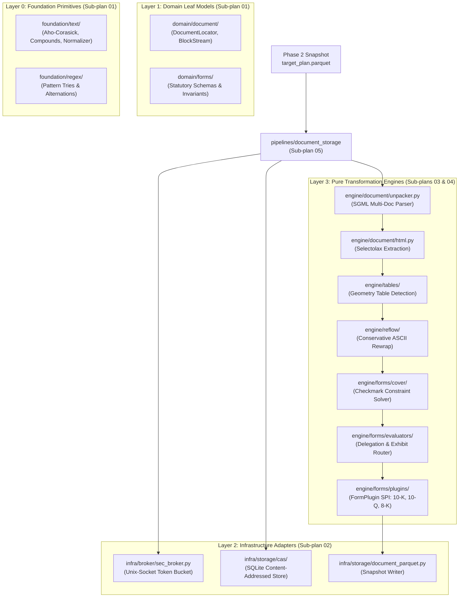
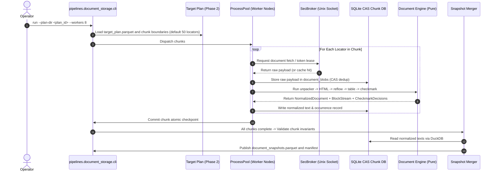

# Master Plan: Phase 2.5 Clean Slate Implementation (`edgar_sec.pipelines.document_storage`)

> [!IMPORTANT]
> **Status:** Proposed Master Architecture & Implementation Plan  
> **Predecessors:** 
> - [Phase 1 (`metadata_sync`)](file:///home/denny/edgar-sec/roadmap/refactor_v2/phase_1.md): COMPLETE (158 tests passing).
> - [Phase 2 (`filing_catalog`)](file:///home/denny/edgar-sec/roadmap/refactor_v2/phase_2.md): COMPLETE (612 tests passing, Stage A & B done).
> **Target Scope:** Comprehensive implementation of Phase 2.5 (Document Storage, HTML/ASCII Normalization, Reflow, Table Tagging, and Cover Checkmark Solving). Phase 2.5 consumes the Phase 2 `target_plan.parquet` and produces content-addressed normalized document snapshots.
> **Scope Scale:** Phase 2.5 encompasses ~363 unported `.v1` files (~50,000+ lines of dense engine, layout, and storage code). Because of this scale, the implementation plan is decomposed into **six modular, linked sub-plans** anchored by this master specification.

---

## 1. Executive Summary & Architecture Map

Phase 1 established submissions metadata extraction; Phase 2 established zero-network catalog materialization and deterministic/stratified target planning.

**Phase 2.5 is the heavy industrial core of `edgar-sec`:**
1. It ingests the Phase 2 `target_plan.parquet` (containing accession numbers, form types, primary documents, and policy weights).
2. It fetches primary SEC filings via a managed Unix-socket token-bucket broker (`SecBroker`, enforcing configured rate limits across arbitrary worker pools).
3. It unrolls multi-document SGML containers (`.nc`, `.txt`), parses HTML trees via `selectolax`, and strips page markers and non-body boilerplate.
4. It detects and protects table geometry, and executes conservative ASCII reflow to produce clean plain-text representations.
5. It runs quadratic-penalty constraint satisfaction over statutory cover-page checkmarks (WKSI, Shell, Filer Status, etc.).
6. It evaluates form delegation (e.g. 10-K delegating financial statements to Exhibit 13) and executes targeted second-pass acquisitions.
7. It stores raw payloads in a local Content-Addressed Storage (CAS) SQLite database and publishes immutable, versioned Parquet document snapshots.



---

## 2. The Six Modular Sub-Plans

Due to the substantial size and distinct failure domains of the subsystems in Phase 2.5, the plan is divided into six self-contained, sequentially actionable specifications:

| Sub-Plan | Document Link | Primary Responsibility | `.v1` Source Footprint | Target `edgar_sec/` Layers |
| :--- | :--- | :--- | :--- | :--- |
| **01** | [Foundation & Domain](file:///home/denny/edgar-sec/roadmap/refactor_v2/phase_2_5/01_foundation_and_domain.md) | Text normalizers, Aho-Corasick automaton, compound words, regex tries, and leaf domain models (`DocumentLocator`, `FilingOccurrence`, `BlockStream`). | `defs/text/bow.py`, `compounds.py`, `defs/regex/`, `defs/sec_documents/records.py` | `foundation/text/`, `foundation/regex/`, `domain/document/`, `domain/forms/` |
| **02** | [Infra: Broker & CAS](file:///home/denny/edgar-sec/roadmap/refactor_v2/phase_2_5/02_infra_broker_and_cas.md) | Multi-process Unix-socket `SecBroker` rate limiter (configured token bucket), SQLite Content-Addressed Storage (`document_blobs`), and database vacuuming. | `defs/sec_http/broker.py`, `defs/sql/`, `phases/025/.../chunk_persistence.py` | `infra/broker/`, `infra/storage/cas/`, `infra/storage/` |
| **03** | [Engine: Document & Reflow](file:///home/denny/edgar-sec/roadmap/refactor_v2/phase_2_5/03_engine_document_and_reflow.md) | Multi-document SGML unrolling, `selectolax` HTML parsing, page-marker stripping, and conservative ASCII reflow engine. | `defs/sec_documents/preprocessor.py`, `defs/text/html.py`, `defs/text/page_markers.py`, `defs/text/reflow/` | `engine/document/`, `engine/reflow/` |
| **04** | [Engine: Tables & Forms](file:///home/denny/edgar-sec/roadmap/refactor_v2/phase_2_5/04_engine_tables_and_forms.md) | Geometry-first table detection, tagged table markers (`<TABLE>`), cover checkmark quadratic-penalty solver, evaluators (delegation), and `FormPlugin` SPI. | `defs/tables/`, `defs/sec_forms/cover/`, `defs/sec_forms/normalization/`, `defs/sec_forms/evaluators/` | `engine/tables/`, `engine/forms/` |
| **05** | [Pipeline Orchestration](file:///home/denny/edgar-sec/roadmap/refactor_v2/phase_2_5/05_pipeline_orchestration.md) | Batch chunk workers, process pool concurrency, target plan execution, resumable checkpoints, exhibit delegation, vacuuming, interactive operator menu, and CLI. | `phases/025_webpage_storage/core/`, `phases/025_webpage_storage/run.py`, `cli.py` | `pipelines/document_storage/` |
| **06** | [Testing & Golden Harness](file:///home/denny/edgar-sec/roadmap/refactor_v2/phase_2_5/06_testing_and_golden_harness.md) | Visual inspection review tool (`python run.py review`), plain-text archetype goldens in `tests/fixtures/archetypes/` (JNJ, Apple, Berry, Kellogg), and engine regression suites. | `phases/025_webpage_storage/tools/build_document_review_artifacts.py`, `defs/tests/` | `tests/fixtures/archetypes/`, `tests/engine/`, `tests/pipelines/document_storage/` |

---

## 3. Upstream Handoff: Consuming Phase 2 Artifacts

Phase 2.5 does **not** read Phase 1 metadata directly. It consumes the published output of Phase 2:

### Input Contract: `target_plan.parquet`
```text
.artifacts/filing_extraction/target_plans/<plan_id>/
├── target_plan.parquet              # Canonical document targets to fetch and normalize
├── plan_manifest.json               # Input fingerprint, locator counts, parameters
└── partitions/                      # Sharded target lists for distributed processing
```

### Schema Invariants Expected from Phase 2
- `document_locator_key`: Unique string identifier: `sha256(accession_number + ":" + document_path)`.
- `accession_number`: Canonical 20-character accession string (`0000320193-23-000106`).
- `source_cik`: 10-digit zero-padded CIK string.
- `form`: Normalized form type (`10-K`, `10-Q`, `8-K`, etc.).
- `filing_date`: Date string `YYYY-MM-DD`.
- `document_path`: Relative document path within accession (`form10k.htm`, `primary_doc.txt`).
- `document_path_source`: Origin indicator (`primary_document`, `submission_bundle`).
- `selection_weight`: Priority weight (from Phase 2 policy selection).

---

## 4. Phase 2.5 Execution & Resumability Lifecycle

Phase 2.5 operates through a robust, resumable, multi-process batch execution pipeline:



---

## 5. Milestone Rollout Roadmap

The implementation is executed across five chronological stages matching the sub-plans:


### Milestone Checklist:
- [ ] **Stage 1 (Sub-plans 01 & 02)**: Foundation text algorithms, domain models, Unix-socket `SecBroker`, SQLite CAS chunk store, and schema definitions.
- [ ] **Stage 2 (Sub-plan 03)**: SGML unpacker, selectolax HTML normalization, page-marker cleaner, and conservative ASCII reflow engine.
- [ ] **Stage 3 (Sub-plan 04)**: Table boundary detection, tagged table formatting, cover checkmark quadratic-penalty solver, evaluators, and `FormPlugin` SPI.
- [ ] **Stage 4 (Sub-plan 05)**: Process-pool chunk workers, resumability ledger, exhibit delegation, partition merger, interactive operator wizard, and CLI.
- [ ] **Stage 5 (Sub-plan 06)**: Visual review tool (`python run.py review`), plain-text archetype validation in `tests/fixtures/archetypes/` (JNJ, Apple, Berry, Kellogg), and verification of all 14 repository policy scanners.

---

## 6. Verification & Quality Gates

| Gate Check | Threshold / Requirement | Verification Method |
| :--- | :--- | :--- |
| **Layer Acyclicity** | Downward-only imports: `pipelines` &rarr; `engine` &rarr; `infra` &rarr; `domain` &rarr; `foundation`. | `check.py --scan` (`layer-boundary` scanner) |
| **Deterministic Output** | 100% character-for-character normalization parity on golden archetypes. | `pytest testing/goldens/test_document_goldens.py` |
| **Pacing Compliance** | Never exceeds configured rate limits across multi-process workers; zero 429 rate-limit errors from SEC. | Multi-worker soak test with mock/live broker |
| **Memory Invariance** | glibc arena reclamation (`malloc_trim(0)`) at chunk intervals; 0 memory leaks. | cgroup memory monitoring during 1,000-document run |
| **Zero Code Leaks** | 0 direct `os.environ` calls, 0 raw SQL strings outside `infra`, 0 hardcoded `.artifacts` strings. | All 14 policy scanners in `check.py --scan` pass cleanly |
