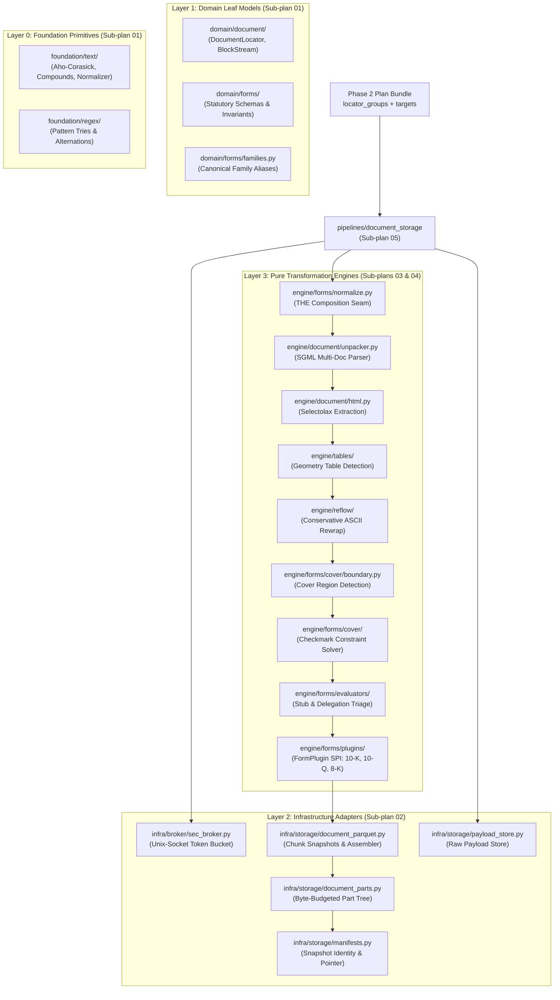
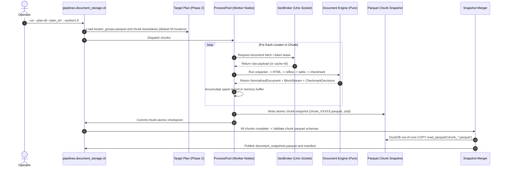
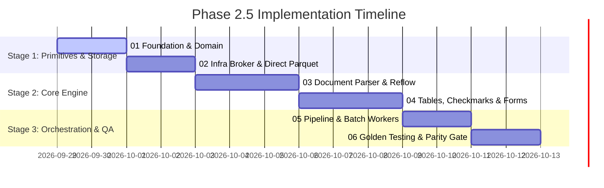

# Master Plan: Phase 2.5 Clean Slate Implementation (`edgar_sec.pipelines.document_storage`)

> [!IMPORTANT]
> **Status:** IMPLEMENTED, with M6.3/M6.4 deferred (see §7).  
> **Predecessors:** 
> - [Phase 1 (`metadata_sync`)](file:///home/denny/edgar-sec/roadmap/refactor_v2/phase_1.md): feature-complete, with documented scope reductions (see that document's §10).
> - [Phase 2 (`filing_catalog`)](file:///home/denny/edgar-sec/roadmap/refactor_v2/phase_2.md): COMPLETE.
> **Target Scope:** Comprehensive implementation of Phase 2.5 (Document Storage, HTML/ASCII Normalization, Reflow, Table Tagging, and Cover Checkmark Solving). Phase 2.5 consumes a published Phase 2 plan bundle and produces content-addressed normalized document snapshots.
> **Scope Scale:** Phase 2.5 encompasses ~363 unported `.v1` files (~50,000+ lines of dense engine, layout, and storage code). Because of this scale, the implementation plan is decomposed into **six modular, linked sub-plans** anchored by this master specification.

---

## 1. Executive Summary & Architecture Map

Phase 1 established submissions metadata extraction; Phase 2 established zero-network catalog materialization and deterministic/stratified target planning.

**Phase 2.5 is the heavy industrial core of `edgar-sec`:**
1. It ingests a published Phase 2 plan bundle: `locator_groups.parquet` (documents to fetch) and `targets/form=*/data.parquet` (the registrants claiming them).
2. It fetches primary SEC filings via a managed Unix-socket broker (`SecBroker`, enforcing configured rate limits across arbitrary worker pools through adaptive slot spacing).
3. It unrolls multi-document SGML containers (`.nc`, `.txt`), parses HTML trees via `selectolax`, and strips page markers and non-body boilerplate.
4. It detects and protects table geometry, and executes conservative ASCII reflow to produce clean plain-text representations.
5. It runs quadratic-penalty constraint satisfaction over statutory cover-page checkmarks (WKSI, Shell, Filer Status, etc.).
6. It evaluates form delegation (e.g. 10-K delegating financial statements to Exhibit 13) and executes targeted second-pass acquisitions.
7. It serializes chunk snapshots directly to immutable, compressed Parquet files and publishes sorted final artifacts via DuckDB out-of-core assembly.



> [!IMPORTANT]
> **The composition seam is the keystone.** Every other engine stage already
> existed as a pure function; nothing composed them. `engine/forms/normalize.py`
> is the one place the stage *order* is written, and it is the load-bearing
> invariant: the cover boundary is detected on the pre-reflow frame that the
> checkmark solver edits, and every line anchor is remapped through
> `build_line_mapper` afterwards. Reflow must never run before the boundary is
> detected.

> [!NOTE]
> **Layer placement is not a stylistic choice.** A fetcher cannot live in
> `infra`: it calls the engine's SGML unpacker, and the `layer-boundary`
> scanner rejects an upward import. That is why the fetcher, worker, merger,
> vacuum, queries, and review all sit under `pipelines/document_storage/`, while
> the payload store, part tree, and manifest machinery they use sit in
> `infra/storage/`.

---

## 2. The Six Modular Sub-Plans

Due to the substantial size and distinct failure domains of the subsystems in Phase 2.5, the plan is divided into six self-contained, sequentially actionable specifications:

| Sub-Plan | Document Link | Primary Responsibility | `.v1` Source Footprint | Target `edgar_sec/` Layers |
| :--- | :--- | :--- | :--- | :--- |
| **01** | [Foundation & Domain](file:///home/denny/edgar-sec/roadmap/refactor_v2/phase_2_5/01_foundation_and_domain.md) | Text normalizers, Aho-Corasick automaton, compound words, regex tries, and leaf domain models (`DocumentLocator`, `FilingOccurrence`, `BlockStream`). | `defs/text/bow.py`, `compounds.py`, `defs/regex/`, `defs/sec_documents/records.py` | `foundation/text/`, `foundation/regex/`, `domain/document/`, `domain/forms/` |
| **02** | [Infra: Broker & Direct Parquet Snapshots](file:///home/denny/edgar-sec/roadmap/refactor_v2/phase_2_5/02_infra_broker_and_cas.md) | Multi-process Unix-socket `SecBroker` rate limiter (adaptive slot spacing, configurable) and PyArrow/DuckDB direct Parquet chunk snapshots. | `defs/sec_http/broker.py`, `phases/025/.../snapshot_merge.py` | `infra/broker/`, `infra/storage/` |
| **03** | [Engine: Document & Reflow](file:///home/denny/edgar-sec/roadmap/refactor_v2/phase_2_5/03_engine_document_and_reflow.md) | Multi-document SGML unrolling, `selectolax` HTML parsing, page-marker stripping, and conservative ASCII reflow engine. | `defs/sec_documents/preprocessor.py`, `defs/text/html.py`, `defs/text/page_markers.py`, `defs/text/reflow/` | `engine/document/`, `engine/reflow/` |
| **04** | [Engine: Tables & Forms](file:///home/denny/edgar-sec/roadmap/refactor_v2/phase_2_5/04_engine_tables_and_forms.md) | Geometry-first table detection, tagged table markers (`<TABLE>`), cover checkmark quadratic-penalty solver, evaluators (delegation), and `FormPlugin` SPI. | `defs/tables/`, `defs/sec_forms/cover/`, `defs/sec_forms/normalization/`, `defs/sec_forms/evaluators/` | `engine/tables/`, `engine/forms/` |
| **05** | [Pipeline Orchestration](file:///home/denny/edgar-sec/roadmap/refactor_v2/phase_2_5/05_pipeline_orchestration.md) | Batch chunk workers, process pool concurrency, target plan execution, resumable checkpoints, exhibit delegation, vacuuming, interactive operator menu, and CLI. | `phases/025_webpage_storage/core/`, `phases/025_webpage_storage/run.py`, `cli.py` | `pipelines/document_storage/` |
| **06** | [Testing & Golden Harness](file:///home/denny/edgar-sec/roadmap/refactor_v2/phase_2_5/06_testing_and_golden_harness.md) | Review harness (`python run.py documents review`), pinned normalization goldens in `tests/fixtures/document_storage/`, and engine regression suites. Real-filing archetypes (M6.3/M6.4) are deferred. | `phases/025_webpage_storage/tools/build_document_review_artifacts.py`, `defs/tests/` | `tests/fixtures/document_storage/`, `tests/engine/`, `tests/pipelines/document_storage/` |

---

## 3. Upstream Handoff: Consuming Phase 2 Artifacts

Phase 2.5 does **not** read Phase 1 metadata directly. It consumes the published output of Phase 2.

### Input Contract: the published plan bundle

A plan bundle is a **directory** under the artifacts root. The layout below is
what Phase 2 actually publishes; an earlier version of this section named
`target_plan.parquet`, `plan_manifest.json`, and a `partitions/` directory, none
of which exist.

```text
{artifacts_root}/filing_catalog/<plan_id>/
├── plan.json                          # Identity, counts, selection policy, plan_fingerprint
├── selection_report.json              # Audit-only; no machine reads it
├── seed_filers.csv                    # policy scope only: the normalized seed set
├── locator_groups.parquet             # THE WORK ORDER: one row per unique document
├── reserve_targets.parquet            # policy scope only: held-back locators
├── expansion_metadata.json            # child plans only: parent/child lineage
└── targets/form=<FORM>/data.parquet   # THE OCCURRENCES: one row per registrant
```

There are two surfaces, and they are not interchangeable:

- **`locator_groups.parquet`** is the work order. One row per unique
  `document_locator_key`, already sorted. This is what Phase 2.5 fetches.
- **`targets/form=<FORM>/data.parquet`** carries occurrences — a registrant's
  claim on a document. Phase 2.5 needs these to attribute fetched content back
  to registrants.

### Schema invariants expected from Phase 2

Verified against `edgar_sec/pipelines/filing_catalog/`, the Phase 2.5 contract
tests, and `domain/filing_catalog/schemas.py`.

On the work order (`locator_groups.parquet`):

- `document_locator_key`: `sha256(accession + ":" + document_path)`. Unique
  across the file and sorted. A document co-filed by two registrants appears
  **once** — this is what lets Phase 2.5 fetch it once.
- `representative_accession`: the canonical accession, **18 characters, no
  dashes** (`000032019323000106`). It is not `accession_number`, and it is not
  the 20-character dashed form.
- `representative_cik`: 10-digit zero-padded CIK.
- `document_path`: relative path within the accession.
- `archive_url`: an HTTPS URL agreeing with the one Phase 1's engine would
  build. Phase 2 rejects the bundle if any row disagrees.
- Column count differs by scope: 8 for a deterministic plan, 18 for a policy
  plan. The identity columns are common to both; do not hard-code either count.

On the occurrences (`targets/form=<FORM>/data.parquet`):

- The schema is **scope-specific and must not be assumed identical between
  scopes.** A deterministic plan publishes the raw `TARGET_COLUMNS` (16 columns).
  A policy plan publishes the feature-enriched occurrence rows it selected from,
  which add the stratification dimensions. Both are pinned in
  `tests/pipelines/filing_catalog/test_phase25_contract.py`.
- What both scopes guarantee: `occurrence_id` and `document_locator_key` are
  present, and every `document_locator_key` appears in the work order.
- There is **no `selection_weight` column.** Priority lives in the policy
  document embedded in `plan.json`, not as a per-row weight.

Integrity: a published bundle records a `plan_fingerprint` in `plan.json`,
covering the plan identity plus its selected locator keys. Phase 2 refuses to
reuse a bundle whose work order no longer matches. Phase 2.5 should treat the
bundle as immutable input and verify the fingerprint if it copies or caches it.

---

## 4. Phase 2.5 Execution & Resumability Lifecycle

Phase 2.5 operates through a robust, resumable, multi-process batch execution pipeline:



---

## 5. Milestone Rollout Roadmap

The implementation is executed across five chronological stages matching the sub-plans:



### Milestone Checklist:
- [x] **Stage 1 (Sub-plans 01 & 02)**: Foundation text algorithms, domain models, Unix-socket `SecBroker`, and direct Parquet chunk snapshot writer.
- [x] **Stage 2 (Sub-plan 03)**: SGML unpacker, HTML normalization, page-marker cleaner, and conservative ASCII reflow engine.
- [x] **Stage 3 (Sub-plan 04)**: Table boundary detection, tagged table formatting, cover checkmark quadratic-penalty solver, cover region detection, evaluators, and the `FormPlugin` SPI — including the composition seam itself.
- [x] **Stage 4 (Sub-plan 05)**: Process-pool chunk workers, resumable chunk checkpoints, exhibit delegation, snapshot merger, cross-run consolidation (`vacuum_snapshots`), and the `run.py documents` CLI.
- [x] **Stage 5 (Sub-plan 06, partial)**: Review harness (`run.py documents review`), pinned normalization goldens in `tests/fixtures/document_storage/`, and verification against all **11** registered policy scanners. M6.3/M6.4 are deferred — see §7.

### v1 Retirement Readiness (measured, not projected)

The Phase 2.5 sub-plans each closed by claiming a v1 file was superseded. The
repo-wide measurement in `v1_retirement.tsv` says how much of that is now safe to
act on. Of the 570 v1 files, **25 (6,551 loc) are individually deletable today**:
a v2 module carries the responsibility, a v2 test imports it, and no retained v1
file still does. A further 34 are superseded and tested but blocked by retained
v1 dependents, and 34 need evidence. 477 are still unexamined pending the §9
re-audit, so this is a floor, not a ceiling.

| verdict | files | v1 loc |
| :--- | ---: | ---: |
| `DELETE_NOW` | 25 | 6,551 |
| `BLOCKED_FOREVER` | 34 | 7,364 |
| `NEEDS_EVIDENCE` | 34 | 10,706 |
| `UNCLAIMED` (provisional) | 477 | 85,601 |

Two Phase 2.5 sub-plans can retire v1 code immediately: **Sub-plan 03** (document
parsing and reflow — `text/html/{tree,cleaner}.py`, `text/reflow/{engine,types}.py`,
`sec_documents/sgml.py`) and **Sub-plan 05** (orchestration — all seven
`phases/025_webpage_storage/core/` files it replaced). Sub-plans 01, 02, 04 and
06 are largely blocked: their v1 counterparts are imported by retained v1 code.

> [!WARNING]
> **`.v1` is not tracked in git** (matched by `.gitignore:225:.*`), so deletion is
> irreversible. Archive before deleting, and delete each module together with the
> v1 tests that reference it — 57 of the 25 eligible files have such tests. Full
> conditions and method: `v2_refactor_roadmap.md` §9.7.

> [!NOTE]
> **M4.3 shipped with documented scope reductions.** The v1 cover subsystem's real
> dependency closure is ~3,265 loc, not the ~996 the original inventory claimed.
> Two of its dependencies have no v2 port and were replaced with scoped
> equivalents rather than a 4x scope expansion: the tiered bag-of-words lexical
> engine (`defs/text/bow/`, 1,234 loc) became a single-tier Aho-Corasick match
> over a generic body-prose vocabulary, scored onto v1's same 0-3 scale; and the
> logical-unit classifier became line-level structural and lexical gates. The
> `TOC_TRANSITION` signal uses v1's heading-based path rather than the
> `find_toc_span` refinement, because no v2 TOC span finder exists.

---

## 6. Verification & Quality Gates

| Gate Check | Threshold / Requirement | Verification Method |
| :--- | :--- | :--- |
| **Layer Acyclicity** | Downward-only imports: `pipelines` &rarr; `engine` &rarr; `infra` &rarr; `domain` &rarr; `foundation`. | `check.py --scan` (`layer-boundary` scanner) |
| **Deterministic Output** | Pinned cover boundary, body anchor, closing span, evaluator verdict, and stage order for every committed golden. | `.venv/bin/pytest tests/engine/forms/test_normalization_goldens.py` |
| **Pacing Compliance** | Never exceeds configured rate limits across multi-process workers; zero 429 rate-limit errors from SEC. | Multi-worker soak test with mock/live broker |
| **Memory Invariance** | glibc arena reclamation (`malloc_trim(0)`) at bounded intervals, and `max_tasks_per_child` recycling in the process pool. | cgroup memory monitoring during a 1,000-document run |
| **Snapshot Immutability** | A published snapshot is never overwritten; consolidation refuses a re-derived id; a purge is refused while a retained snapshot references a source part. | `tests/pipelines/document_storage/test_vacuum.py` |
| **Zero Code Leaks** | 0 direct `os.environ` reads outside `foundation/runtime/env.py`, 0 hardcoded `.artifacts` literals outside path resolvers, no secrets, no `sys.exit()` in library code, 0 upward imports, 0 hardcoded thread/memory limits. | All **7** registered policy scanners in `.venv/bin/python check.py --scan` |

> [!NOTE]
> There is no raw-SQL boundary in v2 and never was. The `sql-boundary` scanner was
> not ported, and SQL strings already exist in `engine/selection/source.py` and
> `pipelines/filing_catalog/planner.py`. Consolidation therefore builds direct SQL
> strings in `pipelines/document_storage/queries.py`, and the invariant actually
> worth holding is a convention: all consolidation SQL text lives in that one
> module and executes only on connections from `infra/storage/duckdb.py`.

---

## 7. Deferred Work

| Item | Why deferred |
| :--- | :--- |
| **M6.3** — real historical filing fixtures in `tests/fixtures/archetypes/` | Requires committing real SEC filings. Deliberately out of scope until a sanitization and licensing decision is made. |
| **M6.4** — golden comparison against promoted real-filing outputs | Depends on M6.3. |
| **M6.5** golden coverage for real filings | The synthetic goldens in `tests/fixtures/document_storage/` cover the pipeline's own behaviour; parity against real filings waits on M6.3. |

What shipped in their place: two committed **synthetic** goldens (ASCII and
HTML, the latter exercising the `<TABLE>` byte-preservation invariant) that pin
the cover region, body anchor, closing span, evaluator verdict, and stage order.
These catch a refactor silently moving a boundary, dropping a stage, or changing
an evaluator's conclusion — offline, deterministically, in under a second.
