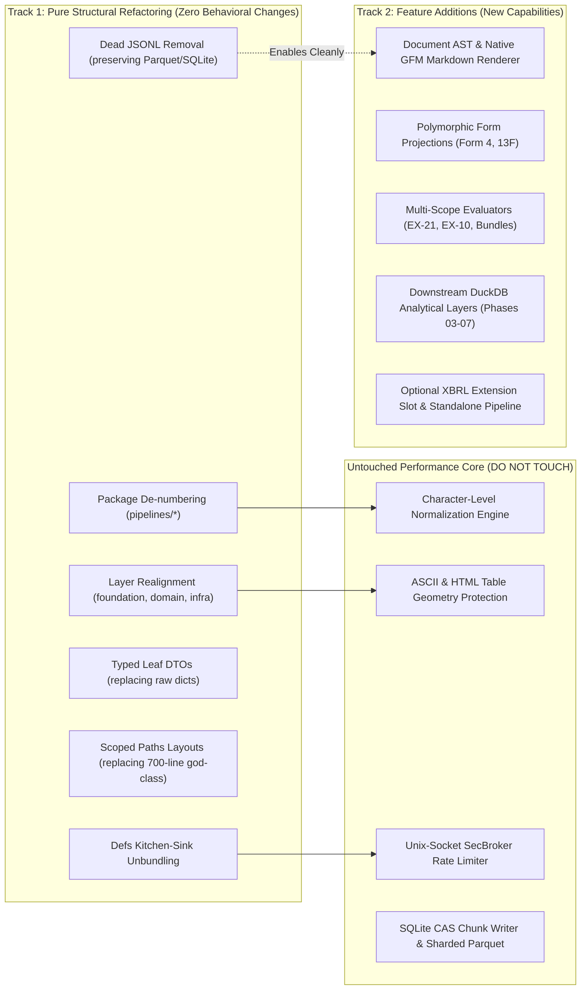
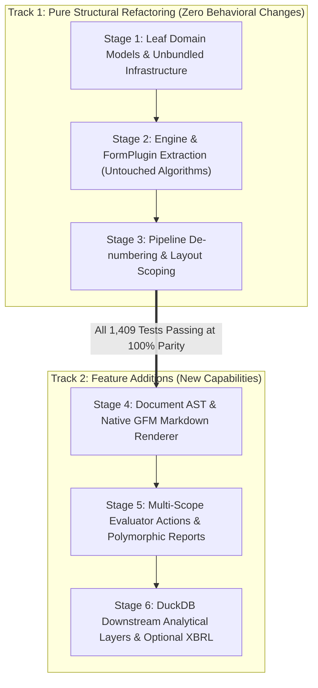

# Blueprint: Architecture & Repository Redesign (v2)

> [!NOTE]
> **Status:** Track 1 stages for **Phase 1 and Phase 2 are implemented** (627 tests, full gate green). Phases 2.5+ not started.  
> **Reading note:** §§1.1, 1.4, and 1.5 inventory the **v1** tree and are kept as the historical record. The **8-layer** layout sketched in §2/§3/§6 was reconciled down to the **5-layer** contract in `AGENTS.md`, which is normative and is what `check.py` enforces. §0 records that reconciliation.  
> This document captures the target architecture for transitioning `edgar-sec` from its v1 architecture (`defs/` + numbered `phases/` with raw string coordinate remapping) to a mature, layered Domain-Driven Design (DDD) incorporating proven Document AST patterns from `edgartools` while preserving our production data-warehouse foundations.

---

## 0. Layer Reconciliation (8-Layer Proposal → 5-Layer Contract)

> [!IMPORTANT]
> **This section is normative and supersedes the 8-layer layout sketched in
> §§2, 3, 3.1, and 6 below.** Those sections are retained as the original design
> intent; where they disagree with this section, this section is what the code
> does and what the gate enforces.

The original proposal used eight layers, giving `documents/` and `forms/` their
own tier above `infra/`. Implementation collapsed that to the five layers already
normative in `AGENTS.md`, for two reasons.

**1. The extra tiers bought nothing the scanner could not enforce.** With
`documents/` between `infra/` and `engine/`, the scanner's rule set grows to
eight clauses and two of them ("may import `documents`", "may import `forms`")
exist only to permit a layer that was going to be reached anyway. Five clauses
cover the same ground.

**2. `documents/` was not a layer, it was a package.** `DocumentRepresentation`
and the block stream are domain models — typed, pure, no I/O. Placing them at a
tier that may import `infra` would have let a document model reach a database
driver, which is precisely the leak §1.4 exists to stop. They now live in
`domain/documents/`, where that is structurally impossible.

| 8-layer proposal | 5-layer contract | Rationale |
| :--- | :--- | :--- |
| `apps/` | root `run.py` launcher | A launcher, not a package. It dispatches by registry entry and imports no pipeline internals. |
| `pipelines/` | `pipelines/` (Layer 4) | Unchanged. |
| `engine/` | `engine/` (Layer 3) | Unchanged; additionally owns `engine/forms/` (below). |
| `forms/` | `engine/forms/` | Form plugins are *transformations* over a document representation, so they belong with the other engines rather than in a tier that can reach `infra`. |
| `documents/` | `domain/documents/` | Typed block stream and representation are pure domain models. |
| `infra/` | `infra/` (Layer 2) | Unchanged. |
| `domain/` | `domain/` (Layer 1) | Unchanged. |
| `foundation/` | `foundation/` (Layer 0) | Unchanged. |

The five layers are what `check.py`'s `layer-boundary` scanner enforces, in the
direction written in `AGENTS.md` §1:

```text
Layer 4  pipelines/    may import  engine, infra, domain, foundation
Layer 3  engine/       may import  infra, domain, foundation
Layer 2  infra/        may import  domain, foundation
Layer 1  domain/       may import  foundation
Layer 0  foundation/   zero internal dependencies on upper layers
```

`documents/`, `forms/`, and `apps/` are therefore **future packages under
existing layers**, not future layers. Phase 2.5 introduces
`domain/documents/` and `engine/forms/`; no change to the scanner is required,
and none will be granted.

---

## 1. Executive Summary & Design Vision

### Why Redesign?
The v1 architecture successfully solved critical algorithmic challenges: multi-process SEC rate pacing, atomic Parquet/SQLite publishing, cover checkmark constraint satisfaction, and ASCII table protection. However, two structural liabilities have emerged:
1. **The "Two-Bucket Fallacy" (`defs/` vs `phases/`)**: Because every non-phase component was pushed into `defs/`, `defs/` has become a flat kitchen sink where low-level regexes, database drivers, form vocabularies, normalization engines, and a full web application server sit as peers. This produces near-circular dependencies managed by fragile lazy imports.
2. **String-Offset Manipulation & Coordinate Drift**: Documents are represented as raw Python `str` with external line numbers. Stripping tags, page markers, or reflowing prose alters line indices, necessitating complex `build_line_mapper()` closures.
3. **Numbered Directory Constraints**: Numbers in package names (`phases/025_webpage_storage`) cause Python import syntax hurdles, requiring dynamic `importlib.import_module` calls.

### Core Philosophy of v2
- **Layered Clean Architecture (No numbered folders)**: Strict downward-only imports enforced at CI time.
- **Flat 1D Block Representation**: Parse filings into a linear stream of typed blocks (`DocumentRepresentation` -> `DocumentBlock[PARAGRAPH, TABLE, PRESERVED, PAGE_BREAK]`). Section bookmarks are established separately in Phase 03 TOC Spine, guaranteeing zero coordinate drift without recursive JSON overhead.
- **FormPlugin SPI (Inversion of Control)**: Each SEC form (10-K, 10-Q, 8-K, Form 4 XML, Form 13F) is a self-contained plugin registering with a lightweight registry. Adding a form never touches core engines or storage pipelines.
- **Preserve Industrial Data-Engineering Strengths**: Retain our central Unix-socket `SecBroker` (4 RPS token bucket), immutable PyArrow/DuckDB dataset publishing, SQLite chunk isolation, and policy scanners.

---

## 1.1. Ground Truth: What Actually Exists Today (from Component READMEs)

To prevent designing against nonexistent abstractions or mischaracterizing existing code, the following inventory is derived directly from component READMEs:

| Component | Actual Directory | Primary Responsibility & Invariants |
| :--- | :--- | :--- |
| **Phase 01** | `phases/01_metadata_extraction/` | **Submissions Metadata Extraction** (`README.md`): Fetches SEC `data.sec.gov/submissions` feed via thread pool. Normalizes historical + recent filings into one row per CIK in `submission_metadata.parquet`. Owns CIK source registry, listing snapshots, and augmentation delta planning. |
| **Phase 02** | `phases/02_filing_extraction/` | **Filing Catalog & Planning** (`README.md`): **Zero network calls**. Materializes nested filing observations from Phase 01 Parquet into form-partitioned catalogs using DuckDB staging. Generates immutable target plans (`deterministic` or `policy-driven`) for Phase 2.5. |
| **Phase 2.5** | `phases/025_webpage_storage/` | **Webpage Storage & Normalized Snapshots** (`README.md`): Consumes Phase 02 target plans. Fetches raw HTML/SGML/iXBRL documents via managed `SecBroker` (production) or offline SQLite CAS (fixture). Runs `DocumentPreprocessor` and `DocumentNormalizer`. Persists isolated SQLite chunks and publishes versioned snapshot Parquets. |
| **Shared Infra** | `defs/` | **Reusable Infrastructure** (`README.md`):<br>• `sec_http/`: Managed Unix-socket `SecBroker` (aggregate 4 RPS limiter, SQLite response cache, failure ledger).<br>• `sec_documents/`: `DocumentPreprocessor`, `DocumentRepresentation`, SGML multi-document unpacker.<br>• `sec_forms/`: Form evaluators (`AnnualEvaluator`, `QuarterlyEvaluator`, `CurrentReportEvaluator`), normalization pipelines, and cover page matchers.<br>• `storage/`: PyArrow dataset partitioning, SQLite chunk backends, atomic publication.<br>• `sql/`: Typed SQL AST compiler and `SqlExecutor`.<br>• `text/`: Syntax, structure, Aho-Corasick automaton, compounds, HTML parser, and table-protecting ASCII reflow.<br>• `tables/` & `taxonomy/`: Geometry-first table detection and financial table taxonomy classification.<br>• `runtime/`: Dotted settings registry, paths, env resolution, progress adapters.<br>• `viewer/`: Read-only dataset browser and DuckDB query UI. |

---

## 1.2. What Remains Unchanged (Preserved) vs What is Newly Proposed in v2

| Dimension | What Remains Unchanged (Preserved from v1) | What is Newly Proposed (v2 Changes) |
| :--- | :--- | :--- |
| **Package Structure** | All underlying algorithmic logic and data models survive. | **Eliminate numbered directories** (`01_`, `02_`, `025_`). Transition into clean, unnumbered, acyclic layers. *(Proposed as eight tiers including `documents/`, `forms/`, and `apps/`; reconciled to the five-layer contract of §0, which is what ships.)* |
| **Phases & Pipelines** | Algorithmic logic of Phases 01, 02, and 025 remains intact. | Map to semantic names: `pipelines/metadata_sync` (Phase 01), `pipelines/filing_catalog` (Phase 02), `pipelines/document_storage` (Phase 025). |
| **Document Ingestion** | Primary document fetched by default (~2MB); Exhibit 13 refetched on delegation. | **Document AST (`documents/`)**: Tree of `Node` subclasses replacing raw string line-offset manipulation (`build_line_mapper()`). |
| **Form Evaluators** | Form evaluation contract (detecting stubs/delegation). | Evaluator returns multi-scope `DecisionAction` (`ACCEPT`, `REFETCH_EXHIBIT`, `REFETCH_BUNDLE`, `REFETCH_SUMMARY_XML`), allowing dynamic acquisition scope per form. |
| **Filing Model** | Underlying identifiers (`source_cik`, `accession`, `document_path`). | Unified **`FilingAggregate`** (inspired by `edgartools`, but sparse/partially-filled by default). |
| **Extraction Format** | Clean plain-text normalized documents. | **Native GitHub-Flavored Markdown (GFM)** rendered directly from AST nodes for LLM phases. |
| **SEC Broker & Pacing** | **Unix-socket `SecBroker`** (4 RPS aggregate token bucket, warm-cache probe). | Preserved 100%. Relocated to `infra/broker/`. |
| **Persistence & Storage** | PyArrow datasets, SQLite chunks, DuckDB queries via `defs.sql`. | Preserved 100%. Relocated to `infra/storage/`. |
| **Quality Gate** | `check.py` with policy scanners, ruff format/check, test suites. | Preserved 100%, plus an automated **AST Layer-Boundary Scanner** to enforce downward-only imports. (v1 had 14 scanners; v2 ships **7** — `environment-access`, `artifact-paths`, `secrets-leakage`, `clean-exit`, `file-length`, `layer-boundary`, `resource-allocation`.) |

---

## 1.3. Explicit Decoupling: Pure Refactoring vs. Feature Additions

To ensure the refactoring does not compromise the system's speed or introduce feature bloat, we strictly separate **Pure Structural Refactoring** from **Feature Additions**.



### 1. Track 1: Pure Structural Refactoring (Zero Feature Creep, Zero Behavioral Change)
This track addresses code health, modularity, and circular import risks without changing runtime output or performance:
- **Eliminate Numbered Directories**: Move `phases/01_*`, `phases/02_*`, `phases/025_*` to `pipelines/metadata_sync`, `pipelines/filing_catalog`, and `pipelines/document_storage`.
- **Unbundle the `defs/` Kitchen-Sink**: Relocate low-level code into strict downward layers:
  - Zero-SEC utilities to `foundation/` (`text`, `regex`, `sql`, `runtime`).
  - Core domain models to `domain/` (`identity`, `records`, `taxonomy`).
  - External protocols and persistence to `infra/` (`http`, `broker`, `storage`).
- **Clean Leaf DTOs**: Replace loosely-typed dictionaries with immutable, validated dataclasses/Pydantic leaf models (`DocumentLocator`, `FilingOccurrence`, `FilingMetadata`).
- **Scoped Paths Layouts**: Retire the 700-line monolithic `defs/runtime/paths.py` god-class in favor of typed, per-pipeline layout objects (`pipelines/document_storage/paths.py`, `pipelines/metadata_sync/paths.py`).
- **Eliminate Dead Code**: Formally purge dead JSONL storage code (`ChunkBackend` JSONL options, `--storage-format jsonl`) that was superseded by Parquet and SQLite.
- **Strict Layer Boundary Scanner**: Add a scanner to `check.py` ensuring dependencies only flow downward.

### 2. The "Untouched & Protected" Performance Core
The following components are already highly optimized and **must NOT be rewritten or degraded** during refactoring:
- **Normalization Algorithm**: The character-level whitespace normalization, cover-page checkmark solver, and regex rules run in microseconds and pass v1's 1,409-test suite. They remain functionally intact. *(1,409 is v1's baseline. The v2 tree currently holds **627** tests: 158 migrated from Phase 1 plus 469 new across Phases 1 and 2. None of the character-level algorithms have been rewritten, so that coverage is preserved in substance but not yet in count — the engine's own relocation to `engine/` is Phase 2.5+ work.)*
- **Table Border & Geometry Detection**: The coordinate-based table detection in `defs/tables/` protects financial tables from corrupted wrapping. It must not be replaced by slow DOM-based parsing.
- **Unix-Socket `SecBroker`**: The 4 RPS central token bucket and SQLite warm-cache probe mechanism survive 100% intact, moving to `infra/broker/`.
- **Two-Tier Storage Backend**: SQLite worker chunking (`chunk-00001.db`) and atomic Parquet publishing remain the core persistence mechanism.

### 3. Track 2: Feature Additions (New Capabilities Built on the Clean Architecture)
These are net-new capabilities that build on the refactored architecture without burdening the core batch ingestion:
- **Feature A: Document AST & Native GFM Markdown Renderer**:
  Converts normalized document tokens into a block-level AST (`SectionNode`, `ParagraphNode`, `TableNode`) that renders directly to GitHub-Flavored Markdown for LLM ingestion.
- **Feature B: Polymorphic Form Projections**:
  Introduces specialized report models (`AnnualReport` with `sections` / `financial_statements`, `CurrentReport` with `items`, `InsiderOwnershipReport` with transactions) rather than forcing every form into a 10-K shape.
- **Feature C: Multi-Scope Evaluator Actions**:
  Expands form evaluators to return `DecisionAction` (`ACCEPT`, `REFETCH_EXHIBIT` for EX-21/EX-10, `REFETCH_BUNDLE` for pre-1998 SGML, or `REFETCH_SUMMARY_XML`).
- **Feature D: Downstream DuckDB-Native Warehouse Layers (Roadmap Phases 03–07)**:
  Analytical relational joins over Parquet datasets (`filing_sections.parquet`, `table_cells.parquet`, `thematic_spines.parquet`) executed in DuckDB.
- **Feature E: Optional XBRL Extension Slot & Standalone Pipeline**:
  An unpopulated `xbrl: Optional[XBRLData] = None` slot on filings, coupled with an optional pipeline to stream `*-xbrl.zip` / `_htm.xml` straight into `xbrl_facts.parquet` with zero raw HTML required.

---

## 1.4. Deep Phase Inventory & Trapped Domain/Infra Realignment

An exact file-by-file audit of the three existing phases reveals that the repository's code currently suffers from **Domain and Infrastructure Leaks**—core models, form vocabularies, and storage schemas that are trapped inside phase-specific directories:

### 1. Existing Phase File Distribution
```text
phases/
├── 01_metadata_extraction/               (38 files)
│   ├── cli.py, run.py, README.md
│   ├── core/
│   │   ├── application.py                # Pipeline coordinator & CLI workflow
│   │   ├── planning.py, chunks.py        # CIK partition & chunk planning
│   │   ├── fetch.py, sec_client.py       # Thread-pool SEC submissions fetcher
│   │   ├── checkpoints.py, merge.py      # Resumability & partition parquet merger
│   │   ├── augmentation.py               # Delta/incremental run planner
│   │   ├── source_registry.py, registry.py # CIK master catalog & input CSV parser
│   │   ├── schemas.py, storage.py        # Submissions schema & PyArrow sink
│   │   └── normalize/                    # <-- DOMAIN LEAK: Submissions JSON -> tabular record
│   │       ├── builder.py, filings.py, profile.py, helpers.py
│   └── tests/ (14 test files + fixtures)
│
├── 02_filing_extraction/                 (27 files)
│   ├── cli.py, run.py, README.md
│   ├── core/
│   │   ├── target_plan.py, plan_expansion.py, plan_publication.py # Target planning
│   │   ├── selection.py, selection_source.py, selection_inventory.py
│   │   ├── selection_policy.py, selection_features.py             # Policy filtering engine
│   │   ├── target_catalog.py, discovery.py, paths.py, schemas.py
│   │   ├── family_vocab.py, company_family.py  # <-- DOMAIN LEAK: SEC Form Families (10-K, 10-Q, 8-K)
│   │   └── materialize/                  # <-- INFRA/APP: DuckDB catalog unnesting
│   │       ├── engine.py, sql.py
│   └── tests/ (7 test files)
│
└── 025_webpage_storage/                  (38 files)
    ├── cli.py, run.py, README.md
    ├── core/
    │   ├── chunk_worker.py, pipeline.py  # Multi-process chunk execution engine
    │   ├── fetcher.py                    # Acquisition adapter (broker vs CAS fixture)
    │   ├── chunk_persistence.py, chunk_cache.py # SQLite chunk DB manager
    │   ├── partition_merger.py, snapshot_merge.py # Chunk integrity & parquet merger
    │   ├── partition_handoff.py, partition_reader.py, snapshot.py, vacuum.py
    │   ├── exhibit_second_pass.py        # EX-13 second pass runner
    │   ├── targets.py, run_status.py, queries.py, fixture_builder.py, schemas.py
    │   ├── processor.py                  # Pipeline step calling preprocessor/normalizer
    │   └── records.py                    # <-- DOMAIN LEAK: DocumentLocator, FilingOccurrence
    ├── testing/ & tools/                 # Corpus promotion & golden review toolchain
    └── tests/ (12 test files + golden fixtures)
```

### 2. Trapped Domain/Infra Realignment Matrix
Just as the document normalizer was extracted from `phases/025_` because it is generic document modeling, these trapped files must be relocated to their proper v2 architectural layers:

| Current File Location | Trapped Functionality | Target v2 Layer | Target File / Package | Status |
| :--- | :--- | :--- | :--- | :--- |
| `phases/025/.../records.py` | `DocumentLocator`, `FilingOccurrence`, `DocumentOccurrenceResult` | `domain/` | `domain/records.py` | **Pending** (Phase 2.5) |
| `phases/02/.../family_vocab.py` | *Company-name* clustering vocabulary: `ABBR_MAP`, `CONTEXT_RULES`, `PLURAL_MAP`, `STATE_CODES` | `domain/` | `domain/taxonomy/family_vocab.py` | **Built** |
| `phases/01/.../registry.py` | CIK master parsing and registration | `domain/` | `domain/identity.py` | **Built** |
| `phases/01/.../normalize/` | Parses SEC `submissions/CIK*.json` into tabular rows | `engine/` | `engine/submissions/` | **Built** |
| `phases/02/.../materialize/` | DuckDB SQL unnest engine for flattening JSON arrays | `infra/` | `infra/storage/duckdb_catalog.py` | **Built** |
| `phases/02/.../company_family.py` | Family clustering from the company-name vocabulary | `engine/` | `engine/company_family/` | **Built** |
| `phases/02/.../selection*.py` | Policy model, feature snapshot, deficit selector, candidate source, inventory | `engine/` | `engine/selection/` | **Built** |
| `phases/025/.../chunk_persistence.py` | SQLite chunk schema, WAL pragma setup, CAS inserts | `infra/` | `infra/storage/sqlite_cas.py` | **Pending** (Phase 2.5) |
| `phases/025/.../testing/` & `tools/` | Golden corpus comparison & review toolchain | `testing/` | `testing/goldens/` | **Pending** (Phase 2.5) |

> [!IMPORTANT]
> **Correction.** The original matrix described `phases/02/.../family_vocab.py` as *"SEC form classifications (`10-K`, `10-Q`, `8-K`, `20-F`)"* and targeted a single `domain/taxonomy.py`. Both were wrong on the merits.
>
> `family_vocab.py` contains **company-name** vocabulary for entity resolution — abbreviations, context disambiguation rules, plural forms, state codes. Form-family classification (`10-K/A` → `10-K`) lived in v1's `defs/sec_forms/families.py` and is a *selection* concern, not a taxonomy one: it is built by `form_family()` in `engine/selection/features.py` and emitted into the feature snapshot.
>
> The package is `domain/taxonomy/` with three modules, not one file: `jurisdictions.py` (`STATE_POSTAL_CODES`, `STATE_NAMES`), `legal_forms.py` (`LEGAL_FORMS`), and `family_vocab.py`. Every table is immutable — `frozenset` for membership, `MappingProxyType` for mappings — because a mutable table would let one caller corrupt the vocabulary process-wide and make clustering depend on call order.

### 3. What Strictly Remains in `pipelines/` (The Application Concurrency Core)
Once domain entities, normalizers, and storage repositories are decoupled, **what remains in `pipelines/` is purely orchestration and concurrency**:
- **`pipelines/metadata_sync/`** (Was Phase 01):
  - `planning.py`: Partitions CIK list into deterministic chunks.
  - `worker.py`: Thread pool fetching submissions and calling `engine.submissions`.
  - `checkpoints.py` & `augmentation.py`: Resumability and delta tracking.
  - `merger.py`: Merging worker Parquets into `submission_metadata.parquet`.
- **`pipelines/filing_catalog/`** (Was Phase 02):
  - `catalog_job.py`: Drives the DuckDB unnest job (zero network calls).
  - `planner.py`: `plan()` for deterministic scope, `plan_policy()` for policy scope.
  - `publication.py`: Immutable bundle staging, plan identity, conflict detection.
  - `discovery.py`: Manifest-only discovery; resolves the artifact layout.
  - `expansion.py`: `expand()` — scales a plan while retaining every parent locator.
  - `cli.py` / `operator.py` / `paths.py`: Command surface, menu, typed layout.

  > [!NOTE]
  > The matrix above originally listed `selection_policy.py` here. It was **not**
  > built there. Selection is a Layer 3 transformation, not orchestration, and
  > putting the policy model in `pipelines/` would have made it unreachable from
  > the engine that consumes it. The whole subsystem now lives in
  > `engine/selection/` (`policy`, `features`, `source`, `selector`, `inventory`),
  > and `pipelines/` reaches downward into it. `engine/company_family/` and
  > `domain/taxonomy/` follow the same reasoning.
- **`pipelines/document_storage/`** (Was Phase 025):
  - `chunk_worker.py`: Process pool driving acquisition (`SecBroker`) and normalization (`engine`).
  - `fetcher.py`: Acquisition adapter (live broker vs offline SQLite CAS).
  - `checkpoints.py`: Chunk resumability and failure ledger.
  - `exhibit_delegator.py`: Evaluator dispatch for second-pass exhibits.
  - `snapshot_merger.py`: Validates chunk invariants and publishes canonical Parquet.


---

## 1.5. Tools, Diagnostics, & Empirical Analysis Harness Reorganization

A critical part of the v1 codebase that has accumulated fragmentation is the collection of **tools, diagnostic scripts, and empirical analysis suites**. These are currently split awkwardly across `defs/text/reflow/tools/`, `phases/025_webpage_storage/tools/`, `phases/025_webpage_storage/testing/`, and root `scripts/`.

### 1. The Root Cause of Tool Fragmentation in v1
- **The Engine vs. Fixture Disconnect**: The reflow engine was built in `defs/text/reflow/` as generic infrastructure, so its empirical research lab was placed under `defs/text/reflow/tools/`. However, the **golden documents** (JNJ, Apple, Kellogg, Berry, etc.) that feed both HTML normalization and reflow were trapped inside `phases/025_webpage_storage/tests/fixtures/documents/`.
- **Awkward Cross-Directory Dependencies**: To test or tune reflow heuristics, developers had to run `phases/025_webpage_storage/tools/build_document_review_artifacts.py` to create scratch files, and then pass that directory into `defs/text/reflow/tools/analysis.py inventory --review-root <dir>`.
- **Phase-Coupled QA**: Document review bundles, expectation promotion, and golden regression testing were artificially tied to Phase 025, even though document representation and layout transformations are properties of the **core engine**, not the storage pipeline.
- **Ad-Hoc Operational Scripts**: Diagnostic probes, progress monitors, and one-off database migrations were scattered across root `scripts/` without clear ownership or lifecycle boundaries.

---

### 2. The Four-Tier Architecture for Tools in v2

In v2, all tools and analysis scripts are organized into **four unambiguous architectural tiers** based on their consumers, dependencies, and lifecycle:

```text
edgar_sec/ (or repository root)
│
├── engine/text/reflow/research/          # [TIER 1] Empirical Layout Discovery & Rule Research Lab
│   ├── HYPOTHESES.md                     # Scientific hypotheses & empirical layout invariants
│   ├── RULE_ENGINE_SPEC.md               # Production specification: lazy BlockContext & rule cascades
│   ├── cli.py                            # CLI: python -m engine.text.reflow.research {inventory,export}
│   ├── inventory.py                      # Offline layout feature extraction & Parquet dataset builder
│   ├── features.py                       # Scalar feature extractors (micro-line-wrap, macro-grammar)
│   ├── records.py                        # Typed schemas for inventory blocks and annotation labels
│   ├── export.py                         # Joins human annotations with features into labeled Parquet
│   ├── clustering/                       # Unsupervised 2D whitespace/column clustering lab
│   │   ├── unsupervised.py               # Space-matrix clustering algorithms
│   │   ├── audit.py                      # Cluster quality and balance auditing
│   │   └── dataset.py                    # Geometry and column matrix generation
│   └── tests/                            # Research contract tests (test_analysis.py, test_clustering.py)
│
├── testing/goldens/                      # [TIER 2] Unified Golden Document Corpus & QA Harness
│   ├── corpus.py                         # Golden corpus loader & fixture resolver (from phase 025 testing/corpus.py)
│   ├── review.py                         # Visual review generator (.txt, .html, .diff, .analysis.json)
│   ├── cli.py                            # Developer QA CLI:
│   │                                     #   python -m testing.goldens review --corpus <parquet>
│   │                                     #   python -m testing.goldens promote-corpus --fixture-id <id>
│   │                                     #   python -m testing.goldens promote-expectations --ids-file <file>
│   ├── fixtures/documents/               # Canonical golden document corpus (document_corpus_v1.parquet)
│   └── tests/test_document_goldens.py    # Regression test suite checking document normalization fidelity
│
├── tools/ops/ (or scripts/ops/)          # [TIER 3] Live Operator Diagnostics & Pipeline Monitoring
│   ├── monitor.py                        # Real-time curses/rich terminal progress UI (from scripts/monitor_progress.py)
│   ├── diagnose_chunk.py                 # SQLite chunk deadlock & worker probe (from scripts/diagnose_stuck_chunk.py)
│   └── (Database Vacuuming)              # Absorbed into pipeline CLI: python -m pipelines.document_storage.cli vacuum
│
└── [PURGED / DEPRECATED]                 # [TIER 4] Dead Code Elimination
    ├── scripts/migrate_http_cache_json_ttl.py          # Obsolete one-off HTTP cache migration
    ├── scripts/migrate_submission_metadata_snapshot.py # Obsolete one-off submission metadata migration
    ├── phases/025/.../tools/chunk_document_reviews.py  # Dead code (20-line review splitter with 0 callers)
    ├── phases/025/.../tools/dump_document_review_set.py# Hardcoded /tmp dumper; superseded by testing/goldens/review.py
    ├── phases/025/.../tools/dump_documents.py          # Ad-hoc blob dumper; superseded by viewer & export CLI
    └── phases/025/.../tools/query_document_corpus.py   # Ad-hoc grep; superseded by DuckDB and defs/viewer
```

---

### 3. Detailed Component Breakdown & Migration Path

#### Tier 1: Engine Research & Layout Discovery Lab (`engine/text/reflow/research/`)
- **Nature**: High-value empirical research lab that powers the conservative ASCII reflow heuristics and table protection rules.
- **Relocation**: Moves cleanly from `defs/text/reflow/tools/` into `engine/text/reflow/research/` (or `engine/reflow/tools/`).
- **Domain Neighbors**: Sits directly adjacent to `engine/text/reflow/rules.py` and `engine/text/reflow/engine.py`.
- **Invariants Preserved**:
  - `HYPOTHESES.md` and `RULE_ENGINE_SPEC.md` remain the formal scientific specifications for layout behavior.
  - Zero live network or SEC calls: operates purely on offline Parquet review inventories.
  - Generates scalar layout features (micro-wrap variance, right-margin jaggedness, punctuation ratios) to parameterize conservative rewrap cascades.

#### Tier 2: Unified Golden Document Corpus & Regression QA Harness (`testing/goldens/`)
- **Nature**: Top-level regression test harness protecting document fidelity across all historical filing archetypes (ASCII, early HTML, complex modern HTML tables).
- **Relocation**: Extracted from `phases/025_webpage_storage/tools/` and `phases/025_webpage_storage/testing/` to repository-level `testing/goldens/`.
- **Why It Must Be Phase-Independent**:
  - The golden corpus is a benchmark for the **document engine** (`engine/document/`), not for storage chunking or acquisition pipelines.
  - Downstream phases (Phase 03 TOC Spine, Phase 04 Item Extraction, Phase 05 Table Parsing) evaluate themselves against the exact same normalized document goldens.
- **Unified Developer Workflow**:
  ```bash
  # 1. Promote new archetypes into the tracked corpus
  python -m testing.goldens promote-corpus --fixture-id <fixture-id>
  
  # 2. Generate side-by-side visual review bundles (.txt, .html, .diff, .analysis.json)
  python -m testing.goldens review --corpus testing/fixtures/documents/document_corpus_v1.parquet --output .artifacts/reviews/<run-id>
  
  # 3. Approve and lock new expected outputs
  python -m testing.goldens promote-expectations --ids-file approved-cases.txt
  
  # 4. Run automated golden gate (integrated into check.py)
  python check.py --goldens
  ```

#### Tier 3: Production Operations & Run Diagnostics (`tools/ops/`)
- **Nature**: Operational tooling for monitoring long-running multi-worker batch pipelines and diagnosing process deadlocks.
- **Consolidation**:
  - `scripts/monitor_progress.py` &rarr; `tools/ops/monitor.py` (also exposed via root `python run.py monitor`). Provides rich real-time visual tracking of partition completion, worker throughput, and broker token-bucket pacing.
  - `scripts/diagnose_stuck_chunk.py` &rarr; `tools/ops/diagnose_chunk.py`. Inspects SQLite chunk locks, process IDs, and uncommitted transactions to identify hung workers.
  - `scripts/compress_partition_db.py` & `scripts/prune_chunk_blobs.py` &rarr; Consolidated natively into the storage pipeline CLI (`python -m pipelines.document_storage.cli vacuum`), eliminating loose scripts.

#### Tier 4: Deprecations & Clean Purge
- **Legacy Migrations**: `migrate_http_cache_json_ttl.py` and `migrate_submission_metadata_snapshot.py` were temporary one-off scripts created during early schema transitions. They have no place in production v2 and will be safely deleted.
- **Ad-Hoc One-Offs**: `chunk_document_reviews.py` (which just chopped a JSONL file into 20-line chunks for manual review), `dump_document_review_set.py` (which dumped text files to `/tmp/`), and `dump_documents.py` have zero callers in the repository and are completely superseded by `testing/goldens/review.py` and the local dataset viewer (`defs/viewer/`).

---

## 2. Architectural Comparison

```mermaid
graph TD
    subgraph "edgar-sec v1 (Current)"
        V1_Phases["phases/ (01, 02, 025)"] -->|Calls| V1_Defs["defs/ (Flat Kitchen Sink)"]
        V1_Defs -.->|Cycle Risks| V1_Defs
        V1_Strings["Raw String Slices & Line Mappers"]
    end

    subgraph "edgar-sec v2 (Reconciled: 5 layers, see §0)"
        V2_Apps["run.py launcher (dispatch, menu, gate)"] --> V2_Pipe["pipelines/ (metadata_sync, filing_catalog, document_storage)"]
        V2_Pipe --> V2_Engine["engine/ (submissions, company_family, selection; + forms/, normalization, reflow)"]
        V2_Engine --> V2_Infra["infra/ (sec_http, storage, + broker/, sgml/)"]
        V2_Infra --> V2_Domain["domain/ (identity, submissions, filing_catalog, taxonomy; + documents/, records)"]
        V2_Domain --> V2_Found["foundation/ (runtime, hashing, scanners; + text/, regex/, sql/)"]
    end
```



| Dimension | `edgar-sec v1` | `dgunning/edgartools` | `edgar-sec v2 (Target)` |
| :--- | :--- | :--- | :--- |
| **Package Structure** | Flat `defs/` + numbered `phases/` | Single package with 32KB `__init__.py` | **Strict Acyclic Layers** (no numbers, clean imports) |
| **Document Model** | Raw `str` + line offsets + line mappers | Document Node Tree (`nodes.py`, `table_nodes.py`) | **Flat Typed Block Stream** (`blocks.py`) + **Phase 03 TOC Spine** |
| **Form Extensibility** | Scattered profiles, routers, and evaluators | Subclasses inheriting from `CompanyReport` | **`FormPlugin` SPI** (self-registering plugins) |
| **Concurrency & Pacing** | **Unix Socket `SecBroker`** (Central token bucket) | Client-side headers + `time.sleep` | **Unix Socket `SecBroker`** (Preserved from v1) |
| **Storage & Warehouse** | PyArrow Parquet, SQLite chunks, JSONL | Ad-hoc local disk cache | **Two-Tier (SQLite Chunks + Parquet Snapshots)** with DuckDB Middleware (**JSONL Removed**) |
| **Downstream Scope** | Ad-hoc phase scripts | Single filing in-memory exploration | **DuckDB-Native Relational Joins** across 200,000+ filings (TOC, Facts, Statements) |
| **Output Formats** | Flat text + metadata dictionary | Markdown, HTML, Rich console, DataFrames | **Structured Parquet + GFM Markdown + 1D Document Blocks** |

---

## 3. v2 Target Package Layout

> [!NOTE]
> Reconciled to the **5-layer contract** per §0. `documents/`, `forms/`, and
> `apps/` appear below as *planned packages under existing layers*, not as
> layers. **Built** marks what exists in the tree today; **pending** marks what
> Phase 2.5+ introduces.

```text
edgar_sec/
├── foundation/                           # [LAYER 0] Zero SEC knowledge. Pure utilities.
│   ├── runtime/                          # **BUILT**  Settings, paths, memory budgets, progress
│   │   ├── settings/                     # **BUILT**  Modular registry (sec/paths/runtime/catalog)
│   │   ├── paths.py                      # **BUILT**  Root resolution + shared artifact conventions
│   │   ├── memory.py, resources.py       # **BUILT**  reclaim(); cgroup-aware derive_resources()
│   │   ├── env.py                        # **BUILT**  Sole os.environ access point
│   │   └── interactive.py, progress.py   # **BUILT**  Operator entrypoint, progress dispatch
│   ├── serialization.py, hashing.py      # **BUILT**  canonical_json/hash; streamed file_sha256
│   ├── scanners/                         # **BUILT**  Modular policy-scanner registry (ALL_SCANNERS)
│   ├── text/ regex/ sql/                 # **PENDING** Phase 2.5+ (ASCII/HTML engine relocation)
│
├── domain/                               # [LAYER 1] Fundamental SEC domain types & leaf models.
│   ├── identity.py                       # **BUILT**  Cik, AccessionNumber
│   ├── sec_urls.py                       # **BUILT**  Sole EDGAR URL builder (submissions/archive/historical)
│   ├── submissions/                      # **BUILT**  SUBMISSION_METADATA_SCHEMA (Phase 1 output contract)
│   ├── filing_catalog/                   # **BUILT**  TARGET/PROFILE/LOCATOR schemas, filter vocabulary
│   ├── taxonomy/                         # **BUILT**  jurisdictions, legal_forms, family_vocab (immutable tables)
│   ├── documents/                        # **PENDING** DocumentRepresentation + 1D block stream (§0)
│   └── records.py                        # **PENDING** DocumentLocator, FilingOccurrence, FilingAggregate
│
├── infra/                                # [LAYER 2] External systems, protocols, and persistence.
│   ├── sec_http/                         # **BUILT**  SecHttpClient, RateLimiter, RetryPolicy, FailureLedger
│   ├── storage/                          # **BUILT**  Atomic IO, Parquet writer, DuckDB connect
│   │   └── duckdb_catalog.py             # **BUILT**  Catalog SQL builders (unnest, profile, targets, filters)
│   ├── broker/                           # **PENDING** Unix-socket SecBroker daemon (Phase 2.5)
│   └── sgml/ sqlite_cas.py               # **PENDING** SGML unpacker; SQLite CAS chunks (Phase 2.5)
│
├── engine/                               # [LAYER 3] Transformation & processing engines.
│   ├── submissions/                      # **BUILT**  Unroller, Profile, Normalizer (Phase 1)
│   ├── company_family/                   # **BUILT**  normalizer, clustering (SHA-256 family keys)
│   ├── selection/                        # **BUILT**  policy, features, source, selector, inventory
│   ├── forms/                            # **PENDING** FormPlugin SPI (§0)
│   ├── normalization.py, tables.py, reflow.py   # **PENDING** Character/geometry engine relocation
│
├── pipelines/                            # [LAYER 4] Batch workflows & orchestrators.
│   ├── metadata_sync/                    # **BUILT**  (v1 Phase 01) fetch, checkpoint, merge, augment
│   ├── filing_catalog/                   # **BUILT**  (v1 Phase 02) catalog_job, planner, discovery,
│   │                                     #           publication, expansion, cli, operator, paths
│   ├── document_storage/                 # **PENDING** (v1 Phase 025) acquisition + normalized snapshots
│   └── filing_extraction/                # **PENDING** Phase 03+ AST Section/Item extraction
│
└── run.py                                # Launcher: dispatch registry, menu, gate. Not a layer.
```

### 3.0. What Phase 1 and Phase 2 Actually Produced

The two shipped phases, with the test counts the gate enforces:

| Phase | Package | Tests | Key artifacts |
| :--- | :--- | :--- | :--- |
| **1 — Submissions metadata** | `pipelines/metadata_sync` | 63 | `submission_metadata.parquet`, `metadata.manifest.json`, `current/pointer.json` |
| **2 — Filing catalog (zero network)** | `pipelines/filing_catalog` | 180 | `company_profiles.parquet`, `filing_targets/part-*.parquet`, immutable plan bundles |

Cross-cutting, built once for both: `domain/taxonomy` (33), `engine/company_family`
(37), `engine/selection` (112), `infra/storage` + `infra/sec_http` (39),
`foundation` (60), `domain` (108). Total **627**.

Two properties worth stating because Phase 2.5 depends on them:

* **Phase 2 performs zero network I/O.** This is not a convention but a gate:
  `tests/test_network_isolation.py` walks the `edgar_sec` import graph and fails
  if `infra.sec_http` is reachable from any Phase 2 package. The walk includes a
  sensitivity check asserting Phase 1's `metadata_sync` *does* still reach it, so
  the assertion cannot pass vacuously.
* **The Phase 2 → Phase 2.5 hand-off is a tested contract.**
  `tests/pipelines/filing_catalog/test_phase25_contract.py` asserts that a
  published plan bundle is a complete, deduplicated, fetchable work order: one
  row per unique document, every `archive_url` well-formed, and
  `targets/form=*/data.parquet` keyed to locators the work order actually
  contains.

### 3.1. Java / Spring Enterprise DDD Mapping

Had this repository been engineered in Java under Spring Boot DDD conventions, the five-layer breakdown of §3 would map directly:

| v2 Python Layer | Java Counterpart | Stereotype / Pattern | Responsibilities & Constraints |
| :--- | :--- | :--- | :--- |
| `foundation/` | `com.edgar.foundation.*` | Core Commons / Utilities | Pure utility algorithms. Zero dependencies on domain or framework. |
| `domain/` | `com.edgar.domain.model.*` | Domain Model (Entities, Value Objects) | Record leaf classes (`Cik`, `AccessionNumber`, `DocumentLocator`). Pure: no database annotations, no I/O. |
| `infra/` | `com.edgar.infra.{sec_http,storage}` | Infrastructure / Secondary Adapters | Repositories (`ParquetDatasetWriter`, `DuckdbCatalog`), SEC HTTP client, broker IPC client. |
| `engine/` | `com.edgar.domain.service.*` | Domain Services | Transformation logic: normalizer, company-family clustering, selection engine, form plugins. |
| `pipelines/` | `com.edgar.application.batch.*` | Application Services / Spring Batch | Multi-step job orchestrators, resumable chunk workers, plan publication. |
| `run.py` | `CommandLineRunner` | Driving Adapter | Launcher, dispatch registry, quality gate. |

The two tiers the 8-layer proposal added map onto existing layers rather than gaining their own: `documents/` is a domain model (`com.edgar.domain.document.*` — Aggregate Root), and `forms/` is a domain service (`com.edgar.domain.service.form.*` — Strategy/SPI). Spring would not make either one a layer, which is a useful sanity check on the original eight.

### 3.2. Detailed Analysis: What to Adopt vs What to Avoid from `edgartools`

We performed a deep inspection of `dgunning/edgartools` (under `scratch/edgartools/edgar/`):

#### 1. Proven Concepts to Adopt in v2:
- **Block-Level Document Stream (`edgar/documents/nodes.py`)**:
  `edgartools` treats documents as structured, typed blocks rather than raw string slices with external line offsets. In `edgar-sec v2`, we adopt this block-oriented structure (`DocumentBlock[PARAGRAPH, TABLE, PRESERVED]`), but decouple it from recursive sectioning (which belongs canonically in Phase 03 TOC Spine). This eliminates coordinate drift and line remapping closures while keeping Phase 025 lightweight.
- **Native GFM Markdown Rendering (`edgar/documents/renderers/`)**:
  Rather than emitting flat plain-text or raw HTML for downstream LLM phases, rendering the AST to GitHub Flavored Markdown (GFM) preserves table layouts, headings, and bold lead-ins cleanly.
- **SGML / `FilingSummary.xml` Parsing (`edgar/sgml/`, `edgar/xbrl/parsers/`)**:
  `edgartools` parses `FilingSummary.xml` to immediately locate financial statements and exhibits (such as Exhibit 13) without guessing or string-scanning the primary filing.

#### 2. Anti-Patterns & Scaling Bottlenecks in `edgartools` to Avoid:
- **Default Full Submission Bundle Fetching (`{accession_no}.txt`)**:
  - **What `edgartools` does**: In `edgar/_filings.py:1970`, accessing `filing.document`, `filing.html()`, `filing.text()`, or `filing.attachments` delegates directly to `filing.sgml()`, which calls `FilingSGML.from_filing(self)` &rarr; downloading `filing.text_url`:
    `https://www.sec.gov/Archives/edgar/data/{cik}/{accession_no_without_hyphens}/{accession_no}.txt`
    This downloads the entire SEC submission bundle (often 20MB to 200MB+ containing base64 images, graphic uuencodes, and all exhibits) on the first read.
  - **Why this fails for batch pipelines**: In an interactive notebook inspecting one 10-K, a 50MB download is tolerable. For `edgar-sec`, which processes hundreds of thousands of filings across a 20-year corpus, downloading full bundles causes catastrophic network saturation, worker memory ballooning, and rate-limit throttling.
  - **The v2 Solution**: Fetch the targeted primary document directly (`{primary_doc_name}.htm`, 1MB–5MB) by default. Keep the domain aggregate model **sparse / partially filled**, loading secondary exhibits or the full bundle only on explicit second-pass triggers.
- **32KB Monolithic `__init__.py` & Heavy Startup**:
  `edgartools` imports virtually the entire library upon `import edgar`, creating a sluggish startup time and high memory overhead. In `edgar-sec v2`, package `__init__.py` files will remain lean leaf points.
- **Client-Side Ad-Hoc Rate Limiting**:
  `edgartools` relies on client-side headers and inline `time.sleep()`. When running multi-process worker pools (e.g. 16 workers), client-side sleeps fail SEC IP-level 10 RPS thresholds. We **must retain our centralized Unix-socket `SecBroker` token bucket**.
- **In-Memory Pandas Footprint**:
  `edgartools` instantiates Pandas DataFrames freely. For a 20-year, 50,000-filing research corpus, in-memory Pandas objects cause severe memory leaks and OOM kills. We retain `edgar-sec`'s immutable PyArrow dataset writing and SQLite chunk isolation.

---

### 3.3. Downstream Analytical Horizon: DuckDB-Native Warehousing vs Single-Doc Tools

A critical distinction between `edgartools` and `edgar-sec` lies in where the system horizon ends:

#### 1. Phase 025 is Where `edgartools` Ends
- `edgartools` is designed as an interactive, single-document exploratory tool for a financial analyst sitting in a Jupyter notebook. It extracts HTML/text, parses inline tables, and exposes Python properties for one filing at a time.
- In `edgar-sec`, Phase 025 (Webpage Storage & Normalized Snapshots) is merely the **ingestion & storage boundary**.
- Per the **Master Roadmap**, what lies beyond Phase 025 is a multi-decade research warehouse across 200,000+ Form 10-K/10-Q filings:
  - **Phase 03 (Canonical Item Segmentation & 1D TOC Spine)**: Partitions filings into statutory Items 1–16 and Parts I–IV using monotonic state machines.
  - **Phase 04 (Thematic Disclosure Cartography)**: Multi-span bookmarks, policy shocks (tariffs, subsidies, SAB 121), and risk topic tracking.
  - **Phase 05 (Universal Table & Measurement Tuple Extraction)**: 6-parameter facts (Magnitude × Unit × Scale × Polarity × Valuation).
  - **Phase 06 (16-Module Domain Fact Extraction)**: Financials, Debt, Leases, Labor, Revenue.
  - **Phase 07 (Analytical Relational Datasets & DDL)**: Fully flattened cross-sectional queries.

#### 2. Downstream Phases Are Lightweight DuckDB Transformers (No In-Memory Bloat)
Because later phases are analytical extractors, they do **not** need heavy Python object hierarchies or in-memory filing trees:
- Downstream jobs execute as **DuckDB streaming queries over disk-backed Parquet shards**:
  ```sql
  -- Downstream Item Extraction via DuckDB relational streaming
  SELECT 
      m.cik, 
      m.fiscal_year, 
      t.form, 
      s.item_id, 
      s.clean_text
  FROM 'manifests/webpage_storage/normalized_documents/snapshots/.../parts/*.parquet' d
  JOIN 'manifests/filing_extraction/filing_catalog/snapshots/.../company_profiles.parquet' m 
      ON d.source_cik = m.cik
  JOIN 'manifests/filing_sections/snapshots/.../sections.parquet' s 
      ON d.doc_id = s.doc_id
  WHERE s.item_id IN ('ITEM 1', 'ITEM 7', 'ITEM 8');
  ```
- DuckDB operates as an in-process columnar middleware, reading only required columns with predicate pushdown and bounded memory (`--memory-limit 8GB`), spilling to disk (`temp_directory`) when needed.

#### 3. Formal Deprecation and Removal of JSONL
- In v1, JSONL was carried as a speculative configuration option (`--storage-format choices=("parquet", "jsonl")`).
- In reality, JSONL is 5x–10x larger on disk, unindexed, slow to seek, and completely ill-suited for cross-sectional analytical joins over 200,000 filings.
- **In v2, JSONL is completely removed from the storage and CLI contracts.**
- The v2 storage model is strictly two-tier:
  1. **Transient Chunk Ingestion**: Isolated SQLite databases (`chunk-XXXXX.db`) with WAL mode, zero lock contention, and ACID safety for parallel workers.
  2. **Canonical Analytical Warehouse**: Apache Parquet shards partitioned by year/quarter, compressed with ZSTD/Snappy.
  3. **The Unifying Engine**: **DuckDB**, seamlessly joining SQLite chunks (`ATTACH ... TYPE SQLITE`) and Parquet shards without loading datasets into Python RAM.

---

## 4. Key Subsystem Blueprints

> [!NOTE]
> All four blueprints are **Track 2 / Phase 2.5+** and are unstarted. Their
> package paths are the reconciled ones from §0 (`domain/documents/`,
> `engine/forms/`), not the original eight-tier proposal.

### Blueprint A: The Document Representation — Flat 1D Block Stream + TOC Index (`domain/documents/`)

Rather than forcing Phase 025 into building a complex, deeply nested recursive AST (`SectionNode[children=[ParagraphNode, TableNode]]`), v2 establishes a clear separation of concerns:
1. **Phase 025 (Document Normalization & Storage)** produces a **Flat 1D Stream of Typed Blocks**.
2. **Phase 03 (Canonical Item Segmentation & TOC Spine)** produces the **Hierarchical Statutory Section Index** (`filing_sections.parquet`).

#### 1. Why the Normalizer Naturally Produces a 1D Block Stream
Because `defs/text/reflow.py` and `DocumentPreprocessor` already handle character-level unwrapping and geometry protection:
- **Reflowed Prose**: Each unwrapped paragraph is already a continuous, single logical line (`TextBlock`).
- **Protected Tables**: Each `<table>...</table>` or ASCII table border is already preserved as an intact unit (`TableBlock`).
- **Preserved Verbatim**: Signature blocks, lists, and preformatted blocks are preserved as single multi-line atomic units (`PreservedBlock`).
- **Page Markers**: Explicit page breaks are cleanly flagged (`PageBreakMarker`).

Thus, normalized output in Phase 025 is a linear sequence of typed blocks:

```python
# documents/models.py
class BlockType(str, Enum):
    PARAGRAPH = "paragraph"      # Reflowed continuous prose line
    TABLE = "table"              # HTML table tags or untagged ASCII table block
    PRESERVED = "preserved"      # Verbatim text, signatures, preformatted lists
    PAGE_BREAK = "page_break"    # Source or synthetic page boundary marker

@dataclass(frozen=True)
class DocumentBlock:
    block_idx: int               # 0-indexed position in document stream
    block_type: BlockType
    content: str                 # Unwrapped text or table markdown/HTML
    metadata: dict[str, Any] = field(default_factory=dict)

    def to_markdown(self) -> str:
        if self.block_type == BlockType.PARAGRAPH:
            return self.content
        elif self.block_type == BlockType.TABLE:
            return self.content  # Markdown or formatted table string
        elif self.block_type == BlockType.PRESERVED:
            return f"```text\n{self.content}\n```"
        return ""

@dataclass
class DocumentRepresentation:
    blocks: list[DocumentBlock]

    def to_text(self) -> str:
        return "\n\n".join(b.content for b in self.blocks if b.content)

    def to_markdown(self) -> str:
        return "\n\n".join(b.to_markdown() for b in self.blocks if b.to_markdown())
```

#### 2. Why a Complex Hierarchical AST in Phase 025 is Redundant
Attempting to construct a nested section hierarchy inside Phase 025 would violate phase boundaries:
- It would require Phase 025 to prematurely guess where `Item 1` starts/ends and disambiguate false TOC matches from real headings.
- It would force serializing bloated recursive JSON trees into Phase 025 SQLite chunks (5x–10x storage explosion).

#### 3. The "Virtual AST" (Phase 025 Blocks + Phase 03 TOC Spine)
In v2, the hierarchical document tree is **materialized on demand** simply by combining Phase 025 blocks with Phase 03 bookmarks:
- **Phase 03 output**: A lightweight catalog mapping each item to a span of block indices:
  ```json
  {"item_1": [42, 150], "item_1a": [151, 320], "item_7": [500, 780]}
  ```
- **In Python**:
  ```python
  class AnnualReport:
      document: DocumentRepresentation
      sections: dict[str, tuple[int, int]]  # {"1A": (151, 320)}
      
      def item(self, item_code: str) -> str:
          start, end = self.sections[item_code]
          return "\n\n".join(b.to_markdown() for b in self.document.blocks[start:end+1])
  ```
- **In DuckDB (Zero-Copy Relational Joins)**:
  ```sql
  -- Extract Item 1A across 200,000 filings without parsing a single JSON AST!
  SELECT 
      sec.doc_id,
      sec.item_code,
      b.content
  FROM read_parquet('filing_sections.parquet') sec
  JOIN read_parquet('document_blocks.parquet') b
    ON b.doc_id = sec.doc_id 
   AND b.block_idx BETWEEN sec.start_block_idx AND sec.end_block_idx
  WHERE sec.item_code = '1A';
  ```

---

### Blueprint B: The `FormPlugin` SPI & Adaptive Scope Evaluator (`engine/forms/`)
Forms register themselves with an inversion-of-control registry. Each plugin owns its structural validation and tells the pipeline runner what acquisition scope is required to satisfy its domain needs.

Furthermore, **external pipelines and research applications can supply custom evaluators** to adaptively fetch arbitrary exhibits (e.g., Exhibit 21 Subsidiaries, Exhibit 10 Material Contracts) or demand the full submission bundle:

```python
# forms/base.py
class DecisionAction(str, Enum):
    ACCEPT = "accept"                     # Primary document satisfies form requirements (98% of cases)
    REFETCH_EXHIBITS = "refetch_exhibits" # Need targeted exhibits (e.g. EX-13, EX-21 subsidiaries, EX-10)
    REFETCH_BUNDLE = "refetch_bundle"     # Need full SGML bundle (.txt) (e.g. archival or pre-1998 formats)
    REFETCH_SUMMARY_XML = "refetch_summary_xml"  # Need FilingSummary.xml (for XBRL / statement maps)
    SKIP = "skip"                         # Corrupted or unparseable

@dataclass(frozen=True)
class RefetchDecision:
    action: DecisionAction
    target_exhibit_types: tuple[str, ...] = ()  # e.g. ("EX-21", "EX-21.1", "EX-10.1")
    target_urls: tuple[str, ...] = ()           # Direct explicit URLs if known
    reason: Optional[str] = None

class FormPlugin(Protocol):
    @property
    def family(self) -> str: ...
    @property
    def aliases(self) -> tuple[str, ...]: ...
    @property
    def supported_representations(self) -> tuple[DocumentRepresentation, ...]: ...
    
    def evaluate(self, filing: FilingAggregate) -> RefetchDecision: ...
    def normalize(self, doc: DocumentRepresentation, options: NormalizationOptions) -> DocumentRepresentation: ...
    def build_report(self, filing: FilingAggregate) -> FormReport: ...
```

#### Example: External Pipeline Injecting a Custom Evaluator
Because `document_blobs` in our storage engine is content-addressed by `(accession + ":" + document_path)`, storing additional exhibits or full bundles requires **zero storage schema changes**:

```python
# External consumer / research pipeline script:
from edgar_sec.forms import FormEvaluator, DecisionAction, RefetchDecision
from edgar_sec.domain import FilingAggregate
from edgar_sec.pipelines.document_storage import DocumentStoragePipeline

class CorporateGraphEvaluator(FormEvaluator):
    """External evaluator that fetches the 10-K primary document AND Exhibit 21 (Subsidiaries)."""
    def evaluate(self, filing: FilingAggregate) -> RefetchDecision:
        if not filing.has_exhibit("EX-21"):
            return RefetchDecision(
                action=DecisionAction.REFETCH_EXHIBITS,
                target_exhibit_types=("EX-21", "EX-21.1"),
                reason="Extracting global corporate ownership graph"
            )
        return RefetchDecision(action=DecisionAction.ACCEPT)

# Run pipeline with custom evaluator override:
pipeline = DocumentStoragePipeline()
pipeline.run(
    plan_id="sp500-2023-annual",
    evaluator=CorporateGraphEvaluator(),
    workers=8
)
```

```python
# forms/plugins/annual.py
@register_form
class AnnualReportPlugin(FormPlugin):
    family = "10-K"
    aliases = ("10-K", "10-K405", "10-KSB", "10-KT", "20-F")
    supported_representations = (DocumentRepresentation.HTML, DocumentRepresentation.ASCII)
    
    def evaluate(self, filing: FilingAggregate) -> RefetchDecision:
        # 1. Inspect Item 7/8 in primary document
        if self._delegates_to_exhibit_13(filing.primary_document):
            return RefetchDecision(
                action=DecisionAction.REFETCH_EXHIBIT,
                target_exhibit_type="EX-13",
                reason="Item 7/8 financial information incorporated by reference to Exhibit 13"
            )
        # 2. Check for legacy pre-1998 inline bundle requirement
        if filing.identity.filing_date.year < 1998 and self._is_legacy_envelope(filing.primary_document):
            return RefetchDecision(
                action=DecisionAction.REFETCH_BUNDLE,
                reason="Pre-1998 multi-document plain text filing requires full SGML bundle"
            )
        return RefetchDecision(action=DecisionAction.ACCEPT)
```
**Advantage**: The core pipeline remains 100% agnostic to form quirks. The evaluator dictates whether to stay lightweight (fetching only the primary doc), fetch a targeted 1MB exhibit, or fall back to the full submission bundle. Adding new forms (such as Form 4 XML or Form 13F) only requires defining its plugin and evaluation scope.

---

### Blueprint C: Pure Pipeline Workflows (`pipelines/`)
Workflows are named orchestrators that consume engines and persistence adapters:

```text
pipelines/document_storage/
├── workflow.py                           # Coordinates: Plan -> Fetch -> Parse/Normalize -> Chunk -> Snapshot
├── chunk_coordinator.py                  # Process pool dispatching chunk jobs
├── worker.py                             # Worker thread executing single chunk
└── second_pass.py                        # Exhibit 13 refetching workflow
```

---

### Blueprint D: The Progressive Hydration Filing Aggregate (`domain/records.py`)
To achieve the developer ergonomics of `edgartools`'s `Filing` model without inheriting its monolithic in-memory bloat, `edgar-sec v2` adopts the **Progressive Entity Hydration** pattern directly inspired by Spring Boot / JPA Aggregate Roots.

In this architecture, the `FilingAggregate` is instantiated **sparsely** in early phases (Phase 01–025) and is **progressively hydrated** as downstream phases execute:

```python
@dataclass
class FilingAttachment:
    filename: str
    description: str
    document_type: str
    url: str
    content: Optional[str] = None          # Populated only if refetched

@dataclass
class FilingAggregate:
    """
    Lean, Universal Aggregate Root for an SEC Filing (domain/records.py).
    Contains only universal invariants shared across ALL ~500 SEC forms.
    Maps 1-to-1 with an immutable foreign key `doc_id` in the analytical warehouse.
    """
    # ── Universal Invariants (Phases 01 & 02) ──────────────────────────
    identity: DocumentLocator              # CIK, AccessionNumber, FilingDate, Form
    metadata: Optional[FilingMetadata] = None  # Filer name, SIC, fiscal year, state

    # ── Primary Document & Normalization (Phase 025) ───────────────────
    primary_document: Optional[DocumentRepresentation] = None   # Flat 1D Block Stream & GFM text
    attachments: Optional[list[FilingAttachment]] = None        # None by default (sparse)
    filing_summary: Optional[FilingSummary] = None             # Populated if XML requested
    raw_bundle: Optional[SgmlBundle] = None                    # Populated only on bundle refetch
    xbrl: Optional[XBRLData] = None                            # Unpopulated extension slot (0 bytes overhead)

    @property
    def is_normalized(self) -> bool:
        return self.primary_document is not None

    def as_report(self) -> FormReport:
        """Polymorphic projection matching edgartools's filing.obj() pattern."""
        plugin = registry.get_plugin(self.identity.form)
        return plugin.build_report(self)
```

#### Avoiding "Dead Fields" Across 500 SEC Form Types: Form-Family Projections

Out of roughly **500 distinct SEC form types**, only periodic corporate reports (10-K, 10-Q, 20-F, 8-K) contain statutory Items, TOCs, and financial statements. Forms like **Form 4** (Insider Trading XML) or **Form 13F** (Institutional Holdings Table) have **zero sections, zero TOC, and zero financial statements**. Putting `sections` or `financial_statements` directly onto `FilingAggregate` would create confusing dead fields.

To solve this, `edgar-sec v2` projects the base aggregate into **specialized form-family report models** (`forms/reports.py`), which are progressively hydrated by DuckDB joins across downstream Parquet tables:

```python
# forms/reports.py
class FormReport(ABC):
    filing: FilingAggregate

class AnnualReport(FormReport):
    """Specialized for 10-K, 10-KSB, 20-F."""
    sections: Optional[SectionCollection] = None            # Phase 03: Items 1–16 bookmarks
    disclosures: Optional[DisclosureCartography] = None     # Phase 04: Tariffs, Subsidies, Risk spans
    financial_statements: Optional[FinancialStatements] = None  # Phase 05: Balance Sheet, Income, Cash Flow
    facts: Optional[FactCollection] = None                  # Phase 06: 16-Domain Measurement Tuples

# Note the following are not implemented yet so they may not need to be populated.
class CurrentReport(FormReport):
    """Specialized for 8-K."""
    items: Optional[dict[str, str]] = None                  # Items 1.01, 2.01, 7.01, 8.01

class InsiderOwnershipReport(FormReport):
    """Specialized for Form 3, 4, 5 (XML/DOM)."""
    reporting_owners: list[ReportingOwner]
    non_derivative_transactions: list[Transaction]
    derivative_transactions: list[DerivativeTransaction]
    # Zero dead 'sections' or 'financial_statements' fields!

class InstitutionalHoldingsReport(FormReport):
    """Specialized for Form 13F (Information Table XML)."""
    holdings: list[HoldingPosition]                         # CUSIP, Issuer, Shares, Market Value
```

#### Progressive Hydration via DuckDB & Parquet Warehouse

In Spring Boot, an Entity maps to multiple relational tables joined by `@Id (doc_id)`. In `edgar-sec`, `doc_id = sha256(accession + ":" + document_path)` serves as the immutable foreign key across all downstream Parquet datasets:

| Roadmap Phase / Form | Parquet Warehouse Artifact | Populated Entity / Report Field |
| :--- | :--- | :--- |
| **Phase 01 / 02** | `company_profiles.parquet`, `filing_targets.parquet` | `filing.identity`, `filing.metadata` |
| **Phase 025** | `normalized_documents/snapshots/.../parts/*.parquet` | `filing.primary_document` (`DocumentRepresentation`) |
| **Phase 03 (TOC)** | `filing_sections/snapshots/.../sections.parquet` | `annual_report.sections` (`Item 1`, `Item 7`) |
| **Phase 04 (Cartography)** | `filing_cartography/snapshots/.../bookmarks.parquet`| `annual_report.disclosures` (Tariffs, Subsidies) |
| **Phase 05 / 06 (Facts)** | `financial_statements/snapshots/.../tables.parquet` | `annual_report.financial_statements`, `facts` |
| **Form 4 Plugin** | `insider_transactions/snapshots/.../parts/*.parquet` | `insider_report.transactions` |
| **Form 13F Plugin** | `institutional_holdings/snapshots/.../parts/*.parquet`| `holdings_report.holdings` |

#### What `edgartools` Actually Parses (Reference Catalog)
Inspection of `edgar/__init__.py:530-610` shows that `edgartools` only models a curated subset of forms; all others fall back to raw attachments:
1. **Periodic/Current Reports**: `10-K`, `10-Q`, `8-K`, `20-F`, `40-F`, `6-K`, `10-D` (CMBS).
2. **Insider & Beneficial Ownership**: `Form 3`, `Form 4`, `Form 5`, `Form 144`, `Schedule 13D`, `Schedule 13G`.
3. **Institutional Holdings**: `Form 13F` (`13F-HR`, `13F-NT`).
4. **Offerings & Reg D**: `Form D`, `Form C`, `Effect`.
5. **Fund Holdings**: `N-PORT`, `NPORT-P`, `NPORT-EX`.

In `edgar-sec v2`, each modeled family is a self-contained plugin in `forms/plugins/` with its own Parquet warehouse schema (`filing_sections.parquet`, `insider_transactions.parquet`, `institutional_holdings.parquet`), joined by `doc_id` in DuckDB. Forms without custom models simply use the generic `FallbackPlugin` and `FilingAggregate` base.

---

#### The XBRL Dimension: How `edgartools` Handles It vs How `edgar-sec v2` Accommodates It

##### 1. Exactly How `edgartools` Handles XBRL
In `edgar/xbrl/` (a 30-file module), `edgartools` processes the 6 standard SEC linkbase XML attachments present in modern annual and quarterly filings:
- **Schema (`.xsd`)**: Element definitions and substitution groups (`parse_schema_content`).
- **Label Linkbase (`_lab.xml`)**: Maps custom company XML tags to human-readable English titles (`parse_labels_content`).
- **Presentation Linkbase (`_pre.xml`)**: Defines hierarchical statement trees (Balance Sheet, Income Statement) (`parse_presentation_content`).
- **Calculation Linkbase (`_cal.xml`)**: Mathematical summation rules (`parse_calculation_content`).
- **Definition Linkbase (`_def.xml`)**: Dimensional qualifiers, hypercubes, and axis members (`parse_definition_content`).
- **Instance Document (`_htm.xml` or inline iXBRL)**: The numeric facts with units, contexts, and dates (`parse_instance_content`).

`edgartools` uses `StatementResolver` to classify roles into statements (`balance_sheet`, `income_statement`, `cashflow_statement`) and exposes `XBRLS` (`edgar/xbrl/stitching/`) to stitch 3 years of statements into a Pandas DataFrame.

**Why this is NOT implemented in our default pipeline**:
- Downloading all 6 XML linkbases per filing requires fetching the full multi-megabyte accession bundle.
- In-memory `lxml` trees for XBRL linkbases consume 100MB–300MB of RAM per filing, which would crash a parallel worker pool processing 200,000 filings.
- The **Master Roadmap** deliberately relies on **geometry-first ASCII/HTML table parsing** (Phase 05) to reconstruct financial statements consistently across *all three eras* (1990–2000 unformatted ASCII, 2001–2010 HTML, and 2011–2026 iXBRL). XBRL only exists for modern filings (post-2010), so relying on it violates Temporal Invariance.

##### 2. How the XBRL Model Exists in `edgar-sec v2` Without Default Implementation
Even though `edgar-sec` does not implement XBRL parsing by default, the v2 architecture accommodates it cleanly as an **unpopulated extension slot**:

```python
# domain/records.py or forms/reports.py
@dataclass
class XBRLFact:
    concept: str                          # e.g. "us-gaap:Revenues"
    value: Decimal | str
    period_start: Optional[date]
    period_end: date
    unit: str
    decimals: Optional[int]
    dimensions: dict[str, str]

@dataclass
class XBRLStatement:
    statement_type: str                   # BalanceSheet, IncomeStatement, CashFlow
    role_name: str
    facts: list[XBRLFact]

@dataclass
class XBRLData:
    statements: dict[str, XBRLStatement]
    all_facts: list[XBRLFact]
```

On the domain model, it is an optional, unpopulated attribute:
```python
class AnnualReport(FormReport):
    filing: FilingAggregate
    sections: SectionCollection
    financial_statements: FinancialStatements  # Reconstructed from table geometry (Phase 05)
    disclosures: DisclosureCartography
    xbrl: Optional[XBRLData] = None            # None by default! 0 bytes overhead.
```

##### 3. How a Future / Parallel XBRL Pipeline Plugs In
If an external pipeline or future module wants to ingest XBRL facts using our high-throughput infrastructure:
1. **Evaluator Scope**: The custom evaluator returns `REFETCH_EXHIBITS` (targeting `_htm.xml` or `FilingSummary.xml`).
2. **Concurrency**: Requests route through our managed Unix-socket `SecBroker` token bucket (4 RPS limit preserved across all processes).
3. **Storage**: Extracted XBRL facts are written directly to `xbrl_facts.parquet` via isolated worker SQLite chunks.
4. **Hydration**: When an analyst accesses `report.xbrl`, DuckDB dynamically joins `xbrl_facts.parquet` on `doc_id`—with zero impact on the core text/table pipeline!

---

## 5. Architectural Critique: What Attempted to be Unified in `defs/` but Failed

A rigorous audit of `defs/` reveals an important tension in the v1 architecture: **the difference between structural/operational flexibility (which succeeded) and premature abstraction / fake unification (which failed).**

### 5.1. The Failed Unifications (Abstractions Bypassed by Real Workloads)

1. **`defs/runtime/paths.py` (The 700-Line Monolithic Path God-Class)**:
   - *The Attempt*: Tried to build a single, universal path-resolution engine (`ProjectPaths`, `PhasePaths`, `RunPaths`, `classify_artifact_path`) that could model and reverse-engineer every file across every phase.
   - *Why It Failed*: Real phases have fundamentally different directory semantics:
     - Phase 01: `manifests/metadata/submission_metadata/final/`
     - Phase 02: `manifests/filing_extraction/filing_catalog/snapshots/<id>/`
     - Phase 025: `manifests/webpage_storage/partition_artifacts/<run>/` and `snapshots/<id>/`
     Because `paths.py` attempted to be globally omniscient, it accumulated endless bespoke methods (`published_augmentation_partition_dataset_path`, `dataset_snapshot_replacement_keys_dir`, etc.) and a fragile 110-line `classify_artifact_path()` regex heuristic trying to guess what arbitrary string paths meant.
   - *v2 Remedy*: **Scoped Layout Objects**. A clean base layout (`foundation/runtime/paths.py`) provides root resolution (`artifacts_root`, `cache_root`). Each pipeline owns its own typed layout specification (`pipelines/document_storage/paths.py`, `pipelines/metadata_sync/paths.py`).

2. **`defs/runtime/interactive.py` (`run_interactive`)**:
   - *The Attempt*: A shared CLI interactive wizard to let operators browse and run partitions across any phase.
   - *Why It Failed*: The abstraction hardcoded Phase 01's exact model: printing `CIKs={count}` and partition numbers. Phase 02 required catalog materialization and policy target picking; Phase 025 required choosing between offline SQLite CAS fixtures and live broker runs. Neither could use `run_interactive`. It became dead code outside Phase 01.
   - *v2 Remedy*: Direct typed CLI subcommands per pipeline with Rich/terminal UI widgets, rather than forcing distinct workflows into a single menu harness.

3. **`defs/runtime/cli.py` (`add_common_options`)**:
   - *The Attempt*: A shared helper to inject standard CLI flags into `argparse`.
   - *Why It Failed*: Assumed every phase took `--input` (a CSV) and had `--storage-format choices=("parquet", "jsonl")`. When Phase 02 (DuckDB catalog) and Phase 025 (SQLite blobs + broker workers) were built, they bypassed it completely. Only Phase 01 used it.

4. **`defs/storage/` Chunk Backends vs Phase 025**:
   - *The Attempt*: `defs/storage/protocols.py` created `ChunkBackend` with Parquet and JSONL implementations for tabular rows.
   - *Why It Failed*: Phase 025 did not store rows—it acquired binary document BLOBs (`document_blobs`) and occurrences. It could not use `ChunkBackend` and had to build its own isolated SQLite chunk engine using `defs.sql`. The abstraction claimed to unify storage, but only served Phase 01.

5. **`defs/filing_identity.py` (Missing Domain Model Leaves)**:
   - *The Attempt*: Created as the single owner of filing identity.
   - *Why It Failed*: It defined string-hashing algorithms (`occurrence_id`, `document_locator_key`), but omitted the actual domain dataclasses! `DocumentLocator` and `FilingOccurrence` ended up being defined locally inside `phases/025_webpage_storage/core/records.py`.

---

### 5.2. The True Unifications: Essential Foundations to Preserve

Not all flexibility was flawed. The following architectural systems in `defs/` proved exceptionally robust and **must be preserved in v2**:

1. **`defs/sec_http/broker.py` (Unix-Socket Acquisition Broker)**:
   - Centrally enforces the SEC aggregate 4 RPS rate limit across arbitrary multi-process worker pools. Warm cache hits are returned immediately without socket lockups. This solved multi-process SEC rate-limiting once and for all.
2. **Content-Addressed BLOB Storage (`sha256(accession + ":" + document_path)`)**:
   - Unifies raw document storage. Whether storing primary HTML, Exhibit 13, Exhibit 21, or a 100MB submission `.txt`, the schema never changes.
3. **`defs/sql/` (Typed SQL AST Compiler & Executor)**:
   - Keeps raw SQL strings and database driver imports (`sqlite3`, `duckdb`) strictly out of phase code.
4. **Policy Scanners in `check.py`**:
   - Prevents credential leaks, direct `os.environ` calls, driver leakage, and file bloat before code can even run.

---

### 5.3. Verdict: What Flexibility Should Be Kept vs Discarded?

- **Discard: Speculative "One-Size-Fits-All" Abstractions**:
  Do not force disparate pipeline workflows into artificial "unified" interactive menus, generic CLI arg injectors, or god-class path solvers.
- **Keep & Strengthen: Domain Model Unification & Pluggable SPIs**:
  Unify the **domain model** (`DocumentLocator`, `FilingAggregate`, `Node` AST) so every phase speaks the same vocabulary. Keep the **pluggable SPIs** (`FormPlugin`, `FormEvaluator`) so external callers can adaptively fetch custom exhibits or full bundles without touching storage internals.

---

## 6. Circular Import Elimination & Rule Enforcement

Three structural rules are enforced, the first two by convention and the third mechanically:

1. **Leaf Types Isolation**: `domain/identity.py`, `domain/submissions/`, and the future `domain/documents/` contain only pure dataclasses, schemas, and enums. They import nothing from `engine`, `infra`, or `pipelines`.
2. **Registry Inversion of Control**: the future `engine/forms/registry.py` will never import any plugin file. Plugins import the registry and call `register_form()`. *(Deferred to Phase 2.5+; the pattern is adopted there, not here.)*
3. **Automated AST Layer-Boundary Scanner (`check.py`)**: `foundation/scanners/layer_boundary.py` walks every import in the tree and fails the gate on an upward one.

> [!NOTE]
> The rule set below is the **reconciled 5-layer contract** of §0, not the original 8-layer proposal. This is the version the scanner implements.

| Layer | May import |
| :--- | :--- |
| `foundation/` | standard library and third-party packages only |
| `domain/` | `foundation` |
| `infra/` | `domain`, `foundation` |
| `engine/` | `infra`, `domain`, `foundation` |
| `pipelines/` | `engine`, `infra`, `domain`, `foundation` |

Any upward import causes a gate failure before tests run. The scanner is the reason the 8→5 reconciliation cost nothing: enforcing "five clauses" is a strictly smaller surface than "eight clauses, two of which permit a layer that does not exist."

### 6.1. Two Import Conventions Enforced Alongside the Scanner

Neither is a layer rule, but both are contract:

- **No backward-compatibility shims.** When a component moves or is renamed, every call site is updated in the same commit. No alias modules, no forwarding functions, no re-exporting a moved symbol from its old home.
- **No barrel re-exports.** `__init__.py` files carry a docstring and `__version__`, nothing more; consumers import from the leaf module. This prevents eager initialization of heavy dependencies (DuckDB, PyArrow), makes symbol ownership explicit, and keeps the scanner's import graph equal to the real one. Dynamic registries such as `ALL_SCANNERS` are the one allowed exception, because they *are* registries.

---

## 7. Phased Rollout: Refactoring Stages vs Feature Addition Stages

To guarantee zero regression and zero downtime, the rollout is split into two sequential tracks: **Track 1 (Pure Structural Refactoring)** followed by **Track 2 (Feature Additions)**.



> [!NOTE]
> Stage 3 is **done for Phase 1 and Phase 2** (627 tests), covering Phase 1 and
> Phase 2 de-numbering and layout scoping. Stages 4–6 are Track 2 and have not
> started; they also depend on Phase 2.5, which is still to come.

### Track 1: Pure Structural Refactoring (Zero Feature Changes, 100% Parity)

| Stage | Focus Area | Deliverables | Backwards Compatibility |
| :--- | :--- | :--- | :--- |
| **Stage 1** | **Leaf Types & Infra Unbundling** | Establish `foundation/`, `domain/`, and `infra/`. Relocate `SecBroker`, SQLite CAS, and `defs.sql`. Define typed DTOs (`DocumentLocator`, `FilingOccurrence`). | Legacy `defs/` re-exports from new packages. All existing tests pass. |
| **Stage 2** | **Engine & FormPlugin Packaging** | Relocate normalization and evaluator pipelines to `engine/` and `forms/`. **Preserve exact regex and character-level algorithms intact.** | `defs/sec_forms/` delegates to `forms/`. |
| **Stage 3** | **Pipeline De-numbering & Layout Scoping** | Move `phases/01_*`, `phases/02_*`, `phases/025_*` to `pipelines/metadata_sync`, `pipelines/filing_catalog`, and `pipelines/document_storage`. Replace 700-line `paths.py` with scoped layouts. Deprecate dead JSONL. | Root launcher dispatches to `pipelines/`. Deprecate numbered `phases/`. **Phase 1 and Phase 2 complete**; `document_storage` deferred to Phase 2.5. |

### Track 2: Feature Additions (Net-New Capabilities on Clean Foundation)

| Stage | Feature Area | Deliverables | Scope & Impact |
| :--- | :--- | :--- | :--- |
| **Stage 4** | **Document AST & Markdown** | Introduce `documents/nodes.py` (block-level AST) and GFM Markdown renderer for LLM ingestion. | Generates rich Markdown for downstream analysis alongside plain text. |
| **Stage 5** | **Multi-Scope Evaluators & Polymorphic Reports** | Implement multi-scope evaluator actions (`REFETCH_EXHIBIT`, `REFETCH_BUNDLE`). Add specialized report projections (`AnnualReport`, `InsiderOwnershipReport`). | Enables targeting exhibits (EX-21, EX-10) without full bundle overhead. |
| **Stage 6** | **Downstream DuckDB & Optional XBRL** | Implement relational Parquet analytical layers (TOC Spine, Table Cells). Add unpopulated `xbrl` slot and optional `*-xbrl.zip` ingestion pipeline. | Enables DuckDB-native cross-modal SQL queries across 200,000+ filings. |

---

## 8. Architectural Decisions & Resolutions

1. **AST Granularity & Hierarchy (RESOLVED)**:  
   Phase 025 emits a **Flat 1D Stream of Typed Blocks** (`ParagraphBlock`, `TableBlock`, `PreservedBlock`, `PageBreakMarker`). Hierarchical sectioning (`SectionNode`) is **deferred to Phase 03 Canonical Item TOC Spine**, where statutory Item state machines canonically operate. Storing flat blocks in Phase 025 and materializing the section tree via Phase 03 bookmarks eliminates recursive JSON bloat, preserves microsecond normalization performance, and guarantees zero coordinate drift.

2. **Packaging Scheme (Open for Alignment)**:  
   Single top-level package `edgar_sec/` with subpackages, or a Poetry/uv workspace with multiple local wheels (`edgar-foundation`, `edgar-domain`, `edgar-engine`)?  
   *(Recommendation: Single top-level package `edgar_sec/` with strict import scanner in `check.py`. Monorepo single-package is much simpler to test, package, and deploy).*

3. **Storage Persistence Format (RESOLVED)**:  
   SQLite chunks persist normalized text with simple line/block index boundaries; no bloated recursive JSON AST is serialized. Hierarchical queries dynamically join the flat block dataset with `filing_sections.parquet` in DuckDB without loading AST trees into Python memory.

4. **Acquisition Strategy (Accession Link vs Full Bundle) (RESOLVED)**:  
   Target the primary accession document (`{primary_doc}.htm`, ~2MB) by default. Use a **Sparse Aggregate model** so secondary attachments/exhibits remain `None` unless an evaluator triggers `REFETCH_EXHIBIT` (e.g. EX-13, EX-21) or an optional XBRL pipeline requests `*-xbrl.zip`. Never fetch the monolithic 50MB–200MB submission `.txt` by default.


---

## 9. v1 → v2 Parity Inventory

> [!IMPORTANT]
> **This section is measured, not estimated.** Every figure below is re-derived
> from `parity_inventory.csv` (570 rows, one per v1 `.py` file) and every path and
> line count in that CSV was re-stat'd against disk by a mechanical gate
> (`.kilo/plans/parity-inventory/verify_c1.py`, checks C1.1–C1.10).
>
> **It supersedes the "Preserved 100%" / "preserved in substance" phrasing used
> in §§1.2, 1.4, 1.5 and 2.** Those sentences describe the *intent* that v1
> assets be carried forward. They do not describe the current tree, and several
> of them read as work already banked when it is not. See §9.4.

### 9.1 Roll-up by workstream

| WS | v1 scope | files | v1 loc | PORTED | DIVERGED | PARTIAL | DROPPED | NOT_STARTED | clean % |
| :-- | :-- | --: | --: | --: | --: | --: | --: | --: | --: |
| W1 | `defs/sec_forms/{cover,forms}` | 55 | 8,916 | 0 | 0 | 1 | 0 | 54 | 0.0% |
| W2 | `defs/sec_forms/` rest | 38 | 6,175 | 0 | 0 | 1 | 0 | 37 | 0.0% |
| W3 | `defs/{text,regex}` | 54 | 11,262 | 0 | 0 | 0 | 0 | 54 | 0.0% |
| W4 | `defs/{tables,taxonomy}` | 88 | 14,909 | 0 | 0 | 0 | 0 | 88 | 0.0% |
| W5 | `defs/{storage,sql}` | 40 | 6,443 | 0 | 0 | 7 | 7 | 26 | 0.0% |
| W6 | `defs/{sec_http,http,sec_documents}` | 16 | 2,780 | 2 | 0 | 4 | 1 | 9 | 3.2% |
| W7 | `defs/{runtime,entities,viewer,testing}` | 39 | 6,274 | 5 | 3 | 13 | 2 | 16 | 15.3% |
| W8 | `phases/{01_metadata_extraction,02_filing_extraction}` | 49 | 10,623 | 11 | 21 | 12 | 2 | 3 | 54.0% |
| W9 | `phases/025_webpage_storage` | 31 | 8,138 | 0 | 0 | 4 | 0 | 27 | 0.0% |
| W10 | v1 root, `filing_identity`, `scripts/`, `scratch/` | 26 | 4,871 | 0 | 0 | 3 | 4 | 19 | 0.0% |
| B | `defs/tests/` + phase test dirs (test axis) | 134 | 29,831 | 14 | 2 | 23 | 1 | 94 | 6.6% |
| **all** | | **570** | **110,222** | **32** | **26** | **68** | **17** | **427** | **7.9%** |

By line count: **7.9% clean-ported** (`PORTED` + `PORTED_DIVERGED`),
**24.4%** reached a v2 equivalent at all (adding `PARTIAL`), **73.8%
`NOT_STARTED`**.

**Read this number as a floor, not a ceiling, and with one caveat.** It is a
*file*-disposition figure, and a document engine's value density is not linear —
`reflow/context.py` at 649 lines encodes more contract than most of W6 at
2,780. Conversely it is a floor because the enum requires a **named v2 test**
for `PORTED`, and §9.3 shows large amounts of shipped-but-untested v2 code that
no verdict can credit.

Two workstream numbers deserve emphasis:

- **W8 (phases 1 and 2) is 54.0%** — the phases just completed are the
  genuinely finished work. Phase 02 = 83.6% clean; phase 01 = 23.3%.
- **W9 (phase 2.5) is 0.0%**, and W1/W2/W3/W4 — the document, table, taxonomy
  and form layers — are 0.0%. **The document engine has not started.**

### 9.2 Phase 2.5 Scope Boundary

This is the reason the inventory exists. Phase 2.5 is the only remaining phase
whose scope was not bounded by a written plan.

**Must be built from scratch (no v2 equivalent at any layer).** All figures are
measured v1 line counts; they are the cost, not a schedule estimate.

| component | v1 loc | v1 source | note |
| :-- | --: | :-- | :-- |
| Acquisition engine | 2,060 | `core/{fetcher,chunk_persistence,chunk_worker,exhibit_second_pass,fixture_builder}.py` | `ArchiveFetcher` SPI, SGML `<DOCUMENT>` unpacking, stub policy, full-submission fallback, broker RPC fetcher, bounded byte-budgeted pipeline |
| Temporal snapshot engine | 1,990 | `core/{snapshot,snapshot_merge,vacuum,partition_reader,queries}.py` | largest single cluster; part-tree with inheritance + vacuum. v2 snapshots are single Parquet files — no part tree, no inheritance |
| Storage spine | 1,067 | `core/{schemas,records,partition_handoff,processor}.py` | six-table SQLite chunk/partition DBs, zstd BLOB payloads, ATTACH-batched merge, and the `processor` SPI |
| Document engine (§§1–4 above) | ~42,500 | `defs/{text,regex,tables,taxonomy,sec_forms,sec_documents}` | reflow cascade, geometry-first table renderer, BoW evidence packs, checkmark solver, SGML unpacker. **0.0% ported** |
| SQL AST + compiler | 2,629 | `defs/sql/` | v2 emits SQL as f-strings; there is no typed AST |
| `SecBroker` daemon | 749 | `defs/sec_http/{broker,broker_cli}.py` | see §9.4 — the roadmap claims this is already preserved |
| Operator tooling | 1,569 | `scripts/{monitor_progress,diagnose_stuck_chunk,compress_partition_db,prune_chunk_blobs}.py` | §1.5 Tier 3 is **stated but unexecuted**: no `tools/` dir, no `pipelines/document_storage/` package, 0 hits for `vacuum` |

**Can be reused from v2 today.** This is the short list, and it is real:

- `SecHttpClient` (`infra/sec_http/client.py`, 382 loc, tested) — the only byte transport.
- The plan-bundle producer: `filing_catalog/paths.py`, `publication.plan_bundle_complete`, `domain/filing_catalog/schemas.TARGET_COLUMNS`.
- `derive_resources()`, `memory.reclaim()`, `atomic_write_json`, `write_parquet_table`, `file_sha256`, `canonical_json`.
- `metadata_sync`'s checkpoint / merge / operator machinery as the pattern to copy.
- The `catalog_snapshot` conftest fixture, so 2.5 need not hand-write Parquet.

**One identity note that is easy to get wrong.** v1's `doc_id()` is
`sha256(f"{accession}:{document_path}")`. That is **already** v2's
`document_locator_key` (`infra/storage/duckdb_catalog.py:153-155`), pinned by
`tests/pipelines/filing_catalog/test_phase25_contract.py:124-127`. Phase 2.5
must reuse that key. v1 also carried a *second*, conflicting identity
implementation in `defs/filing_identity.py` (canonical-JSON hash) which v2 did
**not** adopt — so reusing the v2 key resolves a v1 internal inconsistency
rather than introducing a new break. Do not mint a third digest.

**The interface 2.5 must satisfy already exists and is tested:**
`tests/pipelines/filing_catalog/test_phase25_contract.py` (236 loc) — plan-bundle
completeness, one row per unique document, non-null HTTPS `archive_url`,
occurrences keyed to the work order, reserve disjointness, scope-agnostic.

**Two decisions 2.5 must make rather than inherit:**
1. v2's phase 1 is single-process (`metadata_sync/cli.py:159` loops chunks
   serially; `worker.py:130` uses threads *inside* a chunk). v1's
   `ProcessPoolExecutor(max_tasks_per_child=8)` in `pipeline.py` is a genuine
   divergence, not a regression.
2. `ProjectPaths` (`foundation/runtime/paths.py`, 141 loc) has no
   `fixture()`, `FixturePaths`, `test_run_root()`, or `fixtures_root`. v1's
   `defs/runtime/paths.py` has all of them, and 2.5's fixture cache, review-run
   roots and corpus fixtures need them. **This blocks 2.5's path layer from even
   being named today.**

### 9.3 Inherited Test Gaps

v1's suite is 19,859 lines of behavioural specification. It is the axis a
file-by-file code audit structurally cannot see, so it was audited separately
(workstream B). **16 of 134 v1 test files (6.6%) have a v2 successor.**

Gaps that matter, because they are v1 invariants v2 enforces *nowhere*:

1. **The cgroup memory-probe fallback ladder.** No v2 test calls any probe.
   `AGENTS.md` §2.1's central "cgroup-aware, never raw CPU count" guarantee is
   unverified; a reordering would pass CI.
2. **The golden-document regression gate.** `test_document_goldens.py` was the
   only document-fidelity oracle. §1.5 Tier 2 commits `testing/goldens/` and
   `check.py --goldens`; neither exists.
3. **The SEC in-flight concurrency cap.** `BoundedTransport` / `ConcurrencyPolicy`
   are 0 hits in v2 — v2 has three `Lock()`s and no semaphore. Phase 2.5's chunk
   fan-out needs exactly this.
4. **The read-only SQL guard**, and the `sql-boundary` / `storage-boundary`
   scanners that policed it. Both the guard and its enforcement are gone, and
   raw SQL now appears at `pipelines/filing_catalog/planner.py:343,353` and
   `engine/selection/source.py:215,218,241`.
5. **Import-cycle freedom within a layer.** `scanners/layers.py:86` flags only
   `callee_rank > caller_rank`, so a cycle *inside* `domain/` is invisible,
   while `AGENTS.md` §1 claims acyclicity.

**Separately: 679 lines of `[DONE]`-marked shipped code that no test in
`tests/` references** — including `runtime/progress.py` (marked `[DONE]` in
`phase_1.md:85,333`), `runtime/interactive.py`, `metadata_sync/cli.py`,
`domain/submissions/models.py`, and `sec_http/metrics.py`. The `resource-allocation`
and `length` scanners are registered in `ALL_SCANNERS` but absent from
`tests/foundation/scanners/test_scanners.py`, so `AGENTS.md` §2's claim that
hardcoded thread/memory values "cannot silently regress" is currently unbacked.
There is also no `tests/infra/sec_http/test_errors.py` although `cache`,
`client`, `rate_limit` and `retry` each have a mirror.

### 9.4 Doc Discrepancies

Recorded, **not fixed**. "The roadmap is stale" and "the inventory is stale"
have opposite remedies, so adjudication is a human decision. Full evidence in
`.kilo/plans/parity-inventory/c2_d1_v2_docs.txt` (18 findings) and
`c2_d2_v1_docs.txt` (21 findings). High severity:

| # | doc claim | reality | verdict |
| :-- | :-- | :-- | :-- |
| 1 | `:158` — checkmark solver & normalization "remain functionally intact", coverage "preserved in substance" | 0 hits in `edgar_sec/`+`tests/` for `PenaltyScorer`, `HypothesisScore`, `CoverCheckmarkResult`, `solve_filer_constraints`, `ConstraintViolation`, `CHECKBOX_SCHEMA`, `infer_cover_checkmarks`. 99.3% of the 42,553 loc in the six named packages is `NOT_STARTED` | doc stale — reads as shipped, is deferred |
| 2 | `:102`, `:160` — `SecBroker` "Preserved 100%. Relocated to `infra/broker/`" | `edgar_sec/infra/` holds only `__init__.py`, `sec_http`, `storage`. `grep SecBroker` = 0 hits. `:451` itself says PENDING | doc self-contradicts |
| 3 | `:103` — Persistence & Storage "Preserved 100%" | 1 of 3 named subsystems exists; `defs/sql` is 18 `NOT_STARTED` rows and `sqlite_cas.py` is a 481-line `NOT_STARTED` file | doc stale |
| 4 | `:96` — "All underlying algorithmic logic and data models survive" | `PORTED`+`PORTED_DIVERGED` = 58 files / 8,762 loc = **7.9%** of 110,222 | doc stale |
| 5 | `:75,88,102,160,945,990` — "4 RPS" token bucket | v1 `defs/sec_http/rate_limit.py:8` **and** v2 `foundation/runtime/settings/sec.py:17` both default to **8.0**. A third figure, "10 RPS", appears at `:535`. The error is inherited from v1 prose, not v2 code | doc stale (3-way) |
| 6 | §1.5 Tier 3 — `monitor_progress.py` → `tools/ops/monitor.py`, two scripts → `pipelines.document_storage.cli vacuum` | no `tools/` dir, no `pipelines/document_storage/`, 0 hits for `vacuum\|monitor\|diagnose` | stated, unexecuted — reclassify as 2.5 scope |
| 7 | `:234` — `phases/01/.../registry.py → domain/identity.py` **Built** | `compare_sources` is `NOT_STARTED`; `domain/identity.py` holds only `Cik` / `AccessionNumber`. No `effective_cik_input.csv`, registrant registry, or `cik_diff.json` | doc stale — undocumented drop |
| 8 | §1.5 Tier 2 + §1.5 purge rationale — goldens and viewer "supersede" the document scripts | neither `testing/goldens/review.py` nor a dataset viewer exists; `defs/viewer/` is entirely `NOT_STARTED` (1,104 loc) | doc stale |

Also unresolved: v1 `defs/taxonomy/` vs v2 `domain/taxonomy/` share a name but
are **different layers** — `phase_2.md:219-220` (M5) is the only place the
disambiguation is written down, and `:88` reads as though the latter were the
former's destination.

### 9.5 Maintenance

`parity_inventory.csv` is a tracking artifact meant to be re-run and diffed as
phases land, not a one-off report. Schema:

```csv
v1_path,v1_loc,v1_kind,v1_tests,v2_path,v2_loc,parity,v2_test,evidence,notes,workstream
```

`parity` ∈ `PORTED` · `PORTED_DIVERGED` · `PARTIAL` · `NOT_STARTED` · `DROPPED` ·
`UNDETERMINED`. **`NOT_STARTED` is the default; `UNDETERMINED` beats a guess.**

Re-running lives under `.kilo/plans/` (gitignored, by design): `CONTEXT.md`
(shared ground truth), `manifests/W*.txt` (the partition, `wc -l`-measured),
`parts/*.csv` (one per workstream), and `verify_c1.py`, the mechanical gate that
re-derives every path and line count from disk and rejects the rows that do not
hold. The partition reconciles to exactly 570 files; changing it requires
re-running that arithmetic, because completeness is checked against the file
set, not against the CSVs.

**A note on how this audit went, because it constrains how much the numbers can
be trusted.** Stage C3 sampled 10% of `PORTED` rows and re-derived them from the
v1 file alone. It failed at **40%** disagreement, then **20%** on a fresh
sample, with a single defect class: a v2 test named by *topical adjacency*
rather than by whether it exercises the responsibility. W5, W10 and W6 were
re-run, and W6's re-run used **mutation probes** rather than reading — which
found defects a reading pass had passed (it downgraded `rate_limit.py`, whose
`acquire()` is unpinned: the existing `acquire() == 0.0` assertion is satisfied
by both real code and a mutant that returns a constant).

Two things follow. First, the residual uncertainty is **biased toward
under-reporting** ported work, which is the safe direction: a Phase 2.5 plan
built on this inventory will over-estimate the work remaining rather than
under-estimate it. Second, the decisive check for any future `PORTED` verdict is
a mutation, not a citation. The audit's own mechanical gate cannot catch this
class of error, because a wrong-but-existing path and an existing-but-irrelevant
test file both pass every check C1 makes.
